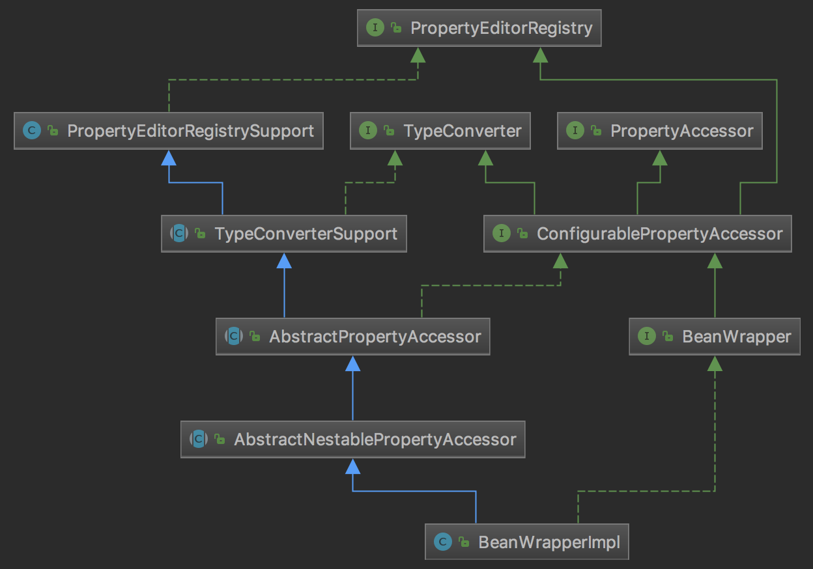

# 个人总结:

- [容器的实现]
    - [加载Bean配置信息](#加载Bean配置信息)
    - [从容器获取bean](#从容器获取bean)
    - [如何设置XML中的字符串值到Bean的属性上](#如何设置XML中的字符串值到Bean的属性上)

## 加载Bean配置信息

加载Bean的配置信息有很多中方法，如从XML解析、根据注解解析等，下面主要介绍根据XML文件解析Bean配置信息。
Spring中从XML文件解析Bean配置的信息的默认实现是[XmlBeanDefinitionReader]，该类的构造函数接收[BeanDefinitionRegistry]类为参数，
[BeanDefinitionRegistry]用于Bean信息的增删改查，默认实现是[DefaultListableBeanFactory]，最简单的Spring容器测试代码如下:
```
DefaultListableBeanFactory factory = new DefaultListableBeanFactory();
new XmlBeanDefinitionReader(factory).loadBeanDefinitions(PATH_TO_XML);
```
一般不会直接使用DefaultListableBeanFactory，通常使用一个[ApplicationContext]实例，[BeanFactory]提供的高级配置机制，使得管理任何性质的对象成为可能，
ApplicationContext是BeanFactory的扩展，功能得到了进一步增强，比如更易与Spring AOP集成、消息资源处理(国际化处理)、事件传递及各种不同应用层的context实现(如针对web应用的WebApplicationContext)，
同时也是开箱即用，只需要设置资源文件的位置就可以了，例如，在web应用程序中，只需要在web.xml中添加简单的XML描述符即可。
如下使用ContextLoaderListener来注册一个ApplicationContext：
```
<context-param>
       <param-name>contextConfigLocation</param-name>
       <param-value>/WEB-INF/daoContext.xml /WEB-INF/applicationContext.xml</param-value>
</context-param>

<listener>
       <listener-class>org.springframework.web.context.ContextLoaderListener</listener-class>
</listener>
<!-- or use the ContextLoaderServlet instead of the above listener
<servlet>
       <servlet-name>context</servlet-name>
       <servlet-class>org.springframework.web.context.ContextLoaderServlet</servlet-class>
       <load-on-startup>1</load-on-startup>
</servlet>
-->
```
下面用[ClassPathXmlApplicationContext]举例说明[ApplicationContext]的工作过程，[ClassPathXmlApplicationContext]创建方式如下:
```
ClassPathXmlApplicationContext applicationContext = new ClassPathXmlApplicationContext("xxxx.xml");
MyBeanA myBeanA = applicationContext.getBean("myBeanA", MyBeanA.class);
```
继承结构如下:

[BeanFactory]定义了访问Spring容器的方法，[ListableBeanFactory]接口定义了不同于[BeanFactory]一个一个访问Spring Bean的访问方式，以列举的方式访问的方法，
[HierarchicalBeanFactory]接口定于了可继承的[BeanFactory]的方法，[EnvironmentCapable]定义了获取[Environment]的方法，标识类存在[Environment]的引用，Spring的`application context`都实现了该方法，
可以在接受[BeanFactory]类型的方法中判断是否是[EnvironmentCapable]以访问该[BeanFactory]的[Environment]，[ApplicationEventPublisher]封装了事件发布功能，[MessageSource]定义了支持国际化和解析字符串参数的功能。
[ResourceLoader]接口定义了从指定位置加载资源的方法，[ResourcePatternResolver]定义了从指定位置加载资源的方法，扩展了[ResourceLoader]接口，默认实现是[PathMatchingResourcePatternResolver]。
[ApplicationContext]接口定义了`application context`的功能，[Lifecycle]接口定义了控制生命周期功能，[ConfigurableApplicationContext]接口定义了配置`application context`的功能，如添加[BeanFactoryPostProcessor]、[ApplicationListener]等，
预定义了一些Spring自带的`bean`的名字，如`loadTimeWeaver`，`environment`等，[DefaultResourceLoader]接口实现了[ResourceLoader]接口，能够解析URL、classpath:...、或普通的文件路径等资源。[AbstractApplicationContext]的抽象实现，采用模版方法模式，
提供了一些供子类实现，在[ConfigurableApplicationContext]的基础上又定义了一些内部bean，如`messageSource`
[ClassPathXmlApplicationContext]的初始化过程在其父类[AbstractApplicationContext]的`refresh()`方法中，该方法所做的工作直接看方法里写的注释，`refresh()`中的`obtainFreshBeanFactory`方法中调用了抽象方法refreshBeanFactory，
该方法在[AbstractRefreshableApplicationContext]中实现了，[AbstractRefreshableApplicationContext]类支持多次调用容器的`refresh`，每次调用`refresh`都会销毁之前的`beanFactory`并重写创建一个。[AbstractRefreshableApplicationContext]也是一个抽象类，
需要子类实现的抽象方法是`loadBeanDefinitions`，该方法在[AbstractRefreshableApplicationContext]创建`beanFactory`后被执行，用于解析资源文件并将解析出的`beanDefinition`添加到`beanFactory`中，
[AbstractRefreshableConfigApplicationContext]类重写了`getConfigLocations`方法，用于指定资源文件(该类还实现了[BeanNameAware]和[InitializingBean]接口，目的是在[ApplicationContext]被作为一个`bean`时做一些工作，
但是在[AbstractApplicationContext]的`refresh`方法中调用`prepareBeanFactory`时已经将容器自身作为一个`bean`添加到了`beanFactory`了，而容器自身的创建并不像普通的`bean`，不会调用各种`bean`的回调方法，包括[BeanNameAware]和[InitializingBean]接口的方法，
所以个人认为[AbstractRefreshableConfigApplicationContext]类实现这两个接口并没有啥用，至少我没找到可能导致这两个方法调用的地方，另外，`bean`获取[ApplicationContext]一般是通过实现[ApplicationContextAware]接口注入的，直接`autowire byType`当然也可以)，[AbstractXmlApplicationContext]实现了`loadBeanDefinitions`方法，使用[XmlBeanDefinitionReader]加载XML资源文件，
[ClassPathXmlApplicationContext]类实现从`classpath`获取资源。
从上述分析可知，`bean`的配置信息加载实现在[AbstractXmlApplicationContext]的`loadBeanDefinitions`方法，该方法代码如下:
```
protected void loadBeanDefinitions(DefaultListableBeanFactory beanFactory) throws BeansException, IOException {
	// Create a new XmlBeanDefinitionReader for the given BeanFactory.
	XmlBeanDefinitionReader beanDefinitionReader = new XmlBeanDefinitionReader(beanFactory);

	// Configure the bean definition reader with this context's
	// resource loading environment.
	beanDefinitionReader.setEnvironment(this.getEnvironment());
	beanDefinitionReader.setResourceLoader(this);
	beanDefinitionReader.setEntityResolver(new ResourceEntityResolver(this));

	// Allow a subclass to provide custom initialization of the reader,
	// then proceed with actually loading the bean definitions.
	initBeanDefinitionReader(beanDefinitionReader);
	loadBeanDefinitions(beanDefinitionReader);
}
```
[XmlBeanDefinitionReader]类是加载`beanDefinition`的关键，实现了所有的加载逻辑，[XmlBeanDefinitionReader]继承关系如下:

[BeanDefinitionReader]接口定义了加载`beanDefinition`的通用方法，[EnvironmentCapable]表示[XmlBeanDefinitionReader]将持有[Environment]，
[AbstractBeanDefinitionReader]接口是[BeanDefinitionReader]的抽象实现，实现了获取指定路径下的`Resource`并交由抽象方法`public int loadBeanDefinitions(Resource resource)`加载，
[XmlBeanDefinitionReader]实现了`public int loadBeanDefinitions(Resource resource)`方法，

[ApplicationContext]: aaa
[ClassPathXmlApplicationContext]: aaa
[AbstractApplicationContext]: aaa
[BeanFactory]: aaa
[Environment]: aaa
[ListableBeanFactory]: aaa
[HierarchicalBeanFactory]: aaa
[EnvironmentCapable]: aaa
[ApplicationEventPublisher]: aaa
[MessageSource]: aaa
[ResourceLoader]: aaa
[ResourcePatternResolver]: aaa
[PathMatchingResourcePatternResolver]: aaa
[ApplicationContext]: aaa
[Lifecycle]: aaa
[ConfigurableApplicationContext]: aaa
[BeanFactoryPostProcessor]: aaa
[ApplicationListener]: aaa
[DefaultResourceLoader]: aaa
[AbstractRefreshableApplicationContext]: aaa
[AbstractRefreshableConfigApplicationContext]: aaa
[AbstractXmlApplicationContext]: aaa
[XmlBeanDefinitionReader]: aaa
[ClassPathXmlApplicationContext]: aaa
[XmlBeanDefinitionReader]: aaa
[BeanDefinitionReader]: aaa
[AbstractBeanDefinitionReader]: aaa

## 从容器获取bean

主要实现是[DefaultListableBeanFactory]类，[DefaultListableBeanFactory]的继承结构如下:

[DefaultListableBeanFactory]实现了很多接口，每个接口都赋予了[DefaultListableBeanFactory]不同的职能，[AliasRegistry]接口包含了别名管理的相关方法，
[SimpleAliasRegistry]类利用Map实现了[AliasRegistry]接口并提供了循环别名检查，[BeanDefinitionRegistry]接口添加了[BeanDefinition]的注册方法，能将`beanName`关联到[BeanDefinition]，
[BeanFactory]接口定义了访问Spring容器的相关操作，如`getBean()`，`isSingleton()`等方法，接口上的注释说明了bean的生命周期里涉及到的接口和对应的方法:
1. BeanNameAware's setBeanName
1. BeanClassLoaderAware's setBeanClassLoader
1. BeanFactoryAware's setBeanFactory
1. EnvironmentAware's setEnvironment
1. EmbeddedValueResolverAware's setEmbeddedValueResolver
1. ResourceLoaderAware's setResourceLoader (only applicable when running in an application context)
1. ApplicationEventPublisherAware's setApplicationEventPublisher (only applicable when running in an application context)
1. MessageSourceAware's setMessageSource (only applicable when running in an application context)
1. ApplicationContextAware's setApplicationContext (only applicable when running in an application context)
1. ServletContextAware's setServletContext (only applicable when running in a web application context)
1. postProcessBeforeInitialization methods of BeanPostProcessors
1. InitializingBean's afterPropertiesSet
1. a custom init-method definition
1. postProcessAfterInitialization methods of BeanPostProcessors

`beanFactory`销毁时对应的接口和对应的方法
1. postProcessBeforeDestruction methods of DestructionAwareBeanPostProcessors
1. DisposableBean's destroy
1. a custom destroy-method definition

[SingletonBeanRegistry]接口定义了单例`beanFactory`的相关方法如`registerSingleton(String beanName, Object singletonObject)`、`getSingleton()`,
[DefaultSingletonBeanRegistry]类实现了基本的单例的注册功能，相当于是一个单例bean的[BeanFactory]，并为[单例bean的循环引用](#单例bean的循环引用)提供了支持，
[FactoryBeanRegistrySupport]类增加了对[FactoryBean]的支持，能够从[FactoryBean]中获取Bean(主要方法是`getObjectFromFactoryBean`)，[HierarchicalBeanFactory]接口在BeanFactory基础上添加了两个方法`getParentBeanFactory`和`containsLocalBean`，
增加了[BeanFactory]的继承功能，[ConfigurableBeanFactory]添加了配置[BeanFactory]的方法，该接口主要在Spring内部配置[BeanFactory]时使用。[AbstractBeanFactory]类实现了[ConfigurableBeanFactory]接口的全部方法并继承了[FactoryBeanRegistrySupport]类，
提供了一些模版方法供子类实现(主要是`getBeanDefinition`和`createBean`)，[AutowireCapableBeanFactory]接口增加了创建bean、自动注入、初始化以及应用bean的后置处理器等相关方法，[AbstractAutowireCapableBeanFactory]类继承[AbstractBeanFactory]并实现了[AutowireCapableBeanFactory]接口，
[ListableBeanFactory]接口定义了获取bean配置清单的相关方法，[ConfigurableListableBeanFactory]接口添加了分析和修改bean definitions的方法，[DefaultListableBeanFactory]综合上面所有功能，主要是对bean注册后的处理。

[XmlBeanDefinitionReader]: aaa
[BeanDefinitionRegistry]: aaa
[DefaultListableBeanFactory]: aaa
[AliasRegistry]: aaa
[SimpleAliasRegistry]: aaa
[BeanDefinitionRegistry]: aaa
[BeanDefinition]: aaa
[BeanFactory]: aaa
[SingletonBeanRegistry]: aaa
[DefaultSingletonBeanRegistry]: aaa
[FactoryBeanRegistrySupport]: aaa
[FactoryBean]: aaa
[HierarchicalBeanFactory]: aaa
[ConfigurableBeanFactory]: aaa
[AbstractBeanFactory]: aaa
[AutowireCapableBeanFactory]: aaa
[AbstractAutowireCapableBeanFactory]: aaa
[ListableBeanFactory]: aaa
[ConfigurableListableBeanFactory]: aaa

## 如何设置XML中的字符串值到Bean的属性上

Spring中的属性转换是通过[PropertyEditor]实现的，[PropertyEditor]是`java.beans`包下的，该接口主要方法如下:
1.`Object getValue()`: 返回属性的当前值。基本类型被封装成对应的封装类实例。
1.`void setValue(Object newValue)`: 设置属性的值，基本类型以封装类传入。
1.`String getAsText()`: 将属性对象用一个字符串表示，以便外部的属性编辑器能以可视化的方式显示。缺省返回null，表示该属性不能以字符串表示。
1.`void setAsText(String text)`: 用一个字符串去更新属性的内部值，这个字符串一般从外部属性编辑器传入。
1.`String[] getTags()`: 返回表示有效属性值的字符串数组(如boolean属性对应的有效Tag为true和false)，以便属性编辑器能以下拉框的方式显示出来。缺省返回null，表示属性没有匹配的字符值有限集合。
1.`String getJavaInitializationString()`: 为属性提供一个表示初始值的字符串，属性编辑器以此值作为属性的默认值。
JDK还提供了[PropertyEditorSupport]类实现了[PropertyEditor]的默认功能，Spring大部分默认属性编辑器都直接扩展于[PropertyEditorSupport]类。
想要实现一个自己的[PropertyEditor]只需要继承[PropertyEditorSupport]并重写`setAsText()`和`getAsText()`方法即可，如:
```
public class UUIDEditor extends PropertyEditorSupport {
    @Override
    public void setAsText(String text) throws IllegalArgumentException {
        if (StringUtils.hasText(text)) {
            setValue(UUID.fromString(text));
        }
        else {
            setValue(null);
        }
    }

    @Override
    public String getAsText() {
        UUID value = (UUID) getValue();
        return (value != null ? value.toString() : "");
    }
}
```
之后在XML中将自定义的[PropertyEditor]添加到[CustomEditorConfigurer]中，如下:
```
<bean id="customEditorConfigurer" class="org.springframework.beans.factory.config.CustomEditorConfigurer">
	<property name="customEditors">
	    <map>
	    <entry key="java.util.UUID">
		<bean class="com.example.UUIDEditor"/>
		</entry>
		</map>
	</property>
</bean>
```
[CustomEditorConfigurer]实现了[BeanFactoryPostProcessor]接口在容器初始化完成后遍历`customEditors`属性并全部添加到[BeanFactory]中，或者同样用[CustomEditorConfigurer]的`propertyEditorRegistrars`属性:
```
<bean id="customEditorConfigurer" class="org.springframework.beans.factory.config.CustomEditorConfigurer">
	<property name="propertyEditorRegistrars">
		<bean class="org.springframework.jmx.export.CustomDateEditorRegistrar"/>
	</property>
</bean>
```
添加[PropertyEditorRegistrar]接口的实现类到`propertyEditorRegistrars`，[CustomEditorConfigurer]会通过`postProcessBeanFactory`方法添加[PropertyEditorRegistrar]到[BeanFactory]中，
容器在启动时执行`prepareBeanFactory`方法时会默认添加[ResourceEditorRegistrar]到[BeanFactory]，使用`customEditors`注册[PropertyEditor]和使用[propertyEditorRegistrars]注册[PropertyEditorRegistrar]区别不大，[PropertyEditor]是直接添加到[BeanFactory]的`customEditors`属性中，
而[PropertyEditorRegistrar]是添加到[BeanFactory]的`propertyEditorRegistrars`属性中，在初始化一个bean时，Spring会创建一个[BeanWrapper]，默认实现是[BeanWrapperImpl]，类图如下:

[PropertyEditorRegistry]接口定义了关联Class和[PropertyEditor]的方法，[PropertyEditorRegistrySupport]实现了[PropertyEditorRegistry]接口并添加了`getDefaultEditor`方法，默认添加了多个[PropertyEditor]到其`defaultEditors`属性中(`defaultEditors`不同于`customEditors`，获取`customEditors`时不会获取`defaultEditors`)。
[TypeConverter]接口定义了将Object转化为指定的类的方法，[TypeConverterSupport]使用[TypeConverterDelegate]类作为代理实现了[TypeConverter]接口，[PropertyAccessor]接口定义了访问bean的属性的若干方法，如判断属性是否可读/写，获取属性值、属性类型和属性的[TypeDescriptor]，设置属性值等。
[ConfigurablePropertyAccessor]接口添加了设置[ConversionService]、`extractOldValueForEditor`和`autoGrowNestedPaths`的方法，[AbstractPropertyAccessor]抽象类实现了其实现的接口的getter/setter方法，并处理了set属性时属性值为[PropertyValues]的情况(获取[PropertyValue]列表并依次执行set)，具体的设置属性的方法为抽象方法。
[AbstractNestablePropertyAccessor]抽象类实现了上述接口的方法，[BeanWrapper]接口定义了获取[BeanWrapper]包装的bean及bean的[PropertyDescriptor]的方法。[BeanWrapperImpl]类实现了[BeanWrapper]接口和[AbstractNestablePropertyAccessor]抽象类。
初始化`bean`时创建[BeanWrapper]的地方是在[AbstractAutowireCapableBeanFactory]的`instantiateBean`方法中，代码如下:
```
protected BeanWrapper instantiateBean(final String beanName, final RootBeanDefinition mbd) {
    ...
    BeanWrapper bw = new BeanWrapperImpl(beanInstance);
    initBeanWrapper(bw);
    ...
}

protected void initBeanWrapper(BeanWrapper bw) {
	bw.setConversionService(getConversionService());
	registerCustomEditors(bw);
}
```
`initBeanWrapper`方法将[BeanWrapper]作为[PropertyEditorRegistry]传入`registerCustomEditors`方法中，`registerCustomEditors`方法代码如下:
```
protected void registerCustomEditors(PropertyEditorRegistry registry) {
	PropertyEditorRegistrySupport registrySupport =
			(registry instanceof PropertyEditorRegistrySupport ? (PropertyEditorRegistrySupport) registry : null);
	if (registrySupport != null) {
		registrySupport.useConfigValueEditors();
	}
	//遍历propertyEditorRegistrars将BeanWrapper传入并执行registerCustomEditors
	if (!this.propertyEditorRegistrars.isEmpty()) {
		for (PropertyEditorRegistrar registrar : this.propertyEditorRegistrars) {
			try {
				registrar.registerCustomEditors(registry);
			}
			catch (BeanCreationException ex) {
				Throwable rootCause = ex.getMostSpecificCause();
				if (rootCause instanceof BeanCurrentlyInCreationException) {
					BeanCreationException bce = (BeanCreationException) rootCause;
					String bceBeanName = bce.getBeanName();
					if (bceBeanName != null && isCurrentlyInCreation(bceBeanName)) {
						if (logger.isDebugEnabled()) {
							logger.debug("PropertyEditorRegistrar [" + registrar.getClass().getName() +
									"] failed because it tried to obtain currently created bean '" +
									ex.getBeanName() + "': " + ex.getMessage());
						}
						onSuppressedException(ex);
						continue;
					}
				}
				throw ex;
			}
		}
	}
	//遍历customEditors将BeanWrapper传入并执行registerCustomEditor
    if (!this.customEditors.isEmpty()) {
		this.customEditors.forEach((requiredType, editorClass) ->
				registry.registerCustomEditor(requiredType, BeanUtils.instantiateClass(editorClass)));
	}
}
```
上面说到[BeanWrapperImpl]的父接口[TypeConverterSupport]使用[TypeConverterDelegate]类作为代理实现了[TypeConverter]接口，[BeanWrapperImpl]的构造函数:
```
public BeanWrapperImpl(Object object) {
	super(object);
}

protected AbstractNestablePropertyAccessor(Object object) {
	registerDefaultEditors();
	setWrappedInstance(object);
}

protected void registerDefaultEditors() {
	this.defaultEditorsActive = true;
}
```
默认激活`defaultEditorsActive`属性，`setWrappedInstance`方法初始化了[TypeConverterDelegate]:
```
this.typeConverterDelegate = new TypeConverterDelegate(this, this.wrappedObject);
```
将[BeanWrapperImpl]作为[PropertyEditorRegistrySupport]传入构造函数，Spring在初始化`bean`时如果[BeanFactory]没有设置`typeConverter`属性则将当前`bean`的[BeanWrapperImpl]作为[TypeConverter]，
之后在[AbstractAutowireCapableBeanFactory]的`applyPropertyValues`方法中获取保存在当前`bean`的[BeanDefinition]中的[PropertyValue]并进行属性注入，比如XML中的日期字符串转Date，Spring解析该属性时将其以[TypedStringValue]类进行封装保存到[BeanDefinition]中，
`applyPropertyValues`方法调用`convertForProperty`进行属性转换，最终属性转换会交由[AbstractNestablePropertyAccessor]的`convertIfNecessary`方法完成，该方法代码如下:
```
private Object convertIfNecessary(@Nullable String propertyName, @Nullable Object oldValue,
		@Nullable Object newValue, @Nullable Class<?> requiredType, @Nullable TypeDescriptor td)
		throws TypeMismatchException {

	Assert.state(this.typeConverterDelegate != null, "No TypeConverterDelegate");
	try {
		return this.typeConverterDelegate.convertIfNecessary(propertyName, oldValue, newValue, requiredType, td);
	}
	catch (ConverterNotFoundException | IllegalStateException ex) {
		PropertyChangeEvent pce =
				new PropertyChangeEvent(getRootInstance(), this.nestedPath + propertyName, oldValue, newValue);
		throw new ConversionNotSupportedException(pce, requiredType, ex);
	}
	catch (ConversionException | IllegalArgumentException ex) {
		PropertyChangeEvent pce =
				new PropertyChangeEvent(getRootInstance(), this.nestedPath + propertyName, oldValue, newValue);
		throw new TypeMismatchException(pce, requiredType, ex);
	}
}
```
实际的转换由[TypeConverterDelegate]实现，[TypeConverterDelegate]会先获取[BeanWrapperImpl]的`customEditors`，如果不存在指定类型的[PropertyEditor]则获取`defaultEditors`，如果最终的转换结果为String并且和期望的返回值类型不符则保存。

[PropertyEditor]: aaa
[PropertyEditorSupport]: aaa
[CustomEditorConfigurer]: aaa
[BeanFactoryPostProcessor]: aaa
[BeanFactory]: aaa
[ResourceEditorRegistrar]: aaa
[BeanWrapper]: aaa
[BeanWrapperImpl]: aaa
[TypeConverter]: aaa
[PropertyAccessor]: aaa
[TypeDescriptor]: aaa
[ConfigurablePropertyAccessor]: aaa
[ConversionService]: aaa
[AbstractPropertyAccessor]: aaa
[PropertyValues]: aaa
[PropertyValue]: aaa
[AbstractNestablePropertyAccessor]: aaa
[BeanWrapper]: aaa
[PropertyDescriptor]: aaa
[BeanWrapperImpl]: aaa