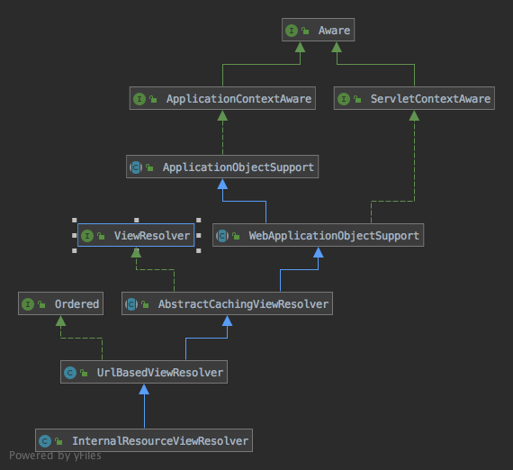

[InternalResourceViewResolver]用于根据视图名称获取视图，继承结构：


[ApplicationObjectSupport]和[WebApplicationObjectSupport]已经在笔记[SimpleUrlHandlerMapping的实现](SimpleUrlHandlerMapping的实现.md)介绍了，[ViewResolver]接口定义了获取视图的方法，代码：
```java
public interface ViewResolver {
	@Nullable
	View resolveViewName(String viewName, Locale locale) throws Exception;
}
```

[AbstractCachingViewResolver]提供了缓存的实现，具体获取视图的过程由子类实现，代码：
```java
public abstract class AbstractCachingViewResolver extends WebApplicationObjectSupport implements ViewResolver {

	/** Default maximum number of entries for the view cache: 1024 */
	public static final int DEFAULT_CACHE_LIMIT = 1024;

	/** Dummy marker object for unresolved views in the cache Maps */
	// 表示一个无法解析的视图
	private static final View UNRESOLVED_VIEW = new View() {
		@Override
		@Nullable
		public String getContentType() {
			return null;
		}
		@Override
		public void render(@Nullable Map<String, ?> model, HttpServletRequest request, HttpServletResponse response) {
		}
	};


	/** The maximum number of entries in the cache */
	// 缓存大小限制
	private volatile int cacheLimit = DEFAULT_CACHE_LIMIT;

	/** Whether we should refrain from resolving views again if unresolved once */
	// 无法解析的视图是否也要缓存
	private boolean cacheUnresolved = true;

	/** Fast access cache for Views, returning already cached instances without a global lock */
	private final Map<Object, View> viewAccessCache = new ConcurrentHashMap<>(DEFAULT_CACHE_LIMIT);

	/** Map from view key to View instance, synchronized for View creation */
	@SuppressWarnings("serial")
	// 利用LinkedHashMap实现缓存
	private final Map<Object, View> viewCreationCache =
			new LinkedHashMap<Object, View>(DEFAULT_CACHE_LIMIT, 0.75f, true) {
				@Override
				protected boolean removeEldestEntry(Map.Entry<Object, View> eldest) {
					if (size() > getCacheLimit()) {
						viewAccessCache.remove(eldest.getKey());
						return true;
					}
					else {
						return false;
					}
				}
			};

	public void setCacheLimit(int cacheLimit) {
		this.cacheLimit = cacheLimit;
	}
  
	public int getCacheLimit() {
		return this.cacheLimit;
	}
  
	public void setCache(boolean cache) {
		this.cacheLimit = (cache ? DEFAULT_CACHE_LIMIT : 0);
	}

	/**
	 * Return if caching is enabled.
	 */
	public boolean isCache() {
		return (this.cacheLimit > 0);
	}
  
	public void setCacheUnresolved(boolean cacheUnresolved) {
		this.cacheUnresolved = cacheUnresolved;
	}
  
	public boolean isCacheUnresolved() {
		return this.cacheUnresolved;
	}


	@Override
	@Nullable
	public View resolveViewName(String viewName, Locale locale) throws Exception {
		// 如果没有开启缓存
		if (!isCache()) {
			// 创建视图，供子类实现
			return createView(viewName, locale);
		}
		else {
			Object cacheKey = getCacheKey(viewName, locale);
			View view = this.viewAccessCache.get(cacheKey);
			if (view == null) {
				synchronized (this.viewCreationCache) {
					view = this.viewCreationCache.get(cacheKey);
					// double check
					if (view == null) {
						// Ask the subclass to create the View object.
						// 创建视图，供子类实现
						view = createView(viewName, locale);
						if (view == null && this.cacheUnresolved) {
							view = UNRESOLVED_VIEW;
						}
						if (view != null) {
							this.viewAccessCache.put(cacheKey, view);
							this.viewCreationCache.put(cacheKey, view);
							if (logger.isTraceEnabled()) {
								logger.trace("Cached view [" + cacheKey + "]");
							}
						}
					}
				}
			}
			return (view != UNRESOLVED_VIEW ? view : null);
		}
	}
  
	protected Object getCacheKey(String viewName, Locale locale) {
		return viewName + '_' + locale;
	}
  
	public void removeFromCache(String viewName, Locale locale) {
		if (!isCache()) {
			logger.warn("View caching is SWITCHED OFF -- removal not necessary");
		}
		else {
			Object cacheKey = getCacheKey(viewName, locale);
			Object cachedView;
			synchronized (this.viewCreationCache) {
				this.viewAccessCache.remove(cacheKey);
				cachedView = this.viewCreationCache.remove(cacheKey);
			}
			if (logger.isDebugEnabled()) {
				// Some debug output might be useful...
				if (cachedView == null) {
					logger.debug("No cached instance for view '" + cacheKey + "' was found");
				}
				else {
					logger.debug("Cache for view " + cacheKey + " has been cleared");
				}
			}
		}
	}
  
	public void clearCache() {
		logger.debug("Clearing entire view cache");
		synchronized (this.viewCreationCache) {
			this.viewAccessCache.clear();
			this.viewCreationCache.clear();
		}
	}
  
	@Nullable
	protected View createView(String viewName, Locale locale) throws Exception {
		return loadView(viewName, locale);
	}
  
	@Nullable
	protected abstract View loadView(String viewName, Locale locale) throws Exception;

}
```

[UrlBasedViewResolver]实现了创建视图的逻辑，视图类型由`viewClass`属性指定，[UrlBasedViewResolver]还支持重定向和转发，当发送重定向和转发时将分别创建视图[RedirectView]和[InternalResourceView]（下面会介绍重定向和转发的区别，还有这两个视图的实现），代码：
```java
public class UrlBasedViewResolver extends AbstractCachingViewResolver implements Ordered {
	// 重定向的前缀
	public static final String REDIRECT_URL_PREFIX = "redirect:";

	// 转发的前缀
	public static final String FORWARD_URL_PREFIX = "forward:";


	@Nullable
	// 视图的类型
	private Class<?> viewClass;

	private String prefix = "";

	private String suffix = "";

	@Nullable
	private String contentType;

	// 当重定向的路径是/开头时，是否认为是路径相对于当前ServletContext
	private boolean redirectContextRelative = true;

	// 重定向是否需要兼容http 1.0
	private boolean redirectHttp10Compatible = true;

	@Nullable
	// 表示能被重定向的域名，可以为空
	private String[] redirectHosts;

	@Nullable
	private String requestContextAttribute;

	/** Map of static attributes, keyed by attribute name (String) */
	// 静态属性，将会被添加到创建的视图属性中
	private final Map<String, Object> staticAttributes = new HashMap<>();

	@Nullable
	private Boolean exposePathVariables;

	@Nullable
	private Boolean exposeContextBeansAsAttributes;

	@Nullable
	private String[] exposedContextBeanNames;

	@Nullable
	private String[] viewNames;

	private int order = Ordered.LOWEST_PRECEDENCE;

	public void setViewClass(@Nullable Class<?> viewClass) {
		if (viewClass != null && !requiredViewClass().isAssignableFrom(viewClass)) {
			throw new IllegalArgumentException("Given view class [" + viewClass.getName() +
					"] is not of type [" + requiredViewClass().getName() + "]");
		}
		this.viewClass = viewClass;
	}
  
	@Nullable
	protected Class<?> getViewClass() {
		return this.viewClass;
	}

	protected Class<?> requiredViewClass() {
		return AbstractUrlBasedView.class;
	}
  
	public void setPrefix(@Nullable String prefix) {
		this.prefix = (prefix != null ? prefix : "");
	}
  
	protected String getPrefix() {
		return this.prefix;
	}
  
	public void setSuffix(@Nullable String suffix) {
		this.suffix = (suffix != null ? suffix : "");
	}
  
	protected String getSuffix() {
		return this.suffix;
	}
  
	public void setContentType(@Nullable String contentType) {
		this.contentType = contentType;
	}
  
	@Nullable
	protected String getContentType() {
		return this.contentType;
	}
  
	public void setRedirectContextRelative(boolean redirectContextRelative) {
		this.redirectContextRelative = redirectContextRelative;
	}
  
	protected boolean isRedirectContextRelative() {
		return this.redirectContextRelative;
	}
  
	public void setRedirectHttp10Compatible(boolean redirectHttp10Compatible) {
		this.redirectHttp10Compatible = redirectHttp10Compatible;
	}
  
	protected boolean isRedirectHttp10Compatible() {
		return this.redirectHttp10Compatible;
	}
  
	public void setRedirectHosts(@Nullable String... redirectHosts) {
		this.redirectHosts = redirectHosts;
	}
  
	@Nullable
	public String[] getRedirectHosts() {
		return this.redirectHosts;
	}
  
	public void setRequestContextAttribute(@Nullable String requestContextAttribute) {
		this.requestContextAttribute = requestContextAttribute;
	}
  
	@Nullable
	protected String getRequestContextAttribute() {
		return this.requestContextAttribute;
	}
  
	public void setAttributes(Properties props) {
		CollectionUtils.mergePropertiesIntoMap(props, this.staticAttributes);
	}
  
	public void setAttributesMap(@Nullable Map<String, ?> attributes) {
		if (attributes != null) {
			this.staticAttributes.putAll(attributes);
		}
	}
  
	public Map<String, Object> getAttributesMap() {
		return this.staticAttributes;
	}
  
	public void setExposePathVariables(@Nullable Boolean exposePathVariables) {
		this.exposePathVariables = exposePathVariables;
	}
  
	@Nullable
	protected Boolean getExposePathVariables() {
		return this.exposePathVariables;
	}

	public void setExposeContextBeansAsAttributes(boolean exposeContextBeansAsAttributes) {
		this.exposeContextBeansAsAttributes = exposeContextBeansAsAttributes;
	}

	@Nullable
	protected Boolean getExposeContextBeansAsAttributes() {
		return this.exposeContextBeansAsAttributes;
	}
  
	public void setExposedContextBeanNames(@Nullable String... exposedContextBeanNames) {
		this.exposedContextBeanNames = exposedContextBeanNames;
	}

	@Nullable
	protected String[] getExposedContextBeanNames() {
		return this.exposedContextBeanNames;
	}
  
	public void setViewNames(@Nullable String... viewNames) {
		this.viewNames = viewNames;
	}
  
	@Nullable
	protected String[] getViewNames() {
		return this.viewNames;
	}
  
	public void setOrder(int order) {
		this.order = order;
	}

	@Override
	public int getOrder() {
		return this.order;
	}

	@Override
	protected void initApplicationContext() {
		super.initApplicationContext();
		if (getViewClass() == null) {
			throw new IllegalArgumentException("Property 'viewClass' is required");
		}
	}
  
	@Override
	protected Object getCacheKey(String viewName, Locale locale) {
		return viewName;
	}
  
	@Override
	protected View createView(String viewName, Locale locale) throws Exception {
		// If this resolver is not supposed to handle the given view,
		// return null to pass on to the next resolver in the chain.
		// 如果viewNames属性不为空，则根据viewNames属性判断当前视图名称是否能被解析
		if (!canHandle(viewName, locale)) {
			return null;
		}
		// Check for special "redirect:" prefix.
		// 如果是重定向请求
		if (viewName.startsWith(REDIRECT_URL_PREFIX)) {
			String redirectUrl = viewName.substring(REDIRECT_URL_PREFIX.length());
			// 创建重定向视图
			RedirectView view = new RedirectView(redirectUrl, isRedirectContextRelative(), isRedirectHttp10Compatible());
			// 获取能够被重定向的域名，可以为空
			String[] hosts = getRedirectHosts();
			if (hosts != null) {
				view.setHosts(hosts);
			}
			// 将创建的视图作为bean添加到applicationContext
			return applyLifecycleMethods(viewName, view);
		}
		// Check for special "forward:" prefix.
		// 如果是转发请求则创建对应的视图，该视图没有被添加到applicationContext
		if (viewName.startsWith(FORWARD_URL_PREFIX)) {
			String forwardUrl = viewName.substring(FORWARD_URL_PREFIX.length());
			return new InternalResourceView(forwardUrl);
		}
		// Else fall back to superclass implementation: calling loadView.
		// 如果既没有redirect前缀，也没有forward前缀，则调用父类的createView方法返回视图，而这里的createView就是AbstractCachingViewResolver
		// 的createView方法，该方法会调用子类的loadView方法
		return super.createView(viewName, locale);
	}
  
	protected boolean canHandle(String viewName, Locale locale) {
		String[] viewNames = getViewNames();
		return (viewNames == null || PatternMatchUtils.simpleMatch(viewNames, viewName));
	}

	@Override
	protected View loadView(String viewName, Locale locale) throws Exception {
		AbstractUrlBasedView view = buildView(viewName);
		// 将视图作为bean添加到applicationContext中
		View result = applyLifecycleMethods(viewName, view);
		return (view.checkResource(locale) ? result : null);
	}
  
	protected AbstractUrlBasedView buildView(String viewName) throws Exception {
		Class<?> viewClass = getViewClass();
		Assert.state(viewClass != null, "No view class");

		// 实例化视图类，默认实现是子类InternalResourceViewResolver的构造函数设置的InternalResourceViewResolver
		AbstractUrlBasedView view = (AbstractUrlBasedView) BeanUtils.instantiateClass(viewClass);
		// 设置视图的路径，这里的prefix和suffix就是通常的viewResolver配置，如/WEB-INF/jsp/和.jsp
		// 这里设置的url就是请求需要转发的路径，如果是jsp的路径，实际上就会被编译后的jsp servlet处理
		view.setUrl(getPrefix() + viewName + getSuffix());

		String contentType = getContentType();
		if (contentType != null) {
			view.setContentType(contentType);
		}

		view.setRequestContextAttribute(getRequestContextAttribute());
		// 添加staticAttributes到视图属性
		view.setAttributesMap(getAttributesMap());

		Boolean exposePathVariables = getExposePathVariables();
		// 设置是否需要暴露请求路径中的属性
		if (exposePathVariables != null) {
			view.setExposePathVariables(exposePathVariables);
		}
		Boolean exposeContextBeansAsAttributes = getExposeContextBeansAsAttributes();
		// 设置是否需要暴露所有applicationContext的bean到视图属性
		if (exposeContextBeansAsAttributes != null) {
			view.setExposeContextBeansAsAttributes(exposeContextBeansAsAttributes);
		}
		String[] exposedContextBeanNames = getExposedContextBeanNames();
		// 设置允许暴露的bean到视图属性，如果为空并且exposeContextBeansAsAttributes为true则所有bean都会被暴露
		if (exposedContextBeanNames != null) {
			view.setExposedContextBeanNames(exposedContextBeanNames);
		}

		return view;
	}
  
	protected View applyLifecycleMethods(String viewName, AbstractUrlBasedView view) {
		ApplicationContext context = getApplicationContext();
		if (context != null) {
			Object initialized = context.getAutowireCapableBeanFactory().initializeBean(view, viewName);
			if (initialized instanceof View) {
				return (View) initialized;
			}
		}
		return view;
	}

}
```

[InternalResourceViewResolver]指定了默认视图的类型（既[InternalResourceViewResolver]），并在创建视图后为视图设置了若干属性，代码：
```java
public class InternalResourceViewResolver extends UrlBasedViewResolver {

	private static final boolean jstlPresent = ClassUtils.isPresent(
			"javax.servlet.jsp.jstl.core.Config", InternalResourceViewResolver.class.getClassLoader());

	@Nullable
	// 要求返回的结果使用include方式而不是forward方式
  private Boolean alwaysInclude;

	public InternalResourceViewResolver() {
		// 获取视图类型，默认InternalResourceView，如果包含jstl的类则使用JstlView，JstlView继承InternalResourceView，在其基础上
    // 添加了applicationContext的messageSource到request的javax.servlet.jsp.jstl.fmt.localizationContext.request属性
    Class<?> viewClass = requiredViewClass();
		if (InternalResourceView.class == viewClass && jstlPresent) {
			viewClass = JstlView.class;
		}
		setViewClass(viewClass);
	}
  
	public InternalResourceViewResolver(String prefix, String suffix) {
		this();
		setPrefix(prefix);
		setSuffix(suffix);
	}
  
	@Override
	protected Class<?> requiredViewClass() {
		return InternalResourceView.class;
	}
  
	public void setAlwaysInclude(boolean alwaysInclude) {
		this.alwaysInclude = alwaysInclude;
	}

	@Override
	protected AbstractUrlBasedView buildView(String viewName) throws Exception {
		InternalResourceView view = (InternalResourceView) super.buildView(viewName);
		if (this.alwaysInclude != null) {
			view.setAlwaysInclude(this.alwaysInclude);
		}
		view.setPreventDispatchLoop(true);
		return view;
	}

}
```

[InternalResourceViewResolver]的作用主要是创建视图，而默认情况下视图的实现是[InternalResourceView]，这里再看一下[InternalResourceView]的实现，继承结构：


[View]接口定义了定义了视图的基本行为，
```java
public interface View {
	String RESPONSE_STATUS_ATTRIBUTE = View.class.getName() + ".responseStatus";

	String PATH_VARIABLES = View.class.getName() + ".pathVariables";

	String SELECTED_CONTENT_TYPE = View.class.getName() + ".selectedContentType";

	@Nullable
	default String getContentType() {
		return null;
	}
  
	void render(@Nullable Map<String, ?> model, HttpServletRequest request, HttpServletResponse response)
			throws Exception;

}
```

[AbstractView]在渲染视图之前为视图准备好了视图属性，代码：
```java
public abstract class AbstractView extends WebApplicationObjectSupport implements View, BeanNameAware {

	/** Default content type. Overridable as bean property. */
	public static final String DEFAULT_CONTENT_TYPE = "text/html;charset=ISO-8859-1";

	/** Initial size for the temporary output byte array (if any) */
	private static final int OUTPUT_BYTE_ARRAY_INITIAL_SIZE = 4096;


	@Nullable
	private String contentType = DEFAULT_CONTENT_TYPE;

	@Nullable
	// 表示视图属性中RequestContext对象的key，RequestContext包含HttpServletRequest、HttpServletResponse、ServletContext和model
	private String requestContextAttribute;

	private final Map<String, Object> staticAttributes = new LinkedHashMap<>();

	// 是否将请求路径的参数暴露到视图属性中
	private boolean exposePathVariables = true;

	// 是否应该暴露bean到视图属性
 private boolean exposeContextBeansAsAttributes = false;

 @Nullable
 // 应该被暴露的bean的name到视图属性
 private Set<String> exposedContextBeanNames;
	
	@Nullable
	private String beanName;

	public void setContentType(@Nullable String contentType) {
		this.contentType = contentType;
	}
  
	@Override
	@Nullable
	public String getContentType() {
		return this.contentType;
	}
  
	public void setRequestContextAttribute(@Nullable String requestContextAttribute) {
		this.requestContextAttribute = requestContextAttribute;
	}
  
	@Nullable
	public String getRequestContextAttribute() {
		return this.requestContextAttribute;
	}
  
	// 以csv的格式解析参数，将参数添加到staticAttributes中
	public void setAttributesCSV(@Nullable String propString) throws IllegalArgumentException {
		if (propString != null) {
			StringTokenizer st = new StringTokenizer(propString, ",");
			while (st.hasMoreTokens()) {
				String tok = st.nextToken();
				int eqIdx = tok.indexOf('=');
				if (eqIdx == -1) {
					throw new IllegalArgumentException("Expected = in attributes CSV string '" + propString + "'");
				}
				if (eqIdx >= tok.length() - 2) {
					throw new IllegalArgumentException(
							"At least 2 characters ([]) required in attributes CSV string '" + propString + "'");
				}
				String name = tok.substring(0, eqIdx);
				String value = tok.substring(eqIdx + 1);

				// Delete first and last characters of value: { and }
				value = value.substring(1);
				value = value.substring(0, value.length() - 1);

				addStaticAttribute(name, value);
			}
		}
	}
  
	public void setAttributes(Properties attributes) {
		CollectionUtils.mergePropertiesIntoMap(attributes, this.staticAttributes);
	}
  
	public void setAttributesMap(@Nullable Map<String, ?> attributes) {
		if (attributes != null) {
			attributes.forEach(this::addStaticAttribute);
		}
	}
  
	public Map<String, Object> getAttributesMap() {
		return this.staticAttributes;
	}
  
	public void addStaticAttribute(String name, Object value) {
		this.staticAttributes.put(name, value);
	}
  
	public Map<String, Object> getStaticAttributes() {
		return Collections.unmodifiableMap(this.staticAttributes);
	}
  
	public void setExposePathVariables(boolean exposePathVariables) {
		this.exposePathVariables = exposePathVariables;
	}
  
	public boolean isExposePathVariables() {
		return this.exposePathVariables;
	}
  
	public void setExposeContextBeansAsAttributes(boolean exposeContextBeansAsAttributes) {
		this.exposeContextBeansAsAttributes = exposeContextBeansAsAttributes;
	}
  
	public void setExposedContextBeanNames(String... exposedContextBeanNames) {
		this.exposedContextBeanNames = new HashSet<>(Arrays.asList(exposedContextBeanNames));
	}
  
	@Override
	public void setBeanName(@Nullable String beanName) {
		this.beanName = beanName;
	}
  
	@Nullable
	public String getBeanName() {
		return this.beanName;
	}
  
	@Override
	public void render(@Nullable Map<String, ?> model, HttpServletRequest request,
			HttpServletResponse response) throws Exception {

		if (logger.isTraceEnabled()) {
			logger.trace("Rendering view with name '" + this.beanName + "' with model " + model +
				" and static attributes " + this.staticAttributes);
		}

		// 合并staticAttributes的值和动态的值
		Map<String, Object> mergedModel = createMergedOutputModel(model, request, response);
		// 添加了缓存相关的首部
		prepareResponse(request, response);
		// getRequestToExpose方法在需要暴露bean的情况下返回ContextExposingHttpServletRequest实例，在视图中获取属性前先判断
		// 是否存在指定的bean，如果存在则作为属性值返回
		// renderMergedOutputModel方法供子类实现
		renderMergedOutputModel(mergedModel, getRequestToExpose(request), response);
	}
  
	protected Map<String, Object> createMergedOutputModel(@Nullable Map<String, ?> model,
			HttpServletRequest request, HttpServletResponse response) {

		@SuppressWarnings("unchecked")
		Map<String, Object> pathVars = (this.exposePathVariables ?
				(Map<String, Object>) request.getAttribute(View.PATH_VARIABLES) : null);

		// Consolidate static and dynamic model attributes.
		int size = this.staticAttributes.size();
		size += (model != null ? model.size() : 0);
		size += (pathVars != null ? pathVars.size() : 0);

		Map<String, Object> mergedModel = new LinkedHashMap<>(size);
		// staticAttributes属性优先级最低，先添加
		mergedModel.putAll(this.staticAttributes);
		if (pathVars != null) {
			mergedModel.putAll(pathVars);
		}
		if (model != null) {
			mergedModel.putAll(model);
		}

		// Expose RequestContext?
		if (this.requestContextAttribute != null) {
			mergedModel.put(this.requestContextAttribute, createRequestContext(request, response, mergedModel));
		}

		return mergedModel;
	}
  
	protected RequestContext createRequestContext(
			HttpServletRequest request, HttpServletResponse response, Map<String, Object> model) {

		return new RequestContext(request, response, getServletContext(), model);
	}
  
	protected void prepareResponse(HttpServletRequest request, HttpServletResponse response) {
		if (generatesDownloadContent()) {
			// http 1.0中控制缓存的首部字段
			response.setHeader("Pragma", "private");
			// http 1.1中控制缓存的首部字段，private表示缓存只能提供给个人，不能保存在共享缓存中，如代理服务器，相当于指定缓存
			// 只能在当前用户的电脑上，must-revalidate表示资源一定要向原服务器请求，而不能从代理服务器请求
			response.setHeader("Cache-Control", "private, must-revalidate");
		}
	}
  
	protected boolean generatesDownloadContent() {
		return false;
	}
  
	protected HttpServletRequest getRequestToExpose(HttpServletRequest originalRequest) {
		if (this.exposeContextBeansAsAttributes || this.exposedContextBeanNames != null) {
			WebApplicationContext wac = getWebApplicationContext();
			Assert.state(wac != null, "No WebApplicationContext");
			return new ContextExposingHttpServletRequest(originalRequest, wac, this.exposedContextBeanNames);
		}
		return originalRequest;
	}
  
	protected abstract void renderMergedOutputModel(
			Map<String, Object> model, HttpServletRequest request, HttpServletResponse response) throws Exception;

	// 将指定model添加到请求属性中
  protected void exposeModelAsRequestAttributes(Map<String, Object> model,
			HttpServletRequest request) throws Exception {

		model.forEach((modelName, modelValue) -> {
			if (modelValue != null) {
				request.setAttribute(modelName, modelValue);
				if (logger.isDebugEnabled()) {
					logger.debug("Added model object '" + modelName + "' of type [" + modelValue.getClass().getName() +
							"] to request in view with name '" + getBeanName() + "'");
				}
			}
			else {
				request.removeAttribute(modelName);
				if (logger.isDebugEnabled()) {
					logger.debug("Removed model object '" + modelName +
							"' from request in view with name '" + getBeanName() + "'");
				}
			}
		});
	}
  
	protected ByteArrayOutputStream createTemporaryOutputStream() {
		return new ByteArrayOutputStream(OUTPUT_BYTE_ARRAY_INITIAL_SIZE);
	}
  
	// 将outputStream写入response
	protected void writeToResponse(HttpServletResponse response, ByteArrayOutputStream baos) throws IOException {
		// Write content type and also length (determined via byte array).
		response.setContentType(getContentType());
		response.setContentLength(baos.size());

		// Flush byte array to servlet output stream.
		ServletOutputStream out = response.getOutputStream();
		baos.writeTo(out);
		out.flush();
	}
  
	protected void setResponseContentType(HttpServletRequest request, HttpServletResponse response) {
		MediaType mediaType = (MediaType) request.getAttribute(View.SELECTED_CONTENT_TYPE);
		if (mediaType != null && mediaType.isConcrete()) {
			response.setContentType(mediaType.toString());
		}
		else {
			response.setContentType(getContentType());
		}
	}

	@Override
	public String toString() {
		StringBuilder sb = new StringBuilder(getClass().getName());
		if (getBeanName() != null) {
			sb.append(": name '").append(getBeanName()).append("'");
		}
		else {
			sb.append(": unnamed");
		}
		return sb.toString();
	}

}
```

[AbstractUrlBasedView]只是添加了一个url属性，代码：
```java
public abstract class AbstractUrlBasedView extends AbstractView implements InitializingBean {

	@Nullable
	private String url;

	protected AbstractUrlBasedView() {
	}
  
	protected AbstractUrlBasedView(String url) {
		this.url = url;
	}
  
	public void setUrl(@Nullable String url) {
		this.url = url;
	}
  
	@Nullable
	public String getUrl() {
		return this.url;
	}

	@Override
	public void afterPropertiesSet() throws Exception {
		if (isUrlRequired() && getUrl() == null) {
			throw new IllegalArgumentException("Property 'url' is required");
		}
	}
  
	protected boolean isUrlRequired() {
		return true;
	}
  
	public boolean checkResource(Locale locale) throws Exception {
		return true;
	}

	@Override
	public String toString() {
		return super.toString() + "; URL [" + getUrl() + "]";
	}

}
```

[InternalResourceView]使用[RequestDispatcher]实现了视图逻辑，代码：
```java
public class InternalResourceView extends AbstractUrlBasedView {

	private boolean alwaysInclude = false;

	// 是否检查循环转发
	private boolean preventDispatchLoop = false;

	public InternalResourceView() {
	}
  
	public InternalResourceView(String url) {
		super(url);
	}
  
	public InternalResourceView(String url, boolean alwaysInclude) {
		super(url);
		this.alwaysInclude = alwaysInclude;
	}
  
	public void setAlwaysInclude(boolean alwaysInclude) {
		this.alwaysInclude = alwaysInclude;
	}
  
	public void setPreventDispatchLoop(boolean preventDispatchLoop) {
		this.preventDispatchLoop = preventDispatchLoop;
	}
  
	@Override
	protected boolean isContextRequired() {
		return false;
	}
  
	@Override
	protected void renderMergedOutputModel(
			Map<String, Object> model, HttpServletRequest request, HttpServletResponse response) throws Exception {

		// Expose the model object as request attributes.
		// 将model添加到请求属性中
		exposeModelAsRequestAttributes(model, request);

		// Expose helpers as request attributes, if any.
		// 供子类实现
		exposeHelpers(request);

		// Determine the path for the request dispatcher.
		// 检查是否存在循环，返回url
		String dispatcherPath = prepareForRendering(request, response);

		// Obtain a RequestDispatcher for the target resource (typically a JSP).
		// 从request获取RequestDispatcher对象，RequestDispatcher对象能够将请求指定的资源添加到response中
		RequestDispatcher rd = getRequestDispatcher(request, dispatcherPath);
		if (rd == null) {
			throw new ServletException("Could not get RequestDispatcher for [" + getUrl() +
					"]: Check that the corresponding file exists within your web application archive!");
		}

		// If already included or response already committed, perform include, else forward.
		// include为true则调用RequestDispatcher的include方法访问资源
		if (useInclude(request, response)) {
			response.setContentType(getContentType());
			if (logger.isDebugEnabled()) {
				logger.debug("Including resource [" + getUrl() + "] in InternalResourceView '" + getBeanName() + "'");
			}
			rd.include(request, response);
		}

		else {
			// Note: The forwarded resource is supposed to determine the content type itself.
			if (logger.isDebugEnabled()) {
				logger.debug("Forwarding to resource [" + getUrl() + "] in InternalResourceView '" + getBeanName() + "'");
			}
			// 否则使用正常的逻辑访问资源
			rd.forward(request, response);
		}
	}
  
	protected void exposeHelpers(HttpServletRequest request) throws Exception {
	}
  
	protected String prepareForRendering(HttpServletRequest request, HttpServletResponse response)
			throws Exception {

		String path = getUrl();
		Assert.state(path != null, "'url' not set");

		if (this.preventDispatchLoop) {
			String uri = request.getRequestURI();
			// 如果uri和path相等则表示发生了循环，如/home的handler返回视图名为home，此时报错
			if (path.startsWith("/") ? uri.equals(path) : uri.equals(StringUtils.applyRelativePath(uri, path))) {
				throw new ServletException("Circular view path [" + path + "]: would dispatch back " +
						"to the current handler URL [" + uri + "] again. Check your ViewResolver setup! " +
						"(Hint: This may be the result of an unspecified view, due to default view name generation.)");
			}
		}
		return path;
	}
  
	@Nullable
	protected RequestDispatcher getRequestDispatcher(HttpServletRequest request, String path) {
		return request.getRequestDispatcher(path);
	}
  
	protected boolean useInclude(HttpServletRequest request, HttpServletResponse response) {
		return (this.alwaysInclude || WebUtils.isIncludeRequest(request) || response.isCommitted());
	}

}
```

[RequestDispatcher]代表请求的派发者，它有2个动作：forward和include

对于forward，这个方法将请求从一个Servlet or JSP目标资源上转发到服务器上的另一个资源（servlet、JSP 文件或HTML文件，这些资源必须是当前Web上下文中的），让其它的资源去生成响应数据，例如用户请求的是目标资源A，A接受到请求后，转发到B（服务器内部处理的转发过程，浏览器上只能看到一个A请求，但是响应是B），真正产生响应数据是被转发的资源B，而A只是起个引导转发作用。浏览器的地址栏不会变，依然是A的URL。

如：
```java
public class User{
      private String name;
      private int age;
      public String getName(){
            return name ;
      }
      public void setName( String name ){
            this .name = name ;
      }
      public int getAge() {
            return age ;
      }
      public void setAge( int age ){
            this .age = age ;
      }
}

public class UsersServlet extends HttpServlet {
      private static final long serialVersionUID = 1L ;

protected void doGet (HttpServletRequest request, HttpServletResponse response) throws ServletException , IOException {
    List<User> users = new ArrayList<>();
    User u1 = new User();
    u1.setAge(20);
    u1.setName("Bob");
    User u2 = new User();
    u2.setAge(21);
    u2.setName("Tony");
    users.add(u1);
    users.add(u2);

    request.setAttribute("users", users);
    request.getRequestDispatcher("users.jsp").forward(request, response);//转发到users.jsp，让他去具体响应
  } 
}
```
```jsp
<%@ page   contentType= "text/html; charset=UTF-8" pageEncoding ="UTF-8" trimDirectiveWhitespaces= "true"
          session ="true" %>
<%@ taglib prefix= "c" uri = "http://java.sun.com/jsp/jstl/core"   %>

<!DOCTYPE html>
< html>
<head>
<meta http-equiv = "Content-Type" content ="text/html; charset=UTF-8">
<title> 用户列表</title>
</head>
<body>

<p> -----------------转发到的资源users.jsp产生的响应数据------------------ </p>

< c:forEach var ="user" items= " ${users}" >
用户姓名:${user.name}  用户年龄:${user.age}  <br />
</ c:forEach>
</body>
</html>
```
这样页面上就能显示`users.jsp`的内容，并且包含users信息

对于include，此方法用于包含响应中某个资源（servlet、JSP 页面和 HTML 文件）的内容。调用者指定一个被包含的资源，将这个包含的资源（JSP,Servlet，HTML）的响应数据包含到自己的响应体中。被包含的数据是在服务器上经过运行产生的，因此是动态包含，而不同于JSP中的include指令，它是JSP转译期的静态包含，类似于C语言中的宏一样，这个过程实质是用一个相同的Request再请求一次被包含的资源，将被包含的资源的响应数据包含到原本的资源中去，构成它的响应数据的一部分。

如：
```java
public class TargetServlet extends HttpServlet {
      private static final long serialVersionUID = 1L ;
      protected void doGet(HttpServletRequest request, HttpServletResponse response) throws ServletException , IOException {
        response.setContentType("text/html;charset=utf-8");
        PrintWriter out = response.getWriter();

        out.println("----------来自TargetServlet----------------<br/>");
        out.print("我偷懒了，下面的响应数据并不是我自己产生的，而是包含的其它资源产生的<br/>");
        request.getRequestDispatcher("test.jsp").include(request, response);

        out.flush();
        out.close();
      }
}
```
```jsp
<%@ page    contentType= "text/html; charset=UTF-8" pageEncoding = "UTF-8" trimDirectiveWhitespaces = "true"
          session = "false"
%>

<p>------------------------来自test.jsp--------------------------</p>
<p>我输出的响应数据将被其它的资源包含</p>
请的URL是<%= request.getRequestURL().toString()%>,可以看出客户端真正请求的不是我，我只是幕后工作者。
```
这样页面上显示的内容就是：
```
这样页面上就能显示`users.jsp`的内容，并且包含users信息
----------来自TargetServlet----------------
我偷懒了，下面的响应数据并不是我自己产生的，而是包含的其它资源产生的

------------------------来自test.jsp--------------------------
我输出的响应数据将被其它的资源包含 
请的URL是http://localhost:8080/app/TargetServlet,可以看出客户端真正请求的不是我，我只是幕后工作者。
```

这里再说一下redirect和forward，上面的[UrlBasedViewResolver]在创建视图时先判断了路径是否以redirect或forward开头，如果是redirect开头的，则创建[RedirectView]返回，如果是forward开头的，则创建[InternalResourceView]返回，如果都不是，则调用`super.createView(viewName, locale)`，实际上就是其调用`loadView()`方法创建视图，该方法的实现可以看[UrlBasedViewResolver]类的注释，这里对redirect和forward进行分析，[维基百科](https://en.wikipedia.org/wiki/Post/Redirect/Get)的这篇文章有两个图能很好的描述redirect和forward的区别

首先是redirect，先看测试代码：
```xml
<?xml version="1.0" encoding="UTF-8"?>
<beans xmlns="http://www.springframework.org/schema/beans" xmlns:xsi="http://www.w3.org/2001/XMLSchema-instance"
       xmlns:mvc="http://www.springframework.org/schema/mvc"
       xmlns:context="http://www.springframework.org/schema/context"
       xsi:schemaLocation="http://www.springframework.org/schema/beans http://www.springframework.org/schema/beans/spring-beans-4.0.xsd http://www.springframework.org/schema/mvc http://www.springframework.org/schema/mvc/spring-mvc.xsd http://www.springframework.org/schema/context http://www.springframework.org/schema/context/spring-context.xsd">

    <context:component-scan base-package="com.dhf"/>
    <mvc:annotation-driven/>
</beans>
```

```java
@Controller
public class UserController {
    @RequestMapping(value = "showForm", method = RequestMethod.GET)
    public String showForm(@ModelAttribute("user") User user) {
        user.setName("test");
        return "add_user";
    }

    @RequestMapping(value = "addUser", method = RequestMethod.POST)
    public String addUser(@ModelAttribute("user") User user,
                          final RedirectAttributes redirectAttributes) {

        redirectAttributes.addFlashAttribute("user", user);
        redirectAttributes.addAttribute("message", "Added successfully.");

        return "redirect:showUser";
    }

    @RequestMapping(value = "showUser", method = RequestMethod.GET)
    public ModelAndView showUser(@ModelAttribute("user") User user) {
        System.out.println("user:" + user.getName() + "," + user.getAge());
        Map<String, String> model = new HashMap<>();
        model.put("demo", "demo");
        return new ModelAndView("show_user", model);
    }
}
```

`add_user.jsp`文件
```jsp
<%@taglib uri="http://www.springframework.org/tags/form" prefix="form" %>
<html>
<body>
<h1>Add New User</h1>
<form:form action="addUser" method="post" modelAttribute="user">
    <table>
        <tr>
            <td><form:label path="name">Name</form:label></td>
            <td><form:input path="name"/></td>
        </tr>
        <tr>
            <td><form:label path="age">Age</form:label></td>
            <td><form:input path="age"/></td>
        </tr>
        <tr>
            <td colspan="2"><input type="submit" value="Add User"/>
            </td>
        </tr>
    </table>
</form:form>
</body>
</html>
```

`show_user.jsp`文件
```jsp
<%@taglib uri="http://www.springframework.org/tags/form" prefix="form" %>
<html>
<body>
<h1><%= request.getParameter("message") %></h1>
${user.name}, ${user.age}, ${demo}
</body>
</html>
```
当请求`/showForm`时，可以看到`add_user.jsp`文件的内容，也就是一个表单，当填写表单后点击按钮，`addUser()`方法响应请求，返回一个重定向，浏览器将会收到一个状态码为302，带有一个名为`Location`，值为`showUser?message=Added+successfully.`的响应，对于302的响应码，浏览器的实现是发送一个GET请求到`Location`，此时浏览器的地址栏将变成`/showUser?message=Added+successfully.`，并且controller中的`showUser()`方法将会接收到请求，所以浏览器会看到`show_user.jsp`的内容:
```
Added successfully.
test, 1, demo
```

此时刷新页面只会重复发送`/showUser?message=Added+successfully.`的GET请求，而对于上面例子中用到的`addFlashAttribute()`和`addAttribute()`方法，可以看笔记[如何实现请求的分发和响应](如何实现请求的分发和响应.md)中关于[FlashMap]的介绍。

对于forward，先看测试代码：
```java
@Controller
public class UserController {
    @RequestMapping(value = "showForm", method = RequestMethod.GET)
    public String showForm(@ModelAttribute("user") User user) {
        user.setName("test");
        return "add_user";
    }

    @RequestMapping(value = "addUser", method = RequestMethod.POST)
    public String addUser(@ModelAttribute("user") User user,
                          final RedirectAttributes redirectAttributes) {

        redirectAttributes.addFlashAttribute("user", user);
        redirectAttributes.addAttribute("message", "Added successfully.");

//        return "redirect:showUser";
        return "forward:showUser";
    }

//    @RequestMapping(value = "showUser", method = RequestMethod.GET)
    @RequestMapping(value = "showUser", method = RequestMethod.POST)
    public ModelAndView showUser(@ModelAttribute("user") User user) {
        System.out.println("user:" + user.getName() + "," + user.getAge());
        Map<String, String> model = new HashMap<>();
        model.put("demo", "demo");
        return new ModelAndView("show_user", model);
    }
}
```

jsp文件不变，当请求`/showForm`时，可以看到`add_user.jsp`文件的内容，当填写表单后点击按钮，请求到`addUser()`方法，返回一个转发响应，Spring内部收到这个响应后调用[RequestDispatcher]的`forward()`方法，将请求转发到`showUser()`，而浏览器是感知不到这一过程的，此时浏览器还在等待响应，由于是转发到`showUser()`方法的，请求还是POST，所以`showUser()`方法的method改为和`addUser()`方法相同，在`showUser()`方法返回后，浏览器会看到`show_user.jsp`的内容:
```
null
test, 1, demo
```

此时刷新页面只会重复发送`/addUser`的POST请求（请求体为第一个POST时提交的数据，也就是`add_user.jsp`中填写的用户信息），这也就是[维基百科](https://en.wikipedia.org/wiki/Post/Redirect/Get)中说到的重复提交的问题

下面再Spring中redirect和forward的实现进行分析

[ApplicationObjectSupport]: aaa
[WebApplicationObjectSupport]: aaa
[ViewResolver]: aaa
[AbstractCachingViewResolver]: aaa
[UrlBasedViewResolver]: aaa
[InternalResourceViewResolver]: aaa
[InternalResourceView]: aaa
[FlashMap]: aaa