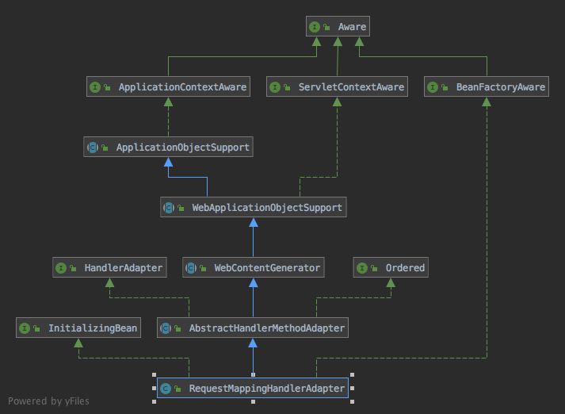

[RequestMappingHandlerAdapter]的继承结构：


[HandlerAdapter]接口的作用可以看笔记[如何实现请求的分发和响应](如何实现请求的分发和响应.md)，主要适用于执行指定类型的handler上的方法来处理请求

[WebContentGenerator]类看上去更像个工具类，主要用于实现缓存相关的header处理，代码：
```java
public abstract class WebContentGenerator extends WebApplicationObjectSupport {

	public static final String METHOD_GET = "GET";

	public static final String METHOD_HEAD = "HEAD";

	public static final String METHOD_POST = "POST";

	private static final String HEADER_PRAGMA = "Pragma";

	private static final String HEADER_EXPIRES = "Expires";

	protected static final String HEADER_CACHE_CONTROL = "Cache-Control";


	/** Set of supported HTTP methods */
	@Nullable
	private Set<String> supportedMethods;

	@Nullable
	private String allowHeader;

	private boolean requireSession = false;

	@Nullable
	private CacheControl cacheControl;

	private int cacheSeconds = -1;

	@Nullable
	private String[] varyByRequestHeaders;


	// deprecated fields

	/** Use HTTP 1.0 expires header? */
	private boolean useExpiresHeader = false;

	/** Use HTTP 1.1 cache-control header? */
	private boolean useCacheControlHeader = true;

	/** Use HTTP 1.1 cache-control header value "no-store"? */
	private boolean useCacheControlNoStore = true;

	private boolean alwaysMustRevalidate = false;

	public WebContentGenerator() {
		this(true);
	}
  
	public WebContentGenerator(boolean restrictDefaultSupportedMethods) {
		// 默认情况下支持GET, HEAD and POST方法
		if (restrictDefaultSupportedMethods) {
			this.supportedMethods = new LinkedHashSet<>(4);
			this.supportedMethods.add(METHOD_GET);
			this.supportedMethods.add(METHOD_HEAD);
			this.supportedMethods.add(METHOD_POST);
		}
		// 根据supportedMethods的配置设置allowHeader
		initAllowHeader();
	}
  
	public WebContentGenerator(String... supportedMethods) {
		setSupportedMethods(supportedMethods);
	}
  
	public final void setSupportedMethods(@Nullable String... methods) {
		if (!ObjectUtils.isEmpty(methods)) {
			this.supportedMethods = new LinkedHashSet<>(Arrays.asList(methods));
		}
		else {
			this.supportedMethods = null;
		}
		initAllowHeader();
	}
  
	@Nullable
	public final String[] getSupportedMethods() {
		return (this.supportedMethods != null ? StringUtils.toStringArray(this.supportedMethods) : null);
	}

	private void initAllowHeader() {
		Collection<String> allowedMethods;
		if (this.supportedMethods == null) {
			allowedMethods = new ArrayList<>(HttpMethod.values().length - 1);
			for (HttpMethod method : HttpMethod.values()) {
				if (method != HttpMethod.TRACE) {
					allowedMethods.add(method.name());
				}
			}
		}
		else if (this.supportedMethods.contains(HttpMethod.OPTIONS.name())) {
			allowedMethods = this.supportedMethods;
		}
		else {
			allowedMethods = new ArrayList<>(this.supportedMethods);
			allowedMethods.add(HttpMethod.OPTIONS.name());

		}
		this.allowHeader = StringUtils.collectionToCommaDelimitedString(allowedMethods);
	}
  
	@Nullable
	protected String getAllowHeader() {
		return this.allowHeader;
	}
  
	public final void setRequireSession(boolean requireSession) {
		this.requireSession = requireSession;
	}
  
	public final boolean isRequireSession() {
		return this.requireSession;
	}
  
	public final void setCacheControl(@Nullable CacheControl cacheControl) {
		this.cacheControl = cacheControl;
	}
  
	@Nullable
	public final CacheControl getCacheControl() {
		return this.cacheControl;
	}
  
	public final void setCacheSeconds(int seconds) {
		this.cacheSeconds = seconds;
	}
  
	public final int getCacheSeconds() {
		return this.cacheSeconds;
	}
  
	public final void setVaryByRequestHeaders(@Nullable String... varyByRequestHeaders) {
		this.varyByRequestHeaders = varyByRequestHeaders;
	}
  
	@Nullable
	public final String[] getVaryByRequestHeaders() {
		return this.varyByRequestHeaders;
	}
  
	@Deprecated
	public final void setUseExpiresHeader(boolean useExpiresHeader) {
		this.useExpiresHeader = useExpiresHeader;
	}
  
	@Deprecated
	public final boolean isUseExpiresHeader() {
		return this.useExpiresHeader;
	}
  
	@Deprecated
	public final void setUseCacheControlHeader(boolean useCacheControlHeader) {
		this.useCacheControlHeader = useCacheControlHeader;
	}

	@Deprecated
	public final boolean isUseCacheControlHeader() {
		return this.useCacheControlHeader;
	}
  
	@Deprecated
	public final void setUseCacheControlNoStore(boolean useCacheControlNoStore) {
		this.useCacheControlNoStore = useCacheControlNoStore;
	}

	/**
	 * Return whether the HTTP 1.1 cache-control header value "no-store" is used.
	 * @deprecated as of 4.2, in favor of {@link #getCacheControl()}
	 */
	@Deprecated
	public final boolean isUseCacheControlNoStore() {
		return this.useCacheControlNoStore;
	}

	@Deprecated
	public final void setAlwaysMustRevalidate(boolean mustRevalidate) {
		this.alwaysMustRevalidate = mustRevalidate;
	}
  
	@Deprecated
	public final boolean isAlwaysMustRevalidate() {
		return this.alwaysMustRevalidate;
	}
  
	// 判断请求方法是否在支持的方法中
	protected final void checkRequest(HttpServletRequest request) throws ServletException {
		// Check whether we should support the request method.
		String method = request.getMethod();
		if (this.supportedMethods != null && !this.supportedMethods.contains(method)) {
			throw new HttpRequestMethodNotSupportedException(method, this.supportedMethods);
		}

		// Check whether a session is required.
		// 如果requireSession为true并且当前请求没有session则报错
		if (this.requireSession && request.getSession(false) == null) {
			throw new HttpSessionRequiredException("Pre-existing session required but none found");
		}
	}
  
	// 为response设置缓存相关的头部
	protected final void prepareResponse(HttpServletResponse response) {
		if (this.cacheControl != null) {
			applyCacheControl(response, this.cacheControl);
		}
		else {
			applyCacheSeconds(response, this.cacheSeconds);
		}
		if (this.varyByRequestHeaders != null) {
			for (String value : getVaryRequestHeadersToAdd(response, this.varyByRequestHeaders)) {
				response.addHeader("Vary", value);
			}
		}
	}
  
	protected final void applyCacheControl(HttpServletResponse response, CacheControl cacheControl) {
		String ccValue = cacheControl.getHeaderValue();
		if (ccValue != null) {
			// Set computed HTTP 1.1 Cache-Control header
			response.setHeader(HEADER_CACHE_CONTROL, ccValue);

			if (response.containsHeader(HEADER_PRAGMA)) {
				// Reset HTTP 1.0 Pragma header if present
				response.setHeader(HEADER_PRAGMA, "");
			}
			if (response.containsHeader(HEADER_EXPIRES)) {
				// Reset HTTP 1.0 Expires header if present
				response.setHeader(HEADER_EXPIRES, "");
			}
		}
	}
  
	@SuppressWarnings("deprecation")
	protected final void applyCacheSeconds(HttpServletResponse response, int cacheSeconds) {
		if (this.useExpiresHeader || !this.useCacheControlHeader) {
			// Deprecated HTTP 1.0 cache behavior, as in previous Spring versions
			if (cacheSeconds > 0) {
				cacheForSeconds(response, cacheSeconds);
			}
			else if (cacheSeconds == 0) {
				preventCaching(response);
			}
		}
		else {
			CacheControl cControl;
			if (cacheSeconds > 0) {
				cControl = CacheControl.maxAge(cacheSeconds, TimeUnit.SECONDS);
				if (this.alwaysMustRevalidate) {
					cControl = cControl.mustRevalidate();
				}
			}
			else if (cacheSeconds == 0) {
				cControl = (this.useCacheControlNoStore ? CacheControl.noStore() : CacheControl.noCache());
			}
			else {
				cControl = CacheControl.empty();
			}
			applyCacheControl(response, cControl);
		}
	}
  
	@Deprecated
	protected final void checkAndPrepare(
			HttpServletRequest request, HttpServletResponse response, boolean lastModified) throws ServletException {

		checkRequest(request);
		prepareResponse(response);
	}
  
	@Deprecated
	protected final void checkAndPrepare(
			HttpServletRequest request, HttpServletResponse response, int cacheSeconds, boolean lastModified)
			throws ServletException {

		checkRequest(request);
		applyCacheSeconds(response, cacheSeconds);
	}
  
	@Deprecated
	protected final void applyCacheSeconds(HttpServletResponse response, int cacheSeconds, boolean mustRevalidate) {
		if (cacheSeconds > 0) {
			cacheForSeconds(response, cacheSeconds, mustRevalidate);
		}
		else if (cacheSeconds == 0) {
			preventCaching(response);
		}
	}
  
	@Deprecated
	protected final void cacheForSeconds(HttpServletResponse response, int seconds) {
		cacheForSeconds(response, seconds, false);
	}
  
	@Deprecated
	protected final void cacheForSeconds(HttpServletResponse response, int seconds, boolean mustRevalidate) {
		if (this.useExpiresHeader) {
			// HTTP 1.0 header
			response.setDateHeader(HEADER_EXPIRES, System.currentTimeMillis() + seconds * 1000L);
		}
		else if (response.containsHeader(HEADER_EXPIRES)) {
			// Reset HTTP 1.0 Expires header if present
			response.setHeader(HEADER_EXPIRES, "");
		}

		if (this.useCacheControlHeader) {
			// HTTP 1.1 header
			String headerValue = "max-age=" + seconds;
			if (mustRevalidate || this.alwaysMustRevalidate) {
				headerValue += ", must-revalidate";
			}
			response.setHeader(HEADER_CACHE_CONTROL, headerValue);
		}

		if (response.containsHeader(HEADER_PRAGMA)) {
			// Reset HTTP 1.0 Pragma header if present
			response.setHeader(HEADER_PRAGMA, "");
		}
	}
  
	@Deprecated
	protected final void preventCaching(HttpServletResponse response) {
		response.setHeader(HEADER_PRAGMA, "no-cache");

		if (this.useExpiresHeader) {
			// HTTP 1.0 Expires header
			response.setDateHeader(HEADER_EXPIRES, 1L);
		}

		if (this.useCacheControlHeader) {
			// HTTP 1.1 Cache-Control header: "no-cache" is the standard value,
			// "no-store" is necessary to prevent caching on Firefox.
			response.setHeader(HEADER_CACHE_CONTROL, "no-cache");
			if (this.useCacheControlNoStore) {
				response.addHeader(HEADER_CACHE_CONTROL, "no-store");
			}
		}
	}


	/*
	 该方法处理vary header，对于vary header的作用：
	 源自：https://imququ.com/post/vary-header-in-http.html

	 要了解 Vary 的作用，先得了解 HTTP 的内容协商机制。有时候，同一个 URL 可以提供多份不同的文档，这就要求服务端和客户端之间有一个选择最合适版本的机制，这就是内容协商

	 协商方式有两种，一种是服务端把文档可用版本列表发给客户端让用户选，这可以使用 300 Multiple Choices 状态码来实现。这种方案有不少问题，首先多一次网络往返；其次服务端同一
	 文档的某些版本可能是为拥有某些技术特征的客户端准备的，而普通用户不一定了解这些细节。举个例子，服务端通常可以将静态资源输出为压缩和未压缩两个版本，压缩版显然是为支持压缩的
	 客户端而准备的，但如果让普通用户选，很可能选择错误的版本。

	 所以 HTTP 的内容协商通常使用另外一种方案：服务端根据客户端发送的请求头中某些字段自动发送最合适的版本。可以用于这个机制的请求头字段又分两种：内容协商专用字段（Accept 字段）、其他字段

	 请求头字段			说明						响应头字段
	 Accept				告知服务器发送何种媒体类型	Content-Type
	 Accept-Language	告知服务器发送何种语言		Content-Language
	 Accept-Charset		告知服务器发送何种字符集	Content-Type
	 Accept-Encoding	告知服务器采用何种压缩方式	Content-Encoding

	 例如客户端发送以下请求头：
	 Accept:* / *
	 Accept-Encoding:gzip,deflate,sdch
	 Accept-Language:zh-CN,en-US;q=0.8,en;q=0.6

	 表示它可以接受任何 MIME 类型的资源；支持采用 gzip、deflate 或 sdch 压缩过的资源；可以接受 zh-CN、en-US 和 en 三种语言，并且 zh-CN 的权重最高（q 取值 0 - 1，最高为 1，最低为 0，默认为 1），
	 服务端应该优先返回语言等于 zh-CN 的版本。

	 浏览器的响应头可能是这样的：
	 Content-Type: text/javascript
	 Content-Encoding: gzip

	 表示这个文档确切的 MIME 类型是 text/javascript；文档内容进行了 gzip 压缩；响应头没有 Content-Language 字段，通常说明返回版本的语言正好是请求头 Accept-Language 中权重最高的那个

	 有时候，上面四个 Accept 字段并不够用，例如要针对特定浏览器如 IE6 输出不一样的内容，就需要用到请求头中的 User-Agent 字段。类似的，请求头中的 Cookie 也可能被服务端用做输出差异化内容的依据。

	 由于客户端和服务端之间可能存在一个或多个中间实体（如缓存服务器），而缓存服务最基本的要求是给用户返回正确的文档。如果服务端根据不同 User-Agent 返回不同内容，而缓存服务器把 IE6 用户的响应缓存下来，
	 并返回给使用其他浏览器的用户，肯定会出问题 。

	 所以 HTTP 协议规定，如果服务端提供的内容取决于 User-Agent 这样「常规 Accept 协商字段之外」的请求头字段，那么响应头中必须包含 Vary 字段，且 Vary 的内容必须包含 User-Agent。同理，如果服务端同时使
	 用请求头中 User-Agent 和 Cookie 这两个字段来生成内容，那么响应中的 Vary 字段看上去应该是这样的：
	 Vary: User-Agent, Cookie

	 也就是说 Vary 字段用于列出一个响应字段列表，告诉缓存服务器遇到同一个 URL 对应着不同版本文档的情况时，如何缓存和筛选合适的版本。
	 */

	private Collection<String> getVaryRequestHeadersToAdd(HttpServletResponse response, String[] varyByRequestHeaders) {
		// 如果response的header中没有vary，则直接将varyByRequestHeaders中的值作为vary的值
		if (!response.containsHeader(HttpHeaders.VARY)) {
			return Arrays.asList(varyByRequestHeaders);
		}
		Collection<String> result = new ArrayList<>(varyByRequestHeaders.length);
		Collections.addAll(result, varyByRequestHeaders);
		// 否则遍历response中已有的vary，从varyByRequestHeaders中删除掉vary中已有的vary值
		for (String header : response.getHeaders(HttpHeaders.VARY)) {
			for (String existing : StringUtils.tokenizeToStringArray(header, ",")) {
				// 如果已有的vary值中有*则不需要再添加额外的vary了，*表示所有的请求都被视为唯一并且非缓存的，既缓存服务器不应该对响应进行缓存
				if ("*".equals(existing)) {
					return Collections.emptyList();
				}
				for (String value : varyByRequestHeaders) {
					if (value.equalsIgnoreCase(existing)) {
						result.remove(value);
					}
				}
			}
		}
		return result;
	}

}
```

[AbstractHandlerMethodAdapter]类实现了屏蔽了[HandlerAdapter]接口的若干方法，屏蔽了子类不需要关注的东西，为子类提供了若干抽象方法，代码：
```java
public abstract class AbstractHandlerMethodAdapter extends WebContentGenerator implements HandlerAdapter, Ordered {

	private int order = Ordered.LOWEST_PRECEDENCE;

	public AbstractHandlerMethodAdapter() {
		// no restriction of HTTP methods by default
		// 默认不对请求的method进行限制，也就是HttpMethod枚举的值中除了TRACE，其他的都是支持的
		super(false);
	}
  
	public void setOrder(int order) {
		this.order = order;
	}

	@Override
	public int getOrder() {
		return this.order;
	}
  
	@Override
	public final boolean supports(Object handler) {
		// HandlerMethod对象对应的是AbstractHandlerMethodMapping类创建的handler，supportsInternal为抽象方法
		return (handler instanceof HandlerMethod && supportsInternal((HandlerMethod) handler));
	}
  
	protected abstract boolean supportsInternal(HandlerMethod handlerMethod);

	@Override
	@Nullable
	public final ModelAndView handle(HttpServletRequest request, HttpServletResponse response, Object handler)
			throws Exception {

		// handleInternal为抽象方法，供子类实现
		return handleInternal(request, response, (HandlerMethod) handler);
	}
  
	@Nullable
	protected abstract ModelAndView handleInternal(HttpServletRequest request,
			HttpServletResponse response, HandlerMethod handlerMethod) throws Exception;

	@Override
	public final long getLastModified(HttpServletRequest request, Object handler) {
		// 供子类实现
		return getLastModifiedInternal(request, (HandlerMethod) handler);
	}
  
	protected abstract long getLastModifiedInternal(HttpServletRequest request, HandlerMethod handlerMethod);

}
```

[RequestMappingHandlerAdapter]类实现了通过[HandlerMethod]对象执行请求的全部过程，包括model的初始化、请求参数的转换和请求结果的处理，常见的Spring MVC注解如[InitBinder]、[ModelAttribute]、[PathVariable]等的支持都实现在[RequestMappingHandlerAdapter]类，代码：
```java
public class RequestMappingHandlerAdapter extends AbstractHandlerMethodAdapter
		implements BeanFactoryAware, InitializingBean {

	@Nullable
	private List<HandlerMethodArgumentResolver> customArgumentResolvers;

	@Nullable
	private HandlerMethodArgumentResolverComposite argumentResolvers;

	@Nullable
	private HandlerMethodArgumentResolverComposite initBinderArgumentResolvers;

	@Nullable
	private List<HandlerMethodReturnValueHandler> customReturnValueHandlers;

	@Nullable
	private HandlerMethodReturnValueHandlerComposite returnValueHandlers;

	@Nullable
	private List<ModelAndViewResolver> modelAndViewResolvers;

	private ContentNegotiationManager contentNegotiationManager = new ContentNegotiationManager();

	private List<HttpMessageConverter<?>> messageConverters;

	private List<Object> requestResponseBodyAdvice = new ArrayList<>();

	@Nullable
	private WebBindingInitializer webBindingInitializer;

	private AsyncTaskExecutor taskExecutor = new SimpleAsyncTaskExecutor("MvcAsync");

	@Nullable
	private Long asyncRequestTimeout;

	private CallableProcessingInterceptor[] callableInterceptors = new CallableProcessingInterceptor[0];

	private DeferredResultProcessingInterceptor[] deferredResultInterceptors = new DeferredResultProcessingInterceptor[0];

	private ReactiveAdapterRegistry reactiveAdapterRegistry = ReactiveAdapterRegistry.getSharedInstance();

	private boolean ignoreDefaultModelOnRedirect = false;

	private int cacheSecondsForSessionAttributeHandlers = 0;

	private boolean synchronizeOnSession = false;

	private SessionAttributeStore sessionAttributeStore = new DefaultSessionAttributeStore();

	private ParameterNameDiscoverer parameterNameDiscoverer = new DefaultParameterNameDiscoverer();

	@Nullable
	private ConfigurableBeanFactory beanFactory;


	private final Map<Class<?>, SessionAttributesHandler> sessionAttributesHandlerCache = new ConcurrentHashMap<>(64);

	private final Map<Class<?>, Set<Method>> initBinderCache = new ConcurrentHashMap<>(64);

	private final Map<ControllerAdviceBean, Set<Method>> initBinderAdviceCache = new LinkedHashMap<>();

	private final Map<Class<?>, Set<Method>> modelAttributeCache = new ConcurrentHashMap<>(64);

	private final Map<ControllerAdviceBean, Set<Method>> modelAttributeAdviceCache = new LinkedHashMap<>();

	public RequestMappingHandlerAdapter() {
		StringHttpMessageConverter stringHttpMessageConverter = new StringHttpMessageConverter();
		stringHttpMessageConverter.setWriteAcceptCharset(false);  // see SPR-7316

		// 初始化各种HttpMessageConverter，HttpMessageConverter的作用是针对某种MediaType进行读写
		this.messageConverters = new ArrayList<>(4);
		this.messageConverters.add(new ByteArrayHttpMessageConverter());
		this.messageConverters.add(stringHttpMessageConverter);
		this.messageConverters.add(new SourceHttpMessageConverter<>());
		this.messageConverters.add(new AllEncompassingFormHttpMessageConverter());
	}
  
	public void setCustomArgumentResolvers(@Nullable List<HandlerMethodArgumentResolver> argumentResolvers) {
		this.customArgumentResolvers = argumentResolvers;
	}
  
	@Nullable
	public List<HandlerMethodArgumentResolver> getCustomArgumentResolvers() {
		return this.customArgumentResolvers;
	}
  
	public void setArgumentResolvers(@Nullable List<HandlerMethodArgumentResolver> argumentResolvers) {
		if (argumentResolvers == null) {
			this.argumentResolvers = null;
		}
		else {
			this.argumentResolvers = new HandlerMethodArgumentResolverComposite();
			this.argumentResolvers.addResolvers(argumentResolvers);
		}
	}
  
	@Nullable
	public List<HandlerMethodArgumentResolver> getArgumentResolvers() {
		return (this.argumentResolvers != null ? this.argumentResolvers.getResolvers() : null);
	}
  
	public void setInitBinderArgumentResolvers(@Nullable List<HandlerMethodArgumentResolver> argumentResolvers) {
		if (argumentResolvers == null) {
			this.initBinderArgumentResolvers = null;
		}
		else {
			this.initBinderArgumentResolvers = new HandlerMethodArgumentResolverComposite();
			this.initBinderArgumentResolvers.addResolvers(argumentResolvers);
		}
	}
  
	@Nullable
	public List<HandlerMethodArgumentResolver> getInitBinderArgumentResolvers() {
		return (this.initBinderArgumentResolvers != null ? this.initBinderArgumentResolvers.getResolvers() : null);
	}
  
	public void setCustomReturnValueHandlers(@Nullable List<HandlerMethodReturnValueHandler> returnValueHandlers) {
		this.customReturnValueHandlers = returnValueHandlers;
	}
  
	@Nullable
	public List<HandlerMethodReturnValueHandler> getCustomReturnValueHandlers() {
		return this.customReturnValueHandlers;
	}
  
	public void setReturnValueHandlers(@Nullable List<HandlerMethodReturnValueHandler> returnValueHandlers) {
		if (returnValueHandlers == null) {
			this.returnValueHandlers = null;
		}
		else {
			this.returnValueHandlers = new HandlerMethodReturnValueHandlerComposite();
			this.returnValueHandlers.addHandlers(returnValueHandlers);
		}
	}
  
	@Nullable
	public List<HandlerMethodReturnValueHandler> getReturnValueHandlers() {
		return (this.returnValueHandlers != null ? this.returnValueHandlers.getHandlers() : null);
	}
  
	public void setModelAndViewResolvers(@Nullable List<ModelAndViewResolver> modelAndViewResolvers) {
		this.modelAndViewResolvers = modelAndViewResolvers;
	}
  
	@Nullable
	public List<ModelAndViewResolver> getModelAndViewResolvers() {
		return this.modelAndViewResolvers;
	}
  
	public void setContentNegotiationManager(ContentNegotiationManager contentNegotiationManager) {
		this.contentNegotiationManager = contentNegotiationManager;
	}
  
	public void setMessageConverters(List<HttpMessageConverter<?>> messageConverters) {
		this.messageConverters = messageConverters;
	}
  
	public List<HttpMessageConverter<?>> getMessageConverters() {
		return this.messageConverters;
	}
  
	public void setRequestBodyAdvice(@Nullable List<RequestBodyAdvice> requestBodyAdvice) {
		if (requestBodyAdvice != null) {
			this.requestResponseBodyAdvice.addAll(requestBodyAdvice);
		}
	}
  
	public void setResponseBodyAdvice(@Nullable List<ResponseBodyAdvice<?>> responseBodyAdvice) {
		if (responseBodyAdvice != null) {
			this.requestResponseBodyAdvice.addAll(responseBodyAdvice);
		}
	}
  
	public void setWebBindingInitializer(@Nullable WebBindingInitializer webBindingInitializer) {
		this.webBindingInitializer = webBindingInitializer;
	}
  
	@Nullable
	public WebBindingInitializer getWebBindingInitializer() {
		return this.webBindingInitializer;
	}
  
	public void setTaskExecutor(AsyncTaskExecutor taskExecutor) {
		this.taskExecutor = taskExecutor;
	}
  
	public void setAsyncRequestTimeout(long timeout) {
		this.asyncRequestTimeout = timeout;
	}
  
	public void setCallableInterceptors(List<CallableProcessingInterceptor> interceptors) {
		this.callableInterceptors = interceptors.toArray(new CallableProcessingInterceptor[0]);
	}
  
	public void setDeferredResultInterceptors(List<DeferredResultProcessingInterceptor> interceptors) {
		this.deferredResultInterceptors = interceptors.toArray(new DeferredResultProcessingInterceptor[0]);
	}
  
	@Deprecated
	public void setReactiveRegistry(ReactiveAdapterRegistry reactiveRegistry) {
		this.reactiveAdapterRegistry = reactiveRegistry;
	}
  
	public void setReactiveAdapterRegistry(ReactiveAdapterRegistry reactiveAdapterRegistry) {
		this.reactiveAdapterRegistry = reactiveAdapterRegistry;
	}
  
	public ReactiveAdapterRegistry getReactiveAdapterRegistry() {
		return this.reactiveAdapterRegistry;
	}
  
	public void setIgnoreDefaultModelOnRedirect(boolean ignoreDefaultModelOnRedirect) {
		this.ignoreDefaultModelOnRedirect = ignoreDefaultModelOnRedirect;
	}
  
	public void setSessionAttributeStore(SessionAttributeStore sessionAttributeStore) {
		this.sessionAttributeStore = sessionAttributeStore;
	}
  
	public void setCacheSecondsForSessionAttributeHandlers(int cacheSecondsForSessionAttributeHandlers) {
		this.cacheSecondsForSessionAttributeHandlers = cacheSecondsForSessionAttributeHandlers;
	}
  
	public void setSynchronizeOnSession(boolean synchronizeOnSession) {
		this.synchronizeOnSession = synchronizeOnSession;
	}
  
	public void setParameterNameDiscoverer(ParameterNameDiscoverer parameterNameDiscoverer) {
		this.parameterNameDiscoverer = parameterNameDiscoverer;
	}
  
	@Override
	public void setBeanFactory(BeanFactory beanFactory) {
		if (beanFactory instanceof ConfigurableBeanFactory) {
			this.beanFactory = (ConfigurableBeanFactory) beanFactory;
		}
	}
  
	@Nullable
	protected ConfigurableBeanFactory getBeanFactory() {
		return this.beanFactory;
	}


	@Override
	public void afterPropertiesSet() {
		// Do this first, it may add ResponseBody advice beans
		// 该方法对所有存在ControllerAdvice注解的bean进行解析，保存相应的advice
		initControllerAdviceCache();

		// 添加默认参数解析工具类，如PathVariableMethodArgumentResolver支持有PathVariable注解的参数的解析
		if (this.argumentResolvers == null) {
			List<HandlerMethodArgumentResolver> resolvers = getDefaultArgumentResolvers();
			this.argumentResolvers = new HandlerMethodArgumentResolverComposite().addResolvers(resolvers);
		}
		if (this.initBinderArgumentResolvers == null) {
			List<HandlerMethodArgumentResolver> resolvers = getDefaultInitBinderArgumentResolvers();
			this.initBinderArgumentResolvers = new HandlerMethodArgumentResolverComposite().addResolvers(resolvers);
		}
		// 添加对返回值进行解析的工具类
		if (this.returnValueHandlers == null) {
			List<HandlerMethodReturnValueHandler> handlers = getDefaultReturnValueHandlers();
			this.returnValueHandlers = new HandlerMethodReturnValueHandlerComposite().addHandlers(handlers);
		}
	}

	private void initControllerAdviceCache() {
		if (getApplicationContext() == null) {
			return;
		}
		if (logger.isInfoEnabled()) {
			logger.info("Looking for @ControllerAdvice: " + getApplicationContext());
		}

		// 获取所有有ControllerAdvice注解的bean
		List<ControllerAdviceBean> adviceBeans = ControllerAdviceBean.findAnnotatedBeans(getApplicationContext());
		AnnotationAwareOrderComparator.sort(adviceBeans);

		List<Object> requestResponseBodyAdviceBeans = new ArrayList<>();

		for (ControllerAdviceBean adviceBean : adviceBeans) {
			Class<?> beanType = adviceBean.getBeanType();
			if (beanType == null) {
				throw new IllegalStateException("Unresolvable type for ControllerAdviceBean: " + adviceBean);
			}
			// 获取该bean的所有方法中没有RequestMapping注解但是有ModelAttribute注解的方法
			Set<Method> attrMethods = MethodIntrospector.selectMethods(beanType, MODEL_ATTRIBUTE_METHODS);
			if (!attrMethods.isEmpty()) {
				// 保存找到的方法
				this.modelAttributeAdviceCache.put(adviceBean, attrMethods);
				if (logger.isInfoEnabled()) {
					logger.info("Detected @ModelAttribute methods in " + adviceBean);
				}
			}
			// 获取该bean的所有方法中有InitBinder注解的方法
			Set<Method> binderMethods = MethodIntrospector.selectMethods(beanType, INIT_BINDER_METHODS);
			if (!binderMethods.isEmpty()) {
				this.initBinderAdviceCache.put(adviceBean, binderMethods);
				if (logger.isInfoEnabled()) {
					logger.info("Detected @InitBinder methods in " + adviceBean);
				}
			}
			// 如果bean实现了RequestBodyAdvice接口
			if (RequestBodyAdvice.class.isAssignableFrom(beanType)) {
				requestResponseBodyAdviceBeans.add(adviceBean);
				if (logger.isInfoEnabled()) {
					logger.info("Detected RequestBodyAdvice bean in " + adviceBean);
				}
			}
			// 如果bean实现了ResponseBodyAdvice接口
			if (ResponseBodyAdvice.class.isAssignableFrom(beanType)) {
				requestResponseBodyAdviceBeans.add(adviceBean);
				if (logger.isInfoEnabled()) {
					logger.info("Detected ResponseBodyAdvice bean in " + adviceBean);
				}
			}
		}

		if (!requestResponseBodyAdviceBeans.isEmpty()) {
			// 保存所有实现了RequestBodyAdvice接口或ResponseBodyAdvice接口的bean
			this.requestResponseBodyAdvice.addAll(0, requestResponseBodyAdviceBeans);
		}
	}
  
	private List<HandlerMethodArgumentResolver> getDefaultArgumentResolvers() {
		List<HandlerMethodArgumentResolver> resolvers = new ArrayList<>();

		// Annotation-based argument resolution
		// 添加各种HandlerMethodArgumentResolver，每个HandlerMethodArgumentResolver都对某种类型的参数进行支持，如PathVariable
		// 注解的参数
		resolvers.add(new RequestParamMethodArgumentResolver(getBeanFactory(), false));
		resolvers.add(new RequestParamMapMethodArgumentResolver());
		resolvers.add(new PathVariableMethodArgumentResolver());
		resolvers.add(new PathVariableMapMethodArgumentResolver());
		resolvers.add(new MatrixVariableMethodArgumentResolver());
		resolvers.add(new MatrixVariableMapMethodArgumentResolver());
		resolvers.add(new ServletModelAttributeMethodProcessor(false));
		resolvers.add(new RequestResponseBodyMethodProcessor(getMessageConverters(), this.requestResponseBodyAdvice));
		resolvers.add(new RequestPartMethodArgumentResolver(getMessageConverters(), this.requestResponseBodyAdvice));
		resolvers.add(new RequestHeaderMethodArgumentResolver(getBeanFactory()));
		resolvers.add(new RequestHeaderMapMethodArgumentResolver());
		resolvers.add(new ServletCookieValueMethodArgumentResolver(getBeanFactory()));
		resolvers.add(new ExpressionValueMethodArgumentResolver(getBeanFactory()));
		resolvers.add(new SessionAttributeMethodArgumentResolver());
		resolvers.add(new RequestAttributeMethodArgumentResolver());

		// Type-based argument resolution
		resolvers.add(new ServletRequestMethodArgumentResolver());
		resolvers.add(new ServletResponseMethodArgumentResolver());
		resolvers.add(new HttpEntityMethodProcessor(getMessageConverters(), this.requestResponseBodyAdvice));
		resolvers.add(new RedirectAttributesMethodArgumentResolver());
		resolvers.add(new ModelMethodProcessor());
		resolvers.add(new MapMethodProcessor());
		resolvers.add(new ErrorsMethodArgumentResolver());
		resolvers.add(new SessionStatusMethodArgumentResolver());
		resolvers.add(new UriComponentsBuilderMethodArgumentResolver());

		// Custom arguments
		if (getCustomArgumentResolvers() != null) {
			resolvers.addAll(getCustomArgumentResolvers());
		}

		// Catch-all
		resolvers.add(new RequestParamMethodArgumentResolver(getBeanFactory(), true));
		resolvers.add(new ServletModelAttributeMethodProcessor(true));

		return resolvers;
	}
  
	private List<HandlerMethodArgumentResolver> getDefaultInitBinderArgumentResolvers() {
		List<HandlerMethodArgumentResolver> resolvers = new ArrayList<>();

		// Annotation-based argument resolution
		resolvers.add(new RequestParamMethodArgumentResolver(getBeanFactory(), false));
		resolvers.add(new RequestParamMapMethodArgumentResolver());
		resolvers.add(new PathVariableMethodArgumentResolver());
		resolvers.add(new PathVariableMapMethodArgumentResolver());
		resolvers.add(new MatrixVariableMethodArgumentResolver());
		resolvers.add(new MatrixVariableMapMethodArgumentResolver());
		resolvers.add(new ExpressionValueMethodArgumentResolver(getBeanFactory()));
		resolvers.add(new SessionAttributeMethodArgumentResolver());
		resolvers.add(new RequestAttributeMethodArgumentResolver());

		// Type-based argument resolution
		resolvers.add(new ServletRequestMethodArgumentResolver());
		resolvers.add(new ServletResponseMethodArgumentResolver());

		// Custom arguments
		if (getCustomArgumentResolvers() != null) {
			resolvers.addAll(getCustomArgumentResolvers());
		}

		// Catch-all
		resolvers.add(new RequestParamMethodArgumentResolver(getBeanFactory(), true));

		return resolvers;
	}
  
	private List<HandlerMethodReturnValueHandler> getDefaultReturnValueHandlers() {
		List<HandlerMethodReturnValueHandler> handlers = new ArrayList<>();

		// Single-purpose return value types
		handlers.add(new ModelAndViewMethodReturnValueHandler());
		handlers.add(new ModelMethodProcessor());
		handlers.add(new ViewMethodReturnValueHandler());
		handlers.add(new ResponseBodyEmitterReturnValueHandler(getMessageConverters(),
				this.reactiveAdapterRegistry, this.taskExecutor, this.contentNegotiationManager));
		handlers.add(new StreamingResponseBodyReturnValueHandler());
		handlers.add(new HttpEntityMethodProcessor(getMessageConverters(),
				this.contentNegotiationManager, this.requestResponseBodyAdvice));
		handlers.add(new HttpHeadersReturnValueHandler());
		handlers.add(new CallableMethodReturnValueHandler());
		handlers.add(new DeferredResultMethodReturnValueHandler());
		handlers.add(new AsyncTaskMethodReturnValueHandler(this.beanFactory));

		// Annotation-based return value types
		handlers.add(new ModelAttributeMethodProcessor(false));
		handlers.add(new RequestResponseBodyMethodProcessor(getMessageConverters(),
				this.contentNegotiationManager, this.requestResponseBodyAdvice));

		// Multi-purpose return value types
		handlers.add(new ViewNameMethodReturnValueHandler());
		handlers.add(new MapMethodProcessor());

		// Custom return value types
		if (getCustomReturnValueHandlers() != null) {
			handlers.addAll(getCustomReturnValueHandlers());
		}

		// Catch-all
		if (!CollectionUtils.isEmpty(getModelAndViewResolvers())) {
			handlers.add(new ModelAndViewResolverMethodReturnValueHandler(getModelAndViewResolvers()));
		}
		else {
			handlers.add(new ModelAttributeMethodProcessor(true));
		}

		return handlers;
	}
  
	@Override
	protected boolean supportsInternal(HandlerMethod handlerMethod) {
		return true;
	}

	@Override
	protected ModelAndView handleInternal(HttpServletRequest request,
			HttpServletResponse response, HandlerMethod handlerMethod) throws Exception {

		ModelAndView mav;
		// 判断当前请求的method是否被支持，如果requireSession为true，还会判断当前请求是否存在session
		checkRequest(request);

		// Execute invokeHandlerMethod in synchronized block if required.
		// 如果synchronizeOnSession为true则在调用invokeHandlerMethod执行请求是加锁
		if (this.synchronizeOnSession) {
			HttpSession session = request.getSession(false);
			if (session != null) {
				Object mutex = WebUtils.getSessionMutex(session);
				synchronized (mutex) {
					mav = invokeHandlerMethod(request, response, handlerMethod);
				}
			}
			else {
				// No HttpSession available -> no mutex necessary
				mav = invokeHandlerMethod(request, response, handlerMethod);
			}
		}
		else {
			// No synchronization on session demanded at all...
			mav = invokeHandlerMethod(request, response, handlerMethod);
		}

		// 如果response中没有配置Cache-Control
		if (!response.containsHeader(HEADER_CACHE_CONTROL)) {
			// 如果处理当前请求的controller配置了SessionAttributes注解，添加相应的缓存相关的header用于设置SessionAttributes的有效时间，cacheSecondsForSessionAttributeHandlers参数表示缓存的有效时间
			if (getSessionAttributesHandler(handlerMethod).hasSessionAttributes()) {
				applyCacheSeconds(response, this.cacheSecondsForSessionAttributeHandlers);
			}
			else {
				// 如果没有配置SessionAttributes注解，则根据cacheControl属性或cacheSeconds属性对缓存header进行配置，同时对vary header进行设置
				prepareResponse(response);
			}
		}

		return mav;
	}
  
	@Override
	protected long getLastModifiedInternal(HttpServletRequest request, HandlerMethod handlerMethod) {
		return -1;
	}
  
	// 为HandlerMethod对象创建相应的SessionAttributesHandler对象
	private SessionAttributesHandler getSessionAttributesHandler(HandlerMethod handlerMethod) {
		Class<?> handlerType = handlerMethod.getBeanType();
		SessionAttributesHandler sessionAttrHandler = this.sessionAttributesHandlerCache.get(handlerType);
		if (sessionAttrHandler == null) {
			synchronized (this.sessionAttributesHandlerCache) {
				sessionAttrHandler = this.sessionAttributesHandlerCache.get(handlerType);
				if (sessionAttrHandler == null) {
					sessionAttrHandler = new SessionAttributesHandler(handlerType, sessionAttributeStore);
					this.sessionAttributesHandlerCache.put(handlerType, sessionAttrHandler);
				}
			}
		}
		return sessionAttrHandler;
	}
  
	@Nullable
	protected ModelAndView invokeHandlerMethod(HttpServletRequest request,
			HttpServletResponse response, HandlerMethod handlerMethod) throws Exception {

		// ServletWebRequest对象封装了request和response
		ServletWebRequest webRequest = new ServletWebRequest(request, response);
		try {
			// WebDataBinderFactory能够创建WebDataBinder对象，而WebDataBinder对象能够为指定的对象设置属性
			WebDataBinderFactory binderFactory = getDataBinderFactory(handlerMethod);
			// ModelFactory能够在调用执行请求的方法之前准备好Model，并且通过ModelFactory能够更新Model
			ModelFactory modelFactory = getModelFactory(handlerMethod, binderFactory);

			// createInvocableHandlerMethod方法直接返回一个ServletInvocableHandlerMethod实例，ServletInvocableHandlerMethod对象
			// 代表的就是即将执行请求的方法
			ServletInvocableHandlerMethod invocableMethod = createInvocableHandlerMethod(handlerMethod);
			// 为invocableMethod设置各种属性
			if (this.argumentResolvers != null) {
				invocableMethod.setHandlerMethodArgumentResolvers(this.argumentResolvers);
			}
			if (this.returnValueHandlers != null) {
				invocableMethod.setHandlerMethodReturnValueHandlers(this.returnValueHandlers);
			}
			invocableMethod.setDataBinderFactory(binderFactory);
			invocableMethod.setParameterNameDiscoverer(this.parameterNameDiscoverer);

			// ModelAndViewContainer对象持有和创建了真正的Model对象，Model实际上就是一个map
			ModelAndViewContainer mavContainer = new ModelAndViewContainer();
			// 添加request中名字为DispatcherServlet.INPUT_FLASH_MAP_ATTRIBUTE的属性，既FlashMap对象
			mavContainer.addAllAttributes(RequestContextUtils.getInputFlashMap(request));
			// 保存session的属性到mavContainer，并调用带有ModelAttribute注解的方法，获取model的属性
			modelFactory.initModel(webRequest, mavContainer, invocableMethod);
			// 当是redirect请求时，或者mavContainer的redirectModel为空是，是否使用defaultModel
			mavContainer.setIgnoreDefaultModelOnRedirect(this.ignoreDefaultModelOnRedirect);

			// createAsyncWebRequest方法默认返回StandardServletAsyncWebRequest实例
			AsyncWebRequest asyncWebRequest = WebAsyncUtils.createAsyncWebRequest(request, response);
			asyncWebRequest.setTimeout(this.asyncRequestTimeout);

			// getAsyncManager方法默认返回WebAsyncManager实例，并将该实例保存到request的WEB_ASYNC_MANAGER_ATTRIBUTE属性
			WebAsyncManager asyncManager = WebAsyncUtils.getAsyncManager(request);
			asyncManager.setTaskExecutor(this.taskExecutor);
			asyncManager.setAsyncWebRequest(asyncWebRequest);
			asyncManager.registerCallableInterceptors(this.callableInterceptors);
			asyncManager.registerDeferredResultInterceptors(this.deferredResultInterceptors);

			// 如果设置了并发调用的返回值
			if (asyncManager.hasConcurrentResult()) {
				Object result = asyncManager.getConcurrentResult();
				mavContainer = (ModelAndViewContainer) asyncManager.getConcurrentResultContext()[0];
				asyncManager.clearConcurrentResult();
				if (logger.isDebugEnabled()) {
					logger.debug("Found concurrent result value [" + result + "]");
				}
				// wrapConcurrentResult方法返回一个ConcurrentResultHandlerMethod实例
				invocableMethod = invocableMethod.wrapConcurrentResult(result);
			}

			// 执行方法，并处理方法返回值
			invocableMethod.invokeAndHandle(webRequest, mavContainer);
			if (asyncManager.isConcurrentHandlingStarted()) {
				return null;
			}

			// 如果有必要，创建ModelAndView对象
			return getModelAndView(mavContainer, modelFactory, webRequest);
		}
		finally {
			webRequest.requestCompleted();
		}
	}
  
	protected ServletInvocableHandlerMethod createInvocableHandlerMethod(HandlerMethod handlerMethod) {
		return new ServletInvocableHandlerMethod(handlerMethod);
	}

	private ModelFactory getModelFactory(HandlerMethod handlerMethod, WebDataBinderFactory binderFactory) {
		// SessionAttributesHandler能够解析handler上的SessionAttributes注解，并将该注解配置的属性保存到sessionAttributeStore
		// 对象上，SessionAttributesHandler通过sessionAttributeStore可以实现session属性的读写，sessionAttributeStore的默认实现
		// 是DefaultSessionAttributeStore，实现原理就是将属性保存到request中，scope设置为WebRequest.SCOPE_SESSION，即：
		// request.setAttribute(storeAttributeName, attributeValue, WebRequest.SCOPE_SESSION);
		SessionAttributesHandler sessionAttrHandler = getSessionAttributesHandler(handlerMethod);
		Class<?> handlerType = handlerMethod.getBeanType();
		Set<Method> methods = this.modelAttributeCache.get(handlerType);
		if (methods == null) {
			// 获取所有没有RequestMapping注解但是有ModelAttribute注解的方法
			methods = MethodIntrospector.selectMethods(handlerType, MODEL_ATTRIBUTE_METHODS);
			this.modelAttributeCache.put(handlerType, methods);
		}
		List<InvocableHandlerMethod> attrMethods = new ArrayList<>();
		// Global methods first
		// modelAttributeAdviceCache的key为所有实现了ControllerAdvice接口的bean，value为该bean上没有RequestMapping注解但是有ModelAttribute注解的方法集合
		this.modelAttributeAdviceCache.forEach((clazz, methodSet) -> {
			if (clazz.isApplicableToBeanType(handlerType)) {
				Object bean = clazz.resolveBean();
				for (Method method : methodSet) {
					// 为每个方法都创建一个InvocableHandlerMethod对象，注意这里的InvocableHandlerMethod对象和createInitBinderMethod方法中创建的InvocableHandlerMethod对象
					// 传入的HandlerMethodArgumentResolverComposite不同，用的是argumentResolvers
					attrMethods.add(createModelAttributeMethod(binderFactory, bean, method));
				}
			}
		});
		// 遍历当前bean上没有RequestMapping注解但是有ModelAttribute注解的方法，同样为这些方法创建InvocableHandlerMethod对象
		for (Method method : methods) {
			Object bean = handlerMethod.getBean();
			attrMethods.add(createModelAttributeMethod(binderFactory, bean, method));
		}
		return new ModelFactory(attrMethods, binderFactory, sessionAttrHandler);
	}

	private InvocableHandlerMethod createModelAttributeMethod(WebDataBinderFactory factory, Object bean, Method method) {
		InvocableHandlerMethod attrMethod = new InvocableHandlerMethod(bean, method);
		if (this.argumentResolvers != null) {
			attrMethod.setHandlerMethodArgumentResolvers(this.argumentResolvers);
		}
		attrMethod.setParameterNameDiscoverer(this.parameterNameDiscoverer);
		attrMethod.setDataBinderFactory(factory);
		return attrMethod;
	}

	private WebDataBinderFactory getDataBinderFactory(HandlerMethod handlerMethod) throws Exception {
		Class<?> handlerType = handlerMethod.getBeanType();
		Set<Method> methods = this.initBinderCache.get(handlerType);
		if (methods == null) {
			// 获取bean中存在InitBinder注解的方法
			methods = MethodIntrospector.selectMethods(handlerType, INIT_BINDER_METHODS);
			this.initBinderCache.put(handlerType, methods);
		}
		List<InvocableHandlerMethod> initBinderMethods = new ArrayList<>();
		// Global methods first
		// initBinderAdviceCache的key为ControllerAdviceBean类，该类的实例从实现了ControllerAdvice接口的bean解析而来，initBinderAdviceCache
		// 的value为实现了ControllerAdvice接口的bean的方法中存在InitBinder注解的方法
		this.initBinderAdviceCache.forEach((clazz, methodSet) -> {
			if (clazz.isApplicableToBeanType(handlerType)) {
				Object bean = clazz.resolveBean();
				for (Method method : methodSet) {
					initBinderMethods.add(createInitBinderMethod(bean, method));
				}
			}
		});
		// 遍历当前bean中所有存在InitBinder注解的方法，为每个方法创建InvocableHandlerMethod对象，InvocableHandlerMethod对象继承自HandlerMethod类，
		// 并持有initBinderArgumentResolvers、webDataBinderFactory和parameterNameDiscoverer的引用，在执行其对应的方法前会执行参数解析，并在解析时
		// 传入webDataBinderFactory对象
		for (Method method : methods) {
			Object bean = handlerMethod.getBean();
			initBinderMethods.add(createInitBinderMethod(bean, method));
		}
		// 创建ServletRequestDataBinderFactory对象返回，该对象持有传入的initBinderMethods
		return createDataBinderFactory(initBinderMethods);
	}

	private InvocableHandlerMethod createInitBinderMethod(Object bean, Method method) {
		InvocableHandlerMethod binderMethod = new InvocableHandlerMethod(bean, method);
		if (this.initBinderArgumentResolvers != null) {
			binderMethod.setHandlerMethodArgumentResolvers(this.initBinderArgumentResolvers);
		}
		binderMethod.setDataBinderFactory(new DefaultDataBinderFactory(this.webBindingInitializer));
		binderMethod.setParameterNameDiscoverer(this.parameterNameDiscoverer);
		return binderMethod;
	}
  
	protected InitBinderDataBinderFactory createDataBinderFactory(List<InvocableHandlerMethod> binderMethods)
			throws Exception {

		return new ServletRequestDataBinderFactory(binderMethods, getWebBindingInitializer());
	}

	@Nullable
	private ModelAndView getModelAndView(ModelAndViewContainer mavContainer,
			ModelFactory modelFactory, NativeWebRequest webRequest) throws Exception {

		modelFactory.updateModel(webRequest, mavContainer);
		if (mavContainer.isRequestHandled()) {
			return null;
		}
		ModelMap model = mavContainer.getModel();
		ModelAndView mav = new ModelAndView(mavContainer.getViewName(), model, mavContainer.getStatus());
		if (!mavContainer.isViewReference()) {
			mav.setView((View) mavContainer.getView());
		}
		if (model instanceof RedirectAttributes) {
			Map<String, ?> flashAttributes = ((RedirectAttributes) model).getFlashAttributes();
			HttpServletRequest request = webRequest.getNativeRequest(HttpServletRequest.class);
			if (request != null) {
				RequestContextUtils.getOutputFlashMap(request).putAll(flashAttributes);
			}
		}
		return mav;
	}

	public static final MethodFilter INIT_BINDER_METHODS = method ->
			AnnotationUtils.findAnnotation(method, InitBinder.class) != null;

	public static final MethodFilter MODEL_ATTRIBUTE_METHODS = method ->
			((AnnotationUtils.findAnnotation(method, RequestMapping.class) == null) &&
			(AnnotationUtils.findAnnotation(method, ModelAttribute.class) != null));

}
```