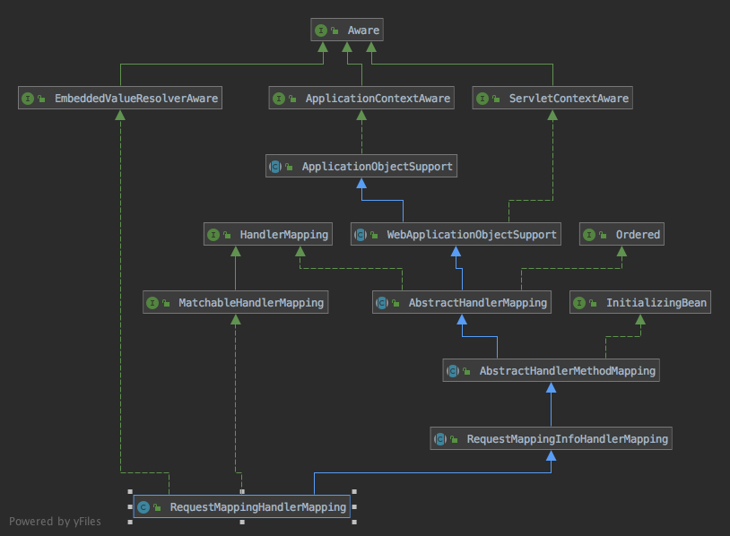

[RequestMappingHandlerMapping]的继承结构：

上面大部分接口在其他笔记都说过了，可以看笔记[如何实现请求的分发和响应](如何实现请求的分发和响应.md)和[SimpleUrlHandlerMapping的实现](SimpleUrlHandlerMapping的实现.md)，这里对重要的内容简单回顾一下，再分析新的内容，首先是

[RequestMappingHandlerMapping]: aaa