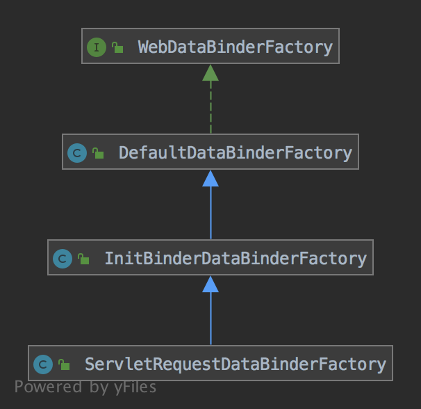

[WebDataBinder]类继承自[DataBinder]类，[DataBinder]类实现了[PropertyEditorRegistry]和[TypeConverter]接口，能够为指定的类提供属性转换功能，代码：
```java
public class DataBinder implements PropertyEditorRegistry, TypeConverter {
	public static final String DEFAULT_OBJECT_NAME = "target";

  public static final int DEFAULT_AUTO_GROW_COLLECTION_LIMIT = 256;

  protected static final Log logger = LogFactory.getLog(DataBinder.class);

  @Nullable
  private final Object target;

  private final String objectName;

  @Nullable
  // 默认实现是BeanPropertyBindingResult类
  private AbstractPropertyBindingResult bindingResult;

  @Nullable
  // DataBinder实现PropertyEditorRegistry和TypeConverter接口的方式很简单，如target不为空，则默认为target创建BeanPropertyBindingResult，
  // 而BeanPropertyBindingResult中又为target创建了BeanWrapperImpl，BeanWrapperImpl类本身实现了PropertyEditorRegistry和TypeConverter接口，
  // 所以target不为空时DataBinder直接通过其BeanWrapperImpl实现PropertyEditorRegistry和TypeConverter接口，如果target为空，则使用这里的SimpleTypeConverter
  // 实现PropertyEditorRegistry和TypeConverter接口
  private SimpleTypeConverter typeConverter;

  // 下面两个值影响设置属性时是否在相应错误情况下抛出异常
  private boolean ignoreUnknownFields = true;

  private boolean ignoreInvalidFields = false;

  // 为空的属性设置属性时是否自动初始化一个默认值，或对于集合类型，是否自动扩容
  private boolean autoGrowNestedPaths = true;

  private int autoGrowCollectionLimit = DEFAULT_AUTO_GROW_COLLECTION_LIMIT;

  @Nullable
  // 被允许设置的属性列表，为空表示没有限制
  private String[] allowedFields;

  @Nullable
  // 不被允许设置的属性列表，为空表示没有限制
  private String[] disallowedFields;

  @Nullable
  // 必须被设置的属性列表，为空表示没有限制
  private String[] requiredFields;

  @Nullable
  // BeanWrapperImpl和SimpleTypeConverter又是通过ConversionService实现的类型转换
  private ConversionService conversionService;

  @Nullable
  private MessageCodesResolver messageCodesResolver;

  private BindingErrorProcessor bindingErrorProcessor = new DefaultBindingErrorProcessor();

  private final List<Validator> validators = new ArrayList<>();

	public DataBinder(@Nullable Object target) {
		this(target, DEFAULT_OBJECT_NAME);
	}
  
	public DataBinder(@Nullable Object target, String objectName) {
		this.target = ObjectUtils.unwrapOptional(target);
		this.objectName = objectName;
	}
  
	@Nullable
	public Object getTarget() {
		return this.target;
	}
  
	public String getObjectName() {
		return this.objectName;
	}
  
	public void setAutoGrowNestedPaths(boolean autoGrowNestedPaths) {
		Assert.state(this.bindingResult == null,
				"DataBinder is already initialized - call setAutoGrowNestedPaths before other configuration methods");
		this.autoGrowNestedPaths = autoGrowNestedPaths;
	}
  
	public boolean isAutoGrowNestedPaths() {
		return this.autoGrowNestedPaths;
	}
  
	public void setAutoGrowCollectionLimit(int autoGrowCollectionLimit) {
		Assert.state(this.bindingResult == null,
				"DataBinder is already initialized - call setAutoGrowCollectionLimit before other configuration methods");
		this.autoGrowCollectionLimit = autoGrowCollectionLimit;
	}
  
	public int getAutoGrowCollectionLimit() {
		return this.autoGrowCollectionLimit;
	}
  
	public void initBeanPropertyAccess() {
		Assert.state(this.bindingResult == null,
				"DataBinder is already initialized - call initBeanPropertyAccess before other configuration methods");
		this.bindingResult = createBeanPropertyBindingResult();
	}
  
	protected AbstractPropertyBindingResult createBeanPropertyBindingResult() {
		// BeanPropertyBindingResult的特点是使用BeanWrapperImpl也就是getter、setter访问target属性
		BeanPropertyBindingResult result = new BeanPropertyBindingResult(getTarget(),
				getObjectName(), isAutoGrowNestedPaths(), getAutoGrowCollectionLimit());

		if (this.conversionService != null) {
			result.initConversion(this.conversionService);
		}
		if (this.messageCodesResolver != null) {
			result.setMessageCodesResolver(this.messageCodesResolver);
		}

		return result;
	}
  
	public void initDirectFieldAccess() {
		Assert.state(this.bindingResult == null,
				"DataBinder is already initialized - call initDirectFieldAccess before other configuration methods");
		this.bindingResult = createDirectFieldBindingResult();
	}
  
	protected AbstractPropertyBindingResult createDirectFieldBindingResult() {
		// DirectFieldBindingResult的特点是直接使用field对象访问target属性
		DirectFieldBindingResult result = new DirectFieldBindingResult(getTarget(),
				getObjectName(), isAutoGrowNestedPaths());

		if (this.conversionService != null) {
			result.initConversion(this.conversionService);
		}
		if (this.messageCodesResolver != null) {
			result.setMessageCodesResolver(this.messageCodesResolver);
		}

		return result;
	}

	protected AbstractPropertyBindingResult getInternalBindingResult() {
		if (this.bindingResult == null) {
			initBeanPropertyAccess();
		}
		return this.bindingResult;
	}
  
	protected ConfigurablePropertyAccessor getPropertyAccessor() {
		return getInternalBindingResult().getPropertyAccessor();
	}
  
	protected SimpleTypeConverter getSimpleTypeConverter() {
		if (this.typeConverter == null) {
			this.typeConverter = new SimpleTypeConverter();
			if (this.conversionService != null) {
				this.typeConverter.setConversionService(this.conversionService);
			}
		}
		return this.typeConverter;
	}
  
	protected PropertyEditorRegistry getPropertyEditorRegistry() {
		if (getTarget() != null) {
			return getInternalBindingResult().getPropertyAccessor();
		}
		else {
			return getSimpleTypeConverter();
		}
	}
  
	protected TypeConverter getTypeConverter() {
		if (getTarget() != null) {
			return getInternalBindingResult().getPropertyAccessor();
		}
		else {
			return getSimpleTypeConverter();
		}
	}
  
	public BindingResult getBindingResult() {
		return getInternalBindingResult();
	}
  
	public void setIgnoreUnknownFields(boolean ignoreUnknownFields) {
		this.ignoreUnknownFields = ignoreUnknownFields;
	}
  
	public boolean isIgnoreUnknownFields() {
		return this.ignoreUnknownFields;
	}
  
	public void setIgnoreInvalidFields(boolean ignoreInvalidFields) {
		this.ignoreInvalidFields = ignoreInvalidFields;
	}
  
	public boolean isIgnoreInvalidFields() {
		return this.ignoreInvalidFields;
	}
  
	public void setAllowedFields(@Nullable String... allowedFields) {
		this.allowedFields = PropertyAccessorUtils.canonicalPropertyNames(allowedFields);
	}
  
	@Nullable
	public String[] getAllowedFields() {
		return this.allowedFields;
	}
  
	public void setDisallowedFields(@Nullable String... disallowedFields) {
		this.disallowedFields = PropertyAccessorUtils.canonicalPropertyNames(disallowedFields);
	}
  
	@Nullable
	public String[] getDisallowedFields() {
		return this.disallowedFields;
	}
  
	public void setRequiredFields(@Nullable String... requiredFields) {
		this.requiredFields = PropertyAccessorUtils.canonicalPropertyNames(requiredFields);
		if (logger.isDebugEnabled()) {
			logger.debug("DataBinder requires binding of required fields [" +
					StringUtils.arrayToCommaDelimitedString(requiredFields) + "]");
		}
	}
  
	@Nullable
	public String[] getRequiredFields() {
		return this.requiredFields;
	}
  
	public void setMessageCodesResolver(@Nullable MessageCodesResolver messageCodesResolver) {
		Assert.state(this.messageCodesResolver == null, "DataBinder is already initialized with MessageCodesResolver");
		this.messageCodesResolver = messageCodesResolver;
		if (this.bindingResult != null && messageCodesResolver != null) {
			this.bindingResult.setMessageCodesResolver(messageCodesResolver);
		}
	}
  
	public void setBindingErrorProcessor(BindingErrorProcessor bindingErrorProcessor) {
		Assert.notNull(bindingErrorProcessor, "BindingErrorProcessor must not be null");
		this.bindingErrorProcessor = bindingErrorProcessor;
	}
  
	public BindingErrorProcessor getBindingErrorProcessor() {
		return this.bindingErrorProcessor;
	}
  
	public void setValidator(@Nullable Validator validator) {
		assertValidators(validator);
		this.validators.clear();
		if (validator != null) {
			this.validators.add(validator);
		}
	}

	private void assertValidators(Validator... validators) {
		Object target = getTarget();
		for (Validator validator : validators) {
			if (validator != null && (target != null && !validator.supports(target.getClass()))) {
				throw new IllegalStateException("Invalid target for Validator [" + validator + "]: " + target);
			}
		}
	}
  
	public void addValidators(Validator... validators) {
		assertValidators(validators);
		this.validators.addAll(Arrays.asList(validators));
	}
  
	public void replaceValidators(Validator... validators) {
		assertValidators(validators);
		this.validators.clear();
		this.validators.addAll(Arrays.asList(validators));
	}
  
	@Nullable
	public Validator getValidator() {
		return (!this.validators.isEmpty() ? this.validators.get(0) : null);
	}
  
	public List<Validator> getValidators() {
		return Collections.unmodifiableList(this.validators);
	}


	//---------------------------------------------------------------------
	// Implementation of PropertyEditorRegistry/TypeConverter interface
	//---------------------------------------------------------------------
	public void setConversionService(@Nullable ConversionService conversionService) {
		Assert.state(this.conversionService == null, "DataBinder is already initialized with ConversionService");
		this.conversionService = conversionService;
		if (this.bindingResult != null && conversionService != null) {
			this.bindingResult.initConversion(conversionService);
		}
	}
  
	@Nullable
	public ConversionService getConversionService() {
		return this.conversionService;
	}
  
	public void addCustomFormatter(Formatter<?> formatter) {
		FormatterPropertyEditorAdapter adapter = new FormatterPropertyEditorAdapter(formatter);
		getPropertyEditorRegistry().registerCustomEditor(adapter.getFieldType(), adapter);
	}
  
	public void addCustomFormatter(Formatter<?> formatter, String... fields) {
		FormatterPropertyEditorAdapter adapter = new FormatterPropertyEditorAdapter(formatter);
		Class<?> fieldType = adapter.getFieldType();
		if (ObjectUtils.isEmpty(fields)) {
			getPropertyEditorRegistry().registerCustomEditor(fieldType, adapter);
		}
		else {
			for (String field : fields) {
				getPropertyEditorRegistry().registerCustomEditor(fieldType, field, adapter);
			}
		}
	}
  
	public void addCustomFormatter(Formatter<?> formatter, Class<?>... fieldTypes) {
		FormatterPropertyEditorAdapter adapter = new FormatterPropertyEditorAdapter(formatter);
		if (ObjectUtils.isEmpty(fieldTypes)) {
			getPropertyEditorRegistry().registerCustomEditor(adapter.getFieldType(), adapter);
		}
		else {
			for (Class<?> fieldType : fieldTypes) {
				getPropertyEditorRegistry().registerCustomEditor(fieldType, adapter);
			}
		}
	}

	@Override
	public void registerCustomEditor(Class<?> requiredType, PropertyEditor propertyEditor) {
		getPropertyEditorRegistry().registerCustomEditor(requiredType, propertyEditor);
	}

	@Override
	public void registerCustomEditor(@Nullable Class<?> requiredType, @Nullable String field, PropertyEditor propertyEditor) {
		getPropertyEditorRegistry().registerCustomEditor(requiredType, field, propertyEditor);
	}

	@Override
	@Nullable
	public PropertyEditor findCustomEditor(@Nullable Class<?> requiredType, @Nullable String propertyPath) {
		return getPropertyEditorRegistry().findCustomEditor(requiredType, propertyPath);
	}

	@Override
	@Nullable
	public <T> T convertIfNecessary(@Nullable Object value, @Nullable Class<T> requiredType) throws TypeMismatchException {
		return getTypeConverter().convertIfNecessary(value, requiredType);
	}

	@Override
	@Nullable
	public <T> T convertIfNecessary(@Nullable Object value, @Nullable Class<T> requiredType,
			@Nullable MethodParameter methodParam) throws TypeMismatchException {

		return getTypeConverter().convertIfNecessary(value, requiredType, methodParam);
	}

	@Override
	@Nullable
	public <T> T convertIfNecessary(@Nullable Object value, @Nullable Class<T> requiredType, @Nullable Field field)
			throws TypeMismatchException {

		return getTypeConverter().convertIfNecessary(value, requiredType, field);
	}
  
	public void bind(PropertyValues pvs) {
		MutablePropertyValues mpvs = (pvs instanceof MutablePropertyValues) ?
				(MutablePropertyValues) pvs : new MutablePropertyValues(pvs);
		doBind(mpvs);
	}
  
	protected void doBind(MutablePropertyValues mpvs) {
		// 判断即将被设置的属性是否允许被设置
		checkAllowedFields(mpvs);
		// 判断即将被设置的属性属否包含了所有的require属性并且require属性的值不为空，如果某个属性不满足条件则会记录一个error到bindingResult
		checkRequiredFields(mpvs);
		// 为target设置属性，如果设置失败则会记录一个error到bindingResult
		applyPropertyValues(mpvs);
	}
  
	protected void checkAllowedFields(MutablePropertyValues mpvs) {
		PropertyValue[] pvs = mpvs.getPropertyValues();
		for (PropertyValue pv : pvs) {
			String field = PropertyAccessorUtils.canonicalPropertyName(pv.getName());
			if (!isAllowed(field)) {
				mpvs.removePropertyValue(pv);
				getBindingResult().recordSuppressedField(field);
				if (logger.isDebugEnabled()) {
					logger.debug("Field [" + field + "] has been removed from PropertyValues " +
							"and will not be bound, because it has not been found in the list of allowed fields");
				}
			}
		}
	}
  
	protected boolean isAllowed(String field) {
		String[] allowed = getAllowedFields();
		String[] disallowed = getDisallowedFields();
		return ((ObjectUtils.isEmpty(allowed) || PatternMatchUtils.simpleMatch(allowed, field)) &&
				(ObjectUtils.isEmpty(disallowed) || !PatternMatchUtils.simpleMatch(disallowed, field)));
	}
  
	protected void checkRequiredFields(MutablePropertyValues mpvs) {
		String[] requiredFields = getRequiredFields();
		if (!ObjectUtils.isEmpty(requiredFields)) {
			Map<String, PropertyValue> propertyValues = new HashMap<>();
			PropertyValue[] pvs = mpvs.getPropertyValues();
			for (PropertyValue pv : pvs) {
				String canonicalName = PropertyAccessorUtils.canonicalPropertyName(pv.getName());
				propertyValues.put(canonicalName, pv);
			}
			for (String field : requiredFields) {
				PropertyValue pv = propertyValues.get(field);
				boolean empty = (pv == null || pv.getValue() == null);
				if (!empty) {
					if (pv.getValue() instanceof String) {
						empty = !StringUtils.hasText((String) pv.getValue());
					}
					else if (pv.getValue() instanceof String[]) {
						String[] values = (String[]) pv.getValue();
						empty = (values.length == 0 || !StringUtils.hasText(values[0]));
					}
				}
				if (empty) {
					// Use bind error processor to create FieldError.
					getBindingErrorProcessor().processMissingFieldError(field, getInternalBindingResult());
					// Remove property from property values to bind:
					// It has already caused a field error with a rejected value.
					if (pv != null) {
						mpvs.removePropertyValue(pv);
						propertyValues.remove(field);
					}
				}
			}
		}
	}
  
	protected void applyPropertyValues(MutablePropertyValues mpvs) {
		try {
			// Bind request parameters onto target object.
			getPropertyAccessor().setPropertyValues(mpvs, isIgnoreUnknownFields(), isIgnoreInvalidFields());
		}
		catch (PropertyBatchUpdateException ex) {
			// Use bind error processor to create FieldErrors.
			for (PropertyAccessException pae : ex.getPropertyAccessExceptions()) {
				getBindingErrorProcessor().processPropertyAccessException(pae, getInternalBindingResult());
			}
		}
	}
  
	public void validate() {
		for (Validator validator : this.validators) {
			validator.validate(getTarget(), getBindingResult());
		}
	}
  
	public void validate(Object... validationHints) {
		for (Validator validator : getValidators()) {
			if (!ObjectUtils.isEmpty(validationHints) && validator instanceof SmartValidator) {
				((SmartValidator) validator).validate(getTarget(), getBindingResult(), validationHints);
			}
			else if (validator != null) {
				validator.validate(getTarget(), getBindingResult());
			}
		}
	}
  
	public Map<?, ?> close() throws BindException {
		if (getBindingResult().hasErrors()) {
			throw new BindException(getBindingResult());
		}
		return getBindingResult().getModel();
	}

}
```

而[WebDataBinder]类在[DataBinder]的基础上提供了属性默认值的支持，代码：
```java
public class WebDataBinder extends DataBinder {

	// 如果MutablePropertyValues中的属性名称以该值为前缀，则表示该属性需要设置一个默认值，如boolean值为false，数组为长度为0的数组
	public static final String DEFAULT_FIELD_MARKER_PREFIX = "_";

	// 如果MutablePropertyValues中的属性名称以该值为前缀，则表示该属性在MutablePropertyValues中的值为默认值
	public static final String DEFAULT_FIELD_DEFAULT_PREFIX = "!";

	@Nullable
	private String fieldMarkerPrefix = DEFAULT_FIELD_MARKER_PREFIX;

	@Nullable
	private String fieldDefaultPrefix = DEFAULT_FIELD_DEFAULT_PREFIX;

	private boolean bindEmptyMultipartFiles = true;

	public WebDataBinder(@Nullable Object target) {
		super(target);
	}
  
	public WebDataBinder(@Nullable Object target, String objectName) {
		super(target, objectName);
	}
  
	public void setFieldMarkerPrefix(@Nullable String fieldMarkerPrefix) {
		this.fieldMarkerPrefix = fieldMarkerPrefix;
	}
  
	@Nullable
	public String getFieldMarkerPrefix() {
		return this.fieldMarkerPrefix;
	}
  
	public void setFieldDefaultPrefix(@Nullable String fieldDefaultPrefix) {
		this.fieldDefaultPrefix = fieldDefaultPrefix;
	}
  
	@Nullable
	public String getFieldDefaultPrefix() {
		return this.fieldDefaultPrefix;
	}
  
	public void setBindEmptyMultipartFiles(boolean bindEmptyMultipartFiles) {
		this.bindEmptyMultipartFiles = bindEmptyMultipartFiles;
	}
  
	public boolean isBindEmptyMultipartFiles() {
		return this.bindEmptyMultipartFiles;
	}
  
	@Override
	protected void doBind(MutablePropertyValues mpvs) {
		// 在执行属性设置之前检查默认值
		checkFieldDefaults(mpvs);
		checkFieldMarkers(mpvs);
		super.doBind(mpvs);
	}
  
	protected void checkFieldDefaults(MutablePropertyValues mpvs) {
		String fieldDefaultPrefix = getFieldDefaultPrefix();
		if (fieldDefaultPrefix != null) {
			// 遍历所有即将被设置的属性，如果属性名以fieldDefaultPrefix开头，则说明其为指定属性的默认值，这里找到这些默认值，将其
			// 添加到mpvs作为真正的值
			PropertyValue[] pvArray = mpvs.getPropertyValues();
			for (PropertyValue pv : pvArray) {
				if (pv.getName().startsWith(fieldDefaultPrefix)) {
					String field = pv.getName().substring(fieldDefaultPrefix.length());
					// 确保去掉fieldDefaultPrefix前缀后的属性是可写的并且mpvs中没有该属性
					if (getPropertyAccessor().isWritableProperty(field) && !mpvs.contains(field)) {
						mpvs.add(field, pv.getValue());
					}
					mpvs.removePropertyValue(pv);
				}
			}
		}
	}
  
	protected void checkFieldMarkers(MutablePropertyValues mpvs) {
		String fieldMarkerPrefix = getFieldMarkerPrefix();
		if (fieldMarkerPrefix != null) {
			// 遍历所有待设置的属性，如果属性名以fieldMarkerPrefix开头则表示该属性需要设置为一个默认对象，如Boolean被设置为false，数组被设置为
			// 长度为0的数组对象
			PropertyValue[] pvArray = mpvs.getPropertyValues();
			for (PropertyValue pv : pvArray) {
				if (pv.getName().startsWith(fieldMarkerPrefix)) {
					String field = pv.getName().substring(fieldMarkerPrefix.length());
					if (getPropertyAccessor().isWritableProperty(field) && !mpvs.contains(field)) {
						Class<?> fieldType = getPropertyAccessor().getPropertyType(field);
						mpvs.add(field, getEmptyValue(field, fieldType));
					}
					mpvs.removePropertyValue(pv);
				}
			}
		}
	}
  
	@Nullable
	protected Object getEmptyValue(String field, @Nullable Class<?> fieldType) {
		return (fieldType != null ? getEmptyValue(fieldType) : null);
	}
  
	@Nullable
	public Object getEmptyValue(Class<?> fieldType) {
		try {
			if (boolean.class == fieldType || Boolean.class == fieldType) {
				// Special handling of boolean property.
				return Boolean.FALSE;
			}
			else if (fieldType.isArray()) {
				// Special handling of array property.
				return Array.newInstance(fieldType.getComponentType(), 0);
			}
			else if (Collection.class.isAssignableFrom(fieldType)) {
				return CollectionFactory.createCollection(fieldType, 0);
			}
			else if (Map.class.isAssignableFrom(fieldType)) {
				return CollectionFactory.createMap(fieldType, 0);
			}
		}
		catch (IllegalArgumentException ex) {
			if (logger.isDebugEnabled()) {
				logger.debug("Failed to create default value - falling back to null: " + ex.getMessage());
			}
		}
		// Default value: null.
		return null;
	}
  
	protected void bindMultipart(Map<String, List<MultipartFile>> multipartFiles, MutablePropertyValues mpvs) {
		multipartFiles.forEach((key, values) -> {
			if (values.size() == 1) {
				MultipartFile value = values.get(0);
				if (isBindEmptyMultipartFiles() || !value.isEmpty()) {
					mpvs.add(key, value);
				}
			}
			else {
				mpvs.add(key, values);
			}
		});
	}

}
```

[WebDataBinder]有个工厂接口[WebDataBinderFactory]，该接口在SpringMVC中用到的实现类为[ServletRequestDataBinderFactory]，这里也对该类做一个介绍，首先是[ServletRequestDataBinderFactory]的继承结构：


[WebDataBinderFactory]接口代码：
```java
public interface WebDataBinderFactory {
	WebDataBinder createBinder(NativeWebRequest webRequest, @Nullable Object target, String objectName)
			throws Exception;

}
```

[DefaultDataBinderFactory]类创建了默认[WebDataBinder]实例，并提供了初始化的回调方法，代码：
```java
public class DefaultDataBinderFactory implements WebDataBinderFactory {

	@Nullable
	// 可以在返回WebDataBinder之前对其进行定制
	private final WebBindingInitializer initializer;

	public DefaultDataBinderFactory(@Nullable WebBindingInitializer initializer) {
		this.initializer = initializer;
	}
  
	@Override
	@SuppressWarnings("deprecation")
	public final WebDataBinder createBinder(
			NativeWebRequest webRequest, @Nullable Object target, String objectName) throws Exception {

		// 返回WebRequestDataBinder对象，WebRequestDataBinder在WebDataBinder基础上对MultipartRequest提供了支持
		WebDataBinder dataBinder = createBinderInstance(target, objectName, webRequest);
		if (this.initializer != null) {
			this.initializer.initBinder(dataBinder, webRequest);
		}
		// 空方法，供子类实现
		initBinder(dataBinder, webRequest);
		return dataBinder;
	}
  
	protected WebDataBinder createBinderInstance(
			@Nullable Object target, String objectName, NativeWebRequest webRequest) throws Exception {

		return new WebRequestDataBinder(target, objectName);
	}
  
	protected void initBinder(WebDataBinder dataBinder, NativeWebRequest webRequest)
			throws Exception {

	}

}
```

[InitBinderDataBinderFactory]类实现了`initBinder()`方法，在[DefaultDataBinderFactory]创建完[WebDataBinder]后对其进行定制，定制是通过[InvocableHandlerMethod]实现的，每个[InvocableHandlerMethod]对象都实现自己的定制功能，[InitBinderDataBinderFactory]要求[InvocableHandlerMethod]代表的方法上存在[InitBinder]注解，并且[InitBinder]注解的值等于[WebDataBinder]对应的target的objectName
```java
public class InitBinderDataBinderFactory extends DefaultDataBinderFactory {
	// 用于初始化WebDataBinder的方法
	private final List<InvocableHandlerMethod> binderMethods;

	public InitBinderDataBinderFactory(@Nullable List<InvocableHandlerMethod> binderMethods,
			@Nullable WebBindingInitializer initializer) {

		super(initializer);
		this.binderMethods = (binderMethods != null ? binderMethods : Collections.emptyList());
	}
  
	@Override
	public void initBinder(WebDataBinder binder, NativeWebRequest request) throws Exception {
		for (InvocableHandlerMethod binderMethod : this.binderMethods) {
			// 先确保方法是支持初始化WebDataBinder的
			if (isBinderMethodApplicable(binderMethod, binder)) {
				Object returnValue = binderMethod.invokeForRequest(request, null, binder);
				if (returnValue != null) {
					throw new IllegalStateException(
							"@InitBinder methods should return void: " + binderMethod);
				}
			}
		}
	}
  
	protected boolean isBinderMethodApplicable(HandlerMethod binderMethod, WebDataBinder binder) {
		InitBinder ann = binderMethod.getMethodAnnotation(InitBinder.class);
		Assert.state(ann != null, "No InitBinder annotation");
		Collection<String> names = Arrays.asList(ann.value());
		return (names.isEmpty() || names.contains(binder.getObjectName()));
	}

}
```

[ServletRequestDataBinderFactory]类重写了`createBinderInstance()`方法，使得默认[WebDataBinder]的实现从[WebRequestDataBinder]变为[ExtendedServletRequestDataBinder]，[ExtendedServletRequestDataBinder]类将请求路径中的参数保存到了[MutablePropertyValues]，使得请求路径中的参数能够被设置到执行请求的方法参数，如"/hotels/{hotel}"的配置和"/hotels/1"的请求路径，则"hotel"->"1"的属性将会被添加到[MutablePropertyValues]
```java
public class ServletRequestDataBinderFactory extends InitBinderDataBinderFactory {
	public ServletRequestDataBinderFactory(@Nullable List<InvocableHandlerMethod> binderMethods,
			@Nullable WebBindingInitializer initializer) {

		super(binderMethods, initializer);
	}


	@Override
	protected ServletRequestDataBinder createBinderInstance(
			@Nullable Object target, String objectName, NativeWebRequest request) throws Exception  {

		return new ExtendedServletRequestDataBinder(target, objectName);
	}

}
```