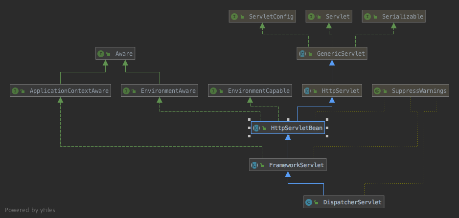

首先看一个demo，运行于tomcat，代码：
```xml
// web.xml
<?xml version="1.0" encoding="UTF-8"?>
<web-app version="3.0" xmlns="http://java.sun.com/xml/ns/javaee"
         xmlns:xsi="http://www.w3.org/2001/XMLSchema-instance"
         xsi:schemaLocation="http://java.sun.com/xml/ns/javaee http://java.sun.com/xml/ns/javaee/web-app_3_0.xsd">
    <display-name>Archetype Created Web Application</display-name>
    
    <context-param>
        <param-name>contextConfigLocation</param-name>
        <param-value>classpath:applicationContext.xml</param-value>
    </context-param>

    <servlet>
        <servlet-name>spring-mvc</servlet-name>
        <servlet-class>org.springframework.web.servlet.DispatcherServlet</servlet-class>
        <load-on-startup>1</load-on-startup>
    </servlet>
    
    <servlet-mapping>
        <servlet-name>spring-mvc</servlet-name>
        <url-pattern>/</url-pattern>
    </servlet-mapping>
    
    <listener>
        <listener-class>org.springframework.web.context.ContextLoaderListener</listener-class>
    </listener>
</web-app>

// spring-mvc-servlet.xml
<?xml version="1.0" encoding="UTF-8"?>
<beans xmlns="http://www.springframework.org/schema/beans"
       xmlns:xsi="http://www.w3.org/2001/XMLSchema-instance"
       xsi:schemaLocation="http://www.springframework.org/schema/beans http://www.springframework.org/schema/beans/spring-beans.xsd">

    <bean id="simpleUrlMapping" class="org.springframework.web.servlet.handler.SimpleUrlHandlerMapping">
        <property name="mappings">
            <props>
                <prop key="/userlist">userController</prop>
            </props>
        </property>
    </bean>

    <bean id="viewResolver" class="org.springframework.web.servlet.view.InternalResourceViewResolver">
        <property name="prefix" value="/WEB-INF/jsp/"/>
        <property name="suffix" value=".jsp"/>
    </bean>

    <bean id="userController" class="com.dhf.UserController"/>
</beans>

// applicationContext.xml
<?xml version="1.0" encoding="UTF-8"?>
<beans xmlns="http://www.springframework.org/schema/beans" xmlns:xsi="http://www.w3.org/2001/XMLSchema-instance"
       xsi:schemaLocation="http://www.springframework.org/schema/beans http://www.springframework.org/schema/beans/spring-beans-4.0.xsd">

    // 该例子中没什么需要配置的业务bean

</beans>
```

上面是xml配置文件，配置`userlist`的请求发送到[UserController]，[UserController]代码：
```java
public class UserController extends AbstractController {
    @Override
    protected ModelAndView handleRequestInternal(HttpServletRequest httpServletRequest, HttpServletResponse httpServletResponse) throws Exception {
        List<User> users = new ArrayList<>();
        User userA = new User();
        userA.setName("userA");
        userA.setAge(10);
        User userB = new User();
        userB.setName("userB");
        userB.setAge(20);

        users.add(userA);
        users.add(userB);
        return new ModelAndView("userlist", "users", users);
    }
}
```

最后是`userlist.jsp`文件，代码：
```jsp
<%@ page pageEncoding="UTF-8" language="java" %>
<%@ taglib prefix="c" uri="http://java.sun.com/jsp/jstl/core"%>
<html>
<head>
    <title>Spring MVC demo</title>
</head>
<body>

    <c:forEach items="${users}" var="user">
        <c:out value="${user.name}"/><br/>
        <c:out value="${user.age}"/><br/>
    </c:forEach>

</body>
</html>
```

浏览器输入`http://localhost:8080/userlist`将会看到：
```
userA
10
userB
20
```

下面分析运行过程，切入点是web.xml文件中的`listener`配置，用于配置容器启动和停止事件，上面配置的[ContextLoaderListener]代码：
```java
public class ContextLoaderListener extends ContextLoader implements ServletContextListener {
	public ContextLoaderListener() {
	}
    
	public ContextLoaderListener(WebApplicationContext context) {
		super(context);
	}

	@Override
    // 容器启动时执行
	public void contextInitialized(ServletContextEvent event) {
		initWebApplicationContext(event.getServletContext());
	}

	@Override
    // 容器关闭时
	public void contextDestroyed(ServletContextEvent event) {
		closeWebApplicationContext(event.getServletContext());
		ContextCleanupListener.cleanupAttributes(event.getServletContext());
	}

}
```

[ContextLoaderListener]主要用于初始化[WebApplicationContext]，初始化代码在其父类[ContextLoader]中，代码：
```java
public class ContextLoader {
	public static final String CONTEXT_ID_PARAM = "contextId";

    // spring的xml配置文件路径
	public static final String CONFIG_LOCATION_PARAM = "contextConfigLocation";

    // 该值能够覆盖默认的WebApplicationContext实现类的类型
	public static final String CONTEXT_CLASS_PARAM = "contextClass";

    /**
    * Config param for {@link ApplicationContextInitializer} classes to use
    * for initializing the root web application context: {@value}
    * @see #customizeContext(ServletContext, ConfigurableWebApplicationContext)
    */
	public static final String CONTEXT_INITIALIZER_CLASSES_PARAM = "contextInitializerClasses";

    /**
    * Config param for global {@link ApplicationContextInitializer} classes to use
    * for initializing all web application contexts in the current application: {@value}
    * @see #customizeContext(ServletContext, ConfigurableWebApplicationContext)
    */
	public static final String GLOBAL_INITIALIZER_CLASSES_PARAM = "globalInitializerClasses";

	/**
	 * Any number of these characters are considered delimiters between
	 * multiple values in a single init-param String value.
	 */
	private static final String INIT_PARAM_DELIMITERS = ",; \t\n";

	/**
	 * Name of the class path resource (relative to the ContextLoader class)
	 * that defines ContextLoader's default strategy names.
	 */
	private static final String DEFAULT_STRATEGIES_PATH = "ContextLoader.properties";


	private static final Properties defaultStrategies;

	static {
        // 加载ContextLoader.properties文件中的内容，该文件指定了WebApplicationContext的默认实现
		try {
			ClassPathResource resource = new ClassPathResource(DEFAULT_STRATEGIES_PATH, ContextLoader.class);
			defaultStrategies = PropertiesLoaderUtils.loadProperties(resource);
		}
		catch (IOException ex) {
			throw new IllegalStateException("Could not load 'ContextLoader.properties': " + ex.getMessage());
		}
	}

	private static final Map<ClassLoader, WebApplicationContext> currentContextPerThread =
			new ConcurrentHashMap<>(1);

	@Nullable
	private static volatile WebApplicationContext currentContext;

	@Nullable
	private WebApplicationContext context;

	// 用于初始化容器
	private final List<ApplicationContextInitializer<ConfigurableApplicationContext>> contextInitializers =
			new ArrayList<>();

	public ContextLoader() {
	}
    
	public ContextLoader(WebApplicationContext context) {
		this.context = context;
	}
    
	@SuppressWarnings("unchecked")
	public void setContextInitializers(@Nullable ApplicationContextInitializer<?>... initializers) {
		if (initializers != null) {
			for (ApplicationContextInitializer<?> initializer : initializers) {
				this.contextInitializers.add((ApplicationContextInitializer<ConfigurableApplicationContext>) initializer);
			}
		}
	}
    
	public WebApplicationContext initWebApplicationContext(ServletContext servletContext) {
		// WebApplicationContext只能创建一次，Spring在创建WebApplicationContext后用WebApplicationContext.ROOT_WEB_APPLICATION_CONTEXT_ATTRIBUTE
		// 为key将WebApplicationContext保存到servletContext中
		if (servletContext.getAttribute(WebApplicationContext.ROOT_WEB_APPLICATION_CONTEXT_ATTRIBUTE) != null) {
			throw new IllegalStateException(
					"Cannot initialize context because there is already a root application context present - " +
					"check whether you have multiple ContextLoader* definitions in your web.xml!");
		}

		Log logger = LogFactory.getLog(ContextLoader.class);
		servletContext.log("Initializing Spring root WebApplicationContext");
		if (logger.isInfoEnabled()) {
			logger.info("Root WebApplicationContext: initialization started");
		}
		// 记录开始启动的时间
		long startTime = System.currentTimeMillis();

		try {
			// Store context in local instance variable, to guarantee that
			// it is available on ServletContext shutdown.
			if (this.context == null) {
				// 创建WebApplicationContext实例，默认为XmlWebApplicationContext
				this.context = createWebApplicationContext(servletContext);
			}
			// 默认WebApplicationContext实例实现了ConfigurableWebApplicationContext接口
			if (this.context instanceof ConfigurableWebApplicationContext) {
				ConfigurableWebApplicationContext cwac = (ConfigurableWebApplicationContext) this.context;
				if (!cwac.isActive()) {
					// The context has not yet been refreshed -> provide services such as
					// setting the parent context, setting the application context id, etc
					if (cwac.getParent() == null) {
						// The context instance was injected without an explicit parent ->
						// determine parent for root web application context, if any.
						// 根据servletContext获取ApplicationContext，并将其作为parent，默认返回null
						ApplicationContext parent = loadParentContext(servletContext);
						cwac.setParent(parent);
					}
					// 设置容器必要属性并刷新容器
					configureAndRefreshWebApplicationContext(cwac, servletContext);
				}
			}
			// 保存context到servlet
			servletContext.setAttribute(WebApplicationContext.ROOT_WEB_APPLICATION_CONTEXT_ATTRIBUTE, this.context);

			ClassLoader ccl = Thread.currentThread().getContextClassLoader();
			if (ccl == ContextLoader.class.getClassLoader()) {
				currentContext = this.context;
			}
			else if (ccl != null) {
				currentContextPerThread.put(ccl, this.context);
			}

			if (logger.isDebugEnabled()) {
				logger.debug("Published root WebApplicationContext as ServletContext attribute with name [" +
						WebApplicationContext.ROOT_WEB_APPLICATION_CONTEXT_ATTRIBUTE + "]");
			}
			if (logger.isInfoEnabled()) {
				long elapsedTime = System.currentTimeMillis() - startTime;
				logger.info("Root WebApplicationContext: initialization completed in " + elapsedTime + " ms");
			}

			return this.context;
		}
		catch (RuntimeException ex) {
			logger.error("Context initialization failed", ex);
			servletContext.setAttribute(WebApplicationContext.ROOT_WEB_APPLICATION_CONTEXT_ATTRIBUTE, ex);
			throw ex;
		}
		catch (Error err) {
			logger.error("Context initialization failed", err);
			servletContext.setAttribute(WebApplicationContext.ROOT_WEB_APPLICATION_CONTEXT_ATTRIBUTE, err);
			throw err;
		}
	}
    
	protected WebApplicationContext createWebApplicationContext(ServletContext sc) {
		Class<?> contextClass = determineContextClass(sc);
		if (!ConfigurableWebApplicationContext.class.isAssignableFrom(contextClass)) {
			throw new ApplicationContextException("Custom context class [" + contextClass.getName() +
					"] is not of type [" + ConfigurableWebApplicationContext.class.getName() + "]");
		}
		return (ConfigurableWebApplicationContext) BeanUtils.instantiateClass(contextClass);
	}
    
	protected Class<?> determineContextClass(ServletContext servletContext) {
		// 如果配置了CONTEXT_CLASS_PARAM则使用该值作为context的类型
		String contextClassName = servletContext.getInitParameter(CONTEXT_CLASS_PARAM);
		if (contextClassName != null) {
			try {
				return ClassUtils.forName(contextClassName, ClassUtils.getDefaultClassLoader());
			}
			catch (ClassNotFoundException ex) {
				throw new ApplicationContextException(
						"Failed to load custom context class [" + contextClassName + "]", ex);
			}
		}
		else {
			/*
			 否则用默认类型，defaultStrategies是个Properties，值来自ContextLoader.properties文件，该文件默认只有一行内容：

			 org.springframework.web.context.WebApplicationContext=org.springframework.web.context.support.XmlWebApplicationContext

			 所以默认情况下WebApplicationContext的类型就是XmlWebApplicationContext
			 */
			contextClassName = defaultStrategies.getProperty(WebApplicationContext.class.getName());
			try {
				return ClassUtils.forName(contextClassName, ContextLoader.class.getClassLoader());
			}
			catch (ClassNotFoundException ex) {
				throw new ApplicationContextException(
						"Failed to load default context class [" + contextClassName + "]", ex);
			}
		}
	}

	protected void configureAndRefreshWebApplicationContext(ConfigurableWebApplicationContext wac, ServletContext sc) {
		// 如果ID还没有初始化过则初始化一个ID
		if (ObjectUtils.identityToString(wac).equals(wac.getId())) {
			// The application context id is still set to its original default value
			// -> assign a more useful id based on available information
			String idParam = sc.getInitParameter(CONTEXT_ID_PARAM);
			if (idParam != null) {
				wac.setId(idParam);
			}
			else {
				// Generate default id...
				wac.setId(ConfigurableWebApplicationContext.APPLICATION_CONTEXT_ID_PREFIX +
						ObjectUtils.getDisplayString(sc.getContextPath()));
			}
		}

		// 保存ServletContext
		wac.setServletContext(sc);
		// 设置contextConfigLocation，该属性配置在web.xml中，值为spring的xml配置文件路径
		String configLocationParam = sc.getInitParameter(CONFIG_LOCATION_PARAM);
		if (configLocationParam != null) {
			wac.setConfigLocation(configLocationParam);
		}

		// The wac environment's #initPropertySources will be called in any case when the context
		// is refreshed; do it eagerly here to ensure servlet property sources are in place for
		// use in any post-processing or initialization that occurs below prior to #refresh
		// 默认实现是StandardEnvironment
		ConfigurableEnvironment env = wac.getEnvironment();
		if (env instanceof ConfigurableWebEnvironment) {
			// 创建MutablePropertySources，并将servlet中的initParameter作为一个PropertySource添加到MutablePropertySources中
			((ConfigurableWebEnvironment) env).initPropertySources(sc, null);
		}

		// 初始化servletContext的globalInitializerClasses属性和contextInitializerClasses属性指定的
		// ApplicationContextInitializer<ConfigurableApplicationContext>实例并分别调用initialize方法
		customizeContext(sc, wac);
		// 刷新容器
		wac.refresh();
	}
    
	protected void customizeContext(ServletContext sc, ConfigurableWebApplicationContext wac) {
		// determineContextInitializerClasses方法返回servletContext中globalInitializerClasses属性和contextInitializerClasses属性指定的
		// 类
		List<Class<ApplicationContextInitializer<ConfigurableApplicationContext>>> initializerClasses =
				determineContextInitializerClasses(sc);

		// 初始化找到的ApplicationContextInitializer<ConfigurableApplicationContext>类型的类
		for (Class<ApplicationContextInitializer<ConfigurableApplicationContext>> initializerClass : initializerClasses) {
			Class<?> initializerContextClass =
					GenericTypeResolver.resolveTypeArgument(initializerClass, ApplicationContextInitializer.class);
			// 如果initializerClass的范型类型和传入的ConfigurableWebApplicationContext类型不匹配则报错
			if (initializerContextClass != null && !initializerContextClass.isInstance(wac)) {
				throw new ApplicationContextException(String.format(
						"Could not apply context initializer [%s] since its generic parameter [%s] " +
						"is not assignable from the type of application context used by this " +
						"context loader: [%s]", initializerClass.getName(), initializerContextClass.getName(),
						wac.getClass().getName()));
			}
			// 实例化并保存initializerClass
			this.contextInitializers.add(BeanUtils.instantiateClass(initializerClass));
		}

		// 根据注解排序
		AnnotationAwareOrderComparator.sort(this.contextInitializers);
		// 分别调用initialize方法对容器进行定制化
		for (ApplicationContextInitializer<ConfigurableApplicationContext> initializer : this.contextInitializers) {
			initializer.initialize(wac);
		}
	}
    
	protected List<Class<ApplicationContextInitializer<ConfigurableApplicationContext>>>
			determineContextInitializerClasses(ServletContext servletContext) {

		List<Class<ApplicationContextInitializer<ConfigurableApplicationContext>>> classes =
				new ArrayList<>();

		String globalClassNames = servletContext.getInitParameter(GLOBAL_INITIALIZER_CLASSES_PARAM);
		if (globalClassNames != null) {
			for (String className : StringUtils.tokenizeToStringArray(globalClassNames, INIT_PARAM_DELIMITERS)) {
				classes.add(loadInitializerClass(className));
			}
		}

		String localClassNames = servletContext.getInitParameter(CONTEXT_INITIALIZER_CLASSES_PARAM);
		if (localClassNames != null) {
			for (String className : StringUtils.tokenizeToStringArray(localClassNames, INIT_PARAM_DELIMITERS)) {
				classes.add(loadInitializerClass(className));
			}
		}

		return classes;
	}

	@SuppressWarnings("unchecked")
	private Class<ApplicationContextInitializer<ConfigurableApplicationContext>> loadInitializerClass(String className) {
		try {
			Class<?> clazz = ClassUtils.forName(className, ClassUtils.getDefaultClassLoader());
			if (!ApplicationContextInitializer.class.isAssignableFrom(clazz)) {
				throw new ApplicationContextException(
						"Initializer class does not implement ApplicationContextInitializer interface: " + clazz);
			}
			return (Class<ApplicationContextInitializer<ConfigurableApplicationContext>>) clazz;
		}
		catch (ClassNotFoundException ex) {
			throw new ApplicationContextException("Failed to load context initializer class [" + className + "]", ex);
		}
	}
    
	@Nullable
	protected ApplicationContext loadParentContext(ServletContext servletContext) {
		return null;
	}
    
	public void closeWebApplicationContext(ServletContext servletContext) {
		servletContext.log("Closing Spring root WebApplicationContext");
		try {
			if (this.context instanceof ConfigurableWebApplicationContext) {
				((ConfigurableWebApplicationContext) this.context).close();
			}
		}
		finally {
			ClassLoader ccl = Thread.currentThread().getContextClassLoader();
			if (ccl == ContextLoader.class.getClassLoader()) {
				currentContext = null;
			}
			else if (ccl != null) {
				currentContextPerThread.remove(ccl);
			}
			servletContext.removeAttribute(WebApplicationContext.ROOT_WEB_APPLICATION_CONTEXT_ATTRIBUTE);
		}
	}

	@Nullable
	public static WebApplicationContext getCurrentWebApplicationContext() {
		ClassLoader ccl = Thread.currentThread().getContextClassLoader();
		if (ccl != null) {
			WebApplicationContext ccpt = currentContextPerThread.get(ccl);
			if (ccpt != null) {
				return ccpt;
			}
		}
		return currentContext;
	}

}
```

可以看到[ContextLoader]的主要任务就是初始化容器，对容器进行配置并将容器保存到[ServletContext]中，下面看web.xml文件中的另一个配置：
```xml
<servlet>
    <servlet-name>spring-mvc</servlet-name>
    <servlet-class>org.springframework.web.servlet.DispatcherServlet</servlet-class>
    <load-on-startup>1</load-on-startup>
</servlet>

<servlet-mapping>
    <servlet-name>spring-mvc</servlet-name>
    <url-pattern>/</url-pattern>
</servlet-mapping>
```

该配置为web应用添加了一个Spring实现的Servlet，而Servlet的作用是处理web请求的，所以用户发送的请求实际上就是[DispatcherServlet]类处理的，下面先看该类的继承结构：


[HttpServlet]是`javax.servlet.http`包下的抽象类，实现Servlet时继承该类则只需要实现`doGet、doPost`等方法即可，[HttpServletBean]类的作用是定义了初始化方法，在初始化方法中为利用[BeanWrapper]为自己设置了若干必要属性（由`requiredProperties`属性指定，默认为空），属性值从ServletContext的`initParameter`中获取，也就是web.xml中的`context-param`元素内的内容，[HttpServletBean]代码：
```java
public abstract class HttpServletBean extends HttpServlet implements EnvironmentCapable, EnvironmentAware {

	/** Logger available to subclasses */
	protected final Log logger = LogFactory.getLog(getClass());

	@Nullable
	private ConfigurableEnvironment environment;

	private final Set<String> requiredProperties = new HashSet<>(4);

	protected final void addRequiredProperty(String property) {
		this.requiredProperties.add(property);
	}
    
	@Override
	public void setEnvironment(Environment environment) {
		Assert.isInstanceOf(ConfigurableEnvironment.class, environment, "ConfigurableEnvironment required");
		this.environment = (ConfigurableEnvironment) environment;
	}
    
	@Override
	public ConfigurableEnvironment getEnvironment() {
		if (this.environment == null) {
			this.environment = createEnvironment();
		}
		return this.environment;
	}
    
	protected ConfigurableEnvironment createEnvironment() {
		return new StandardServletEnvironment();
	}
    
	@Override
	// GenericServlet定义的方法，用于初始化当前servlet
	public final void init() throws ServletException {
		if (logger.isDebugEnabled()) {
			logger.debug("Initializing servlet '" + getServletName() + "'");
		}

		// Set bean properties from init parameters.
		/*
		 getServletConfig返回ServletConfig，该对象表示的是servlet在web.xml中的配置，如：
		 <servlet>
    	    <servlet-name>spring-mvc</servlet-name>
    	    <servlet-class>org.springframework.web.servlet.DispatcherServlet</servlet-class>
    	    <load-on-startup>1</load-on-startup>
    	</servlet>

		ServletConfigPropertyValues类继承自MutablePropertyValues，该类构造函数从ServletConfig中获取InitParameter，并保存下来，
		如果requiredProperties不为空并且InitParameter中没有requiredProperties指定的属性则报错
		 */
		PropertyValues pvs = new ServletConfigPropertyValues(getServletConfig(), this.requiredProperties);
		if (!pvs.isEmpty()) {
			try {
				// 将这些属性应用到当前servlet中
				BeanWrapper bw = PropertyAccessorFactory.forBeanPropertyAccess(this);
				ResourceLoader resourceLoader = new ServletContextResourceLoader(getServletContext());
				bw.registerCustomEditor(Resource.class, new ResourceEditor(resourceLoader, getEnvironment()));
				// 供子类实现
				initBeanWrapper(bw);
				bw.setPropertyValues(pvs, true);
			}
			catch (BeansException ex) {
				if (logger.isErrorEnabled()) {
					logger.error("Failed to set bean properties on servlet '" + getServletName() + "'", ex);
				}
				throw ex;
			}
		}

		// Let subclasses do whatever initialization they like.
		// 供子类实现
		initServletBean();

		if (logger.isDebugEnabled()) {
			logger.debug("Servlet '" + getServletName() + "' configured successfully");
		}
	}
    
	protected void initBeanWrapper(BeanWrapper bw) throws BeansException {
	}
    
	protected void initServletBean() throws ServletException {
	}
    
	@Override
	@Nullable
	public String getServletName() {
		return (getServletConfig() != null ? getServletConfig().getServletName() : null);
	}
    
	private static class ServletConfigPropertyValues extends MutablePropertyValues {
		public ServletConfigPropertyValues(ServletConfig config, Set<String> requiredProperties)
				throws ServletException {

			Set<String> missingProps = (!CollectionUtils.isEmpty(requiredProperties) ?
					new HashSet<>(requiredProperties) : null);

			Enumeration<String> paramNames = config.getInitParameterNames();
			while (paramNames.hasMoreElements()) {
				String property = paramNames.nextElement();
				Object value = config.getInitParameter(property);
				addPropertyValue(new PropertyValue(property, value));
				if (missingProps != null) {
					missingProps.remove(property);
				}
			}

			// Fail if we are still missing properties.
			if (!CollectionUtils.isEmpty(missingProps)) {
				throw new ServletException(
						"Initialization from ServletConfig for servlet '" + config.getServletName() +
						"' failed; the following required properties were missing: " +
						StringUtils.collectionToDelimitedString(missingProps, ", "));
			}
		}
	}

}
```

[FrameworkServlet]类在初始化方法中尝试获取容器，如果不存在容器则创建并配置容器，同时该类重写了[HttpServlet]中的`doGet、doPost`等方法，将这些方法的实现统一交由一个方法处理，并利用模版方法模式在这个方法中实现了处理请求的统一逻辑，而真正处理请求的方法则交由子类实现，代码：
```java
public abstract class FrameworkServlet extends HttpServletBean implements ApplicationContextAware {
	/**
	 * Suffix for WebApplicationContext namespaces. If a servlet of this class is
	 * given the name "test" in a context, the namespace used by the servlet will
	 * resolve to "test-servlet".
	 */
	public static final String DEFAULT_NAMESPACE_SUFFIX = "-servlet";

	/**
	 * Default context class for FrameworkServlet.
	 * @see org.springframework.web.context.support.XmlWebApplicationContext
	 */
	public static final Class<?> DEFAULT_CONTEXT_CLASS = XmlWebApplicationContext.class;

	/**
	 * Prefix for the ServletContext attribute for the WebApplicationContext.
	 * The completion is the servlet name.
	 */
	public static final String SERVLET_CONTEXT_PREFIX = FrameworkServlet.class.getName() + ".CONTEXT.";

	/**
	 * Any number of these characters are considered delimiters between
	 * multiple values in a single init-param String value.
	 */
	private static final String INIT_PARAM_DELIMITERS = ",; \t\n";


	/** ServletContext attribute to find the WebApplicationContext in */
	@Nullable
	private String contextAttribute;

	/** WebApplicationContext implementation class to create */
	private Class<?> contextClass = DEFAULT_CONTEXT_CLASS;

	/** WebApplicationContext id to assign */
	@Nullable
	private String contextId;

	/** Namespace for this servlet */
	@Nullable
    // namespace用于指定该servlet的配置文件名，默认是servlename-servlet.xml
	private String namespace;

	/** Explicit context config location */
	@Nullable
	private String contextConfigLocation;

	/** Actual ApplicationContextInitializer instances to apply to the context */
	private final List<ApplicationContextInitializer<ConfigurableApplicationContext>> contextInitializers =
			new ArrayList<>();

	/** Comma-delimited ApplicationContextInitializer class names set through init param */
	@Nullable
	private String contextInitializerClasses;

	/** Should we publish the context as a ServletContext attribute? */
	private boolean publishContext = true;

	/** Should we publish a ServletRequestHandledEvent at the end of each request? */
	private boolean publishEvents = true;

	/** Expose LocaleContext and RequestAttributes as inheritable for child threads? */
	private boolean threadContextInheritable = false;

	/** Should we dispatch an HTTP OPTIONS request to {@link #doService}? */
	private boolean dispatchOptionsRequest = false;

	/** Should we dispatch an HTTP TRACE request to {@link #doService}? */
	private boolean dispatchTraceRequest = false;

	/** WebApplicationContext for this servlet */
	@Nullable
	private WebApplicationContext webApplicationContext;

	/** If the WebApplicationContext was injected via {@link #setApplicationContext} */
	private boolean webApplicationContextInjected = false;

	/** Flag used to detect whether onRefresh has already been called */
	private boolean refreshEventReceived = false;

	public FrameworkServlet() {
	}
    
	public FrameworkServlet(WebApplicationContext webApplicationContext) {
		this.webApplicationContext = webApplicationContext;
	}
    
	public void setContextAttribute(@Nullable String contextAttribute) {
		this.contextAttribute = contextAttribute;
	}
    
	@Nullable
	public String getContextAttribute() {
		return this.contextAttribute;
	}
    
	public void setContextClass(Class<?> contextClass) {
		this.contextClass = contextClass;
	}
    
	public Class<?> getContextClass() {
		return this.contextClass;
	}
    
	public void setContextId(@Nullable String contextId) {
		this.contextId = contextId;
	}
    
	@Nullable
	public String getContextId() {
		return this.contextId;
	}
    
	public void setNamespace(String namespace) {
		this.namespace = namespace;
	}
    
	public String getNamespace() {
        // 如果没有设置namespace则使用getServletName() + -servlet作为namespace，而servletname配置在web.xml中
		return (this.namespace != null ? this.namespace : getServletName() + DEFAULT_NAMESPACE_SUFFIX);
	}
    
	public void setContextConfigLocation(@Nullable String contextConfigLocation) {
		this.contextConfigLocation = contextConfigLocation;
	}
    
	@Nullable
	public String getContextConfigLocation() {
		return this.contextConfigLocation;
	}
    
	@SuppressWarnings("unchecked")
	// ApplicationContextInitializer用于定制化ApplicationContext
	public void setContextInitializers(@Nullable ApplicationContextInitializer<?>... initializers) {
		if (initializers != null) {
			for (ApplicationContextInitializer<?> initializer : initializers) {
				this.contextInitializers.add((ApplicationContextInitializer<ConfigurableApplicationContext>) initializer);
			}
		}
	}
    
	// 同上，也是添加ApplicationContextInitializer，不过这里传入的是全类名，多个ApplicationContextInitializer用,;tab或换行分开
	public void setContextInitializerClasses(String contextInitializerClasses) {
		this.contextInitializerClasses = contextInitializerClasses;
	}
    
	// 是否将该ServletContext作为ServletContext的属性暴露出去，默认true
	public void setPublishContext(boolean publishContext) {
		this.publishContext = publishContext;
	}
    
	// 请求结束后是否需要发送ServletRequestHandledEvent事件，默认true
	public void setPublishEvents(boolean publishEvents) {
		this.publishEvents = publishEvents;
	}
    
	public void setThreadContextInheritable(boolean threadContextInheritable) {
		this.threadContextInheritable = threadContextInheritable;
	}
    
	// HTTP的OPTIONS请求是否需要发送到doService方法，默认false
	public void setDispatchOptionsRequest(boolean dispatchOptionsRequest) {
		this.dispatchOptionsRequest = dispatchOptionsRequest;
	}
    
	public void setDispatchTraceRequest(boolean dispatchTraceRequest) {
		this.dispatchTraceRequest = dispatchTraceRequest;
	}
    
	@Override
	public void setApplicationContext(ApplicationContext applicationContext) {
		if (this.webApplicationContext == null && applicationContext instanceof WebApplicationContext) {
			this.webApplicationContext = (WebApplicationContext) applicationContext;
			this.webApplicationContextInjected = true;
		}
	}
    
	@Override
	protected final void initServletBean() throws ServletException {
		getServletContext().log("Initializing Spring FrameworkServlet '" + getServletName() + "'");
		if (this.logger.isInfoEnabled()) {
			this.logger.info("FrameworkServlet '" + getServletName() + "': initialization started");
		}
		long startTime = System.currentTimeMillis();

		try {
			this.webApplicationContext = initWebApplicationContext();
			// 供子类实现
			initFrameworkServlet();
		}
		catch (ServletException | RuntimeException ex) {
			this.logger.error("Context initialization failed", ex);
			throw ex;
		}

		if (this.logger.isInfoEnabled()) {
			long elapsedTime = System.currentTimeMillis() - startTime;
			this.logger.info("FrameworkServlet '" + getServletName() + "': initialization completed in " +
					elapsedTime + " ms");
		}
	}
    
	protected WebApplicationContext initWebApplicationContext() {
     // 获取保存在ServletContext中的WebApplicationContext，默认情况下ContextLoaderListener已经创建了一个WebApplicationContext
     // 并放到了ServletContext，这里将获取到的WebApplicationContext作为rootContext
     WebApplicationContext rootContext =
             WebApplicationContextUtils.getWebApplicationContext(getServletContext());
     WebApplicationContext wac = null;

     // 如果webApplicationContext已经指定了
     if (this.webApplicationContext != null) {
         // A context instance was injected at construction time -> use it
         wac = this.webApplicationContext;
         if (wac instanceof ConfigurableWebApplicationContext) {
             ConfigurableWebApplicationContext cwac = (ConfigurableWebApplicationContext) wac;
             // 和ContextLoaderListener的initWebApplicationContext方法做的是一个事
             if (!cwac.isActive()) {
                 // The context has not yet been refreshed -> provide services such as
                 // setting the parent context, setting the application context id, etc
                 if (cwac.getParent() == null) {
                     // The context instance was injected without an explicit parent -> set
                     // the root application context (if any; may be null) as the parent
                     cwac.setParent(rootContext);
                 }
                 configureAndRefreshWebApplicationContext(cwac);
             }
         }
     }
     // 如果当前Servlet的webApplicationContext还没有创建则尝试从ServletContext的属性中获取WebApplicationContext，属性名为contextAttribute的值
     if (wac == null) {
         // No context instance was injected at construction time -> see if one
         // has been registered in the servlet context. If one exists, it is assumed
         // that the parent context (if any) has already been set and that the
         // user has performed any initialization such as setting the context id
         wac = findWebApplicationContext();
     }
     // 如果没找到WebApplicationContext则创建一个，并传入rootContext作为parent applicationContext
     if (wac == null) {
         // No context instance is defined for this servlet -> create a local one
         wac = createWebApplicationContext(rootContext);
     }

     if (!this.refreshEventReceived) {
         // Either the context is not a ConfigurableApplicationContext with refresh
         // support or the context injected at construction time had already been
         // refreshed -> trigger initial onRefresh manually here.
         // 供子类实现，通知WebApplicationContext刷新了
         onRefresh(wac);
     }

     if (this.publishContext) {
         // Publish the context as a servlet context attribute.
         String attrName = getServletContextAttributeName();
         getServletContext().setAttribute(attrName, wac);
         if (this.logger.isDebugEnabled()) {
             this.logger.debug("Published WebApplicationContext of servlet '" + getServletName() +
                     "' as ServletContext attribute with name [" + attrName + "]");
         }
     }

     return wac;
 }
    
	@Nullable
	protected WebApplicationContext findWebApplicationContext() {
		String attrName = getContextAttribute();
		if (attrName == null) {
			return null;
		}
		WebApplicationContext wac =
				WebApplicationContextUtils.getWebApplicationContext(getServletContext(), attrName);
		if (wac == null) {
			throw new IllegalStateException("No WebApplicationContext found: initializer not registered?");
		}
		return wac;
	}
    
	protected WebApplicationContext createWebApplicationContext(@Nullable ApplicationContext parent) {
     // 默认为XmlWebApplicationContext
     Class<?> contextClass = getContextClass();
     if (this.logger.isDebugEnabled()) {
         this.logger.debug("Servlet with name '" + getServletName() +
                 "' will try to create custom WebApplicationContext context of class '" +
                 contextClass.getName() + "'" + ", using parent context [" + parent + "]");
     }
     if (!ConfigurableWebApplicationContext.class.isAssignableFrom(contextClass)) {
         throw new ApplicationContextException(
                 "Fatal initialization error in servlet with name '" + getServletName() +
                 "': custom WebApplicationContext class [" + contextClass.getName() +
                 "] is not of type ConfigurableWebApplicationContext");
     }
     ConfigurableWebApplicationContext wac =
             (ConfigurableWebApplicationContext) BeanUtils.instantiateClass(contextClass);

     wac.setEnvironment(getEnvironment());
     // 将传入的容器作为parent
     wac.setParent(parent);
     // 如果设置了容器配置文件的路径则将其设置到容器中
     String configLocation = getContextConfigLocation();
     if (configLocation != null) {
         wac.setConfigLocation(configLocation);
     }
     // 配置并刷新容器
     configureAndRefreshWebApplicationContext(wac);

     return wac;
    }

	protected void configureAndRefreshWebApplicationContext(ConfigurableWebApplicationContext wac) {
     if (ObjectUtils.identityToString(wac).equals(wac.getId())) {
         // The application context id is still set to its original default value
         // -> assign a more useful id based on available information
         if (this.contextId != null) {
             wac.setId(this.contextId);
         }
         else {
             // Generate default id...
             wac.setId(ConfigurableWebApplicationContext.APPLICATION_CONTEXT_ID_PREFIX +
                     ObjectUtils.getDisplayString(getServletContext().getContextPath()) + '/' + getServletName());
         }
     }

     wac.setServletContext(getServletContext());
     wac.setServletConfig(getServletConfig());
     // 为容器设置namespace，也就是servlet配置文件的路径，默认是serveltname + -servlet
     wac.setNamespace(getNamespace());
		 // ContextRefreshListener类监听容器刷新事件，事件发生时调用FrameworkServlet的onRefresh方法，SourceFilteringListener类只是
			// 对事件源做了个过滤，事件源必须是构造函数的第一个参数
     wac.addApplicationListener(new SourceFilteringListener(wac, new ContextRefreshListener()));

     // The wac environment's #initPropertySources will be called in any case when the context
     // is refreshed; do it eagerly here to ensure servlet property sources are in place for
     // use in any post-processing or initialization that occurs below prior to #refresh
     ConfigurableEnvironment env = wac.getEnvironment();
     if (env instanceof ConfigurableWebEnvironment) {
         ((ConfigurableWebEnvironment) env).initPropertySources(getServletContext(), getServletConfig());
     }

     // 供子类实现
     postProcessWebApplicationContext(wac);
     // 初始化ApplicationContextInitializer并调用initialize方法对容器进行定制
     applyInitializers(wac);
     // 刷新容器
     wac.refresh();
    }
    
	protected WebApplicationContext createWebApplicationContext(@Nullable WebApplicationContext parent) {
		return createWebApplicationContext((ApplicationContext) parent);
	}
    
	protected void postProcessWebApplicationContext(ConfigurableWebApplicationContext wac) {
	}
    
	protected void applyInitializers(ConfigurableApplicationContext wac) {
		String globalClassNames = getServletContext().getInitParameter(ContextLoader.GLOBAL_INITIALIZER_CLASSES_PARAM);
		if (globalClassNames != null) {
			for (String className : StringUtils.tokenizeToStringArray(globalClassNames, INIT_PARAM_DELIMITERS)) {
				this.contextInitializers.add(loadInitializer(className, wac));
			}
		}

		if (this.contextInitializerClasses != null) {
			for (String className : StringUtils.tokenizeToStringArray(this.contextInitializerClasses, INIT_PARAM_DELIMITERS)) {
				this.contextInitializers.add(loadInitializer(className, wac));
			}
		}

		AnnotationAwareOrderComparator.sort(this.contextInitializers);
		for (ApplicationContextInitializer<ConfigurableApplicationContext> initializer : this.contextInitializers) {
			initializer.initialize(wac);
		}
	}

	@SuppressWarnings("unchecked")
	private ApplicationContextInitializer<ConfigurableApplicationContext> loadInitializer(
			String className, ConfigurableApplicationContext wac) {
		try {
			Class<?> initializerClass = ClassUtils.forName(className, wac.getClassLoader());
			Class<?> initializerContextClass =
					GenericTypeResolver.resolveTypeArgument(initializerClass, ApplicationContextInitializer.class);
			if (initializerContextClass != null && !initializerContextClass.isInstance(wac)) {
				throw new ApplicationContextException(String.format(
						"Could not apply context initializer [%s] since its generic parameter [%s] " +
						"is not assignable from the type of application context used by this " +
						"framework servlet: [%s]", initializerClass.getName(), initializerContextClass.getName(),
						wac.getClass().getName()));
			}
			return BeanUtils.instantiateClass(initializerClass, ApplicationContextInitializer.class);
		}
		catch (ClassNotFoundException ex) {
			throw new ApplicationContextException(String.format("Could not load class [%s] specified " +
					"via 'contextInitializerClasses' init-param", className), ex);
		}
	}
    
	public String getServletContextAttributeName() {
		return SERVLET_CONTEXT_PREFIX + getServletName();
	}
    
	@Nullable
	public final WebApplicationContext getWebApplicationContext() {
		return this.webApplicationContext;
	}
    
	protected void initFrameworkServlet() throws ServletException {
	}
    
	public void refresh() {
		WebApplicationContext wac = getWebApplicationContext();
		if (!(wac instanceof ConfigurableApplicationContext)) {
			throw new IllegalStateException("WebApplicationContext does not support refresh: " + wac);
		}
		((ConfigurableApplicationContext) wac).refresh();
	}
    
	public void onApplicationEvent(ContextRefreshedEvent event) {
		this.refreshEventReceived = true;
		onRefresh(event.getApplicationContext());
	}
    
	protected void onRefresh(ApplicationContext context) {
		// For subclasses: do nothing by default.
	}

	@Override
	public void destroy() {
		getServletContext().log("Destroying Spring FrameworkServlet '" + getServletName() + "'");
		// Only call close() on WebApplicationContext if locally managed...
		if (this.webApplicationContext instanceof ConfigurableApplicationContext && !this.webApplicationContextInjected) {
			((ConfigurableApplicationContext) this.webApplicationContext).close();
		}
	}
    
	@Override
	// 处理请求时首先会执行该方法
	protected void service(HttpServletRequest request, HttpServletResponse response)
			throws ServletException, IOException {

		// HttpServlet的service方法没有对PATCH进行处理，这里对于PATCH类型的请求直接调用processRequest方法
		HttpMethod httpMethod = HttpMethod.resolve(request.getMethod());
		if (httpMethod == HttpMethod.PATCH || httpMethod == null) {
			processRequest(request, response);
		}
		else {
			// 其他类型的方法交由HttpServlet的service处理，HttpServlet的service方法会根据请求的httpMethod调用
			// doGet或doPost等方法
			super.service(request, response);
		}
	}
    
	@Override
	protected final void doGet(HttpServletRequest request, HttpServletResponse response)
			throws ServletException, IOException {

		processRequest(request, response);
	}
    
	@Override
	protected final void doPost(HttpServletRequest request, HttpServletResponse response)
			throws ServletException, IOException {

		processRequest(request, response);
	}
    
	@Override
	protected final void doPut(HttpServletRequest request, HttpServletResponse response)
			throws ServletException, IOException {

		processRequest(request, response);
	}
    
	@Override
	protected final void doDelete(HttpServletRequest request, HttpServletResponse response)
			throws ServletException, IOException {

		processRequest(request, response);
	}
    
	@Override
	protected void doOptions(HttpServletRequest request, HttpServletResponse response)
			throws ServletException, IOException {

		// 如果dispatchOptionsRequest为true表示PATCH类型的http请求也应该发送给Handler
		if (this.dispatchOptionsRequest || CorsUtils.isPreFlightRequest(request)) {
			processRequest(request, response);
			if (response.containsHeader("Allow")) {
				// Proper OPTIONS response coming from a handler - we're done.
				return;
			}
		}

		// Use response wrapper in order to always add PATCH to the allowed methods
		// 在父类的options请求返回的运行的httpMethod列表的基础上加上PATCH类型
		super.doOptions(request, new HttpServletResponseWrapper(response) {
			@Override
			public void setHeader(String name, String value) {
				if ("Allow".equals(name)) {
					value = (StringUtils.hasLength(value) ? value + ", " : "") + HttpMethod.PATCH.name();
				}
				super.setHeader(name, value);
			}
		});
	}
    
	@Override
	protected void doTrace(HttpServletRequest request, HttpServletResponse response)
			throws ServletException, IOException {

		if (this.dispatchTraceRequest) {
			processRequest(request, response);
			if ("message/http".equals(response.getContentType())) {
				// Proper TRACE response coming from a handler - we're done.
				return;
			}
		}
		super.doTrace(request, response);
	}
    
	// 各种类型的请求都会调用该方法进行处理
	protected final void processRequest(HttpServletRequest request, HttpServletResponse response)
			throws ServletException, IOException {

		long startTime = System.currentTimeMillis();
		Throwable failureCause = null;

		// 保留当前的LocaleContext配置
		// 为请求新建LocaleContext
		LocaleContext previousLocaleContext = LocaleContextHolder.getLocaleContext();
		LocaleContext localeContext = buildLocaleContext(request);

		// 同上
		RequestAttributes previousAttributes = RequestContextHolder.getRequestAttributes();
		ServletRequestAttributes requestAttributes = buildRequestAttributes(request, response, previousAttributes);

		// 获取request中的WebAsyncManager，如果没有则创建一个返回
		WebAsyncManager asyncManager = WebAsyncUtils.getAsyncManager(request);
		asyncManager.registerCallableInterceptor(FrameworkServlet.class.getName(), new RequestBindingInterceptor());

		// 保存localeContext和requestAttributes到对应的ThreadLocal
		initContextHolders(request, localeContext, requestAttributes);

		try {
			// 供子类实现
			doService(request, response);
		}
		catch (ServletException | IOException ex) {
			failureCause = ex;
			throw ex;
		}
		catch (Throwable ex) {
			failureCause = ex;
			throw new NestedServletException("Request processing failed", ex);
		}

		finally {
			// 还原previousLocaleContext和previousAttributes
			resetContextHolders(request, previousLocaleContext, previousAttributes);
			if (requestAttributes != null) {
				requestAttributes.requestCompleted();
			}

			if (logger.isDebugEnabled()) {
				if (failureCause != null) {
					this.logger.debug("Could not complete request", failureCause);
				}
				else {
					if (asyncManager.isConcurrentHandlingStarted()) {
						logger.debug("Leaving response open for concurrent processing");
					}
					else {
						this.logger.debug("Successfully completed request");
					}
				}
			}

			// 发送请求处理完成事件
			publishRequestHandledEvent(request, response, startTime, failureCause);
		}
	}
    
	@Nullable
	protected LocaleContext buildLocaleContext(HttpServletRequest request) {
		return new SimpleLocaleContext(request.getLocale());
	}
    
	@Nullable
	protected ServletRequestAttributes buildRequestAttributes(HttpServletRequest request,
			@Nullable HttpServletResponse response, @Nullable RequestAttributes previousAttributes) {

		if (previousAttributes == null || previousAttributes instanceof ServletRequestAttributes) {
			return new ServletRequestAttributes(request, response);
		}
		else {
			return null;  // preserve the pre-bound RequestAttributes instance
		}
	}

	private void initContextHolders(HttpServletRequest request,
			@Nullable LocaleContext localeContext, @Nullable RequestAttributes requestAttributes) {

		if (localeContext != null) {
			LocaleContextHolder.setLocaleContext(localeContext, this.threadContextInheritable);
		}
		if (requestAttributes != null) {
			RequestContextHolder.setRequestAttributes(requestAttributes, this.threadContextInheritable);
		}
		if (logger.isTraceEnabled()) {
			logger.trace("Bound request context to thread: " + request);
		}
	}

	private void resetContextHolders(HttpServletRequest request,
			@Nullable LocaleContext prevLocaleContext, @Nullable RequestAttributes previousAttributes) {

		LocaleContextHolder.setLocaleContext(prevLocaleContext, this.threadContextInheritable);
		RequestContextHolder.setRequestAttributes(previousAttributes, this.threadContextInheritable);
		if (logger.isTraceEnabled()) {
			logger.trace("Cleared thread-bound request context: " + request);
		}
	}

	private void publishRequestHandledEvent(HttpServletRequest request, HttpServletResponse response,
			long startTime, @Nullable Throwable failureCause) {

		if (this.publishEvents && this.webApplicationContext != null) {
			// Whether or not we succeeded, publish an event.
			long processingTime = System.currentTimeMillis() - startTime;
			this.webApplicationContext.publishEvent(
					new ServletRequestHandledEvent(this,
							request.getRequestURI(), request.getRemoteAddr(),
							request.getMethod(), getServletConfig().getServletName(),
							WebUtils.getSessionId(request), getUsernameForRequest(request),
							processingTime, failureCause, response.getStatus()));
		}
	}

	@Nullable
	protected String getUsernameForRequest(HttpServletRequest request) {
		Principal userPrincipal = request.getUserPrincipal();
		return (userPrincipal != null ? userPrincipal.getName() : null);
	}

	protected abstract void doService(HttpServletRequest request, HttpServletResponse response)
			throws Exception;

	private class ContextRefreshListener implements ApplicationListener<ContextRefreshedEvent> {

		@Override
		public void onApplicationEvent(ContextRefreshedEvent event) {
			FrameworkServlet.this.onApplicationEvent(event);
		}
	}
    
	private class RequestBindingInterceptor implements CallableProcessingInterceptor {

		@Override
		public <T> void preProcess(NativeWebRequest webRequest, Callable<T> task) {
			HttpServletRequest request = webRequest.getNativeRequest(HttpServletRequest.class);
			if (request != null) {
				HttpServletResponse response = webRequest.getNativeResponse(HttpServletResponse.class);
				initContextHolders(request, buildLocaleContext(request),
						buildRequestAttributes(request, response, null));
			}
		}
		@Override
		public <T> void postProcess(NativeWebRequest webRequest, Callable<T> task, Object concurrentResult) {
			HttpServletRequest request = webRequest.getNativeRequest(HttpServletRequest.class);
			if (request != null) {
				resetContextHolders(request, null, null);
			}
		}
	}

}
```

最后是[DispatcherServlet]，该类实现了[FrameworkServlet]中的抽象方法`doService()`，同时在容器刷新时为容器设置若干个工具类，如[LocaleResolver]，代码：
```java
@SuppressWarnings("serial")
public class DispatcherServlet extends FrameworkServlet {

	/** Well-known name for the MultipartResolver object in the bean factory for this namespace. */
	public static final String MULTIPART_RESOLVER_BEAN_NAME = "multipartResolver";

	/** Well-known name for the LocaleResolver object in the bean factory for this namespace. */
	public static final String LOCALE_RESOLVER_BEAN_NAME = "localeResolver";

	/** Well-known name for the ThemeResolver object in the bean factory for this namespace. */
	public static final String THEME_RESOLVER_BEAN_NAME = "themeResolver";

	/**
	 * Well-known name for the HandlerMapping object in the bean factory for this namespace.
	 * Only used when "detectAllHandlerMappings" is turned off.
	 * @see #setDetectAllHandlerMappings
	 */
	public static final String HANDLER_MAPPING_BEAN_NAME = "handlerMapping";

	/**
	 * Well-known name for the HandlerAdapter object in the bean factory for this namespace.
	 * Only used when "detectAllHandlerAdapters" is turned off.
	 * @see #setDetectAllHandlerAdapters
	 */
	public static final String HANDLER_ADAPTER_BEAN_NAME = "handlerAdapter";

	/**
	 * Well-known name for the HandlerExceptionResolver object in the bean factory for this namespace.
	 * Only used when "detectAllHandlerExceptionResolvers" is turned off.
	 * @see #setDetectAllHandlerExceptionResolvers
	 */
	public static final String HANDLER_EXCEPTION_RESOLVER_BEAN_NAME = "handlerExceptionResolver";

	/**
	 * Well-known name for the RequestToViewNameTranslator object in the bean factory for this namespace.
	 */
	public static final String REQUEST_TO_VIEW_NAME_TRANSLATOR_BEAN_NAME = "viewNameTranslator";

	/**
	 * Well-known name for the ViewResolver object in the bean factory for this namespace.
	 * Only used when "detectAllViewResolvers" is turned off.
	 * @see #setDetectAllViewResolvers
	 */
	public static final String VIEW_RESOLVER_BEAN_NAME = "viewResolver";

	/**
	 * Well-known name for the FlashMapManager object in the bean factory for this namespace.
	 */
	public static final String FLASH_MAP_MANAGER_BEAN_NAME = "flashMapManager";

	/**
	 * Request attribute to hold the current web application context.
	 * Otherwise only the global web app context is obtainable by tags etc.
	 * @see org.springframework.web.servlet.support.RequestContextUtils#findWebApplicationContext
	 */
	public static final String WEB_APPLICATION_CONTEXT_ATTRIBUTE = DispatcherServlet.class.getName() + ".CONTEXT";

	/**
	 * Request attribute to hold the current LocaleResolver, retrievable by views.
	 * @see org.springframework.web.servlet.support.RequestContextUtils#getLocaleResolver
	 */
	public static final String LOCALE_RESOLVER_ATTRIBUTE = DispatcherServlet.class.getName() + ".LOCALE_RESOLVER";

	/**
	 * Request attribute to hold the current ThemeResolver, retrievable by views.
	 * @see org.springframework.web.servlet.support.RequestContextUtils#getThemeResolver
	 */
	public static final String THEME_RESOLVER_ATTRIBUTE = DispatcherServlet.class.getName() + ".THEME_RESOLVER";

	/**
	 * Request attribute to hold the current ThemeSource, retrievable by views.
	 * @see org.springframework.web.servlet.support.RequestContextUtils#getThemeSource
	 */
	public static final String THEME_SOURCE_ATTRIBUTE = DispatcherServlet.class.getName() + ".THEME_SOURCE";

	/**
	 * Name of request attribute that holds a read-only {@code Map<String,?>}
	 * with "input" flash attributes saved by a previous request, if any.
	 * @see org.springframework.web.servlet.support.RequestContextUtils#getInputFlashMap(HttpServletRequest)
	 */
	public static final String INPUT_FLASH_MAP_ATTRIBUTE = DispatcherServlet.class.getName() + ".INPUT_FLASH_MAP";

	/**
	 * Name of request attribute that holds the "output" {@link FlashMap} with
	 * attributes to save for a subsequent request.
	 * @see org.springframework.web.servlet.support.RequestContextUtils#getOutputFlashMap(HttpServletRequest)
	 */
	public static final String OUTPUT_FLASH_MAP_ATTRIBUTE = DispatcherServlet.class.getName() + ".OUTPUT_FLASH_MAP";

	/**
	 * Name of request attribute that holds the {@link FlashMapManager}.
	 * @see org.springframework.web.servlet.support.RequestContextUtils#getFlashMapManager(HttpServletRequest)
	 */
	public static final String FLASH_MAP_MANAGER_ATTRIBUTE = DispatcherServlet.class.getName() + ".FLASH_MAP_MANAGER";

	/**
	 * Name of request attribute that exposes an Exception resolved with an
	 * {@link HandlerExceptionResolver} but where no view was rendered
	 * (e.g. setting the status code).
	 */
	public static final String EXCEPTION_ATTRIBUTE = DispatcherServlet.class.getName() + ".EXCEPTION";

	/** Log category to use when no mapped handler is found for a request. */
	public static final String PAGE_NOT_FOUND_LOG_CATEGORY = "org.springframework.web.servlet.PageNotFound";

	/**
	 * Name of the class path resource (relative to the DispatcherServlet class)
	 * that defines DispatcherServlet's default strategy names.
	 */
	private static final String DEFAULT_STRATEGIES_PATH = "DispatcherServlet.properties";

	/**
	 * Common prefix that DispatcherServlet's default strategy attributes start with.
	 */
	private static final String DEFAULT_STRATEGIES_PREFIX = "org.springframework.web.servlet";

	/** Additional logger to use when no mapped handler is found for a request. */
	protected static final Log pageNotFoundLogger = LogFactory.getLog(PAGE_NOT_FOUND_LOG_CATEGORY);

	private static final Properties defaultStrategies;

	static {
		// Load default strategy implementations from properties file.
		// This is currently strictly internal and not meant to be customized
		// by application developers.
		try {
			ClassPathResource resource = new ClassPathResource(DEFAULT_STRATEGIES_PATH, DispatcherServlet.class);
			defaultStrategies = PropertiesLoaderUtils.loadProperties(resource);
		}
		catch (IOException ex) {
			throw new IllegalStateException("Could not load '" + DEFAULT_STRATEGIES_PATH + "': " + ex.getMessage());
		}
	}

	/** Detect all HandlerMappings or just expect "handlerMapping" bean? */
	private boolean detectAllHandlerMappings = true;

	/** Detect all HandlerAdapters or just expect "handlerAdapter" bean? */
	private boolean detectAllHandlerAdapters = true;

	/** Detect all HandlerExceptionResolvers or just expect "handlerExceptionResolver" bean? */
	private boolean detectAllHandlerExceptionResolvers = true;

	/** Detect all ViewResolvers or just expect "viewResolver" bean? */
	private boolean detectAllViewResolvers = true;

	/** Throw a NoHandlerFoundException if no Handler was found to process this request? **/
	private boolean throwExceptionIfNoHandlerFound = false;

	/** Perform cleanup of request attributes after include request? */
	private boolean cleanupAfterInclude = true;

	/** MultipartResolver used by this servlet */
	@Nullable
	private MultipartResolver multipartResolver;

	/** LocaleResolver used by this servlet */
	@Nullable
	private LocaleResolver localeResolver;

	/** ThemeResolver used by this servlet */
	@Nullable
	private ThemeResolver themeResolver;

	/** List of HandlerMappings used by this servlet */
	@Nullable
	private List<HandlerMapping> handlerMappings;

	/** List of HandlerAdapters used by this servlet */
	@Nullable
	private List<HandlerAdapter> handlerAdapters;

	/** List of HandlerExceptionResolvers used by this servlet */
	@Nullable
	private List<HandlerExceptionResolver> handlerExceptionResolvers;

	/** RequestToViewNameTranslator used by this servlet */
	@Nullable
	private RequestToViewNameTranslator viewNameTranslator;

	/** FlashMapManager used by this servlet */
	@Nullable
	private FlashMapManager flashMapManager;

	/** List of ViewResolvers used by this servlet */
	@Nullable
	private List<ViewResolver> viewResolvers;

	public DispatcherServlet() {
		super();
		setDispatchOptionsRequest(true);
	}
    
	public DispatcherServlet(WebApplicationContext webApplicationContext) {
		super(webApplicationContext);
		setDispatchOptionsRequest(true);
	}
    
	public void setDetectAllHandlerMappings(boolean detectAllHandlerMappings) {
		this.detectAllHandlerMappings = detectAllHandlerMappings;
	}
    
	public void setDetectAllHandlerAdapters(boolean detectAllHandlerAdapters) {
		this.detectAllHandlerAdapters = detectAllHandlerAdapters;
	}
    
	public void setDetectAllHandlerExceptionResolvers(boolean detectAllHandlerExceptionResolvers) {
		this.detectAllHandlerExceptionResolvers = detectAllHandlerExceptionResolvers;
	}
    
	public void setDetectAllViewResolvers(boolean detectAllViewResolvers) {
		this.detectAllViewResolvers = detectAllViewResolvers;
	}
    
	public void setThrowExceptionIfNoHandlerFound(boolean throwExceptionIfNoHandlerFound) {
		this.throwExceptionIfNoHandlerFound = throwExceptionIfNoHandlerFound;
	}
    
	public void setCleanupAfterInclude(boolean cleanupAfterInclude) {
		this.cleanupAfterInclude = cleanupAfterInclude;
	}
    
	@Override
	// ApplicationContext刷新后执行下面的方法
	protected void onRefresh(ApplicationContext context) {
		initStrategies(context);
	}
    
	protected void initStrategies(ApplicationContext context) {
		// 从ApplicationContext获取MultipartResolver bean，如果没有则根据defaultStrategies中的配置来初始化MultipartResolver
		initMultipartResolver(context);
		// 以下同上
		initLocaleResolver(context);
		initThemeResolver(context);
		initHandlerMappings(context);
		initHandlerAdapters(context);
		initHandlerExceptionResolvers(context);
		initRequestToViewNameTranslator(context);
		initViewResolvers(context);
		initFlashMapManager(context);
	}
    
	private void initMultipartResolver(ApplicationContext context) {
		try {
			this.multipartResolver = context.getBean(MULTIPART_RESOLVER_BEAN_NAME, MultipartResolver.class);
			if (logger.isDebugEnabled()) {
				logger.debug("Using MultipartResolver [" + this.multipartResolver + "]");
			}
		}
		catch (NoSuchBeanDefinitionException ex) {
			// Default is no multipart resolver.
			this.multipartResolver = null;
			if (logger.isDebugEnabled()) {
				logger.debug("Unable to locate MultipartResolver with name '" + MULTIPART_RESOLVER_BEAN_NAME +
						"': no multipart request handling provided");
			}
		}
	}
    
	private void initLocaleResolver(ApplicationContext context) {
		try {
			this.localeResolver = context.getBean(LOCALE_RESOLVER_BEAN_NAME, LocaleResolver.class);
			if (logger.isDebugEnabled()) {
				logger.debug("Using LocaleResolver [" + this.localeResolver + "]");
			}
		}
		catch (NoSuchBeanDefinitionException ex) {
			// We need to use the default.
			this.localeResolver = getDefaultStrategy(context, LocaleResolver.class);
			if (logger.isDebugEnabled()) {
				logger.debug("Unable to locate LocaleResolver with name '" + LOCALE_RESOLVER_BEAN_NAME +
						"': using default [" + this.localeResolver + "]");
			}
		}
	}
    
	private void initThemeResolver(ApplicationContext context) {
		try {
			this.themeResolver = context.getBean(THEME_RESOLVER_BEAN_NAME, ThemeResolver.class);
			if (logger.isDebugEnabled()) {
				logger.debug("Using ThemeResolver [" + this.themeResolver + "]");
			}
		}
		catch (NoSuchBeanDefinitionException ex) {
			// We need to use the default.
			this.themeResolver = getDefaultStrategy(context, ThemeResolver.class);
			if (logger.isDebugEnabled()) {
				logger.debug("Unable to locate ThemeResolver with name '" + THEME_RESOLVER_BEAN_NAME +
						"': using default [" + this.themeResolver + "]");
			}
		}
	}
    
	private void initHandlerMappings(ApplicationContext context) {
		this.handlerMappings = null;

		if (this.detectAllHandlerMappings) {
			// 获取所有实现了HandlerMapping接口的bean
			// Find all HandlerMappings in the ApplicationContext, including ancestor contexts.
			Map<String, HandlerMapping> matchingBeans =
					BeanFactoryUtils.beansOfTypeIncludingAncestors(context, HandlerMapping.class, true, false);
			if (!matchingBeans.isEmpty()) {
				this.handlerMappings = new ArrayList<>(matchingBeans.values());
				// We keep HandlerMappings in sorted order.
				AnnotationAwareOrderComparator.sort(this.handlerMappings);
			}
		}
		else {
			try {
				HandlerMapping hm = context.getBean(HANDLER_MAPPING_BEAN_NAME, HandlerMapping.class);
				this.handlerMappings = Collections.singletonList(hm);
			}
			catch (NoSuchBeanDefinitionException ex) {
				// Ignore, we'll add a default HandlerMapping later.
			}
		}

		// Ensure we have at least one HandlerMapping, by registering
		// a default HandlerMapping if no other mappings are found.
		if (this.handlerMappings == null) {
			this.handlerMappings = getDefaultStrategies(context, HandlerMapping.class);
			if (logger.isDebugEnabled()) {
				logger.debug("No HandlerMappings found in servlet '" + getServletName() + "': using default");
			}
		}
	}
    
	// 同上
	private void initHandlerAdapters(ApplicationContext context) {
		this.handlerAdapters = null;

		if (this.detectAllHandlerAdapters) {
			// Find all HandlerAdapters in the ApplicationContext, including ancestor contexts.
			Map<String, HandlerAdapter> matchingBeans =
					BeanFactoryUtils.beansOfTypeIncludingAncestors(context, HandlerAdapter.class, true, false);
			if (!matchingBeans.isEmpty()) {
				this.handlerAdapters = new ArrayList<>(matchingBeans.values());
				// We keep HandlerAdapters in sorted order.
				AnnotationAwareOrderComparator.sort(this.handlerAdapters);
			}
		}
		else {
			try {
				HandlerAdapter ha = context.getBean(HANDLER_ADAPTER_BEAN_NAME, HandlerAdapter.class);
				this.handlerAdapters = Collections.singletonList(ha);
			}
			catch (NoSuchBeanDefinitionException ex) {
				// Ignore, we'll add a default HandlerAdapter later.
			}
		}

		// Ensure we have at least some HandlerAdapters, by registering
		// default HandlerAdapters if no other adapters are found.
		if (this.handlerAdapters == null) {
			this.handlerAdapters = getDefaultStrategies(context, HandlerAdapter.class);
			if (logger.isDebugEnabled()) {
				logger.debug("No HandlerAdapters found in servlet '" + getServletName() + "': using default");
			}
		}
	}
    
	// 同上
	private void initHandlerExceptionResolvers(ApplicationContext context) {
		this.handlerExceptionResolvers = null;

		if (this.detectAllHandlerExceptionResolvers) {
			// Find all HandlerExceptionResolvers in the ApplicationContext, including ancestor contexts.
			Map<String, HandlerExceptionResolver> matchingBeans = BeanFactoryUtils
					.beansOfTypeIncludingAncestors(context, HandlerExceptionResolver.class, true, false);
			if (!matchingBeans.isEmpty()) {
				this.handlerExceptionResolvers = new ArrayList<>(matchingBeans.values());
				// We keep HandlerExceptionResolvers in sorted order.
				AnnotationAwareOrderComparator.sort(this.handlerExceptionResolvers);
			}
		}
		else {
			try {
				HandlerExceptionResolver her =
						context.getBean(HANDLER_EXCEPTION_RESOLVER_BEAN_NAME, HandlerExceptionResolver.class);
				this.handlerExceptionResolvers = Collections.singletonList(her);
			}
			catch (NoSuchBeanDefinitionException ex) {
				// Ignore, no HandlerExceptionResolver is fine too.
			}
		}

		// Ensure we have at least some HandlerExceptionResolvers, by registering
		// default HandlerExceptionResolvers if no other resolvers are found.
		if (this.handlerExceptionResolvers == null) {
			this.handlerExceptionResolvers = getDefaultStrategies(context, HandlerExceptionResolver.class);
			if (logger.isDebugEnabled()) {
				logger.debug("No HandlerExceptionResolvers found in servlet '" + getServletName() + "': using default");
			}
		}
	}
    
	// 同上
	private void initRequestToViewNameTranslator(ApplicationContext context) {
		try {
			this.viewNameTranslator =
					context.getBean(REQUEST_TO_VIEW_NAME_TRANSLATOR_BEAN_NAME, RequestToViewNameTranslator.class);
			if (logger.isDebugEnabled()) {
				logger.debug("Using RequestToViewNameTranslator [" + this.viewNameTranslator + "]");
			}
		}
		catch (NoSuchBeanDefinitionException ex) {
			// We need to use the default.
			this.viewNameTranslator = getDefaultStrategy(context, RequestToViewNameTranslator.class);
			if (logger.isDebugEnabled()) {
				logger.debug("Unable to locate RequestToViewNameTranslator with name '" +
						REQUEST_TO_VIEW_NAME_TRANSLATOR_BEAN_NAME + "': using default [" + this.viewNameTranslator +
						"]");
			}
		}
	}
    
	// 同上
	private void initViewResolvers(ApplicationContext context) {
		this.viewResolvers = null;

		if (this.detectAllViewResolvers) {
			// Find all ViewResolvers in the ApplicationContext, including ancestor contexts.
			Map<String, ViewResolver> matchingBeans =
					BeanFactoryUtils.beansOfTypeIncludingAncestors(context, ViewResolver.class, true, false);
			if (!matchingBeans.isEmpty()) {
				this.viewResolvers = new ArrayList<>(matchingBeans.values());
				// We keep ViewResolvers in sorted order.
				AnnotationAwareOrderComparator.sort(this.viewResolvers);
			}
		}
		else {
			try {
				ViewResolver vr = context.getBean(VIEW_RESOLVER_BEAN_NAME, ViewResolver.class);
				this.viewResolvers = Collections.singletonList(vr);
			}
			catch (NoSuchBeanDefinitionException ex) {
				// Ignore, we'll add a default ViewResolver later.
			}
		}

		// Ensure we have at least one ViewResolver, by registering
		// a default ViewResolver if no other resolvers are found.
		if (this.viewResolvers == null) {
			this.viewResolvers = getDefaultStrategies(context, ViewResolver.class);
			if (logger.isDebugEnabled()) {
				logger.debug("No ViewResolvers found in servlet '" + getServletName() + "': using default");
			}
		}
	}
    
	// 同上
	private void initFlashMapManager(ApplicationContext context) {
		try {
			this.flashMapManager = context.getBean(FLASH_MAP_MANAGER_BEAN_NAME, FlashMapManager.class);
			if (logger.isDebugEnabled()) {
				logger.debug("Using FlashMapManager [" + this.flashMapManager + "]");
			}
		}
		catch (NoSuchBeanDefinitionException ex) {
			// We need to use the default.
			this.flashMapManager = getDefaultStrategy(context, FlashMapManager.class);
			if (logger.isDebugEnabled()) {
				logger.debug("Unable to locate FlashMapManager with name '" +
						FLASH_MAP_MANAGER_BEAN_NAME + "': using default [" + this.flashMapManager + "]");
			}
		}
	}
    
	@Nullable
	public final ThemeSource getThemeSource() {
		return (getWebApplicationContext() instanceof ThemeSource ? (ThemeSource) getWebApplicationContext() : null);
	}
    
	@Nullable
	public final MultipartResolver getMultipartResolver() {
		return this.multipartResolver;
	}
    
	@Nullable
	public final List<HandlerMapping> getHandlerMappings() {
		return (this.handlerMappings != null ? Collections.unmodifiableList(this.handlerMappings) : null);
	}
    
	protected <T> T getDefaultStrategy(ApplicationContext context, Class<T> strategyInterface) {
		List<T> strategies = getDefaultStrategies(context, strategyInterface);
		if (strategies.size() != 1) {
			throw new BeanInitializationException(
					"DispatcherServlet needs exactly 1 strategy for interface [" + strategyInterface.getName() + "]");
		}
		return strategies.get(0);
	}
    
	@SuppressWarnings("unchecked")
	// 根据defaultStrategies中保存的接口和实现类的映射关系创建传入的类型实例，并添加到ApplicationContext中
	protected <T> List<T> getDefaultStrategies(ApplicationContext context, Class<T> strategyInterface) {
		String key = strategyInterface.getName();
		String value = defaultStrategies.getProperty(key);
		if (value != null) {
			String[] classNames = StringUtils.commaDelimitedListToStringArray(value);
			List<T> strategies = new ArrayList<>(classNames.length);
			for (String className : classNames) {
				try {
					Class<?> clazz = ClassUtils.forName(className, DispatcherServlet.class.getClassLoader());
					Object strategy = createDefaultStrategy(context, clazz);
					strategies.add((T) strategy);
				}
				catch (ClassNotFoundException ex) {
					throw new BeanInitializationException(
							"Could not find DispatcherServlet's default strategy class [" + className +
							"] for interface [" + key + "]", ex);
				}
				catch (LinkageError err) {
					throw new BeanInitializationException(
							"Unresolvable class definition for DispatcherServlet's default strategy class [" +
							className + "] for interface [" + key + "]", err);
				}
			}
			return strategies;
		}
		else {
			return new LinkedList<>();
		}
	}
    
	protected Object createDefaultStrategy(ApplicationContext context, Class<?> clazz) {
		return context.getAutowireCapableBeanFactory().createBean(clazz);
	}

	@Override
	// http请求都会交由该方法处理
	protected void doService(HttpServletRequest request, HttpServletResponse response) throws Exception {
		if (logger.isDebugEnabled()) {
			String resumed = WebAsyncUtils.getAsyncManager(request).hasConcurrentResult() ? " resumed" : "";
			logger.debug("DispatcherServlet with name '" + getServletName() + "'" + resumed +
					" processing " + request.getMethod() + " request for [" + getRequestUri(request) + "]");
		}

		// Keep a snapshot of the request attributes in case of an include,
		// to be able to restore the original attributes after the include.
		Map<String, Object> attributesSnapshot = null;
		// 判断当前request是否包含在一个request中，也就是是否是另一个request请求发起的，依据是判断request的attribute中是否存在javax.servlet.include.request_uri属性
		if (WebUtils.isIncludeRequest(request)) {
			attributesSnapshot = new HashMap<>();
			Enumeration<?> attrNames = request.getAttributeNames();
			while (attrNames.hasMoreElements()) {
				String attrName = (String) attrNames.nextElement();
				if (this.cleanupAfterInclude || attrName.startsWith(DEFAULT_STRATEGIES_PREFIX)) {
					attributesSnapshot.put(attrName, request.getAttribute(attrName));
				}
			}
		}

		// Make framework objects available to handlers and view objects.
		// 为请求设置下面4种属性，便于访问
		request.setAttribute(WEB_APPLICATION_CONTEXT_ATTRIBUTE, getWebApplicationContext());
		request.setAttribute(LOCALE_RESOLVER_ATTRIBUTE, this.localeResolver);
		request.setAttribute(THEME_RESOLVER_ATTRIBUTE, this.themeResolver);
		request.setAttribute(THEME_SOURCE_ATTRIBUTE, getThemeSource());

		if (this.flashMapManager != null) {
			FlashMap inputFlashMap = this.flashMapManager.retrieveAndUpdate(request, response);
			if (inputFlashMap != null) {
				request.setAttribute(INPUT_FLASH_MAP_ATTRIBUTE, Collections.unmodifiableMap(inputFlashMap));
			}
			request.setAttribute(OUTPUT_FLASH_MAP_ATTRIBUTE, new FlashMap());
			request.setAttribute(FLASH_MAP_MANAGER_ATTRIBUTE, this.flashMapManager);
		}

		try {
			doDispatch(request, response);
		}
		finally {
			if (!WebAsyncUtils.getAsyncManager(request).isConcurrentHandlingStarted()) {
				// Restore the original attribute snapshot, in case of an include.
				if (attributesSnapshot != null) {
					// 请求处理完成后用attributesSnapshot中保存的属性值覆盖request中的属性值
					restoreAttributesAfterInclude(request, attributesSnapshot);
				}
			}
		}
	}
    
	protected void doDispatch(HttpServletRequest request, HttpServletResponse response) throws Exception {
		HttpServletRequest processedRequest = request;
		HandlerExecutionChain mappedHandler = null;
		boolean multipartRequestParsed = false;

		WebAsyncManager asyncManager = WebAsyncUtils.getAsyncManager(request);

		try {
			ModelAndView mv = null;
			Exception dispatchException = null;

			try {
				// 如果是multipart类型的request则转换成MultipartHttpServletRequest
				processedRequest = checkMultipart(request);
				multipartRequestParsed = (processedRequest != request);

				// Determine handler for the current request.
				// 获取请求对应的HandlerExecutionChain
				mappedHandler = getHandler(processedRequest);
				if (mappedHandler == null) {
					// 没找到则报错
					noHandlerFound(processedRequest, response);
					return;
				}

				// Determine handler adapter for the current request.
				// 用handlerAdapter转换，HandlerAdapter的作用是对LastModified提供支持
				HandlerAdapter ha = getHandlerAdapter(mappedHandler.getHandler());

				// Process last-modified header, if supported by the handler.
				String method = request.getMethod();
				boolean isGet = "GET".equals(method);
				if (isGet || "HEAD".equals(method)) {
					// 获取指定请求的LastModified，下面根据LastModified的值判读是否直接返回304，如果是则直接设置response的status为304
					long lastModified = ha.getLastModified(request, mappedHandler.getHandler());
					if (logger.isDebugEnabled()) {
						logger.debug("Last-Modified value for [" + getRequestUri(request) + "] is: " + lastModified);
					}
					// checkNotModified方法会检查缓存相关的请求头如ETAG、If-Modified-Since等，返回true表示没有被修改，而checkNotModified方法在
					// 返回true时已经对状态码进行了设置，如304、412等，所以也不需要再执行请求，直接返回即可
					if (new ServletWebRequest(request, response).checkNotModified(lastModified) && isGet) {
						return;
					}
				}

				// 调用handler的preHandle方法，如果返回false则表示结束调用
				if (!mappedHandler.applyPreHandle(processedRequest, response)) {
					return;
				}

				// Actually invoke the handler.
				// 如果不结束调用则执行请求
				mv = ha.handle(processedRequest, response, mappedHandler.getHandler());

				if (asyncManager.isConcurrentHandlingStarted()) {
					return;
				}

				// 利用viewNameTranslator获取请求的viewName，并将该值设置到handle方法返回的ModelAndView中，所以viewNameTranslator能够
                // 覆盖controller中设置的viewName
				applyDefaultViewName(processedRequest, mv);
				// 调用handler的postHandle方法
				mappedHandler.applyPostHandle(processedRequest, response, mv);
			}
			catch (Exception ex) {
				dispatchException = ex;
			}
			catch (Throwable err) {
				// As of 4.3, we're processing Errors thrown from handler methods as well,
				// making them available for @ExceptionHandler methods and other scenarios.
				dispatchException = new NestedServletException("Handler dispatch failed", err);
			}
			// 渲染ModelAndView，并发起请求完成事件
			processDispatchResult(processedRequest, response, mappedHandler, mv, dispatchException);
		}
		catch (Exception ex) {
			// 发生异常时也发起请求完成事件
			triggerAfterCompletion(processedRequest, response, mappedHandler, ex);
		}
		catch (Throwable err) {
			triggerAfterCompletion(processedRequest, response, mappedHandler,
					new NestedServletException("Handler processing failed", err));
		}
		finally {
			if (asyncManager.isConcurrentHandlingStarted()) {
				// Instead of postHandle and afterCompletion
				if (mappedHandler != null) {
					mappedHandler.applyAfterConcurrentHandlingStarted(processedRequest, response);
				}
			}
			else {
				// Clean up any resources used by a multipart request.
				if (multipartRequestParsed) {
					cleanupMultipart(processedRequest);
				}
			}
		}
	}
    
	private void applyDefaultViewName(HttpServletRequest request, @Nullable ModelAndView mv) throws Exception {
		if (mv != null && !mv.hasView()) {
			String defaultViewName = getDefaultViewName(request);
			if (defaultViewName != null) {
				mv.setViewName(defaultViewName);
			}
		}
	}
    
	private void processDispatchResult(HttpServletRequest request, HttpServletResponse response,
         @Nullable HandlerExecutionChain mappedHandler, @Nullable ModelAndView mv,
         @Nullable Exception exception) throws Exception {

     boolean errorView = false;

     if (exception != null) {
         if (exception instanceof ModelAndViewDefiningException) {
             logger.debug("ModelAndViewDefiningException encountered", exception);
             mv = ((ModelAndViewDefiningException) exception).getModelAndView();
         }
         else {
             Object handler = (mappedHandler != null ? mappedHandler.getHandler() : null);
             // 对于其他类型的异常，如果存在HandlerExceptionResolver则对异常进行解析，获取对应的ModelAndView，如果不存在HandlerExceptionResolver
             // 则抛出传入的异常
             mv = processHandlerException(request, response, handler, exception);
             errorView = (mv != null);
         }
     }

     // Did the handler return a view to render?
     if (mv != null && !mv.wasCleared()) {
         // 渲染ModelAndView
         render(mv, request, response);
         if (errorView) {
             WebUtils.clearErrorRequestAttributes(request);
         }
     }
     else {
         if (logger.isDebugEnabled()) {
             logger.debug("Null ModelAndView returned to DispatcherServlet with name '" + getServletName() +
                     "': assuming HandlerAdapter completed request handling");
         }
     }

     if (WebAsyncUtils.getAsyncManager(request).isConcurrentHandlingStarted()) {
         // Concurrent handling started during a forward
         return;
     }

     if (mappedHandler != null) {
         mappedHandler.triggerAfterCompletion(request, response, null);
     }
 }
    
	@Override
	protected LocaleContext buildLocaleContext(final HttpServletRequest request) {
		LocaleResolver lr = this.localeResolver;
		if (lr instanceof LocaleContextResolver) {
			return ((LocaleContextResolver) lr).resolveLocaleContext(request);
		}
		else {
			return () -> (lr != null ? lr.resolveLocale(request) : request.getLocale());
		}
	}
    
	protected HttpServletRequest checkMultipart(HttpServletRequest request) throws MultipartException {
		if (this.multipartResolver != null && this.multipartResolver.isMultipart(request)) {
			if (WebUtils.getNativeRequest(request, MultipartHttpServletRequest.class) != null) {
				logger.debug("Request is already a MultipartHttpServletRequest - if not in a forward, " +
						"this typically results from an additional MultipartFilter in web.xml");
			}
			else if (hasMultipartException(request) ) {
				logger.debug("Multipart resolution failed for current request before - " +
						"skipping re-resolution for undisturbed error rendering");
			}
			else {
				try {
					return this.multipartResolver.resolveMultipart(request);
				}
				catch (MultipartException ex) {
					if (request.getAttribute(WebUtils.ERROR_EXCEPTION_ATTRIBUTE) != null) {
						logger.debug("Multipart resolution failed for error dispatch", ex);
						// Keep processing error dispatch with regular request handle below
					}
					else {
						throw ex;
					}
				}
			}
		}
		// If not returned before: return original request.
		return request;
	}
    
	private boolean hasMultipartException(HttpServletRequest request) {
		Throwable error = (Throwable) request.getAttribute(WebUtils.ERROR_EXCEPTION_ATTRIBUTE);
		while (error != null) {
			if (error instanceof MultipartException) {
				return true;
			}
			error = error.getCause();
		}
		return false;
	}
    
	protected void cleanupMultipart(HttpServletRequest request) {
		if (this.multipartResolver != null) {
			MultipartHttpServletRequest multipartRequest =
					WebUtils.getNativeRequest(request, MultipartHttpServletRequest.class);
			if (multipartRequest != null) {
				this.multipartResolver.cleanupMultipart(multipartRequest);
			}
		}
	}

	/**
	 * Return the HandlerExecutionChain for this request.
	 * <p>Tries all handler mappings in order.
	 * @param request current HTTP request
	 * @return the HandlerExecutionChain, or {@code null} if no handler could be found
	 */
	@Nullable
	protected HandlerExecutionChain getHandler(HttpServletRequest request) throws Exception {
		if (this.handlerMappings != null) {
			for (HandlerMapping hm : this.handlerMappings) {
				if (logger.isTraceEnabled()) {
					logger.trace(
							"Testing handler map [" + hm + "] in DispatcherServlet with name '" + getServletName() + "'");
				}
				HandlerExecutionChain handler = hm.getHandler(request);
				if (handler != null) {
					return handler;
				}
			}
		}
		return null;
	}
    
	protected void noHandlerFound(HttpServletRequest request, HttpServletResponse response) throws Exception {
		if (pageNotFoundLogger.isWarnEnabled()) {
			pageNotFoundLogger.warn("No mapping found for HTTP request with URI [" + getRequestUri(request) +
					"] in DispatcherServlet with name '" + getServletName() + "'");
		}
		if (this.throwExceptionIfNoHandlerFound) {
			throw new NoHandlerFoundException(request.getMethod(), getRequestUri(request),
					new ServletServerHttpRequest(request).getHeaders());
		}
		else {
			response.sendError(HttpServletResponse.SC_NOT_FOUND);
		}
	}

	/**
	 * Return the HandlerAdapter for this handler object.
	 * @param handler the handler object to find an adapter for
	 * @throws ServletException if no HandlerAdapter can be found for the handler. This is a fatal error.
	 */
	protected HandlerAdapter getHandlerAdapter(Object handler) throws ServletException {
		if (this.handlerAdapters != null) {
			for (HandlerAdapter ha : this.handlerAdapters) {
				if (logger.isTraceEnabled()) {
					logger.trace("Testing handler adapter [" + ha + "]");
				}
				if (ha.supports(handler)) {
					return ha;
				}
			}
		}
		throw new ServletException("No adapter for handler [" + handler +
				"]: The DispatcherServlet configuration needs to include a HandlerAdapter that supports this handler");
	}
    
	@Nullable
	protected ModelAndView processHandlerException(HttpServletRequest request, HttpServletResponse response,
			@Nullable Object handler, Exception ex) throws Exception {

		// Success and error responses may use different content types
		request.removeAttribute(HandlerMapping.PRODUCIBLE_MEDIA_TYPES_ATTRIBUTE);

		// Check registered HandlerExceptionResolvers...
		ModelAndView exMv = null;
		if (this.handlerExceptionResolvers != null) {
			for (HandlerExceptionResolver handlerExceptionResolver : this.handlerExceptionResolvers) {
				exMv = handlerExceptionResolver.resolveException(request, response, handler, ex);
				if (exMv != null) {
					break;
				}
			}
		}
		if (exMv != null) {
			if (exMv.isEmpty()) {
				request.setAttribute(EXCEPTION_ATTRIBUTE, ex);
				return null;
			}
			// We might still need view name translation for a plain error model...
			if (!exMv.hasView()) {
				String defaultViewName = getDefaultViewName(request);
				if (defaultViewName != null) {
					exMv.setViewName(defaultViewName);
				}
			}
			if (logger.isDebugEnabled()) {
				logger.debug("Handler execution resulted in exception - forwarding to resolved error view: " + exMv, ex);
			}
			WebUtils.exposeErrorRequestAttributes(request, ex, getServletName());
			return exMv;
		}

		throw ex;
	}
    
	protected void render(ModelAndView mv, HttpServletRequest request, HttpServletResponse response) throws Exception {
     // Determine locale for request and apply it to the response.
     // 如果存在localeResolver则获取Locale，以支持国际化
     Locale locale =
             (this.localeResolver != null ? this.localeResolver.resolveLocale(request) : request.getLocale());
     response.setLocale(locale);

     View view;
     // 获取controller中设置的viewName
     String viewName = mv.getViewName();
     if (viewName != null) {
         // We need to resolve the view name.
         // 调用viewResolvers解析viewName，返回View对象
         view = resolveViewName(viewName, mv.getModelInternal(), locale, request);
         if (view == null) {
             throw new ServletException("Could not resolve view with name '" + mv.getViewName() +
                     "' in servlet with name '" + getServletName() + "'");
         }
     }
     else {
         // No need to lookup: the ModelAndView object contains the actual View object.
         view = mv.getView();
         if (view == null) {
             throw new ServletException("ModelAndView [" + mv + "] neither contains a view name nor a " +
                     "View object in servlet with name '" + getServletName() + "'");
         }
     }

     // Delegate to the View object for rendering.
     if (logger.isDebugEnabled()) {
         logger.debug("Rendering view [" + view + "] in DispatcherServlet with name '" + getServletName() + "'");
     }
     try {
         if (mv.getStatus() != null) {
             response.setStatus(mv.getStatus().value());
         }
         view.render(mv.getModelInternal(), request, response);
     }
     catch (Exception ex) {
         if (logger.isDebugEnabled()) {
             logger.debug("Error rendering view [" + view + "] in DispatcherServlet with name '" +
                     getServletName() + "'", ex);
         }
         throw ex;
     }
 }
    
	@Nullable
	protected String getDefaultViewName(HttpServletRequest request) throws Exception {
		return (this.viewNameTranslator != null ? this.viewNameTranslator.getViewName(request) : null);
	}
    
	@Nullable
	protected View resolveViewName(String viewName, @Nullable Map<String, Object> model,
			Locale locale, HttpServletRequest request) throws Exception {

		if (this.viewResolvers != null) {
			for (ViewResolver viewResolver : this.viewResolvers) {
				View view = viewResolver.resolveViewName(viewName, locale);
				if (view != null) {
					return view;
				}
			}
		}
		return null;
	}

	private void triggerAfterCompletion(HttpServletRequest request, HttpServletResponse response,
			@Nullable HandlerExecutionChain mappedHandler, Exception ex) throws Exception {

		if (mappedHandler != null) {
			mappedHandler.triggerAfterCompletion(request, response, ex);
		}
		throw ex;
	}
    
	@SuppressWarnings("unchecked")
	private void restoreAttributesAfterInclude(HttpServletRequest request, Map<?,?> attributesSnapshot) {
		// Need to copy into separate Collection here, to avoid side effects
		// on the Enumeration when removing attributes.
		Set<String> attrsToCheck = new HashSet<>();
		Enumeration<?> attrNames = request.getAttributeNames();
		while (attrNames.hasMoreElements()) {
			String attrName = (String) attrNames.nextElement();
			if (this.cleanupAfterInclude || attrName.startsWith(DEFAULT_STRATEGIES_PREFIX)) {
				attrsToCheck.add(attrName);
			}
		}

		// Add attributes that may have been removed
		attrsToCheck.addAll((Set<String>) attributesSnapshot.keySet());

		// Iterate over the attributes to check, restoring the original value
		// or removing the attribute, respectively, if appropriate.
		for (String attrName : attrsToCheck) {
			Object attrValue = attributesSnapshot.get(attrName);
			if (attrValue == null){
				request.removeAttribute(attrName);
			}
			else if (attrValue != request.getAttribute(attrName)) {
				request.setAttribute(attrName, attrValue);
			}
		}
	}

	private static String getRequestUri(HttpServletRequest request) {
		String uri = (String) request.getAttribute(WebUtils.INCLUDE_REQUEST_URI_ATTRIBUTE);
		if (uri == null) {
			uri = request.getRequestURI();
		}
		return uri;
	}

}
```

在了解[DispatcherServlet]的实现后，来分析最开始的例子中的请求响应过程，首先web.xml中配置的[ContextLoaderListener]为我们创建了一个容器，容器的配置文件路径由`context-param`中的`contextConfigLocation`属性设置，[ContextLoaderListener]将创建好的容器保存到了ServletContext的属性中，并以`WebApplicationContext.class.getName() + ".ROOT"`为key

在[ContextLoaderListener]运行完成后，web服务器才会初始化Servlet，而web.xml中配置的[DispatcherServlet]在初始化时也创建了一个容器，对应的代码：
```java
protected WebApplicationContext initWebApplicationContext() {
    // 获取保存在ServletContext中的WebApplicationContext，默认情况下ContextLoaderListener已经创建了一个WebApplicationContext
    // 并放到了ServletContext，这里将获取到的WebApplicationContext作为rootContext
    WebApplicationContext rootContext =
            WebApplicationContextUtils.getWebApplicationContext(getServletContext());
    WebApplicationContext wac = null;

    //...

    // 如果没找到WebApplicationContext则创建一个，并传入rootContext作为parent applicationContext
    if (wac == null) {
        // No context instance is defined for this servlet -> create a local one
        wac = createWebApplicationContext(rootContext);
    }

    //...

    return wac;
}
```

[DispatcherServlet]在创建容器前获取[ContextLoaderListener]创建的容器，将其作为即将创建的容器的parent，代码：
```java
protected WebApplicationContext createWebApplicationContext(@Nullable ApplicationContext parent) {
    // 获取容器类，默认为XmlWebApplicationContext
    Class<?> contextClass = getContextClass();
    if (this.logger.isDebugEnabled()) {
        this.logger.debug("Servlet with name '" + getServletName() +
                "' will try to create custom WebApplicationContext context of class '" +
                contextClass.getName() + "'" + ", using parent context [" + parent + "]");
    }
    if (!ConfigurableWebApplicationContext.class.isAssignableFrom(contextClass)) {
        throw new ApplicationContextException(
                "Fatal initialization error in servlet with name '" + getServletName() +
                "': custom WebApplicationContext class [" + contextClass.getName() +
                "] is not of type ConfigurableWebApplicationContext");
    }
    // 调用默认构造函数实例化容器对象
    ConfigurableWebApplicationContext wac =
            (ConfigurableWebApplicationContext) BeanUtils.instantiateClass(contextClass);

    wac.setEnvironment(getEnvironment());
    // 将传入的容器作为parent
    wac.setParent(parent);
    // 如果设置了容器配置文件的路径则将其设置到容器中
    String configLocation = getContextConfigLocation();
    if (configLocation != null) {
        wac.setConfigLocation(configLocation);
    }
    // 配置并刷新容器
    configureAndRefreshWebApplicationContext(wac);

    return wac;
}
```

在创建容器对象之后，[DispatcherServlet]还调用了`configureAndRefreshWebApplicationContext()`方法配置容器，该方法中为容器设置了namespace属性，代码：
```java
protected void configureAndRefreshWebApplicationContext(ConfigurableWebApplicationContext wac) {
    if (ObjectUtils.identityToString(wac).equals(wac.getId())) {
        // The application context id is still set to its original default value
        // -> assign a more useful id based on available information
        if (this.contextId != null) {
            wac.setId(this.contextId);
        }
        else {
            // Generate default id...
            wac.setId(ConfigurableWebApplicationContext.APPLICATION_CONTEXT_ID_PREFIX +
                    ObjectUtils.getDisplayString(getServletContext().getContextPath()) + '/' + getServletName());
        }
    }

    wac.setServletContext(getServletContext());
    wac.setServletConfig(getServletConfig());
    // 为容器设置namespace，也就是servlet配置文件的路径，默认是serveltname + -servlet
    wac.setNamespace(getNamespace());
		// ContextRefreshListener类监听容器刷新事件，事件发生时调用FrameworkServlet的onRefresh方法，SourceFilteringListener类只是
		// 对事件源做了个过滤，事件源必须是构造函数的第一个参数
    wac.addApplicationListener(new SourceFilteringListener(wac, new ContextRefreshListener()));

    // The wac environment's #initPropertySources will be called in any case when the context
    // is refreshed; do it eagerly here to ensure servlet property sources are in place for
    // use in any post-processing or initialization that occurs below prior to #refresh
    ConfigurableEnvironment env = wac.getEnvironment();
    if (env instanceof ConfigurableWebEnvironment) {
        ((ConfigurableWebEnvironment) env).initPropertySources(getServletContext(), getServletConfig());
    }

    // 供子类实现
    postProcessWebApplicationContext(wac);
    // 初始化ApplicationContextInitializer并调用initialize方法对容器进行定制
    applyInitializers(wac);
    // 刷新容器
    wac.refresh();
}

// getNamespace方法
public static final String DEFAULT_NAMESPACE_SUFFIX = "-servlet";
public String getNamespace() {
    // 如果没有设置namespace则使用getServletName() + -servlet作为namespace，而servletname配置在web.xml中
    return (this.namespace != null ? this.namespace : getServletName() + DEFAULT_NAMESPACE_SUFFIX);
}
```

可以看到[DispatcherServlet]创建的容器的namespace属性被设置为了`servletname + -servlet`，对于namespace属性的作用，可以看容器默认实现类[XmlWebApplicationContext]中是如何使用该属性的，该类中有个`getDefaultConfigLocations()`方法，该方法返回默认情况下的容器配置文件路径，代码：
```java
public static final String DEFAULT_CONFIG_LOCATION_PREFIX = "/WEB-INF/";
public static final String DEFAULT_CONFIG_LOCATION_SUFFIX = ".xml";

protected String[] getDefaultConfigLocations() {
    if (getNamespace() != null) {
        return new String[] {DEFAULT_CONFIG_LOCATION_PREFIX + getNamespace() + DEFAULT_CONFIG_LOCATION_SUFFIX};
    }
    else {
        return new String[] {DEFAULT_CONFIG_LOCATION};
    }
}
```

所以[DispatcherServlet]创建的容器的xml配置文件路径就是`/WEB-INF/servletname-servlet.xml`，综上所诉，[ContextLoaderListener]使用web.xml中`contextConfigLocation`属性指定的xml配置文件创建了root容器，而[DispatcherServlet]也使用`/WEB-INF/servletname-servlet.xml`文件创建了一个容器，并将root容器作为parent，这两个容器分工明确，[ContextLoaderListener]创建的容器定义了业务代码的容器配置，既所有业务相关的bean都在`contextConfigLocation`属性指定的xml配置文件中配置，而[DispatcherServlet]类的作用是分发请求，所以其创建的容器就是用于请求分发和处理的，这里将其称为servlet容器，servlet容器定义请求分发和处理相关的bean，如果bean需要注入业务bean，也可以通过root容器获取到

针对最开始的例子的请求转发，在`spring-mvc-servlet.xml`文件中定义了下面的内容：
```xml
<?xml version="1.0" encoding="UTF-8"?>
<beans xmlns="http://www.springframework.org/schema/beans"
       xmlns:xsi="http://www.w3.org/2001/XMLSchema-instance"
       xsi:schemaLocation="http://www.springframework.org/schema/beans http://www.springframework.org/schema/beans/spring-beans.xsd">

    <bean id="simpleUrlMapping" class="org.springframework.web.servlet.handler.SimpleUrlHandlerMapping">
        <property name="mappings">
            <props>
                <prop key="/userlist">userController</prop>
            </props>
        </property>
    </bean>

    <bean id="viewResolver" class="org.springframework.web.servlet.view.InternalResourceViewResolver">
        <property name="prefix" value="/WEB-INF/jsp/"/>
        <property name="suffix" value=".jsp"/>
    </bean>

    <bean id="userController" class="com.dhf.UserController"/>
</beans>
```

上面的代码定义了一个[HandlerMapping]和一个[ViewResolver]，这两种类型的bean在[DispatcherServlet]创建过程中都会被初始化，并在请求转发过程中各自起不同的作用，下面是[DispatcherServlet]类的`doDispatch()`方法代码：
```java
protected void doDispatch(HttpServletRequest request, HttpServletResponse response) throws Exception {
    HttpServletRequest processedRequest = request;
    HandlerExecutionChain mappedHandler = null;
    boolean multipartRequestParsed = false;

    WebAsyncManager asyncManager = WebAsyncUtils.getAsyncManager(request);

    try {
        ModelAndView mv = null;
        Exception dispatchException = null;

        try {
            //...

            // 从HandlerMapping获取请求对应的HandlerExecutionChain
            mappedHandler = getHandler(processedRequest);
            if (mappedHandler == null) {
                // 没找到则报错
                noHandlerFound(processedRequest, response);
                return;
            }

            //执行HandlerExecutionChain获取ModelAndView
        }
        //...

        // 渲染ModelAndView，并发起请求完成事件
        processDispatchResult(processedRequest, response, mappedHandler, mv, dispatchException);
    }
    //...
}
```

在分发请求时，[DispatcherServlet]会从[HandlerMapping]中获取[HandlerExecutionChain]，[HandlerExecutionChain]表示的是调用链，实际上对应的就是具体的controller的方法，从[HandlerMapping]中获取[HandlerExecutionChain]的过程可以看笔记[SimpleUrlHandlerMapping的实现.md](SimpleUrlHandlerMapping的实现.md)，这里不再赘述

在获取到[ModelAndView]后，[DispatcherServlet]调用`processDispatchResult()`方法对其进行解析，代码：
```java
private void processDispatchResult(HttpServletRequest request, HttpServletResponse response,
        @Nullable HandlerExecutionChain mappedHandler, @Nullable ModelAndView mv,
        @Nullable Exception exception) throws Exception {

    //...

    // Did the handler return a view to render?
    if (mv != null && !mv.wasCleared()) {
        // 渲染ModelAndView
        render(mv, request, response);
        if (errorView) {
            WebUtils.clearErrorRequestAttributes(request);
        }
    }

    //...
}

protected void render(ModelAndView mv, HttpServletRequest request, HttpServletResponse response) throws Exception {
    //...

    View view;
    // 获取controller中设置的viewName
    String viewName = mv.getViewName();
    if (viewName != null) {
        // We need to resolve the view name.
        // 调用viewResolvers解析viewName，返回View对象
        view = resolveViewName(viewName, mv.getModelInternal(), locale, request);
        if (view == null) {
            throw new ServletException("Could not resolve view with name '" + mv.getViewName() +
                    "' in servlet with name '" + getServletName() + "'");
        }
    }

    //...

    try {
        if (mv.getStatus() != null) {
            response.setStatus(mv.getStatus().value());
        }
        view.render(mv.getModelInternal(), request, response);
    }
    catch (Exception ex) {
        if (logger.isDebugEnabled()) {
            logger.debug("Error rendering view [" + view + "] in DispatcherServlet with name '" +
                    getServletName() + "'", ex);
        }
        throw ex;
    }
}

protected View resolveViewName(String viewName, @Nullable Map<String, Object> model,
        Locale locale, HttpServletRequest request) throws Exception {

    if (this.viewResolvers != null) {
        for (ViewResolver viewResolver : this.viewResolvers) {
            View view = viewResolver.resolveViewName(viewName, locale);
            if (view != null) {
                return view;
            }
        }
    }
    return null;
}
```

所以[DispatcherServlet]的分发过程简单来说就是从[HandlerMapping]中获取并执行请求对应的[HandlerExecutionChain]，并用[ViewResolver]解析[HandlerExecutionChain]返回的[ModelAndView]，最后通过解析到的[View]对象返回视图（获取[ModelAndView]和视图的实现原理可以看笔记[InternalResourceViewResolver的实现](InternalResourceViewResolver的实现.md)）

[UserController]: aaa
[ContextLoaderListener]: aaa
[ContextLoader]: aaa
[ServletContext]: aaa
[DispatcherServlet]: aaa
[HttpServlet]: aaa
[HttpServletBean]: aaa
[BeanWrapper]: aaa
[LocaleResolver]: aaa
[XmlWebApplicationContext]: aaa
[HandlerMapping]: aaa
[HandlerExecutionChain]: aaa
[ModelAndView]: aaa
[ViewResolver]: aaa
[View]: aaa