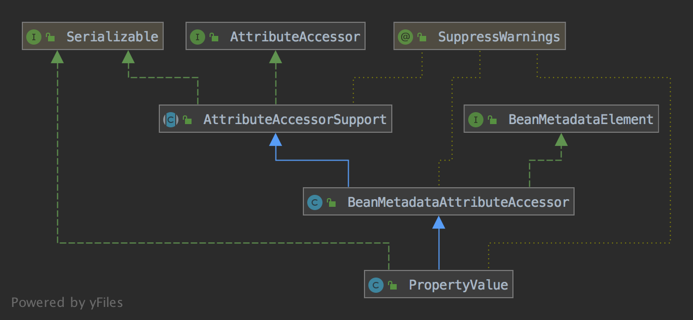

## 如何设置XML中的字符串值到Bean的属性上

属性填充分两步，一步是获取属性值，一步是转换属性值为期望值，对于XML配置文件，属性值一般直接定义在XML中，如：
```java
public class TestPropertyPopulateBean {
	private String name;
	private Integer num;
	private Date time;
	private MyBeanA myBeanA;
	private MyBeanB myBeanB;

	public TestPropertyPopulateBean(String name, MyBeanA myBeanA) {
		this.name = name;
		this.myBeanA = myBeanA;
	}

	public String getName() {
		return name;
	}

	public void setName(String name) {
		this.name = name;
	}

	public Integer getNum() {
		return num;
	}

	public void setNum(Integer num) {
		this.num = num;
	}

	public Date getTime() {
		return time;
	}

	public void setTime(Date time) {
		this.time = time;
	}

	public MyBeanA getMyBeanA() {
		return myBeanA;
	}

	public void setMyBeanA(MyBeanA myBeanA) {
		this.myBeanA = myBeanA;
	}

	public MyBeanB getMyBeanB() {
		return myBeanB;
	}

	public void setMyBeanB(MyBeanB myBeanB) {
		this.myBeanB = myBeanB;
	}
}

public class MyBeanA {
	private String name;

	public String getName() {
		return name;
	}

	public void setName(String name) {
		this.name = name;
	}
}

public class MyBeanB {
	private String name;

	public String getName() {
		return name;
	}

	public void setName(String name) {
		this.name = name;
	}
}

import org.springframework.beans.propertyeditors.CustomDateEditor;
public class CustomDateEditorRegistrar implements PropertyEditorRegistrar {
	@Override
	public void registerCustomEditors(PropertyEditorRegistry registry) {
		registry.registerCustomEditor(Date.class, new CustomDateEditor(new SimpleDateFormat("yyyy-MM-dd"), true));
	}
}
```

XML配置：
```xml
<?xml version="1.0" encoding="UTF-8"?>
<beans xmlns="http://www.springframework.org/schema/beans"
	   xmlns:xsi="http://www.w3.org/2001/XMLSchema-instance"
	   xsi:schemaLocation="http://www.springframework.org/schema/beans
	   http://www.springframework.org/schema/beans/spring-beans.xsd">
	<bean id="testPropertyPopulateBean"
			class="org.springframework.tests.sample.beans.property.TestPropertyPopulateBean" autowire="byType">
		<constructor-arg name="name" value="test"/>
		<constructor-arg name="myBeanA" ref="myBeanA"/>
		<property name="num" value="20"/>
		<property name="time" value="2019-06-16"/>
	</bean>

	<bean id="myBeanA" class="org.springframework.tests.sample.beans.property.MyBeanA">
		<property name="name" value="myBeanA"/>
	</bean>

	<bean id="myBeanB" class="org.springframework.tests.sample.beans.property.MyBeanB">
		<property name="name" value="myBeanB"/>
	</bean>

	<bean class="org.springframework.beans.factory.config.CustomEditorConfigurer">
		<property name="propertyEditorRegistrars">
			<bean class="org.springframework.tests.sample.beans.property.CustomDateEditorRegistrar"/>
		</property>
	</bean>
</beans>
```

测试代码：
```java
@Test
public void testPropertyPopulate() {
	ClassPathXmlApplicationContext applicationContext = new ClassPathXmlApplicationContext(classPathResource("-application-context.xml").getPath(), getClass());
	TestPropertyPopulateBean testPropertyPopulateBean = applicationContext.getBean("testPropertyPopulateBean", TestPropertyPopulateBean.class);
	System.out.println(testPropertyPopulateBean.getName());
	System.out.println(testPropertyPopulateBean.getNum());
	System.out.println(testPropertyPopulateBean.getTime());
	System.out.println(testPropertyPopulateBean.getMyBeanA().getName());
	System.out.println(testPropertyPopulateBean.getMyBeanB().getName());
}

/*
输出：
test
20
Sun Jun 16 00:00:00 CST 2019
myBeanA
myBeanB
*/
```
上述的例子有构造函数的属性注入和普通成员变量的属性注入，注入的属性有普通的字符串和数字、无法直接转换的Date类型属性和引用其他bean的属性。下面分析spring是如何设置上这些属性的，以下内容假设已经看过笔记[容器的初始化过程](../容器的实现/容器的初始化过程.md)和[从容器获取Bean](../容器的实现/从容器获取Bean.md)

bean的属性注入发生在初始化bean时执行的`populateBean()`方法中，代码：
```java
protected void populateBean(String beanName, RootBeanDefinition mbd, @Nullable BeanWrapper bw) {
	if (bw == null) {
		if (mbd.hasPropertyValues()) {
			throw new BeanCreationException(
					mbd.getResourceDescription(), beanName, "Cannot apply property values to null instance");
		}
		else {
			// Skip property population phase for null instance.
			return;
		}
	}

	// Give any InstantiationAwareBeanPostProcessors the opportunity to modify the
	// state of the bean before properties are set. This can be used, for example,
	// to support styles of field injection.
	boolean continueWithPropertyPopulation = true;

	// 给InstantiationAwareBeanPostProcessors机会在设置属性之前改变bean
	if (!mbd.isSynthetic() && hasInstantiationAwareBeanPostProcessors()) {
		for (BeanPostProcessor bp : getBeanPostProcessors()) {
			if (bp instanceof InstantiationAwareBeanPostProcessor) {
				InstantiationAwareBeanPostProcessor ibp = (InstantiationAwareBeanPostProcessor) bp;
				if (!ibp.postProcessAfterInstantiation(bw.getWrappedInstance(), beanName)) {
					continueWithPropertyPopulation = false;
					break;
				}
			}
		}
	}

	// 如果postProcessAfterInstantiation返回false则停止自动注入属性的过程
	if (!continueWithPropertyPopulation) {
		return;
	}

	// 获取所有从XML的property元素解析到的属性
	// 可能是RuntimeBeanReference或者是TypedStringValue
	PropertyValues pvs = (mbd.hasPropertyValues() ? mbd.getPropertyValues() : null);

	// 判断属性的注入方式，通过在XML配置bean时设置autowire属性指定，如果设置了autowire则尝试自动注入bean的属性(即使没有在属性上声明注解)
	if (mbd.getResolvedAutowireMode() == RootBeanDefinition.AUTOWIRE_BY_NAME ||
			mbd.getResolvedAutowireMode() == RootBeanDefinition.AUTOWIRE_BY_TYPE) {
		MutablePropertyValues newPvs = new MutablePropertyValues(pvs);

		// Add property values based on autowire by name if applicable.
		if (mbd.getResolvedAutowireMode() == RootBeanDefinition.AUTOWIRE_BY_NAME) {
			// 根据属性名称获取bean，获取到的bean保存在newPvs中
			autowireByName(beanName, mbd, bw, newPvs);
		}

		// Add property values based on autowire by type if applicable.
		if (mbd.getResolvedAutowireMode() == RootBeanDefinition.AUTOWIRE_BY_TYPE) {
			// 根据属性类型获取bean，获取到的bean保存在newPvs中
			autowireByType(beanName, mbd, bw, newPvs);
		}

		pvs = newPvs;
	}

	boolean hasInstAwareBpps = hasInstantiationAwareBeanPostProcessors();
	boolean needsDepCheck = (mbd.getDependencyCheck() != RootBeanDefinition.DEPENDENCY_CHECK_NONE);

	// 如果存在InstantiationAwareBeanPostProcessors并且当前bean没有禁用依赖检查，则执行postProcessPropertyValues方法
	if (hasInstAwareBpps || needsDepCheck) {
		if (pvs == null) {
			pvs = mbd.getPropertyValues();
		}
		PropertyDescriptor[] filteredPds = filterPropertyDescriptorsForDependencyCheck(bw, mbd.allowCaching);
		if (hasInstAwareBpps) {
			for (BeanPostProcessor bp : getBeanPostProcessors()) {
				if (bp instanceof InstantiationAwareBeanPostProcessor) {
					InstantiationAwareBeanPostProcessor ibp = (InstantiationAwareBeanPostProcessor) bp;
					pvs = ibp.postProcessPropertyValues(pvs, filteredPds, bw.getWrappedInstance(), beanName);
					if (pvs == null) {
						return;
					}
				}
			}
		}
		if (needsDepCheck) {
			checkDependencies(beanName, mbd, filteredPds, pvs);
		}
	}

	// 设置属性到bean中
	if (pvs != null) {
		applyPropertyValues(beanName, mbd, bw, pvs);
	}
}
```

`populateBean()`方法将属性注入分为两步，一步是获取所有的属性，也就是`PropertyValues pvs = (mbd.hasPropertyValues() ? mbd.getPropertyValues() : null)`和该语句下面的`autowireByName()`与`autowireByType`，一步是`applyPropertyValues()`方法，将属性设置到bean中，所以首先需要分析的是获取到的[PropertyValues]有什么用，和[PropertyValues]如何获取的。下面是[PropertyValues]的定义：
```java
public interface PropertyValues {
	PropertyValue[] getPropertyValues();

	@Nullable
	PropertyValue getPropertyValue(String propertyName);

	PropertyValues changesSince(PropertyValues old);

	boolean contains(String propertyName);

	boolean isEmpty();

}
```
[PropertyValues]作用只是维护一组[PropertyValue]，而[PropertyValue]继承结构为：


[AttributeAccessor]接口定义了属性的访问方法
```java
public interface AttributeAccessor {
	void setAttribute(String name, @Nullable Object value);

	@Nullable
	Object getAttribute(String name);

	@Nullable
	Object removeAttribute(String name);

	boolean hasAttribute(String name);

	String[] attributeNames();
}
```

[AttributeAccessorSupport]抽象类实现了[AttributeAccessor]接口的方法，用map保存属性和属性值
```java
@SuppressWarnings("serial")
public abstract class AttributeAccessorSupport implements AttributeAccessor, Serializable {
	private final Map<String, Object> attributes = new LinkedHashMap<>(0);

	@Override
	public void setAttribute(String name, @Nullable Object value) {
		Assert.notNull(name, "Name must not be null");
		if (value != null) {
			this.attributes.put(name, value);
		}
		else {
			removeAttribute(name);
		}
	}

	@Override
	@Nullable
	public Object getAttribute(String name) {
		Assert.notNull(name, "Name must not be null");
		return this.attributes.get(name);
	}

	@Override
	@Nullable
	public Object removeAttribute(String name) {
		Assert.notNull(name, "Name must not be null");
		return this.attributes.remove(name);
	}

	@Override
	public boolean hasAttribute(String name) {
		Assert.notNull(name, "Name must not be null");
		return this.attributes.containsKey(name);
	}

	@Override
	public String[] attributeNames() {
		return StringUtils.toStringArray(this.attributes.keySet());
	}

	// 从另一个AttributeAccessor复制属性
	protected void copyAttributesFrom(AttributeAccessor source) {
		Assert.notNull(source, "Source must not be null");
		String[] attributeNames = source.attributeNames();
		for (String attributeName : attributeNames) {
			setAttribute(attributeName, source.getAttribute(attributeName));
		}
	}


	@Override
	public boolean equals(Object other) {
		if (this == other) {
			return true;
		}
		if (!(other instanceof AttributeAccessorSupport)) {
			return false;
		}
		AttributeAccessorSupport that = (AttributeAccessorSupport) other;
		return this.attributes.equals(that.attributes);
	}

	@Override
	public int hashCode() {
		return this.attributes.hashCode();
	}
}
```

[BeanMetadataElement]接口定义了获取配置源的方法，如对于XML配置，元素的配置源就是其在XML中的配置元素对应的[Element]对象，可以返回null
```java
public interface BeanMetadataElement {
	@Nullable
	Object getSource();
}
```

[BeanMetadataAttributeAccessor]类主要是利用[AttributeAccessorSupport]保存属性，并将属性值定义为[BeanMetadataAttribute]保存在[AttributeAccessorSupport]的map中，[BeanMetadataAttribute]类的作用是维护属性名和属性值还有属性的配置源
```java
public class BeanMetadataAttribute implements BeanMetadataElement {

	private final String name;

	@Nullable
	private final Object value;

	@Nullable
	private Object source;

	public BeanMetadataAttribute(String name, @Nullable Object value) {
		Assert.notNull(name, "Name must not be null");
		this.name = name;
		this.value = value;
	}


	public String getName() {
		return this.name;
	}

	@Nullable
	public Object getValue() {
		return this.value;
	}

	public void setSource(@Nullable Object source) {
		this.source = source;
	}

	@Override
	@Nullable
	public Object getSource() {
		return this.source;
	}


	@Override
	public boolean equals(Object other) {
		if (this == other) {
			return true;
		}
		if (!(other instanceof BeanMetadataAttribute)) {
			return false;
		}
		BeanMetadataAttribute otherMa = (BeanMetadataAttribute) other;
		return (this.name.equals(otherMa.name) &&
				ObjectUtils.nullSafeEquals(this.value, otherMa.value) &&
				ObjectUtils.nullSafeEquals(this.source, otherMa.source));
	}

	@Override
	public int hashCode() {
		return this.name.hashCode() * 29 + ObjectUtils.nullSafeHashCode(this.value);
	}

	@Override
	public String toString() {
		return "metadata attribute '" + this.name + "'";
	}
}

@SuppressWarnings("serial")
public class BeanMetadataAttributeAccessor extends AttributeAccessorSupport implements BeanMetadataElement {

	@Nullable
	private Object source;

	public void setSource(@Nullable Object source) {
		this.source = source;
	}

	@Override
	@Nullable
	public Object getSource() {
		return this.source;
	}


	public void addMetadataAttribute(BeanMetadataAttribute attribute) {
		super.setAttribute(attribute.getName(), attribute);
	}

	@Nullable
	public BeanMetadataAttribute getMetadataAttribute(String name) {
		return (BeanMetadataAttribute) super.getAttribute(name);
	}

	@Override
	public void setAttribute(String name, @Nullable Object value) {
		super.setAttribute(name, new BeanMetadataAttribute(name, value));
	}

	@Override
	@Nullable
	public Object getAttribute(String name) {
		BeanMetadataAttribute attribute = (BeanMetadataAttribute) super.getAttribute(name);
		return (attribute != null ? attribute.getValue() : null);
	}

	@Override
	@Nullable
	public Object removeAttribute(String name) {
		BeanMetadataAttribute attribute = (BeanMetadataAttribute) super.removeAttribute(name);
		return (attribute != null ? attribute.getValue() : null);
	}
}
```

[PropertyValue]主要是用于维护单个bean的属性值，[BeanMetadataAttributeAccessor]是有保存多个属性的能力的，之所以没有维护所有的属性，是因为单个属性的实现使用起来更灵活，以及能够以优化的方式处理索引属性。
```java
@SuppressWarnings("serial")
public class PropertyValue extends BeanMetadataAttributeAccessor implements Serializable {

	private final String name;

	@Nullable
	// 保存未转换的值
	private final Object value;

	// 属性是否是Optional类型的
	private boolean optional = false;

	// 是否已经转换过
	private boolean converted = false;

	@Nullable
	// 保存转换后值
	private Object convertedValue;

	/** Package-visible field that indicates whether conversion is necessary */
	@Nullable
	// 是否需要转换
	volatile Boolean conversionNecessary;

	/** Package-visible field for caching the resolved property path tokens */
	@Nullable
	transient volatile Object resolvedTokens;


	public PropertyValue(String name, @Nullable Object value) {
		Assert.notNull(name, "Name must not be null");
		this.name = name;
		this.value = value;
	}

	public PropertyValue(PropertyValue original) {
		Assert.notNull(original, "Original must not be null");
		this.name = original.getName();
		this.value = original.getValue();
		this.optional = original.isOptional();
		this.converted = original.converted;
		this.convertedValue = original.convertedValue;
		this.conversionNecessary = original.conversionNecessary;
		this.resolvedTokens = original.resolvedTokens;
		setSource(original.getSource());
		copyAttributesFrom(original);
	}

	public PropertyValue(PropertyValue original, @Nullable Object newValue) {
		Assert.notNull(original, "Original must not be null");
		this.name = original.getName();
		this.value = newValue;
		this.optional = original.isOptional();
		this.conversionNecessary = original.conversionNecessary;
		this.resolvedTokens = original.resolvedTokens;
		setSource(original);
		copyAttributesFrom(original);
	}

	public String getName() {
		return this.name;
	}

	@Nullable
	public Object getValue() {
		return this.value;
	}

	public PropertyValue getOriginalPropertyValue() {
		PropertyValue original = this;
		Object source = getSource();
		while (source instanceof PropertyValue && source != original) {
			original = (PropertyValue) source;
			source = original.getSource();
		}
		return original;
	}

	public void setOptional(boolean optional) {
		this.optional = optional;
	}

	public boolean isOptional() {
		return this.optional;
	}

	public synchronized boolean isConverted() {
		return this.converted;
	}

	public synchronized void setConvertedValue(@Nullable Object value) {
		this.converted = true;
		this.convertedValue = value;
	}

	@Nullable
	public synchronized Object getConvertedValue() {
		return this.convertedValue;
	}


	@Override
	public boolean equals(Object other) {
		if (this == other) {
			return true;
		}
		if (!(other instanceof PropertyValue)) {
			return false;
		}
		PropertyValue otherPv = (PropertyValue) other;
		return (this.name.equals(otherPv.name) &&
				ObjectUtils.nullSafeEquals(this.value, otherPv.value) &&
				ObjectUtils.nullSafeEquals(getSource(), otherPv.getSource()));
	}

	@Override
	public int hashCode() {
		return this.name.hashCode() * 29 + ObjectUtils.nullSafeHashCode(this.value);
	}

	@Override
	public String toString() {
		return "bean property '" + this.name + "'";
	}
}
```


Spring中的属性转换是通过[PropertyEditor]实现的，[PropertyEditor]是`java.beans`包下的，该接口主要方法如下:
1.`Object getValue()`: 返回属性的当前值。基本类型被封装成对应的封装类实例。
1.`void setValue(Object newValue)`: 设置属性的值，基本类型以封装类传入。
1.`String getAsText()`: 将属性对象用一个字符串表示，以便外部的属性编辑器能以可视化的方式显示。缺省返回null，表示该属性不能以字符串表示。
1.`void setAsText(String text)`: 用一个字符串去更新属性的内部值，这个字符串一般从外部属性编辑器传入。
1.`String[] getTags()`: 返回表示有效属性值的字符串数组(如boolean属性对应的有效Tag为true和false)，以便属性编辑器能以下拉框的方式显示出来。缺省返回null，表示属性没有匹配的字符值有限集合。
1.`String getJavaInitializationString()`: 为属性提供一个表示初始值的字符串，属性编辑器以此值作为属性的默认值。
JDK还提供了[PropertyEditorSupport]类实现了[PropertyEditor]的默认功能，Spring大部分默认属性编辑器都直接扩展于[PropertyEditorSupport]类。
想要实现一个自己的[PropertyEditor]只需要继承[PropertyEditorSupport]并重写`setAsText()`和`getAsText()`方法即可，如:
```
public class UUIDEditor extends PropertyEditorSupport {
    @Override
    public void setAsText(String text) throws IllegalArgumentException {
        if (StringUtils.hasText(text)) {
            setValue(UUID.fromString(text));
        }
        else {
            setValue(null);
        }
    }

    @Override
    public String getAsText() {
        UUID value = (UUID) getValue();
        return (value != null ? value.toString() : "");
    }
}
```
之后在XML中将自定义的[PropertyEditor]添加到[CustomEditorConfigurer]中，如下:
```
<bean id="customEditorConfigurer" class="org.springframework.beans.factory.config.CustomEditorConfigurer">
	<property name="customEditors">
	    <map>
	    <entry key="java.util.UUID">
		<bean class="com.example.UUIDEditor"/>
		</entry>
		</map>
	</property>
</bean>
```
[CustomEditorConfigurer]实现了[BeanFactoryPostProcessor]接口在容器初始化完成后遍历`customEditors`属性并全部添加到[BeanFactory]中，或者同样用[CustomEditorConfigurer]的`propertyEditorRegistrars`属性:
```
<bean id="customEditorConfigurer" class="org.springframework.beans.factory.config.CustomEditorConfigurer">
	<property name="propertyEditorRegistrars">
		<bean class="org.springframework.jmx.export.CustomDateEditorRegistrar"/>
	</property>
</bean>
```
添加[PropertyEditorRegistrar]接口的实现类到`propertyEditorRegistrars`，[CustomEditorConfigurer]会通过`postProcessBeanFactory`方法添加[PropertyEditorRegistrar]到[BeanFactory]中，
容器在启动时执行`prepareBeanFactory`方法时会默认添加[ResourceEditorRegistrar]到[BeanFactory]，使用`customEditors`注册[PropertyEditor]和使用[propertyEditorRegistrars]注册[PropertyEditorRegistrar]区别不大，[PropertyEditor]是直接添加到[BeanFactory]的`customEditors`属性中，
而[PropertyEditorRegistrar]是添加到[BeanFactory]的`propertyEditorRegistrars`属性中，在初始化一个bean时，Spring会创建一个[BeanWrapper]，默认实现是[BeanWrapperImpl]，类图如下:

[PropertyEditorRegistry]接口定义了关联Class和[PropertyEditor]的方法，[PropertyEditorRegistrySupport]实现了[PropertyEditorRegistry]接口并添加了`getDefaultEditor`方法，默认添加了多个[PropertyEditor]到其`defaultEditors`属性中(`defaultEditors`不同于`customEditors`，获取`customEditors`时不会获取`defaultEditors`)。
[TypeConverter]接口定义了将Object转化为指定的类的方法，[TypeConverterSupport]使用[TypeConverterDelegate]类作为代理实现了[TypeConverter]接口，[PropertyAccessor]接口定义了访问bean的属性的若干方法，如判断属性是否可读/写，获取属性值、属性类型和属性的[TypeDescriptor]，设置属性值等。
[ConfigurablePropertyAccessor]接口添加了设置[ConversionService]、`extractOldValueForEditor`和`autoGrowNestedPaths`的方法，[AbstractPropertyAccessor]抽象类实现了其实现的接口的getter/setter方法，并处理了set属性时属性值为[PropertyValues]的情况(获取[PropertyValue]列表并依次执行set)，具体的设置属性的方法为抽象方法。
[AbstractNestablePropertyAccessor]抽象类实现了上述接口的方法，[BeanWrapper]接口定义了获取[BeanWrapper]包装的bean及bean的[PropertyDescriptor]的方法。[BeanWrapperImpl]类实现了[BeanWrapper]接口和[AbstractNestablePropertyAccessor]抽象类。
初始化`bean`时创建[BeanWrapper]的地方是在[AbstractAutowireCapableBeanFactory]的`instantiateBean`方法中，代码如下:
```
protected BeanWrapper instantiateBean(final String beanName, final RootBeanDefinition mbd) {
    ...
    BeanWrapper bw = new BeanWrapperImpl(beanInstance);
    initBeanWrapper(bw);
    ...
}

protected void initBeanWrapper(BeanWrapper bw) {
	bw.setConversionService(getConversionService());
	registerCustomEditors(bw);
}
```
`initBeanWrapper`方法将[BeanWrapper]作为[PropertyEditorRegistry]传入`registerCustomEditors`方法中，`registerCustomEditors`方法代码如下:
```
protected void registerCustomEditors(PropertyEditorRegistry registry) {
	PropertyEditorRegistrySupport registrySupport =
			(registry instanceof PropertyEditorRegistrySupport ? (PropertyEditorRegistrySupport) registry : null);
	if (registrySupport != null) {
		registrySupport.useConfigValueEditors();
	}
	//遍历propertyEditorRegistrars将BeanWrapper传入并执行registerCustomEditors
	if (!this.propertyEditorRegistrars.isEmpty()) {
		for (PropertyEditorRegistrar registrar : this.propertyEditorRegistrars) {
			try {
				registrar.registerCustomEditors(registry);
			}
			catch (BeanCreationException ex) {
				Throwable rootCause = ex.getMostSpecificCause();
				if (rootCause instanceof BeanCurrentlyInCreationException) {
					BeanCreationException bce = (BeanCreationException) rootCause;
					String bceBeanName = bce.getBeanName();
					if (bceBeanName != null && isCurrentlyInCreation(bceBeanName)) {
						if (logger.isDebugEnabled()) {
							logger.debug("PropertyEditorRegistrar [" + registrar.getClass().getName() +
									"] failed because it tried to obtain currently created bean '" +
									ex.getBeanName() + "': " + ex.getMessage());
						}
						onSuppressedException(ex);
						continue;
					}
				}
				throw ex;
			}
		}
	}
	//遍历customEditors将BeanWrapper传入并执行registerCustomEditor
    if (!this.customEditors.isEmpty()) {
		this.customEditors.forEach((requiredType, editorClass) ->
				registry.registerCustomEditor(requiredType, BeanUtils.instantiateClass(editorClass)));
	}
}
```
上面说到[BeanWrapperImpl]的父接口[TypeConverterSupport]使用[TypeConverterDelegate]类作为代理实现了[TypeConverter]接口，[BeanWrapperImpl]的构造函数:
```
public BeanWrapperImpl(Object object) {
	super(object);
}

protected AbstractNestablePropertyAccessor(Object object) {
	registerDefaultEditors();
	setWrappedInstance(object);
}

protected void registerDefaultEditors() {
	this.defaultEditorsActive = true;
}
```
默认激活`defaultEditorsActive`属性，`setWrappedInstance`方法初始化了[TypeConverterDelegate]:
```
this.typeConverterDelegate = new TypeConverterDelegate(this, this.wrappedObject);
```
将[BeanWrapperImpl]作为[PropertyEditorRegistrySupport]传入构造函数，Spring在初始化`bean`时如果[BeanFactory]没有设置`typeConverter`属性则将当前`bean`的[BeanWrapperImpl]作为[TypeConverter]，
之后在[AbstractAutowireCapableBeanFactory]的`applyPropertyValues`方法中获取保存在当前`bean`的[BeanDefinition]中的[PropertyValue]并进行属性注入，比如XML中的日期字符串转Date，Spring解析该属性时将其以[TypedStringValue]类进行封装保存到[BeanDefinition]中，
`applyPropertyValues`方法调用`convertForProperty`进行属性转换，最终属性转换会交由[AbstractNestablePropertyAccessor]的`convertIfNecessary`方法完成，该方法代码如下:
```
private Object convertIfNecessary(@Nullable String propertyName, @Nullable Object oldValue,
		@Nullable Object newValue, @Nullable Class<?> requiredType, @Nullable TypeDescriptor td)
		throws TypeMismatchException {

	Assert.state(this.typeConverterDelegate != null, "No TypeConverterDelegate");
	try {
		return this.typeConverterDelegate.convertIfNecessary(propertyName, oldValue, newValue, requiredType, td);
	}
	catch (ConverterNotFoundException | IllegalStateException ex) {
		PropertyChangeEvent pce =
				new PropertyChangeEvent(getRootInstance(), this.nestedPath + propertyName, oldValue, newValue);
		throw new ConversionNotSupportedException(pce, requiredType, ex);
	}
	catch (ConversionException | IllegalArgumentException ex) {
		PropertyChangeEvent pce =
				new PropertyChangeEvent(getRootInstance(), this.nestedPath + propertyName, oldValue, newValue);
		throw new TypeMismatchException(pce, requiredType, ex);
	}
}
```
实际的转换由[TypeConverterDelegate]实现，[TypeConverterDelegate]会先获取[BeanWrapperImpl]的`customEditors`，如果不存在指定类型的[PropertyEditor]则获取`defaultEditors`，如果最终的转换结果为String并且和期望的返回值类型不符则保存。

[PropertyEditorRegistrar]: aaa
[BeanMetadataAttribute]: aaa
[Element]: aaa
[PropertyEditor]: aaa
[PropertyEditorSupport]: aaa
[CustomEditorConfigurer]: aaa
[BeanFactoryPostProcessor]: aaa
[BeanFactory]: aaa
[ResourceEditorRegistrar]: aaa
[BeanWrapper]: aaa
[BeanWrapperImpl]: aaa
[TypeConverter]: aaa
[PropertyAccessor]: aaa
[TypeDescriptor]: aaa
[ConfigurablePropertyAccessor]: aaa
[ConversionService]: aaa
[AbstractPropertyAccessor]: aaa
[PropertyValues]: aaa
[PropertyValue]: aaa
[AbstractNestablePropertyAccessor]: aaa
[BeanWrapper]: aaa
[PropertyDescriptor]: aaa
[BeanWrapperImpl]: aaa