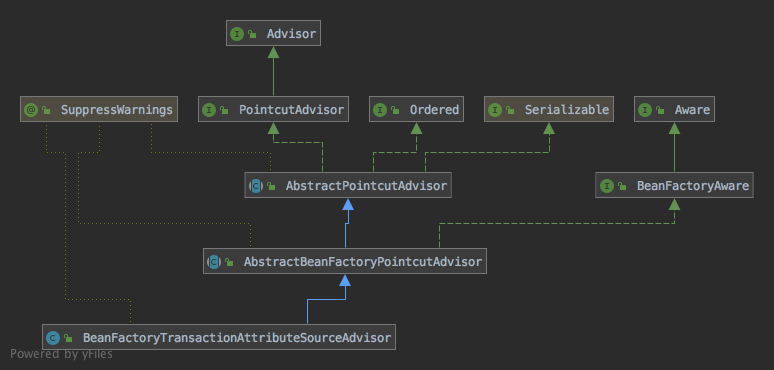
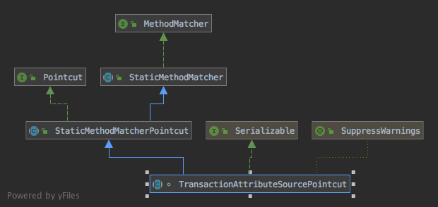
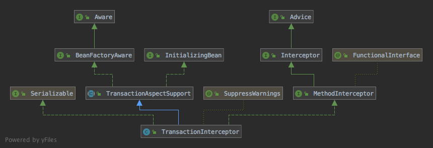
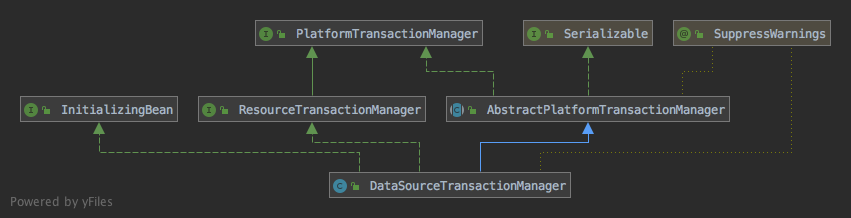

首先看一个事务回滚的测试用例：
```xml
<?xml version="1.0" encoding="UTF-8"?>
<beans xmlns="http://www.springframework.org/schema/beans"
	   xmlns:xsi="http://www.w3.org/2001/XMLSchema-instance"
	   xmlns:tx="http://www.springframework.org/schema/tx"
	   xsi:schemaLocation="http://www.springframework.org/schema/beans http://www.springframework.org/schema/beans/spring-beans-4.0.xsd

       http://www.springframework.org/schema/tx http://www.springframework.org/schema/tx/spring-tx-4.0.xsd">

	<tx:annotation-driven/>

	<bean id="transactionManager" class="org.springframework.jdbc.datasource.DataSourceTransactionManager">
		<property name="dataSource" ref="dataSource"/>
	</bean>

	<bean id="bookDao" class="org.springframework.transaction.annotation.dhf.book.dao.impl.JdbcTemplateBookDao">
		<property name="dataSource" ref="dataSource"/>
	</bean>

</beans>
```

```java
public class MyAnnotationTransactionTests {
	ClassPathXmlApplicationContext context = new ClassPathXmlApplicationContext("org/springframework/transaction/annotation/dhf/MyAnnotationTransactionTests.xml");
	@Test
	public void baseTest() {
		BookDao bookDao = (BookDao) context.getBean("bookDao");
		System.out.println(bookDao.getAll());
	}

	@Test
	public void requiredTest() {
		BookDao bookDao = (BookDao) context.getBean("bookDao");
		int count = bookDao.getAll().size();
		System.out.println("count: " + count);

		try {
			System.out.println("insertWithException");
			bookDao.insertWithException(new Book() {{
				setName("test");
				setYear(1);
			}});
		} catch (Exception e) {
			System.out.println(e.getMessage());;
		}

		count = bookDao.getAll().size();
		System.out.println("count: " + count);

		try {
			System.out.println("insert");
			bookDao.insert(new Book() {{
				setName("test");
				setYear(1);
			}});
		} catch (Exception e) {
			e.printStackTrace();
		}

		count = bookDao.getAll().size();
		System.out.println("count: " + count);
	}
}

/*
输出：
count: 5
insertWithException
test insert exception
count: 5
insert
count: 6
*/
```

上面用到的[BookDao]接口及用到的`insert()`和`insertWithException()`方法代码：
```java
@Transactional(propagation = Propagation.REQUIRED)
public interface BookDao {
    void insert(Book book);

    void insertWithException(Book book);

    void insertBatch(List<Book> books);

    void delete(Book book);

    void deleteAll();

    Book getById(Integer id);

    List<Book> getAll();
}

@Override
public void insert(Book book) {
    String sql = "INSERT INTO BOOK(BOOK_ID, NAME, YEAR) VALUES (?, ?, ?)";

    getJdbcTemplate().update(sql, new Object[]{book.getBookId(), book.getName(), book.getYear()});
}
@Override
public void insertWithException(Book book) {
    String sql = "INSERT INTO BOOK(BOOK_ID, NAME, YEAR) VALUES (?, ?, ?)";

    getJdbcTemplate().update(sql, new Object[]{book.getBookId(), book.getName(), book.getYear()});
    throw new RuntimeException("test insert exception");
}
```

可以看到，当insert后抛出异常，数据不会被插入到数据库，即数据库回滚了，而正常执行的insert成功插入了，下面分析Spring中事务的实现原理，首先和AOP一样，先找到XML中`tx`对应的[NamespaceHandler]，其实现是[TxNamespaceHandler]，代码：
```java
public class TxNamespaceHandler extends NamespaceHandlerSupport {

	static final String TRANSACTION_MANAGER_ATTRIBUTE = "transaction-manager";

	// 默认事务管理器的bean name
  static final String DEFAULT_TRANSACTION_MANAGER_BEAN_NAME = "transactionManager";


	static String getTransactionManagerName(Element element) {
		return (element.hasAttribute(TRANSACTION_MANAGER_ATTRIBUTE) ?
				element.getAttribute(TRANSACTION_MANAGER_ATTRIBUTE) : DEFAULT_TRANSACTION_MANAGER_BEAN_NAME);
	}


	@Override
	public void init() {
		registerBeanDefinitionParser("advice", new TxAdviceBeanDefinitionParser());
		registerBeanDefinitionParser("annotation-driven", new AnnotationDrivenBeanDefinitionParser());
		registerBeanDefinitionParser("jta-transaction-manager", new JtaTransactionManagerBeanDefinitionParser());
	}

}
```

`annotation-driven`对应的解析类是[AnnotationDrivenBeanDefinitionParser]，代码：
```java
class AnnotationDrivenBeanDefinitionParser implements BeanDefinitionParser {
	@Override
	@Nullable
	public BeanDefinition parse(Element element, ParserContext parserContext) {
		registerTransactionalEventListenerFactory(parserContext);
		String mode = element.getAttribute("mode");
		if ("aspectj".equals(mode)) {
			// 如果设置mode为aspectj则使用aspectj创建代理
			// mode="aspectj"
			registerTransactionAspect(element, parserContext);
		}
		else {
			// mode="proxy"
			AopAutoProxyConfigurer.configureAutoProxyCreator(element, parserContext);
		}
		return null;
	}

	private void registerTransactionAspect(Element element, ParserContext parserContext) {
		String txAspectBeanName = TransactionManagementConfigUtils.TRANSACTION_ASPECT_BEAN_NAME;
		String txAspectClassName = TransactionManagementConfigUtils.TRANSACTION_ASPECT_CLASS_NAME;
		if (!parserContext.getRegistry().containsBeanDefinition(txAspectBeanName)) {
			RootBeanDefinition def = new RootBeanDefinition();
			def.setBeanClassName(txAspectClassName);
			def.setFactoryMethodName("aspectOf");
			registerTransactionManager(element, def);
			parserContext.registerBeanComponent(new BeanComponentDefinition(def, txAspectBeanName));
		}
	}

	private static void registerTransactionManager(Element element, BeanDefinition def) {
		def.getPropertyValues().add("transactionManagerBeanName",
				TxNamespaceHandler.getTransactionManagerName(element));
	}

	private void registerTransactionalEventListenerFactory(ParserContext parserContext) {
		RootBeanDefinition def = new RootBeanDefinition();
		def.setBeanClass(TransactionalEventListenerFactory.class);
		parserContext.registerBeanComponent(new BeanComponentDefinition(def,
				TransactionManagementConfigUtils.TRANSACTIONAL_EVENT_LISTENER_FACTORY_BEAN_NAME));
	}

	private static class AopAutoProxyConfigurer {
		public static void configureAutoProxyCreator(Element element, ParserContext parserContext) {
			// 事务的实现是基于aop的，这里添加InfrastructureAdvisorAutoProxyCreator的BeanDefinition到BeanFactory，InfrastructureAdvisorAutoProxyCreator
			// 能够将role为ROLE_INFRASTRUCTURE并且实现了Advisor接口的bean添加到aop的可用advisor列表中
			AopNamespaceUtils.registerAutoProxyCreatorIfNecessary(parserContext, element);

			String txAdvisorBeanName = TransactionManagementConfigUtils.TRANSACTION_ADVISOR_BEAN_NAME;
			if (!parserContext.getRegistry().containsBeanDefinition(txAdvisorBeanName)) {
				Object eleSource = parserContext.extractSource(element);

				// Create the TransactionAttributeSource definition.
				// 注册class为AnnotationTransactionAttributeSource的bean
				RootBeanDefinition sourceDef = new RootBeanDefinition(
						"org.springframework.transaction.annotation.AnnotationTransactionAttributeSource");
				sourceDef.setSource(eleSource);
				sourceDef.setRole(BeanDefinition.ROLE_INFRASTRUCTURE);
				// 注册BeanDefinition到BeanFactory，用DefaultBeanNameGenerator生成bean name，默认为className#0
				String sourceName = parserContext.getReaderContext().registerWithGeneratedName(sourceDef);

				// Create the TransactionInterceptor definition.
				// 注册class为TransactionInterceptor的bean
				RootBeanDefinition interceptorDef = new RootBeanDefinition(TransactionInterceptor.class);
				interceptorDef.setSource(eleSource);
				interceptorDef.setRole(BeanDefinition.ROLE_INFRASTRUCTURE);
				// 将<tx:annotation-driven/>中的transaction-manager属性添加到该bean的PropertyValues中，如果没有则默认为transactionManager
				registerTransactionManager(element, interceptorDef);
				// 添加transactionAttributeSource属性为上面注册的AnnotationTransactionAttributeSource的引用
				interceptorDef.getPropertyValues().add("transactionAttributeSource", new RuntimeBeanReference(sourceName));
				String interceptorName = parserContext.getReaderContext().registerWithGeneratedName(interceptorDef);

				// Create the TransactionAttributeSourceAdvisor definition.
				// 注册class为BeanFactoryTransactionAttributeSourceAdvisor的bean，BeanFactoryTransactionAttributeSourceAdvisor实现了Advisor接口
				RootBeanDefinition advisorDef = new RootBeanDefinition(BeanFactoryTransactionAttributeSourceAdvisor.class);
				advisorDef.setSource(eleSource);
				advisorDef.setRole(BeanDefinition.ROLE_INFRASTRUCTURE);
				// 添加上面注册的两个bean到下面两个属性中
				advisorDef.getPropertyValues().add("transactionAttributeSource", new RuntimeBeanReference(sourceName));
				advisorDef.getPropertyValues().add("adviceBeanName", interceptorName);
				if (element.hasAttribute("order")) {
					advisorDef.getPropertyValues().add("order", element.getAttribute("order"));
				}
				// 注册BeanDefinition
				parserContext.getRegistry().registerBeanDefinition(txAdvisorBeanName, advisorDef);

				// 发起上面3个BeanDefinition的注册事件
				CompositeComponentDefinition compositeDef = new CompositeComponentDefinition(element.getTagName(), eleSource);
				compositeDef.addNestedComponent(new BeanComponentDefinition(sourceDef, sourceName));
				compositeDef.addNestedComponent(new BeanComponentDefinition(interceptorDef, interceptorName));
				compositeDef.addNestedComponent(new BeanComponentDefinition(advisorDef, txAdvisorBeanName));
				parserContext.registerComponent(compositeDef);
			}
		}
	}

}
```

[AnnotationDrivenBeanDefinitionParser]一共注册了4个[BeanDefinition]，其中[AnnotationTransactionAttributeSource]和[TransactionInterceptor]都被设置为[BeanFactoryTransactionAttributeSourceAdvisor]的属性，所以先从[BeanFactoryTransactionAttributeSourceAdvisor]的代码入手，下面是[BeanFactoryTransactionAttributeSourceAdvisor]的继承结构：


[BeanFactoryTransactionAttributeSourceAdvisor]实现了[Advisor]接口，[AnnotationDrivenBeanDefinitionParser]中注册的[InfrastructureAdvisorAutoProxyCreator]会在创建bean时获取所有实现了[Advisor]接口的Bean以创建其他Bean的代理，所以创建普通Bean时[BeanFactoryTransactionAttributeSourceAdvisor]会被作为[Advisor]参与Bean的代理创建过程，[BeanFactoryTransactionAttributeSourceAdvisor]作为[Advisor]时涉及到的方法有：
```java
private final TransactionAttributeSourcePointcut pointcut = new TransactionAttributeSourcePointcut() {
  @Override
  @Nullable
  protected TransactionAttributeSource getTransactionAttributeSource() {
    return transactionAttributeSource;
  }
};

@Override
public Pointcut getPointcut() {
  return this.pointcut;
}

@Override
public Advice getAdvice() {
  Advice advice = this.advice;
  if (advice != null) {
    return advice;
  }

  // 如果Advice还未初始化则根据adviceBeanName获取Advice
  Assert.state(this.adviceBeanName != null, "'adviceBeanName' must be specified");
  Assert.state(this.beanFactory != null, "BeanFactory must be set to resolve 'adviceBeanName'");

  if (this.beanFactory.isSingleton(this.adviceBeanName)) {
    // Rely on singleton semantics provided by the factory.
    advice = this.beanFactory.getBean(this.adviceBeanName, Advice.class);
    this.advice = advice;
    return advice;
  }
  else {
    // No singleton guarantees from the factory -> let's lock locally but
    // reuse the factory's singleton lock, just in case a lazy dependency
    // of our advice bean happens to trigger the singleton lock implicitly...
    synchronized (this.adviceMonitor) {
      advice = this.advice;
      if (advice == null) {
        advice = this.beanFactory.getBean(this.adviceBeanName, Advice.class);
        this.advice = advice;
      }
      return advice;
    }
  }
}
```

其中`adviceBeanName`属性就是[AnnotationDrivenBeanDefinitionParser]中注册的[TransactionInterceptor]的bean name，从笔记[如何实现AOP](如何实现AOP.md)可知，创建Bean代理之前，[AbstractAdvisorAutoProxyCreator]类的`findEligibleAdvisors()`方法会遍历所有的[Advisor]并过滤掉不匹配正在创建的Bean的[Advisor]，过滤过程会根据[Advisor]的类型执行不同的逻辑，对于[BeanFactoryTransactionAttributeSourceAdvisor]类，其实现了[PointcutAdvisor]接口，所以过滤时会调用[BeanFactoryTransactionAttributeSourceAdvisor]的`getPointcut()`方法获取[Pointcut]并通过[Pointcut]类判断[Advisor]的适用性，而[BeanFactoryTransactionAttributeSourceAdvisor]的[Pointcut]就是匿名的[TransactionAttributeSourcePointcut]实现类，实现`getTransactionAttributeSource()`方法返回[BeanFactoryTransactionAttributeSourceAdvisor]中的`transactionAttributeSource`属性，也就是[AnnotationDrivenBeanDefinitionParser]中注册的[AnnotationTransactionAttributeSource]，下面先看[TransactionAttributeSourcePointcut]的实现，下面是[TransactionAttributeSourcePointcut]的继承结构：


[StaticMethodMatcher]定义了一个静态的[MethodMatcher]的基本实现，即匹配结果不受方法参数的影响，代码：
```java
public abstract class StaticMethodMatcher implements MethodMatcher {

	@Override
	public final boolean isRuntime() {
		// 表示当前MethodMatcher
		return false;
	}

	@Override
	public final boolean matches(Method method, @Nullable Class<?> targetClass, Object... args) {
		// should never be invoked because isRuntime() returns false
		throw new UnsupportedOperationException("Illegal MethodMatcher usage");
	}

}
```

[StaticMethodMatcherPointcut]类实现了基本的get、set方法
```java
public abstract class StaticMethodMatcherPointcut extends StaticMethodMatcher implements Pointcut {

	private ClassFilter classFilter = ClassFilter.TRUE;

	public void setClassFilter(ClassFilter classFilter) {
		this.classFilter = classFilter;
	}

	@Override
	public ClassFilter getClassFilter() {
		return this.classFilter;
	}


	@Override
	public final MethodMatcher getMethodMatcher() {
		// StaticMethodMatcherPointcut类实现了MethodMatcher接口，所以这里直接把自己作为MethodMatcher返回
		return this;
	}

}
```

下面是[TransactionAttributeSourcePointcut]的代码：
```java
@SuppressWarnings("serial")
abstract class TransactionAttributeSourcePointcut extends StaticMethodMatcherPointcut implements Serializable {

	@Override
	public boolean matches(Method method, @Nullable Class<?> targetClass) {
		// 如果bean本身是个代理，则不匹配
		if (targetClass != null && TransactionalProxy.class.isAssignableFrom(targetClass)) {
			return false;
		}
		// 返回的实际上就是AnnotationTransactionAttributeSource
		TransactionAttributeSource tas = getTransactionAttributeSource();
		// 如果AnnotationTransactionAttributeSource能够从方法中获取到TransactionAttribute实例则表示该方法需要被代理，即匹配成功
		return (tas == null || tas.getTransactionAttribute(method, targetClass) != null);
	}

	@Override
	public boolean equals(Object other) {
		if (this == other) {
			return true;
		}
		if (!(other instanceof TransactionAttributeSourcePointcut)) {
			return false;
		}
		TransactionAttributeSourcePointcut otherPc = (TransactionAttributeSourcePointcut) other;
		return ObjectUtils.nullSafeEquals(getTransactionAttributeSource(), otherPc.getTransactionAttributeSource());
	}

	@Override
	public int hashCode() {
		return TransactionAttributeSourcePointcut.class.hashCode();
	}

	@Override
	public String toString() {
		return getClass().getName() + ": " + getTransactionAttributeSource();
	}

	@Nullable
	protected abstract TransactionAttributeSource getTransactionAttributeSource();

}
```

所以下面需要看[AnnotationTransactionAttributeSource]的实现，下面是[AnnotationTransactionAttributeSource]的继承结构：


[TransactionAttributeSource]接口代码：
```java
public interface TransactionAttributeSource {
	@Nullable
	TransactionAttribute getTransactionAttribute(Method method, @Nullable Class<?> targetClass);
}
```

[TransactionAttribute]的作用是返回方法上的事务属性，代码：
```java
public interface TransactionAttribute extends TransactionDefinition {
	@Nullable
	// 返回事务的qualifier值，即Transactional注解的transactionManager属性值，用于选择事务对应的transactionManager
	String getQualifier();

	// 判断传入的异常是否需要回滚
	boolean rollbackOn(Throwable ex);
}
```

[AbstractFallbackTransactionAttributeSource]抽象类实现了获取[TransactionAttribute]的基本逻辑，具体获取[TransactionAttribute]的实现由子类实现，代码：
```java
public abstract class AbstractFallbackTransactionAttributeSource implements TransactionAttributeSource {
	private static final TransactionAttribute NULL_TRANSACTION_ATTRIBUTE = new DefaultTransactionAttribute();

	protected final Log logger = LogFactory.getLog(getClass());

	// TransactionAttribute的缓存，key为执行方法和方法所在类组成的对象
	private final Map<Object, TransactionAttribute> attributeCache = new ConcurrentHashMap<>(1024);

	@Override
	@Nullable
	public TransactionAttribute getTransactionAttribute(Method method, @Nullable Class<?> targetClass) {
		if (method.getDeclaringClass() == Object.class) {
			return null;
		}

		// First, see if we have a cached value.
		Object cacheKey = getCacheKey(method, targetClass);
		Object cached = this.attributeCache.get(cacheKey);
		// 先尝试从缓存中获取
		if (cached != null) {
			// Value will either be canonical value indicating there is no transaction attribute,
			// or an actual transaction attribute.
			// 如果缓存中保存的是NULL_TRANSACTION_ATTRIBUTE则说明之前判断过了该方法不需要事务
			if (cached == NULL_TRANSACTION_ATTRIBUTE) {
				return null;
			}
			else {
				return (TransactionAttribute) cached;
			}
		}
		else {
			// We need to work it out.
			// 创建TransactionAttribute
			TransactionAttribute txAttr = computeTransactionAttribute(method, targetClass);
			// Put it in the cache.
			if (txAttr == null) {
				// 如果txAttr为空，则保存NULL_TRANSACTION_ATTRIBUTE到缓存，下次在获取时直接返回null
				this.attributeCache.put(cacheKey, NULL_TRANSACTION_ATTRIBUTE);
			}
			else {
				// 获取方法的唯一名称，由全类名.方法名组成
				String methodIdentification = ClassUtils.getQualifiedMethodName(method, targetClass);
				if (txAttr instanceof DefaultTransactionAttribute) {
					((DefaultTransactionAttribute) txAttr).setDescriptor(methodIdentification);
				}
				if (logger.isDebugEnabled()) {
					logger.debug("Adding transactional method '" + methodIdentification + "' with attribute: " + txAttr);
				}
				// 结果保存到缓存中
				this.attributeCache.put(cacheKey, txAttr);
			}
			return txAttr;
		}
	}

	protected Object getCacheKey(Method method, @Nullable Class<?> targetClass) {
		return new MethodClassKey(method, targetClass);
	}

	@Nullable
	protected TransactionAttribute computeTransactionAttribute(Method method, @Nullable Class<?> targetClass) {
		// Don't allow no-public methods as required.
		// 默认情况下非public的方法不执行事务
		if (allowPublicMethodsOnly() && !Modifier.isPublic(method.getModifiers())) {
			return null;
		}

		// The method may be on an interface, but we need attributes from the target class.
		// If the target class is null, the method will be unchanged.
		// 如果method的声明类不是specificTargetClass，则从specificTargetClass开始获取实现了method方法的类并返回该方法，即
		// 获取最具体的方法实现
		Method specificMethod = AopUtils.getMostSpecificMethod(method, targetClass);

		// First try is the method in the target class.
		// 供子类实现，获取方法上的TransactionAttribute属性，如果返回值不为空则直接返回
		TransactionAttribute txAttr = findTransactionAttribute(specificMethod);
		if (txAttr != null) {
			return txAttr;
		}

		// Second try is the transaction attribute on the target class.
		txAttr = findTransactionAttribute(specificMethod.getDeclaringClass());
		// 供子类实现，获取类上的TransactionAttribute属性，如果返回值不为空并且方法是用户创建的而不是桥接方法等自动生成的方法，则直接返回
		if (txAttr != null && ClassUtils.isUserLevelMethod(method)) {
			return txAttr;
		}

		// 如果没从子类获取到TransactionAttribute，则再使用原始的方法获取一次
		if (specificMethod != method) {
			// Fallback is to look at the original method.
			txAttr = findTransactionAttribute(method);
			if (txAttr != null) {
				return txAttr;
			}
			// Last fallback is the class of the original method.
			txAttr = findTransactionAttribute(method.getDeclaringClass());
			if (txAttr != null && ClassUtils.isUserLevelMethod(method)) {
				return txAttr;
			}
		}

		return null;
	}

	@Nullable
	protected abstract TransactionAttribute findTransactionAttribute(Method method);

	@Nullable
	protected abstract TransactionAttribute findTransactionAttribute(Class<?> clazz);

	// 是否只有public方法才能执行事务
	protected boolean allowPublicMethodsOnly() {
		return false;
	}

}
```

最后是[AnnotationTransactionAttributeSource]的实现，代码：
```java
@SuppressWarnings("serial")
public class AnnotationTransactionAttributeSource extends AbstractFallbackTransactionAttributeSource
		implements Serializable {

	// 判断是否使用了javax.transaction.Transactional注解，如果是则在获取TransactionAttributeSource时需要使用相应的解析类获取
	private static final boolean jta12Present = ClassUtils.isPresent(
			"javax.transaction.Transactional", AnnotationTransactionAttributeSource.class.getClassLoader());

	// 同上
	private static final boolean ejb3Present = ClassUtils.isPresent(
			"javax.ejb.TransactionAttribute", AnnotationTransactionAttributeSource.class.getClassLoader());

	private final boolean publicMethodsOnly;

	// TransactionAnnotationParser根据注解获取TransactionAttributeSource
	private final Set<TransactionAnnotationParser> annotationParsers;

	public AnnotationTransactionAttributeSource() {
		this(true);
	}

	public AnnotationTransactionAttributeSource(boolean publicMethodsOnly) {
		this.publicMethodsOnly = publicMethodsOnly;
		this.annotationParsers = new LinkedHashSet<>(2);
		// Spring的Transactional注解的解析类
		this.annotationParsers.add(new SpringTransactionAnnotationParser());
		// javax.transaction.Transactional注解的解析类
		if (jta12Present) {
			this.annotationParsers.add(new JtaTransactionAnnotationParser());
		}
		// javax.ejb.TransactionAttribute注解的解析类
		if (ejb3Present) {
			this.annotationParsers.add(new Ejb3TransactionAnnotationParser());
		}
	}
	
	public AnnotationTransactionAttributeSource(TransactionAnnotationParser annotationParser) {
		this.publicMethodsOnly = true;
		Assert.notNull(annotationParser, "TransactionAnnotationParser must not be null");
		this.annotationParsers = Collections.singleton(annotationParser);
	}
	
	public AnnotationTransactionAttributeSource(TransactionAnnotationParser... annotationParsers) {
		this.publicMethodsOnly = true;
		Assert.notEmpty(annotationParsers, "At least one TransactionAnnotationParser needs to be specified");
		Set<TransactionAnnotationParser> parsers = new LinkedHashSet<>(annotationParsers.length);
		Collections.addAll(parsers, annotationParsers);
		this.annotationParsers = parsers;
	}

	public AnnotationTransactionAttributeSource(Set<TransactionAnnotationParser> annotationParsers) {
		this.publicMethodsOnly = true;
		Assert.notEmpty(annotationParsers, "At least one TransactionAnnotationParser needs to be specified");
		this.annotationParsers = annotationParsers;
	}


	@Override
	@Nullable
	protected TransactionAttribute findTransactionAttribute(Method method) {
		return determineTransactionAttribute(method);
	}

	@Override
	@Nullable
	protected TransactionAttribute findTransactionAttribute(Class<?> clazz) {
		return determineTransactionAttribute(clazz);
	}

	@Nullable
	protected TransactionAttribute determineTransactionAttribute(AnnotatedElement ae) {
		for (TransactionAnnotationParser annotationParser : this.annotationParsers) {
			TransactionAttribute attr = annotationParser.parseTransactionAnnotation(ae);
			if (attr != null) {
				return attr;
			}
		}
		return null;
	}

	@Override
	protected boolean allowPublicMethodsOnly() {
		return this.publicMethodsOnly;
	}


	@Override
	public boolean equals(Object other) {
		if (this == other) {
			return true;
		}
		if (!(other instanceof AnnotationTransactionAttributeSource)) {
			return false;
		}
		AnnotationTransactionAttributeSource otherTas = (AnnotationTransactionAttributeSource) other;
		return (this.annotationParsers.equals(otherTas.annotationParsers) &&
				this.publicMethodsOnly == otherTas.publicMethodsOnly);
	}

	@Override
	public int hashCode() {
		return this.annotationParsers.hashCode();
	}

}
```

[AnnotationTransactionAttributeSource]内部定义了多个[TransactionAnnotationParser]的实现，获取[TransactionAttribute]实际上就是这些[TransactionAnnotationParser]的实现的，以Spring的[Transactional]注解为例，实现是[SpringTransactionAnnotationParser]类，[SpringTransactionAnnotationParser]解析注解属性并将这些属性保存到[RuleBasedTransactionAttribute]实例中并返回，代码：
```java
@SuppressWarnings("serial")
public class SpringTransactionAnnotationParser implements TransactionAnnotationParser, Serializable {

	@Override
	@Nullable
	public TransactionAttribute parseTransactionAnnotation(AnnotatedElement ae) {
		// 合并注解的属性，方法上的Transactional注解属性会覆盖类上的属性
		AnnotationAttributes attributes = AnnotatedElementUtils.findMergedAnnotationAttributes(
				ae, Transactional.class, false, false);
		if (attributes != null) {
			return parseTransactionAnnotation(attributes);
		}
		else {
			return null;
		}
	}

	public TransactionAttribute parseTransactionAnnotation(Transactional ann) {
		return parseTransactionAnnotation(AnnotationUtils.getAnnotationAttributes(ann, false, false));
	}

	protected TransactionAttribute parseTransactionAnnotation(AnnotationAttributes attributes) {
		// 创建RuleBasedTransactionAttribute类，并为RuleBasedTransactionAttribute设置传入的注解的若干属性值
		RuleBasedTransactionAttribute rbta = new RuleBasedTransactionAttribute();
		Propagation propagation = attributes.getEnum("propagation");
		rbta.setPropagationBehavior(propagation.value());
		Isolation isolation = attributes.getEnum("isolation");
		rbta.setIsolationLevel(isolation.value());
		rbta.setTimeout(attributes.getNumber("timeout").intValue());
		rbta.setReadOnly(attributes.getBoolean("readOnly"));
		rbta.setQualifier(attributes.getString("value"));
		ArrayList<RollbackRuleAttribute> rollBackRules = new ArrayList<>();
		Class<?>[] rbf = attributes.getClassArray("rollbackFor");
		for (Class<?> rbRule : rbf) {
			// rbf表示所有应该被回滚的异常，这里用RollbackRuleAttribute封装异常类并保存到RuleBasedTransactionAttribute中
			RollbackRuleAttribute rule = new RollbackRuleAttribute(rbRule);
			rollBackRules.add(rule);
		}
		String[] rbfc = attributes.getStringArray("rollbackForClassName");
		for (String rbRule : rbfc) {
			// 同上
			RollbackRuleAttribute rule = new RollbackRuleAttribute(rbRule);
			rollBackRules.add(rule);
		}
		Class<?>[] nrbf = attributes.getClassArray("noRollbackFor");
		for (Class<?> rbRule : nrbf) {
			// nrbf表示所有不应该被回滚的异常
			NoRollbackRuleAttribute rule = new NoRollbackRuleAttribute(rbRule);
			rollBackRules.add(rule);
		}
		String[] nrbfc = attributes.getStringArray("noRollbackForClassName");
		for (String rbRule : nrbfc) {
			// 同上
			NoRollbackRuleAttribute rule = new NoRollbackRuleAttribute(rbRule);
			rollBackRules.add(rule);
		}
		rbta.getRollbackRules().addAll(rollBackRules);
		return rbta;
	}

	@Override
	public boolean equals(Object other) {
		return (this == other || other instanceof SpringTransactionAnnotationParser);
	}

	@Override
	public int hashCode() {
		return SpringTransactionAnnotationParser.class.hashCode();
	}

}
```

以上是针对[BeanFactoryTransactionAttributeSourceAdvisor]实现的`getPointcut()`方法，对于[Pointcut]，只是Spring中AOP的验证，而代理的实现则是[Advice]，[BeanFactoryTransactionAttributeSourceAdvisor]返回的[Advice]是[TransactionInterceptor]，下面在分析[TransactionInterceptor]的实现，下面是[TransactionInterceptor]的继承结构：


如果看过笔记[从容器获取Bean](从容器获取Bean.md)和[如何实现AOP](如何实现AOP.md)，那对上面的接口不会默认，所以下面直接看实现类，首先是[TransactionAspectSupport]，该类实现了事务代理执行过程中的所有逻辑，代码：
```java
public abstract class TransactionAspectSupport implements BeanFactoryAware, InitializingBean {
	private static final Object DEFAULT_TRANSACTION_MANAGER_KEY = new Object();

	// TransactionInfo保存了事务相关的所有信息，包括transactionManager、transactionAttribute、事务状态等
	private static final ThreadLocal<TransactionInfo> transactionInfoHolder =
			new NamedThreadLocal<>("Current aspect-driven transaction");

	@Nullable
	protected static TransactionInfo currentTransactionInfo() throws NoTransactionException {
		return transactionInfoHolder.get();
	}

	public static TransactionStatus currentTransactionStatus() throws NoTransactionException {
		TransactionInfo info = currentTransactionInfo();
		if (info == null || info.transactionStatus == null) {
			throw new NoTransactionException("No transaction aspect-managed TransactionStatus in scope");
		}
		return info.transactionStatus;
	}


	protected final Log logger = LogFactory.getLog(getClass());

	@Nullable
	// AnnotationDrivenBeanDefinitionParser中默认设置该属性为transactionManager
	private String transactionManagerBeanName;

	@Nullable
	private PlatformTransactionManager transactionManager;

	@Nullable
	// transactionAttributeSource实际上就是AnnotationDrivenBeanDefinitionParser中注册的AnnotationTransactionAttributeSource
	private TransactionAttributeSource transactionAttributeSource;

	@Nullable
	private BeanFactory beanFactory;

	// PlatformTransactionManager的缓存，key为qualifier
	private final ConcurrentMap<Object, PlatformTransactionManager> transactionManagerCache =
			new ConcurrentReferenceHashMap<>(4);

	public void setTransactionManagerBeanName(@Nullable String transactionManagerBeanName) {
		this.transactionManagerBeanName = transactionManagerBeanName;
	}

	@Nullable
	protected final String getTransactionManagerBeanName() {
		return this.transactionManagerBeanName;
	}
	
	public void setTransactionManager(@Nullable PlatformTransactionManager transactionManager) {
		this.transactionManager = transactionManager;
	}
	
	@Nullable
	public PlatformTransactionManager getTransactionManager() {
		return this.transactionManager;
	}

	public void setTransactionAttributes(Properties transactionAttributes) {
		NameMatchTransactionAttributeSource tas = new NameMatchTransactionAttributeSource();
		tas.setProperties(transactionAttributes);
		this.transactionAttributeSource = tas;
	}

	public void setTransactionAttributeSources(TransactionAttributeSource... transactionAttributeSources) {
		this.transactionAttributeSource = new CompositeTransactionAttributeSource(transactionAttributeSources);
	}

	public void setTransactionAttributeSource(@Nullable TransactionAttributeSource transactionAttributeSource) {
		this.transactionAttributeSource = transactionAttributeSource;
	}

	@Nullable
	public TransactionAttributeSource getTransactionAttributeSource() {
		return this.transactionAttributeSource;
	}

	@Override
	public void setBeanFactory(@Nullable BeanFactory beanFactory) {
		this.beanFactory = beanFactory;
	}

	@Nullable
	protected final BeanFactory getBeanFactory() {
		return this.beanFactory;
	}

	@Override
	public void afterPropertiesSet() {
		// 检查transactionManager、beanFactory和transactionAttributeSource是否为空
		if (getTransactionManager() == null && this.beanFactory == null) {
			throw new IllegalStateException(
					"Set the 'transactionManager' property or make sure to run within a BeanFactory " +
					"containing a PlatformTransactionManager bean!");
		}
		if (getTransactionAttributeSource() == null) {
			throw new IllegalStateException(
					"Either 'transactionAttributeSource' or 'transactionAttributes' is required: " +
					"If there are no transactional methods, then don't use a transaction aspect.");
		}
	}

	@Nullable
	// 方法执行事务时实际上执行的是该方法，参数invocation的默认实现是调用MethodInvocation的proceed方法
	protected Object invokeWithinTransaction(Method method, @Nullable Class<?> targetClass,
			final InvocationCallback invocation) throws Throwable {

		// If the transaction attribute is null, the method is non-transactional.
		// 这里返回的实际上是AnnotationTransactionAttributeSource
		TransactionAttributeSource tas = getTransactionAttributeSource();
		// 对于使用默认的Spring的Transaction注解的方法，AnnotationTransactionAttributeSource返回的TransactionAttribute实例是RuleBasedTransactionAttribute
		final TransactionAttribute txAttr = (tas != null ? tas.getTransactionAttribute(method, targetClass) : null);
		final PlatformTransactionManager tm = determineTransactionManager(txAttr);
		// 以方法的唯一标识表示当前的连接点
		final String joinpointIdentification = methodIdentification(method, targetClass, txAttr);

		// CallbackPreferringPlatformTransactionManager在PlatformTransactionManager接口的基础上定义了一个execute方法，用于代替PlatformTransactionManager
		// 执行事务管理逻辑
		if (txAttr == null || !(tm instanceof CallbackPreferringPlatformTransactionManager)) {
			// Standard transaction demarcation with getTransaction and commit/rollback calls.
			// 如果txAttr不为空，则开启事务，创建TransactionInfo对象并保存事务状态到TransactionInfo对象中
			TransactionInfo txInfo = createTransactionIfNecessary(tm, txAttr, joinpointIdentification);
			Object retVal = null;
			try {
				// This is an around advice: Invoke the next interceptor in the chain.
				// This will normally result in a target object being invoked.
				// 执行MethodInvocation的proceed方法，即执行其他Advice，如果没有Advice则是执行被代理方法
				retVal = invocation.proceedWithInvocation();
			}
			catch (Throwable ex) {
				// target invocation exception
				// 如果发生异常，则根据保存在txInfo中的transactionAttribute判断是否需要回滚，如果需要则调用txInfo中的transactionManager的rollback方法
				// 如果不需要回滚则执行txInfo中的transactionManager的commit方法
				completeTransactionAfterThrowing(txInfo, ex);
				throw ex;
			}
			finally {
				// Spring的事务是可嵌套的，这里将事务还原成外部事务
				cleanupTransactionInfo(txInfo);
			}
			// 执行txInfo中的transactionManager的commit方法
			commitTransactionAfterReturning(txInfo);
			return retVal;
		}

		else {
			final ThrowableHolder throwableHolder = new ThrowableHolder();

			// It's a CallbackPreferringPlatformTransactionManager: pass a TransactionCallback in.
			try {
				Object result = ((CallbackPreferringPlatformTransactionManager) tm).execute(txAttr, status -> {
					// 创建TransactionInfo
					TransactionInfo txInfo = prepareTransactionInfo(tm, txAttr, joinpointIdentification, status);
					try {
						return invocation.proceedWithInvocation();
					}
					catch (Throwable ex) {
						// 发生异常时判断是否需要回滚
						if (txAttr.rollbackOn(ex)) {
							// A RuntimeException: will lead to a rollback.
							if (ex instanceof RuntimeException) {
								throw (RuntimeException) ex;
							}
							else {
								throw new ThrowableHolderException(ex);
							}
						}
						else {
							// A normal return value: will lead to a commit.
							throwableHolder.throwable = ex;
							return null;
						}
					}
					finally {
						cleanupTransactionInfo(txInfo);
					}
				});

				// Check result state: It might indicate a Throwable to rethrow.
				if (throwableHolder.throwable != null) {
					throw throwableHolder.throwable;
				}
				return result;
			}
			catch (ThrowableHolderException ex) {
				throw ex.getCause();
			}
			catch (TransactionSystemException ex2) {
				if (throwableHolder.throwable != null) {
					logger.error("Application exception overridden by commit exception", throwableHolder.throwable);
					ex2.initApplicationException(throwableHolder.throwable);
				}
				throw ex2;
			}
			catch (Throwable ex2) {
				if (throwableHolder.throwable != null) {
					logger.error("Application exception overridden by commit exception", throwableHolder.throwable);
				}
				throw ex2;
			}
		}
	}

	protected void clearTransactionManagerCache() {
		this.transactionManagerCache.clear();
		this.beanFactory = null;
	}

	@Nullable
	// 根据transactionManagerBeanName或txAttr中的qualifier获取PlatformTransactionManager
	protected PlatformTransactionManager determineTransactionManager(@Nullable TransactionAttribute txAttr) {
		// Do not attempt to lookup tx manager if no tx attributes are set
		if (txAttr == null || this.beanFactory == null) {
			return getTransactionManager();
		}

		String qualifier = txAttr.getQualifier();
		// 根据qualifier的值获取transactionManager，实际上就是根据qualifier从beanFactory获取bean
		if (StringUtils.hasText(qualifier)) {
			return determineQualifiedTransactionManager(this.beanFactory, qualifier);
		}
		// 默认被设置为transactionManager
		else if (StringUtils.hasText(this.transactionManagerBeanName)) {
			return determineQualifiedTransactionManager(this.beanFactory, this.transactionManagerBeanName);
		}
		else {
			// 如果没有设置默认的PlatformTransactionManager，则从bean中获取实现了PlatformTransactionManager接口的bean
			PlatformTransactionManager defaultTransactionManager = getTransactionManager();
			if (defaultTransactionManager == null) {
				defaultTransactionManager = this.transactionManagerCache.get(DEFAULT_TRANSACTION_MANAGER_KEY);
				if (defaultTransactionManager == null) {
					defaultTransactionManager = this.beanFactory.getBean(PlatformTransactionManager.class);
					this.transactionManagerCache.putIfAbsent(
							DEFAULT_TRANSACTION_MANAGER_KEY, defaultTransactionManager);
				}
			}
			return defaultTransactionManager;
		}
	}

	private PlatformTransactionManager determineQualifiedTransactionManager(BeanFactory beanFactory, String qualifier) {
		PlatformTransactionManager txManager = this.transactionManagerCache.get(qualifier);
		if (txManager == null) {
			txManager = BeanFactoryAnnotationUtils.qualifiedBeanOfType(
					beanFactory, PlatformTransactionManager.class, qualifier);
			this.transactionManagerCache.putIfAbsent(qualifier, txManager);
		}
		return txManager;
	}

	// 获取方法的唯一标识，默认为方法所在类的全类名.方法名
	private String methodIdentification(Method method, @Nullable Class<?> targetClass,
			@Nullable TransactionAttribute txAttr) {

		String methodIdentification = methodIdentification(method, targetClass);
		if (methodIdentification == null) {
			if (txAttr instanceof DefaultTransactionAttribute) {
				methodIdentification = ((DefaultTransactionAttribute) txAttr).getDescriptor();
			}
			if (methodIdentification == null) {
				methodIdentification = ClassUtils.getQualifiedMethodName(method, targetClass);
			}
		}
		return methodIdentification;
	}

	@Nullable
	protected String methodIdentification(Method method, @Nullable Class<?> targetClass) {
		return null;
	}

	@SuppressWarnings("serial")
	protected TransactionInfo createTransactionIfNecessary(@Nullable PlatformTransactionManager tm,
			@Nullable TransactionAttribute txAttr, final String joinpointIdentification) {

		// If no name specified, apply method identification as transaction name.
		if (txAttr != null && txAttr.getName() == null) {
			txAttr = new DelegatingTransactionAttribute(txAttr) {
				@Override
				public String getName() {
					return joinpointIdentification;
				}
			};
		}

		TransactionStatus status = null;
		if (txAttr != null) {
			if (tm != null) {
				// getTransaction方法开启事务并返回TransactionStatus对象
				status = tm.getTransaction(txAttr);
			}
			else {
				if (logger.isDebugEnabled()) {
					logger.debug("Skipping transactional joinpoint [" + joinpointIdentification +
							"] because no transaction manager has been configured");
				}
			}
		}
		return prepareTransactionInfo(tm, txAttr, joinpointIdentification, status);
	}

	protected TransactionInfo prepareTransactionInfo(@Nullable PlatformTransactionManager tm,
			@Nullable TransactionAttribute txAttr, String joinpointIdentification,
			@Nullable TransactionStatus status) {

		TransactionInfo txInfo = new TransactionInfo(tm, txAttr, joinpointIdentification);
		if (txAttr != null) {
			// We need a transaction for this method...
			if (logger.isTraceEnabled()) {
				logger.trace("Getting transaction for [" + txInfo.getJoinpointIdentification() + "]");
			}
			// The transaction manager will flag an error if an incompatible tx already exists.
			txInfo.newTransactionStatus(status);
		}
		else {
			// The TransactionInfo.hasTransaction() method will return false. We created it only
			// to preserve the integrity of the ThreadLocal stack maintained in this class.
			if (logger.isTraceEnabled())
				logger.trace("Don't need to create transaction for [" + joinpointIdentification +
						"]: This method isn't transactional.");
		}

		// We always bind the TransactionInfo to the thread, even if we didn't create
		// a new transaction here. This guarantees that the TransactionInfo stack
		// will be managed correctly even if no transaction was created by this aspect.
		txInfo.bindToThread();
		return txInfo;
	}

	protected void commitTransactionAfterReturning(@Nullable TransactionInfo txInfo) {
		if (txInfo != null && txInfo.getTransactionStatus() != null) {
			if (logger.isTraceEnabled()) {
				logger.trace("Completing transaction for [" + txInfo.getJoinpointIdentification() + "]");
			}
			txInfo.getTransactionManager().commit(txInfo.getTransactionStatus());
		}
	}

	protected void completeTransactionAfterThrowing(@Nullable TransactionInfo txInfo, Throwable ex) {
		if (txInfo != null && txInfo.getTransactionStatus() != null) {
			if (logger.isTraceEnabled()) {
				logger.trace("Completing transaction for [" + txInfo.getJoinpointIdentification() +
						"] after exception: " + ex);
			}
			// 判断发生的异常是否需要回滚
			if (txInfo.transactionAttribute != null && txInfo.transactionAttribute.rollbackOn(ex)) {
				try {
					txInfo.getTransactionManager().rollback(txInfo.getTransactionStatus());
				}
				catch (TransactionSystemException ex2) {
					logger.error("Application exception overridden by rollback exception", ex);
					ex2.initApplicationException(ex);
					throw ex2;
				}
				catch (RuntimeException | Error ex2) {
					logger.error("Application exception overridden by rollback exception", ex);
					throw ex2;
				}
			}
			else {
				// 如果不需要回滚则执行commit
				// We don't roll back on this exception.
				// Will still roll back if TransactionStatus.isRollbackOnly() is true.
				try {
					txInfo.getTransactionManager().commit(txInfo.getTransactionStatus());
				}
				catch (TransactionSystemException ex2) {
					logger.error("Application exception overridden by commit exception", ex);
					ex2.initApplicationException(ex);
					throw ex2;
				}
				catch (RuntimeException | Error ex2) {
					logger.error("Application exception overridden by commit exception", ex);
					throw ex2;
				}
			}
		}
	}

	protected void cleanupTransactionInfo(@Nullable TransactionInfo txInfo) {
		if (txInfo != null) {
			txInfo.restoreThreadLocalStatus();
		}
	}

	protected final class TransactionInfo {

		@Nullable
		private final PlatformTransactionManager transactionManager;

		@Nullable
		private final TransactionAttribute transactionAttribute;

		private final String joinpointIdentification;

		@Nullable
		private TransactionStatus transactionStatus;

		@Nullable
		private TransactionInfo oldTransactionInfo;

		public TransactionInfo(@Nullable PlatformTransactionManager transactionManager,
				@Nullable TransactionAttribute transactionAttribute, String joinpointIdentification) {

			this.transactionManager = transactionManager;
			this.transactionAttribute = transactionAttribute;
			this.joinpointIdentification = joinpointIdentification;
		}

		public PlatformTransactionManager getTransactionManager() {
			Assert.state(this.transactionManager != null, "No PlatformTransactionManager set");
			return this.transactionManager;
		}

		@Nullable
		public TransactionAttribute getTransactionAttribute() {
			return this.transactionAttribute;
		}

		public String getJoinpointIdentification() {
			return this.joinpointIdentification;
		}

		public void newTransactionStatus(@Nullable TransactionStatus status) {
			this.transactionStatus = status;
		}

		@Nullable
		public TransactionStatus getTransactionStatus() {
			return this.transactionStatus;
		}

		public boolean hasTransaction() {
			return (this.transactionStatus != null);
		}

		private void bindToThread() {
			this.oldTransactionInfo = transactionInfoHolder.get();
			transactionInfoHolder.set(this);
		}

		private void restoreThreadLocalStatus() {
			transactionInfoHolder.set(this.oldTransactionInfo);
		}

		@Override
		public String toString() {
			return (this.transactionAttribute != null ? this.transactionAttribute.toString() : "No transaction");
		}
	}

	@FunctionalInterface
	protected interface InvocationCallback {

		Object proceedWithInvocation() throws Throwable;
	}

	private static class ThrowableHolder {

		@Nullable
		public Throwable throwable;
	}

	@SuppressWarnings("serial")
	private static class ThrowableHolderException extends RuntimeException {

		public ThrowableHolderException(Throwable throwable) {
			super(throwable);
		}

		@Override
		public String toString() {
			return getCause().toString();
		}
	}

}
```

[TransactionInterceptor]实现了`invoke()`方法，即实现了事务代理的执行逻辑，而具体实现只是简单的调用`invokeWithinTransaction()`方法，[TransactionInterceptor]的作用相当于将[TransactionAspectSupport]和Spring AOP的逻辑解耦，[TransactionAspectSupport]只需要关心如何执行事务管理即可，代码：
```java
@SuppressWarnings("serial")
public class TransactionInterceptor extends TransactionAspectSupport implements MethodInterceptor, Serializable {
	public TransactionInterceptor() {
	}
	
	public TransactionInterceptor(PlatformTransactionManager ptm, Properties attributes) {
		setTransactionManager(ptm);
		setTransactionAttributes(attributes);
	}

	public TransactionInterceptor(PlatformTransactionManager ptm, TransactionAttributeSource tas) {
		setTransactionManager(ptm);
		setTransactionAttributeSource(tas);
	}


	@Override
	@Nullable
	public Object invoke(final MethodInvocation invocation) throws Throwable {
		// 获取被代理类的类型
		Class<?> targetClass = (invocation.getThis() != null ? AopUtils.getTargetClass(invocation.getThis()) : null);

		return invokeWithinTransaction(invocation.getMethod(), targetClass, invocation::proceed);
	}

	private void writeObject(ObjectOutputStream oos) throws IOException {
		oos.defaultWriteObject();

		oos.writeObject(getTransactionManagerBeanName());
		oos.writeObject(getTransactionManager());
		oos.writeObject(getTransactionAttributeSource());
		oos.writeObject(getBeanFactory());
	}

	private void readObject(ObjectInputStream ois) throws IOException, ClassNotFoundException {
		ois.defaultReadObject();
		setTransactionManagerBeanName((String) ois.readObject());
		setTransactionManager((PlatformTransactionManager) ois.readObject());
		setTransactionAttributeSource((TransactionAttributeSource) ois.readObject());
		setBeanFactory((BeanFactory) ois.readObject());
	}

}
```

从[TransactionAspectSupport]的实现可以看出，Spring事务执行过程中，`TransactionManager`起了非常重要的作用，下面分析`TransactionManager`的实现，[TransactionAspectSupport]中的`TransactionManager`默认是从[BeanFactory]中获取bean name为`transactionManager`的bean，最开始的例子中使用的`TransactionManager`的实现是[DataSourceTransactionManager]类，该类继承结构如下：


[PlatformTransactionManager]接口定义了Spring中事务管理的基本操作，代码：
```java
public interface PlatformTransactionManager {
	// 获取事务，并将事务对象封装为TransactionStatus返回
	TransactionStatus getTransaction(@Nullable TransactionDefinition definition) throws TransactionException;

	// 提交事务
	void commit(TransactionStatus status) throws TransactionException;

	// 回滚事务
	void rollback(TransactionStatus status) throws TransactionException;
}
```

[PlatformTransactionManager]中用到的[TransactionStatus]表示的是事务对象，能够获取事务信息并对事务进行操作，[TransactionStatus]接口还继承了[SavepointManager]接口，使得[SavepointManager]接口定义了使用和管理`savepoint`的方法，`savepoint`是JDBC提供的功能，能够在回滚时指定回滚到特定的`savepoint`，内嵌事务就是通过保存点实现的，保存点可以实现回滚部分事务

[ResourceTransactionManager]接口代码：
```java
public interface ResourceTransactionManager extends PlatformTransactionManager {
	// 返回当前PlatformTransactionManager正在使用的resource factory，如JDBC DataSource
	Object getResourceFactory();
}

```

[AbstractPlatformTransactionManager]抽象类实现了事务管理的基本逻辑，用模版方法模式定义了开启事务的过程，同时[AbstractPlatformTransactionManager]类还定义了若干个控制Spring事务执行逻辑的属性，[AbstractPlatformTransactionManager]的代码很长，但是也很重要，下面将加了详细注释的代码贴出来，最后再分析Spring事务执行过程中的细节，代码：
```java
@SuppressWarnings("serial")
public abstract class AbstractPlatformTransactionManager implements PlatformTransactionManager, Serializable {

	/**
	 * Always activate transaction synchronization, even for "empty" transactions
	 * that result from PROPAGATION_SUPPORTS with no existing backend transaction.
	 * @see org.springframework.transaction.TransactionDefinition#PROPAGATION_SUPPORTS
	 * @see org.springframework.transaction.TransactionDefinition#PROPAGATION_NOT_SUPPORTED
	 * @see org.springframework.transaction.TransactionDefinition#PROPAGATION_NEVER
	 */
	public static final int SYNCHRONIZATION_ALWAYS = 0;

	/**
	 * Activate transaction synchronization only for actual transactions,
	 * that is, not for empty ones that result from PROPAGATION_SUPPORTS with
	 * no existing backend transaction.
	 * @see org.springframework.transaction.TransactionDefinition#PROPAGATION_REQUIRED
	 * @see org.springframework.transaction.TransactionDefinition#PROPAGATION_MANDATORY
	 * @see org.springframework.transaction.TransactionDefinition#PROPAGATION_REQUIRES_NEW
	 */
	public static final int SYNCHRONIZATION_ON_ACTUAL_TRANSACTION = 1;

	/**
	 * Never active transaction synchronization, not even for actual transactions.
	 */
	public static final int SYNCHRONIZATION_NEVER = 2;


	/** Constants instance for AbstractPlatformTransactionManager */
	private static final Constants constants = new Constants(AbstractPlatformTransactionManager.class);


	protected transient Log logger = LogFactory.getLog(getClass());

	private int transactionSynchronization = SYNCHRONIZATION_ALWAYS;

	private int defaultTimeout = TransactionDefinition.TIMEOUT_DEFAULT;

	private boolean nestedTransactionAllowed = false;

	private boolean validateExistingTransaction = false;

	private boolean globalRollbackOnParticipationFailure = true;

	private boolean failEarlyOnGlobalRollbackOnly = false;

	private boolean rollbackOnCommitFailure = false;


	/**
	 * Set the transaction synchronization by the name of the corresponding constant
	 * in this class, e.g. "SYNCHRONIZATION_ALWAYS".
	 * @param constantName name of the constant
	 * @see #SYNCHRONIZATION_ALWAYS
	 */
	public final void setTransactionSynchronizationName(String constantName) {
		setTransactionSynchronization(constants.asNumber(constantName).intValue());
	}

	/**
	 * Set when this transaction manager should activate the thread-bound
	 * transaction synchronization support. Default is "always".
	 * <p>Note that transaction synchronization isn't supported for
	 * multiple concurrent transactions by different transaction managers.
	 * Only one transaction manager is allowed to activate it at any time.
	 * @see #SYNCHRONIZATION_ALWAYS
	 * @see #SYNCHRONIZATION_ON_ACTUAL_TRANSACTION
	 * @see #SYNCHRONIZATION_NEVER
	 * @see TransactionSynchronizationManager
	 * @see TransactionSynchronization
	 */
	public final void setTransactionSynchronization(int transactionSynchronization) {
		this.transactionSynchronization = transactionSynchronization;
	}

	/**
	 * Return if this transaction manager should activate the thread-bound
	 * transaction synchronization support.
	 */
	public final int getTransactionSynchronization() {
		return this.transactionSynchronization;
	}

	/**
	 * Specify the default timeout that this transaction manager should apply
	 * if there is no timeout specified at the transaction level, in seconds.
	 * <p>Default is the underlying transaction infrastructure's default timeout,
	 * e.g. typically 30 seconds in case of a JTA provider, indicated by the
	 * {@code TransactionDefinition.TIMEOUT_DEFAULT} value.
	 * @see org.springframework.transaction.TransactionDefinition#TIMEOUT_DEFAULT
	 */
	public final void setDefaultTimeout(int defaultTimeout) {
		if (defaultTimeout < TransactionDefinition.TIMEOUT_DEFAULT) {
			throw new InvalidTimeoutException("Invalid default timeout", defaultTimeout);
		}
		this.defaultTimeout = defaultTimeout;
	}

	/**
	 * Return the default timeout that this transaction manager should apply
	 * if there is no timeout specified at the transaction level, in seconds.
	 * <p>Returns {@code TransactionDefinition.TIMEOUT_DEFAULT} to indicate
	 * the underlying transaction infrastructure's default timeout.
	 */
	public final int getDefaultTimeout() {
		return this.defaultTimeout;
	}

	/**
	 * Set whether nested transactions are allowed. Default is "false".
	 * <p>Typically initialized with an appropriate default by the
	 * concrete transaction manager subclass.
	 */
	public final void setNestedTransactionAllowed(boolean nestedTransactionAllowed) {
		this.nestedTransactionAllowed = nestedTransactionAllowed;
	}

	/**
	 * Return whether nested transactions are allowed.
	 */
	public final boolean isNestedTransactionAllowed() {
		return this.nestedTransactionAllowed;
	}

	/**
	 * Set whether existing transactions should be validated before participating
	 * in them.
	 * <p>When participating in an existing transaction (e.g. with
	 * PROPAGATION_REQUIRED or PROPAGATION_SUPPORTS encountering an existing
	 * transaction), this outer transaction's characteristics will apply even
	 * to the inner transaction scope. Validation will detect incompatible
	 * isolation level and read-only settings on the inner transaction definition
	 * and reject participation accordingly through throwing a corresponding exception.
	 * <p>Default is "false", leniently ignoring inner transaction settings,
	 * simply overriding them with the outer transaction's characteristics.
	 * Switch this flag to "true" in order to enforce strict validation.
	 * @since 2.5.1
	 */
	public final void setValidateExistingTransaction(boolean validateExistingTransaction) {
		this.validateExistingTransaction = validateExistingTransaction;
	}

	/**
	 * Return whether existing transactions should be validated before participating
	 * in them.
	 * @since 2.5.1
	 */
	public final boolean isValidateExistingTransaction() {
		return this.validateExistingTransaction;
	}

	/**
	 * Set whether to globally mark an existing transaction as rollback-only
	 * after a participating transaction failed.
	 * <p>Default is "true": If a participating transaction (e.g. with
	 * PROPAGATION_REQUIRED or PROPAGATION_SUPPORTS encountering an existing
	 * transaction) fails, the transaction will be globally marked as rollback-only.
	 * The only possible outcome of such a transaction is a rollback: The
	 * transaction originator <i>cannot</i> make the transaction commit anymore.
	 * <p>Switch this to "false" to let the transaction originator make the rollback
	 * decision. If a participating transaction fails with an exception, the caller
	 * can still decide to continue with a different path within the transaction.
	 * However, note that this will only work as long as all participating resources
	 * are capable of continuing towards a transaction commit even after a data access
	 * failure: This is generally not the case for a Hibernate Session, for example;
	 * neither is it for a sequence of JDBC insert/update/delete operations.
	 * <p><b>Note:</b>This flag only applies to an explicit rollback attempt for a
	 * subtransaction, typically caused by an exception thrown by a data access operation
	 * (where TransactionInterceptor will trigger a {@code PlatformTransactionManager.rollback()}
	 * call according to a rollback rule). If the flag is off, the caller can handle the exception
	 * and decide on a rollback, independent of the rollback rules of the subtransaction.
	 * This flag does, however, <i>not</i> apply to explicit {@code setRollbackOnly}
	 * calls on a {@code TransactionStatus}, which will always cause an eventual
	 * global rollback (as it might not throw an exception after the rollback-only call).
	 * <p>The recommended solution for handling failure of a subtransaction
	 * is a "nested transaction", where the global transaction can be rolled
	 * back to a savepoint taken at the beginning of the subtransaction.
	 * PROPAGATION_NESTED provides exactly those semantics; however, it will
	 * only work when nested transaction support is available. This is the case
	 * with DataSourceTransactionManager, but not with JtaTransactionManager.
	 * @see #setNestedTransactionAllowed
	 * @see org.springframework.transaction.jta.JtaTransactionManager
	 */
	public final void setGlobalRollbackOnParticipationFailure(boolean globalRollbackOnParticipationFailure) {
		this.globalRollbackOnParticipationFailure = globalRollbackOnParticipationFailure;
	}

	/**
	 * Return whether to globally mark an existing transaction as rollback-only
	 * after a participating transaction failed.
	 */
	public final boolean isGlobalRollbackOnParticipationFailure() {
		return this.globalRollbackOnParticipationFailure;
	}

	/**
	 * Set whether to fail early in case of the transaction being globally marked
	 * as rollback-only.
	 * <p>Default is "false", only causing an UnexpectedRollbackException at the
	 * outermost transaction boundary. Switch this flag on to cause an
	 * UnexpectedRollbackException as early as the global rollback-only marker
	 * has been first detected, even from within an inner transaction boundary.
	 * <p>Note that, as of Spring 2.0, the fail-early behavior for global
	 * rollback-only markers has been unified: All transaction managers will by
	 * default only cause UnexpectedRollbackException at the outermost transaction
	 * boundary. This allows, for example, to continue unit tests even after an
	 * operation failed and the transaction will never be completed. All transaction
	 * managers will only fail earlier if this flag has explicitly been set to "true".
	 * @since 2.0
	 * @see org.springframework.transaction.UnexpectedRollbackException
	 */
	public final void setFailEarlyOnGlobalRollbackOnly(boolean failEarlyOnGlobalRollbackOnly) {
		this.failEarlyOnGlobalRollbackOnly = failEarlyOnGlobalRollbackOnly;
	}

	/**
	 * Return whether to fail early in case of the transaction being globally marked
	 * as rollback-only.
	 * @since 2.0
	 */
	public final boolean isFailEarlyOnGlobalRollbackOnly() {
		return this.failEarlyOnGlobalRollbackOnly;
	}

	/**
	 * Set whether {@code doRollback} should be performed on failure of the
	 * {@code doCommit} call. Typically not necessary and thus to be avoided,
	 * as it can potentially override the commit exception with a subsequent
	 * rollback exception.
	 * <p>Default is "false".
	 * @see #doCommit
	 * @see #doRollback
	 */
	public final void setRollbackOnCommitFailure(boolean rollbackOnCommitFailure) {
		this.rollbackOnCommitFailure = rollbackOnCommitFailure;
	}

	/**
	 * Return whether {@code doRollback} should be performed on failure of the
	 * {@code doCommit} call.
	 */
	public final boolean isRollbackOnCommitFailure() {
		return this.rollbackOnCommitFailure;
	}


	//---------------------------------------------------------------------
	// Implementation of PlatformTransactionManager
	//---------------------------------------------------------------------

	/**
	 * This implementation handles propagation behavior. Delegates to
	 * {@code doGetTransaction}, {@code isExistingTransaction}
	 * and {@code doBegin}.
	 * @see #doGetTransaction
	 * @see #isExistingTransaction
	 * @see #doBegin
	 */
	@Override
	// 参数TransactionDefinition定义了事务的属性，包括传播行为、隔离级别、超时时间和是否只读，对于TransactionAspectSupport的createTransactionIfNecessary
	// 方法，传入的参数就是AnnotationTransactionAttributeSource对象根据Transactional注解创建的RuleBasedTransactionAttribute对象
	public final TransactionStatus getTransaction(@Nullable TransactionDefinition definition) throws TransactionException {
		// 创建DataSourceTransactionObject对象，该对象持有当前DataSource在当前线程中创建的ConnectionHolder，在一个事务中第一次调用该方法
		// 时ConnectionHolder为空
		Object transaction = doGetTransaction();

		// Cache debug flag to avoid repeated checks.
		boolean debugEnabled = logger.isDebugEnabled();

		if (definition == null) {
			// Use defaults if no transaction definition given.
			definition = new DefaultTransactionDefinition();
		}

		// 如果已经存在事务，则需要根据事务的传播行为做相应的处理
		if (isExistingTransaction(transaction)) {
			// Existing transaction found -> check propagation behavior to find out how to behave.
			return handleExistingTransaction(definition, transaction, debugEnabled);
		}

		// 还没开启事务时执行下面的逻辑

		// Check definition settings for new transaction.
		// 验证事务的超时时间是否合法
		if (definition.getTimeout() < TransactionDefinition.TIMEOUT_DEFAULT) {
			throw new InvalidTimeoutException("Invalid transaction timeout", definition.getTimeout());
		}

		// No existing transaction found -> check propagation behavior to find out how to proceed.
		// 没有事务时事务的传播行为是PROPAGATION_MANDATORY则报错
		if (definition.getPropagationBehavior() == TransactionDefinition.PROPAGATION_MANDATORY) {
			throw new IllegalTransactionStateException(
					"No existing transaction found for transaction marked with propagation 'mandatory'");
		}
		// 下面3种传播行为在没有事务时都会创建自己的事务
		else if (definition.getPropagationBehavior() == TransactionDefinition.PROPAGATION_REQUIRED ||
				definition.getPropagationBehavior() == TransactionDefinition.PROPAGATION_REQUIRES_NEW ||
				definition.getPropagationBehavior() == TransactionDefinition.PROPAGATION_NESTED) {
			// 如果开启事务则suspend返回null，这里挂一个空事务相当于什么都不做
			SuspendedResourcesHolder suspendedResources = suspend(null);
			if (debugEnabled) {
				logger.debug("Creating new transaction with name [" + definition.getName() + "]: " + definition);
			}
			try {
				// newSynchronization用于设置是否需要将definition对象和下面创建的status对象的信息保存到TransactionSynchronizationManager的
				// 当前线程的各个ThreadLocal中
				boolean newSynchronization = (getTransactionSynchronization() != SYNCHRONIZATION_NEVER);
				// 用传入的参数创建DefaultTransactionStatus对象
				DefaultTransactionStatus status = newTransactionStatus(
						definition, transaction, true, newSynchronization, debugEnabled, suspendedResources);
				// 供子类实现，对于DataSourceTransactionManager的实现，该方法创建Connection对象，根据definition的配置设置Connection对象的相关属性，
				// 创建ConnectionHolder对象并保存新建的Connection对象的引用，将ConnectionHolder对象保存到传入的transaction对象中，也就是说该方法执行完后
				// 数据库连接已经创建了
				doBegin(transaction, definition);
				// 将status和definition的属性保存到TransactionSynchronizationManager的当前线程的各个ThreadLocal中
				prepareSynchronization(status, definition);
				return status;
			}
			catch (RuntimeException | Error ex) {
				resume(null, suspendedResources);
				throw ex;
			}
		}
		else {
			// Create "empty" transaction: no actual transaction, but potentially synchronization.
			if (definition.getIsolationLevel() != TransactionDefinition.ISOLATION_DEFAULT && logger.isWarnEnabled()) {
				logger.warn("Custom isolation level specified but no actual transaction initiated; " +
						"isolation level will effectively be ignored: " + definition);
			}
			boolean newSynchronization = (getTransactionSynchronization() == SYNCHRONIZATION_ALWAYS);
			return prepareTransactionStatus(definition, null, true, newSynchronization, debugEnabled, null);
		}
	}

	/**
	 * Create a TransactionStatus for an existing transaction.
	 */
	private TransactionStatus handleExistingTransaction(
			TransactionDefinition definition, Object transaction, boolean debugEnabled)
			throws TransactionException {

		// 如果传播行为是PROPAGATION_NEVER则直接报错
		if (definition.getPropagationBehavior() == TransactionDefinition.PROPAGATION_NEVER) {
			throw new IllegalTransactionStateException(
					"Existing transaction found for transaction marked with propagation 'never'");
		}

		// 如果是PROPAGATION_NOT_SUPPORTED则需要挂起当前事务，以非事务运行
		if (definition.getPropagationBehavior() == TransactionDefinition.PROPAGATION_NOT_SUPPORTED) {
			if (debugEnabled) {
				logger.debug("Suspending current transaction");
			}
			// 挂起事务，返回值为当前被挂起事务的信息，即SuspendedResourcesHolder对象
			Object suspendedResources = suspend(transaction);
			// 是否需要保存事务状态到TransactionSynchronizationManager的各个ThreadLocal中，对于非事务运行的情况，也是有事务状态的，
			// 如是否存在事务等，非事务运行是这些状态实际上都是否或者默认值
			boolean newSynchronization = (getTransactionSynchronization() == SYNCHRONIZATION_ALWAYS);
			// PROPAGATION_NOT_SUPPORTED是以非事务的方式运行，所以这里调用的是prepareTransactionStatus方法，prepareTransactionStatus方法
			// 内部也是执行newTransactionStatus方法和prepareSynchronization方法，和需要创建事务的时候一样，但是对于创建事务的情况，不是直接执行
			// prepareTransactionStatus方法而是执行newTransactionStatus方法，再执行doBegin方法，再执行prepareSynchronization方法，事务的开启
			// 就是在doBegin中进行的
			return prepareTransactionStatus(
					definition, null, false, newSynchronization, debugEnabled, suspendedResources);
		}

		// 如果是PROPAGATION_REQUIRES_NEW则挂起当前事务并新建一个事务运行，新建的事务的运行不影响被挂起的事务，被挂起的事务在恢复后的执行
		// 也不影响这里新建的事务
		if (definition.getPropagationBehavior() == TransactionDefinition.PROPAGATION_REQUIRES_NEW) {
			if (debugEnabled) {
				logger.debug("Suspending current transaction, creating new transaction with name [" +
						definition.getName() + "]");
			}
			// 挂起事务，挂起操作实际上就是清空TransactionSynchronizationManager上事务相关的属性，设置参入的参数transaction也就是DataSourceTransactionObject的
			// ConnectionHolder对象为空，这里的返回值包含了被挂起事务的ConnectionHolder对象、事务在TransactionSynchronizationManager中的各个属性等信息，用于之后恢复事务使用
			SuspendedResourcesHolder suspendedResources = suspend(transaction);
			try {
				boolean newSynchronization = (getTransactionSynchronization() != SYNCHRONIZATION_NEVER);
				DefaultTransactionStatus status = newTransactionStatus(
						definition, transaction, true, newSynchronization, debugEnabled, suspendedResources);
				doBegin(transaction, definition);
				prepareSynchronization(status, definition);
				return status;
			}
			catch (RuntimeException | Error beginEx) {
				resumeAfterBeginException(transaction, suspendedResources, beginEx);
				throw beginEx;
			}
		}

		// 如果是PROPAGATION_NESTED则创建一个嵌套事务并在嵌套事务中运行，嵌套事务的运行不会影响被挂起事务，被挂起事务回滚也会导致嵌套事务回滚
		if (definition.getPropagationBehavior() == TransactionDefinition.PROPAGATION_NESTED) {
			if (!isNestedTransactionAllowed()) {
				throw new NestedTransactionNotSupportedException(
						"Transaction manager does not allow nested transactions by default - " +
						"specify 'nestedTransactionAllowed' property with value 'true'");
			}
			if (debugEnabled) {
				logger.debug("Creating nested transaction with name [" + definition.getName() + "]");
			}
			// 是否使用保存点实现嵌套事务，默认为true
			if (useSavepointForNestedTransaction()) {
				// Create savepoint within existing Spring-managed transaction,
				// through the SavepointManager API implemented by TransactionStatus.
				// Usually uses JDBC 3.0 savepoints. Never activates Spring synchronization.
				// 由于使用的是保存点，所以使用的还是原来的ConnectionHolder，事务也是原来的事务，所以这里传入的newSynchronization参数为false
				DefaultTransactionStatus status =
						prepareTransactionStatus(definition, transaction, false, false, debugEnabled, null);
				// 创建保存点，如果被代理方法发生异常可以通过保存点回滚
				status.createAndHoldSavepoint();
				return status;
			}
			else {
				// Nested transaction through nested begin and commit/rollback calls.
				// Usually only for JTA: Spring synchronization might get activated here
				// in case of a pre-existing JTA transaction.
				boolean newSynchronization = (getTransactionSynchronization() != SYNCHRONIZATION_NEVER);
				DefaultTransactionStatus status = newTransactionStatus(
						definition, transaction, true, newSynchronization, debugEnabled, null);
				doBegin(transaction, definition);
				prepareSynchronization(status, definition);
				return status;
			}
		}

		// Assumably PROPAGATION_SUPPORTS or PROPAGATION_REQUIRED.
		if (debugEnabled) {
			logger.debug("Participating in existing transaction");
		}

		// 下面处理PROPAGATION_SUPPORTS和PROPAGATION_REQUIRED类型的事务，这两个类型都是直接加入已存在的事务，所以直接像PROPAGATION_NOT_SUPPORTED一样
		// 直接调用prepareTransactionStatus方法即可，只不过不用挂起事务而已

		// 是否需要验证事务配置
		if (isValidateExistingTransaction()) {
			// 验证定义的事务和当前事务的隔离级别是否相等
			if (definition.getIsolationLevel() != TransactionDefinition.ISOLATION_DEFAULT) {
				Integer currentIsolationLevel = TransactionSynchronizationManager.getCurrentTransactionIsolationLevel();
				if (currentIsolationLevel == null || currentIsolationLevel != definition.getIsolationLevel()) {
					Constants isoConstants = DefaultTransactionDefinition.constants;
					throw new IllegalTransactionStateException("Participating transaction with definition [" +
							definition + "] specifies isolation level which is incompatible with existing transaction: " +
							(currentIsolationLevel != null ?
									isoConstants.toCode(currentIsolationLevel, DefaultTransactionDefinition.PREFIX_ISOLATION) :
									"(unknown)"));
				}
			}
			// 验证readOnly是否相等
			if (!definition.isReadOnly()) {
				if (TransactionSynchronizationManager.isCurrentTransactionReadOnly()) {
					throw new IllegalTransactionStateException("Participating transaction with definition [" +
							definition + "] is not marked as read-only but existing transaction is");
				}
			}
		}
		boolean newSynchronization = (getTransactionSynchronization() != SYNCHRONIZATION_NEVER);
		return prepareTransactionStatus(definition, transaction, false, newSynchronization, debugEnabled, null);
	}

	/**
	 * Create a new TransactionStatus for the given arguments,
	 * also initializing transaction synchronization as appropriate.
	 * @see #newTransactionStatus
	 * @see #prepareTransactionStatus
	 */
	protected final DefaultTransactionStatus prepareTransactionStatus(
			TransactionDefinition definition, @Nullable Object transaction, boolean newTransaction,
			boolean newSynchronization, boolean debug, @Nullable Object suspendedResources) {

		// 根据传入的参数创建DefaultTransactionStatus对象，参数newTransaction表示当前事务是否新建了事务，newSynchronization表示是否
		// 需要保存这里创建的对象信息到TransactionSynchronizationManager里线程的各个ThreadLocal
		DefaultTransactionStatus status = newTransactionStatus(
				definition, transaction, newTransaction, newSynchronization, debug, suspendedResources);
		// 为当前线程初始化TransactionSynchronizationManager对象的各个事务相关的属性
		prepareSynchronization(status, definition);
		return status;
	}

	/**
	 * Create a TransactionStatus instance for the given arguments.
	 */
	protected DefaultTransactionStatus newTransactionStatus(
			TransactionDefinition definition, @Nullable Object transaction, boolean newTransaction,
			boolean newSynchronization, boolean debug, @Nullable Object suspendedResources) {

		// 判断newSynchronization为true并且当前线程事务是否被激活，满足这两个条件才将DefaultTransactionStatus的newSynchronization设置为true
		boolean actualNewSynchronization = newSynchronization &&
				!TransactionSynchronizationManager.isSynchronizationActive();
		return new DefaultTransactionStatus(
				transaction, newTransaction, actualNewSynchronization,
				definition.isReadOnly(), debug, suspendedResources);
	}

	/**
	 * Initialize transaction synchronization as appropriate.
	 */
	protected void prepareSynchronization(DefaultTransactionStatus status, TransactionDefinition definition) {
		if (status.isNewSynchronization()) {
			// actualTransactionActive表示传入的status对应的事务是否是新创建的
			TransactionSynchronizationManager.setActualTransactionActive(status.hasTransaction());
			// 保存当前事务的隔离级别
			TransactionSynchronizationManager.setCurrentTransactionIsolationLevel(
					definition.getIsolationLevel() != TransactionDefinition.ISOLATION_DEFAULT ?
							definition.getIsolationLevel() : null);
			// 保存当前事务的readonly配置
			TransactionSynchronizationManager.setCurrentTransactionReadOnly(definition.isReadOnly());
			// 保存当前事务的名字，在TransactionAspectSupport类的createTransactionIfNecessary方法中创建了一个匿名内部类，重写了
			// getName方法，这里实际上返回的将是被代理方法的唯一表示，即被代理方法所在类名 + 方法名
			TransactionSynchronizationManager.setCurrentTransactionName(definition.getName());
			// 初始化ThreadLocal -> synchronizations
			TransactionSynchronizationManager.initSynchronization();
		}
	}

	/**
	 * Determine the actual timeout to use for the given definition.
	 * Will fall back to this manager's default timeout if the
	 * transaction definition doesn't specify a non-default value.
	 * @param definition the transaction definition
	 * @return the actual timeout to use
	 * @see org.springframework.transaction.TransactionDefinition#getTimeout()
	 * @see #setDefaultTimeout
	 */
	protected int determineTimeout(TransactionDefinition definition) {
		if (definition.getTimeout() != TransactionDefinition.TIMEOUT_DEFAULT) {
			return definition.getTimeout();
		}
		return this.defaultTimeout;
	}


	/**
	 * Suspend the given transaction. Suspends transaction synchronization first,
	 * then delegates to the {@code doSuspend} template method.
	 * @param transaction the current transaction object
	 * (or {@code null} to just suspend active synchronizations, if any)
	 * @return an object that holds suspended resources
	 * (or {@code null} if neither transaction nor synchronization active)
	 * @see #doSuspend
	 * @see #resume
	 */
	@Nullable
	protected final SuspendedResourcesHolder suspend(@Nullable Object transaction) throws TransactionException {
		// 先判断TransactionSynchronizationManager中当前线程的synchronizations是否不为空
		if (TransactionSynchronizationManager.isSynchronizationActive()) {
			// 获取并调用当前线程的所有TransactionSynchronization的suspend方法
			List<TransactionSynchronization> suspendedSynchronizations = doSuspendSynchronization();
			try {
				Object suspendedResources = null;
				if (transaction != null) {
					// 供子类实现，对于DataSourceTransactionManager的实现，该方法从TransactionSynchronizationManager中将
					// DataSource和ConnectionHolder的关联关系解绑，所以这里的返回值实际上就是ConnectionHolder对象
					suspendedResources = doSuspend(transaction);
				}
				// 保存当前事务的信息到SuspendedResourcesHolder，清除TransactionSynchronizationManager的事务相关状态属性
				String name = TransactionSynchronizationManager.getCurrentTransactionName();
				TransactionSynchronizationManager.setCurrentTransactionName(null);
				boolean readOnly = TransactionSynchronizationManager.isCurrentTransactionReadOnly();
				TransactionSynchronizationManager.setCurrentTransactionReadOnly(false);
				Integer isolationLevel = TransactionSynchronizationManager.getCurrentTransactionIsolationLevel();
				TransactionSynchronizationManager.setCurrentTransactionIsolationLevel(null);
				boolean wasActive = TransactionSynchronizationManager.isActualTransactionActive();
				TransactionSynchronizationManager.setActualTransactionActive(false);
				return new SuspendedResourcesHolder(
						suspendedResources, suspendedSynchronizations, name, readOnly, isolationLevel, wasActive);
			}
			catch (RuntimeException | Error ex) {
				// doSuspend failed - original transaction is still active...
				doResumeSynchronization(suspendedSynchronizations);
				throw ex;
			}
		}
		else if (transaction != null) {
			// Transaction active but no synchronization active.
			Object suspendedResources = doSuspend(transaction);
			return new SuspendedResourcesHolder(suspendedResources);
		}
		else {
			// Neither transaction nor synchronization active.
			return null;
		}
	}

	/**
	 * Resume the given transaction. Delegates to the {@code doResume}
	 * template method first, then resuming transaction synchronization.
	 * @param transaction the current transaction object
	 * @param resourcesHolder the object that holds suspended resources,
	 * as returned by {@code suspend} (or {@code null} to just
	 * resume synchronizations, if any)
	 * @see #doResume
	 * @see #suspend
	 */
	// 事务执行完成后恢复被挂起的事务
	protected final void resume(@Nullable Object transaction, @Nullable SuspendedResourcesHolder resourcesHolder)
			throws TransactionException {

		if (resourcesHolder != null) {
			// 这里获取到的suspendedResources实际上就是ConnectionHolder
			Object suspendedResources = resourcesHolder.suspendedResources;
			if (suspendedResources != null) {
				// 供子类实现，对于DataSourceTransactionManager的实现，该方法将dataSource和suspendedResources在TransactionSynchronizationManager中进行绑定
				doResume(transaction, suspendedResources);
			}
			// 恢复事务相关配置到TransactionSynchronizationManager
			List<TransactionSynchronization> suspendedSynchronizations = resourcesHolder.suspendedSynchronizations;
			if (suspendedSynchronizations != null) {
				// 恢复原事务的状态
				TransactionSynchronizationManager.setActualTransactionActive(resourcesHolder.wasActive);
				TransactionSynchronizationManager.setCurrentTransactionIsolationLevel(resourcesHolder.isolationLevel);
				TransactionSynchronizationManager.setCurrentTransactionReadOnly(resourcesHolder.readOnly);
				TransactionSynchronizationManager.setCurrentTransactionName(resourcesHolder.name);
				// 遍历传入的参数，调用resume方法，并将这些TransactionSynchronization注册到TransactionSynchronizationManager中
				doResumeSynchronization(suspendedSynchronizations);
			}
		}
	}

	/**
	 * Resume outer transaction after inner transaction begin failed.
	 */
	private void resumeAfterBeginException(
			Object transaction, @Nullable SuspendedResourcesHolder suspendedResources, Throwable beginEx) {

		String exMessage = "Inner transaction begin exception overridden by outer transaction resume exception";
		try {
			resume(transaction, suspendedResources);
		}
		catch (RuntimeException | Error resumeEx) {
			logger.error(exMessage, beginEx);
			throw resumeEx;
		}
	}

	/**
	 * Suspend all current synchronizations and deactivate transaction
	 * synchronization for the current thread.
	 * @return the List of suspended TransactionSynchronization objects
	 */
	private List<TransactionSynchronization> doSuspendSynchronization() {
		// 返回当前线程的所有TransactionSynchronization
		List<TransactionSynchronization> suspendedSynchronizations =
				TransactionSynchronizationManager.getSynchronizations();
		// 逐个调用suspend方法
		for (TransactionSynchronization synchronization : suspendedSynchronizations) {
			synchronization.suspend();
		}
		// 清空当前线程的TransactionSynchronization集合
		TransactionSynchronizationManager.clearSynchronization();
		return suspendedSynchronizations;
	}

	/**
	 * Reactivate transaction synchronization for the current thread
	 * and resume all given synchronizations.
	 * @param suspendedSynchronizations List of TransactionSynchronization objects
	 */
	private void doResumeSynchronization(List<TransactionSynchronization> suspendedSynchronizations) {
		TransactionSynchronizationManager.initSynchronization();
		for (TransactionSynchronization synchronization : suspendedSynchronizations) {
			synchronization.resume();
			TransactionSynchronizationManager.registerSynchronization(synchronization);
		}
	}


	/**
	 * This implementation of commit handles participating in existing
	 * transactions and programmatic rollback requests.
	 * Delegates to {@code isRollbackOnly}, {@code doCommit}
	 * and {@code rollback}.
	 * @see org.springframework.transaction.TransactionStatus#isRollbackOnly()
	 * @see #doCommit
	 * @see #rollback
	 */
	@Override
	public final void commit(TransactionStatus status) throws TransactionException {
		// 如果事务已经完成则抛出异常
		if (status.isCompleted()) {
			throw new IllegalTransactionStateException(
					"Transaction is already completed - do not call commit or rollback more than once per transaction");
		}

		DefaultTransactionStatus defStatus = (DefaultTransactionStatus) status;
		// 如果事务被标记为rollbackOnly则直接回滚，一般用于测试，使得事务总是被回滚
		if (defStatus.isLocalRollbackOnly()) {
			if (defStatus.isDebug()) {
				logger.debug("Transactional code has requested rollback");
			}
			processRollback(defStatus, false);
			return;
		}

		// 对于connectionHolder被标记为rollbackOnly的情况，shouldCommitOnGlobalRollbackOnly用于判断此时是否应该commit，
		// 如果是则不执行下面的if语句，否则进行回滚
		if (!shouldCommitOnGlobalRollbackOnly() && defStatus.isGlobalRollbackOnly()) {
			if (defStatus.isDebug()) {
				logger.debug("Global transaction is marked as rollback-only but transactional code requested commit");
			}
			// 回滚，并且设置unexpected为true使得下面的方法会抛出UnexpectedRollbackException
			processRollback(defStatus, true);
			return;
		}

		// 执行commit
		processCommit(defStatus);
	}

	/**
	 * Process an actual commit.
	 * Rollback-only flags have already been checked and applied.
	 * @param status object representing the transaction
	 * @throws TransactionException in case of commit failure
	 */
	private void processCommit(DefaultTransactionStatus status) throws TransactionException {
		try {
			// 标记triggerBeforeCommit和triggerBeforeCompletion是否成功执行完成，没有抛出异常
			boolean beforeCompletionInvoked = false;

			try {
				boolean unexpectedRollback = false;
				// 空方法，供子类实现
				prepareForCommit(status);
				// 调用TransactionSynchronizationManager的所有TransactionSynchronization的beforeCommit方法
				triggerBeforeCommit(status);
				// 调用TransactionSynchronizationManager的所有TransactionSynchronization的beforeCompletion方法
				triggerBeforeCompletion(status);
				beforeCompletionInvoked = true;

				// 如果存在保存点，则释放保存点，对于内嵌事务，默认实现方式就是创建保存点
				if (status.hasSavepoint()) {
					if (status.isDebug()) {
						logger.debug("Releasing transaction savepoint");
					}
					// 获取connectionHolder的rollbackOnly状态
					unexpectedRollback = status.isGlobalRollbackOnly();
					status.releaseHeldSavepoint();
				}
				// 如果status中的事务是新建的而不是加入的一个已存在的事务
				else if (status.isNewTransaction()) {
					if (status.isDebug()) {
						logger.debug("Initiating transaction commit");
					}
					// 获取connectionHolder的rollbackOnly状态
					unexpectedRollback = status.isGlobalRollbackOnly();
					// 执行commit，对于DataSourceTransactionManager，该方法执行的就是Connection对象的commit方法
					doCommit(status);
				}
				// 如果在事务被标记为rollbackOnly时要提前报错的话
				else if (isFailEarlyOnGlobalRollbackOnly()) {
					// 获取connectionHolder的rollbackOnly状态
					unexpectedRollback = status.isGlobalRollbackOnly();
				}

				// Throw UnexpectedRollbackException if we have a global rollback-only
				// marker but still didn't get a corresponding exception from commit.
				// connectionHolder的rollbackOnly属性为true，但是运行到这里说明没有拿到导致rollbackOnly属性为true的异常，这里直接抛出异常
				if (unexpectedRollback) {
					throw new UnexpectedRollbackException(
							"Transaction silently rolled back because it has been marked as rollback-only");
				}
			}
			catch (UnexpectedRollbackException ex) {
				// can only be caused by doCommit
				triggerAfterCompletion(status, TransactionSynchronization.STATUS_ROLLED_BACK);
				throw ex;
			}
			catch (TransactionException ex) {
				// can only be caused by doCommit
				if (isRollbackOnCommitFailure()) {
					doRollbackOnCommitException(status, ex);
				}
				else {
					triggerAfterCompletion(status, TransactionSynchronization.STATUS_UNKNOWN);
				}
				throw ex;
			}
			catch (RuntimeException | Error ex) {
				// 如果triggerBeforeCommit和triggerBeforeCompletion没有顺利执行完，这在这再次执行triggerBeforeCompletion方法
				if (!beforeCompletionInvoked) {
					triggerBeforeCompletion(status);
				}
				// commit时报错了，这里回滚
				doRollbackOnCommitException(status, ex);
				throw ex;
			}

			// Trigger afterCommit callbacks, with an exception thrown there
			// propagated to callers but the transaction still considered as committed.
			// 执行到这说明commit过程没有发生异常
			try {
				// 调用TransactionSynchronizationManager的所有TransactionSynchronization的afterCommit方法
				triggerAfterCommit(status);
			}
			finally {
				// 调用TransactionSynchronizationManager的所有TransactionSynchronization的afterCompletion方法
				triggerAfterCompletion(status, TransactionSynchronization.STATUS_COMMITTED);
			}

		}
		finally {
			// 设置status的completed为true，清空TransactionSynchronizationManager的当前事务的相关配置，恢复Connection对象在开启事务
			// 前的配置，恢复被挂起的事务
			cleanupAfterCompletion(status);
		}
	}

	/**
	 * This implementation of rollback handles participating in existing
	 * transactions. Delegates to {@code doRollback} and
	 * {@code doSetRollbackOnly}.
	 * @see #doRollback
	 * @see #doSetRollbackOnly
	 */
	@Override
	public final void rollback(TransactionStatus status) throws TransactionException {
		// 如果事务已经完成，此时回滚报错
		if (status.isCompleted()) {
			throw new IllegalTransactionStateException(
					"Transaction is already completed - do not call commit or rollback more than once per transaction");
		}

		DefaultTransactionStatus defStatus = (DefaultTransactionStatus) status;
		processRollback(defStatus, false);
	}

	/**
	 * Process an actual rollback.
	 * The completed flag has already been checked.
	 * @param status object representing the transaction
	 * @throws TransactionException in case of rollback failure
	 */
	private void processRollback(DefaultTransactionStatus status, boolean unexpected) {
		try {
			boolean unexpectedRollback = unexpected;

			try {
				// 遍历保存在TransactionSynchronizationManager的TransactionSynchronization，逐个调用beforeCompletion方法
				triggerBeforeCompletion(status);

				// 如果存在保存点，则回滚到保存点，对于内嵌事务，默认实现就是保存点
				if (status.hasSavepoint()) {
					if (status.isDebug()) {
						logger.debug("Rolling back transaction to savepoint");
					}
					status.rollbackToHeldSavepoint();
				}
				// 只有新建的事务才回滚
				else if (status.isNewTransaction()) {
					if (status.isDebug()) {
						logger.debug("Initiating transaction rollback");
					}
					// 抽象方法，对于DataSourceTransactionManager，该方法就是调用Connection对象的rollback方法
					doRollback(status);
				}
				else {
					// 否则表示当前正在使用一个已存在的事务
					// Participating in larger transaction
					if (status.hasTransaction()) {
						// globalRollbackOnParticipationFailure表示在加入一个事务后运行出错是否需要标记加入的事务为待rollback
						if (status.isLocalRollbackOnly() || isGlobalRollbackOnParticipationFailure()) {
							if (status.isDebug()) {
								logger.debug("Participating transaction failed - marking existing transaction as rollback-only");
							}
							// 设置connectionHolder的rollbackOnly属性为true
							doSetRollbackOnly(status);
						}
						else {
							if (status.isDebug()) {
								logger.debug("Participating transaction failed - letting transaction originator decide on rollback");
							}
						}
					}
					else {
						logger.debug("Should roll back transaction but cannot - no transaction available");
					}
					// Unexpected rollback only matters here if we're asked to fail early
					// failEarlyOnGlobalRollbackOnly表示是否需要在加入一个事务后运行出错时直接抛出异常而不是仅仅标记connectionHolder的rollbackOnly属性为true
					if (!isFailEarlyOnGlobalRollbackOnly()) {
						unexpectedRollback = false;
					}
				}
			}
			catch (RuntimeException | Error ex) {
				// 如果回滚则调用TransactionSynchronizationManager的所有TransactionSynchronization的afterCompletion方法，传入
				// 事务状态为unknown
				triggerAfterCompletion(status, TransactionSynchronization.STATUS_UNKNOWN);
				// 抛出异常
				throw ex;
			}

			// 调用TransactionSynchronizationManager的所有TransactionSynchronization的afterCompletion方法，传入事务状态为rollback
			triggerAfterCompletion(status, TransactionSynchronization.STATUS_ROLLED_BACK);

			// Raise UnexpectedRollbackException if we had a global rollback-only marker
			// unexpectedRollback表示此次回滚是由于connectionHolder的rollbackOnly属性为true导致的，对于这种情况这里直接抛出异常
			if (unexpectedRollback) {
				throw new UnexpectedRollbackException(
						"Transaction rolled back because it has been marked as rollback-only");
			}
		}
		finally {
			cleanupAfterCompletion(status);
		}
	}

	/**
	 * Invoke {@code doRollback}, handling rollback exceptions properly.
	 * @param status object representing the transaction
	 * @param ex the thrown application exception or error
	 * @throws TransactionException in case of rollback failure
	 * @see #doRollback
	 */
	private void doRollbackOnCommitException(DefaultTransactionStatus status, Throwable ex) throws TransactionException {
		try {
			if (status.isNewTransaction()) {
				if (status.isDebug()) {
					logger.debug("Initiating transaction rollback after commit exception", ex);
				}
				doRollback(status);
			}
			else if (status.hasTransaction() && isGlobalRollbackOnParticipationFailure()) {
				if (status.isDebug()) {
					logger.debug("Marking existing transaction as rollback-only after commit exception", ex);
				}
				doSetRollbackOnly(status);
			}
		}
		catch (RuntimeException | Error rbex) {
			logger.error("Commit exception overridden by rollback exception", ex);
			triggerAfterCompletion(status, TransactionSynchronization.STATUS_UNKNOWN);
			throw rbex;
		}
		triggerAfterCompletion(status, TransactionSynchronization.STATUS_ROLLED_BACK);
	}


	/**
	 * Trigger {@code beforeCommit} callbacks.
	 * @param status object representing the transaction
	 */
	protected final void triggerBeforeCommit(DefaultTransactionStatus status) {
		if (status.isNewSynchronization()) {
			if (status.isDebug()) {
				logger.trace("Triggering beforeCommit synchronization");
			}
			TransactionSynchronizationUtils.triggerBeforeCommit(status.isReadOnly());
		}
	}

	/**
	 * Trigger {@code beforeCompletion} callbacks.
	 * @param status object representing the transaction
	 */
	protected final void triggerBeforeCompletion(DefaultTransactionStatus status) {
		if (status.isNewSynchronization()) {
			if (status.isDebug()) {
				logger.trace("Triggering beforeCompletion synchronization");
			}
			TransactionSynchronizationUtils.triggerBeforeCompletion();
		}
	}

	/**
	 * Trigger {@code afterCommit} callbacks.
	 * @param status object representing the transaction
	 */
	private void triggerAfterCommit(DefaultTransactionStatus status) {
		if (status.isNewSynchronization()) {
			if (status.isDebug()) {
				logger.trace("Triggering afterCommit synchronization");
			}
			TransactionSynchronizationUtils.triggerAfterCommit();
		}
	}

	/**
	 * Trigger {@code afterCompletion} callbacks.
	 * @param status object representing the transaction
	 * @param completionStatus completion status according to TransactionSynchronization constants
	 */
	private void triggerAfterCompletion(DefaultTransactionStatus status, int completionStatus) {
		if (status.isNewSynchronization()) {
			List<TransactionSynchronization> synchronizations = TransactionSynchronizationManager.getSynchronizations();
			TransactionSynchronizationManager.clearSynchronization();
			if (!status.hasTransaction() || status.isNewTransaction()) {
				if (status.isDebug()) {
					logger.trace("Triggering afterCompletion synchronization");
				}
				// No transaction or new transaction for the current scope ->
				// invoke the afterCompletion callbacks immediately
				invokeAfterCompletion(synchronizations, completionStatus);
			}
			else if (!synchronizations.isEmpty()) {
				// Existing transaction that we participate in, controlled outside
				// of the scope of this Spring transaction manager -> try to register
				// an afterCompletion callback with the existing (JTA) transaction.
				registerAfterCompletionWithExistingTransaction(status.getTransaction(), synchronizations);
			}
		}
	}

	/**
	 * Actually invoke the {@code afterCompletion} methods of the
	 * given Spring TransactionSynchronization objects.
	 * <p>To be called by this abstract manager itself, or by special implementations
	 * of the {@code registerAfterCompletionWithExistingTransaction} callback.
	 * @param synchronizations List of TransactionSynchronization objects
	 * @param completionStatus the completion status according to the
	 * constants in the TransactionSynchronization interface
	 * @see #registerAfterCompletionWithExistingTransaction(Object, java.util.List)
	 * @see TransactionSynchronization#STATUS_COMMITTED
	 * @see TransactionSynchronization#STATUS_ROLLED_BACK
	 * @see TransactionSynchronization#STATUS_UNKNOWN
	 */
	protected final void invokeAfterCompletion(List<TransactionSynchronization> synchronizations, int completionStatus) {
		TransactionSynchronizationUtils.invokeAfterCompletion(synchronizations, completionStatus);
	}

	/**
	 * Clean up after completion, clearing synchronization if necessary,
	 * and invoking doCleanupAfterCompletion.
	 * @param status object representing the transaction
	 * @see #doCleanupAfterCompletion
	 */
	private void cleanupAfterCompletion(DefaultTransactionStatus status) {
		status.setCompleted();
		if (status.isNewSynchronization()) {
			TransactionSynchronizationManager.clear();
		}
		if (status.isNewTransaction()) {
			// 供子类实现，在完成事务后清除事务，对于DataSourceTransactionManager的实现，该方法恢复Connection对象的autoCommit状态、
			// readonly状态和隔离级别
			doCleanupAfterCompletion(status.getTransaction());
		}
		// 如果当前事务中存在一个被挂起的事务则恢复被挂起的事务
		if (status.getSuspendedResources() != null) {
			if (status.isDebug()) {
				logger.debug("Resuming suspended transaction after completion of inner transaction");
			}
			Object transaction = (status.hasTransaction() ? status.getTransaction() : null);
			// 恢复被挂起的事务
			resume(transaction, (SuspendedResourcesHolder) status.getSuspendedResources());
		}
	}


	//---------------------------------------------------------------------
	// Template methods to be implemented in subclasses
	//---------------------------------------------------------------------

	/**
	 * Return a transaction object for the current transaction state.
	 * <p>The returned object will usually be specific to the concrete transaction
	 * manager implementation, carrying corresponding transaction state in a
	 * modifiable fashion. This object will be passed into the other template
	 * methods (e.g. doBegin and doCommit), either directly or as part of a
	 * DefaultTransactionStatus instance.
	 * <p>The returned object should contain information about any existing
	 * transaction, that is, a transaction that has already started before the
	 * current {@code getTransaction} call on the transaction manager.
	 * Consequently, a {@code doGetTransaction} implementation will usually
	 * look for an existing transaction and store corresponding state in the
	 * returned transaction object.
	 * @return the current transaction object
	 * @throws org.springframework.transaction.CannotCreateTransactionException
	 * if transaction support is not available
	 * @throws TransactionException in case of lookup or system errors
	 * @see #doBegin
	 * @see #doCommit
	 * @see #doRollback
	 * @see DefaultTransactionStatus#getTransaction
	 */
	protected abstract Object doGetTransaction() throws TransactionException;

	/**
	 * Check if the given transaction object indicates an existing transaction
	 * (that is, a transaction which has already started).
	 * <p>The result will be evaluated according to the specified propagation
	 * behavior for the new transaction. An existing transaction might get
	 * suspended (in case of PROPAGATION_REQUIRES_NEW), or the new transaction
	 * might participate in the existing one (in case of PROPAGATION_REQUIRED).
	 * <p>The default implementation returns {@code false}, assuming that
	 * participating in existing transactions is generally not supported.
	 * Subclasses are of course encouraged to provide such support.
	 * @param transaction transaction object returned by doGetTransaction
	 * @return if there is an existing transaction
	 * @throws TransactionException in case of system errors
	 * @see #doGetTransaction
	 */
	protected boolean isExistingTransaction(Object transaction) throws TransactionException {
		return false;
	}

	/**
	 * Return whether to use a savepoint for a nested transaction.
	 * <p>Default is {@code true}, which causes delegation to DefaultTransactionStatus
	 * for creating and holding a savepoint. If the transaction object does not implement
	 * the SavepointManager interface, a NestedTransactionNotSupportedException will be
	 * thrown. Else, the SavepointManager will be asked to create a new savepoint to
	 * demarcate the start of the nested transaction.
	 * <p>Subclasses can override this to return {@code false}, causing a further
	 * call to {@code doBegin} - within the context of an already existing transaction.
	 * The {@code doBegin} implementation needs to handle this accordingly in such
	 * a scenario. This is appropriate for JTA, for example.
	 * @see DefaultTransactionStatus#createAndHoldSavepoint
	 * @see DefaultTransactionStatus#rollbackToHeldSavepoint
	 * @see DefaultTransactionStatus#releaseHeldSavepoint
	 * @see #doBegin
	 */
	protected boolean useSavepointForNestedTransaction() {
		return true;
	}

	/**
	 * Begin a new transaction with semantics according to the given transaction
	 * definition. Does not have to care about applying the propagation behavior,
	 * as this has already been handled by this abstract manager.
	 * <p>This method gets called when the transaction manager has decided to actually
	 * start a new transaction. Either there wasn't any transaction before, or the
	 * previous transaction has been suspended.
	 * <p>A special scenario is a nested transaction without savepoint: If
	 * {@code useSavepointForNestedTransaction()} returns "false", this method
	 * will be called to start a nested transaction when necessary. In such a context,
	 * there will be an active transaction: The implementation of this method has
	 * to detect this and start an appropriate nested transaction.
	 * @param transaction transaction object returned by {@code doGetTransaction}
	 * @param definition TransactionDefinition instance, describing propagation
	 * behavior, isolation level, read-only flag, timeout, and transaction name
	 * @throws TransactionException in case of creation or system errors
	 */
	protected abstract void doBegin(Object transaction, TransactionDefinition definition)
			throws TransactionException;

	/**
	 * Suspend the resources of the current transaction.
	 * Transaction synchronization will already have been suspended.
	 * <p>The default implementation throws a TransactionSuspensionNotSupportedException,
	 * assuming that transaction suspension is generally not supported.
	 * @param transaction transaction object returned by {@code doGetTransaction}
	 * @return an object that holds suspended resources
	 * (will be kept unexamined for passing it into doResume)
	 * @throws org.springframework.transaction.TransactionSuspensionNotSupportedException
	 * if suspending is not supported by the transaction manager implementation
	 * @throws TransactionException in case of system errors
	 * @see #doResume
	 */
	protected Object doSuspend(Object transaction) throws TransactionException {
		throw new TransactionSuspensionNotSupportedException(
				"Transaction manager [" + getClass().getName() + "] does not support transaction suspension");
	}

	/**
	 * Resume the resources of the current transaction.
	 * Transaction synchronization will be resumed afterwards.
	 * <p>The default implementation throws a TransactionSuspensionNotSupportedException,
	 * assuming that transaction suspension is generally not supported.
	 * @param transaction transaction object returned by {@code doGetTransaction}
	 * @param suspendedResources the object that holds suspended resources,
	 * as returned by doSuspend
	 * @throws org.springframework.transaction.TransactionSuspensionNotSupportedException
	 * if resuming is not supported by the transaction manager implementation
	 * @throws TransactionException in case of system errors
	 * @see #doSuspend
	 */
	protected void doResume(@Nullable Object transaction, Object suspendedResources) throws TransactionException {
		throw new TransactionSuspensionNotSupportedException(
				"Transaction manager [" + getClass().getName() + "] does not support transaction suspension");
	}

	/**
	 * Return whether to call {@code doCommit} on a transaction that has been
	 * marked as rollback-only in a global fashion.
	 * <p>Does not apply if an application locally sets the transaction to rollback-only
	 * via the TransactionStatus, but only to the transaction itself being marked as
	 * rollback-only by the transaction coordinator.
	 * <p>Default is "false": Local transaction strategies usually don't hold the rollback-only
	 * marker in the transaction itself, therefore they can't handle rollback-only transactions
	 * as part of transaction commit. Hence, AbstractPlatformTransactionManager will trigger
	 * a rollback in that case, throwing an UnexpectedRollbackException afterwards.
	 * <p>Override this to return "true" if the concrete transaction manager expects a
	 * {@code doCommit} call even for a rollback-only transaction, allowing for
	 * special handling there. This will, for example, be the case for JTA, where
	 * {@code UserTransaction.commit} will check the read-only flag itself and
	 * throw a corresponding RollbackException, which might include the specific reason
	 * (such as a transaction timeout).
	 * <p>If this method returns "true" but the {@code doCommit} implementation does not
	 * throw an exception, this transaction manager will throw an UnexpectedRollbackException
	 * itself. This should not be the typical case; it is mainly checked to cover misbehaving
	 * JTA providers that silently roll back even when the rollback has not been requested
	 * by the calling code.
	 * @see #doCommit
	 * @see DefaultTransactionStatus#isGlobalRollbackOnly()
	 * @see DefaultTransactionStatus#isLocalRollbackOnly()
	 * @see org.springframework.transaction.TransactionStatus#setRollbackOnly()
	 * @see org.springframework.transaction.UnexpectedRollbackException
	 * @see javax.transaction.UserTransaction#commit()
	 * @see javax.transaction.RollbackException
	 */
	protected boolean shouldCommitOnGlobalRollbackOnly() {
		return false;
	}

	/**
	 * Make preparations for commit, to be performed before the
	 * {@code beforeCommit} synchronization callbacks occur.
	 * <p>Note that exceptions will get propagated to the commit caller
	 * and cause a rollback of the transaction.
	 * @param status the status representation of the transaction
	 * @throws RuntimeException in case of errors; will be <b>propagated to the caller</b>
	 * (note: do not throw TransactionException subclasses here!)
	 */
	protected void prepareForCommit(DefaultTransactionStatus status) {
	}

	/**
	 * Perform an actual commit of the given transaction.
	 * <p>An implementation does not need to check the "new transaction" flag
	 * or the rollback-only flag; this will already have been handled before.
	 * Usually, a straight commit will be performed on the transaction object
	 * contained in the passed-in status.
	 * @param status the status representation of the transaction
	 * @throws TransactionException in case of commit or system errors
	 * @see DefaultTransactionStatus#getTransaction
	 */
	protected abstract void doCommit(DefaultTransactionStatus status) throws TransactionException;

	/**
	 * Perform an actual rollback of the given transaction.
	 * <p>An implementation does not need to check the "new transaction" flag;
	 * this will already have been handled before. Usually, a straight rollback
	 * will be performed on the transaction object contained in the passed-in status.
	 * @param status the status representation of the transaction
	 * @throws TransactionException in case of system errors
	 * @see DefaultTransactionStatus#getTransaction
	 */
	protected abstract void doRollback(DefaultTransactionStatus status) throws TransactionException;

	/**
	 * Set the given transaction rollback-only. Only called on rollback
	 * if the current transaction participates in an existing one.
	 * <p>The default implementation throws an IllegalTransactionStateException,
	 * assuming that participating in existing transactions is generally not
	 * supported. Subclasses are of course encouraged to provide such support.
	 * @param status the status representation of the transaction
	 * @throws TransactionException in case of system errors
	 */
	protected void doSetRollbackOnly(DefaultTransactionStatus status) throws TransactionException {
		throw new IllegalTransactionStateException(
				"Participating in existing transactions is not supported - when 'isExistingTransaction' " +
				"returns true, appropriate 'doSetRollbackOnly' behavior must be provided");
	}

	/**
	 * Register the given list of transaction synchronizations with the existing transaction.
	 * <p>Invoked when the control of the Spring transaction manager and thus all Spring
	 * transaction synchronizations end, without the transaction being completed yet. This
	 * is for example the case when participating in an existing JTA or EJB CMT transaction.
	 * <p>The default implementation simply invokes the {@code afterCompletion} methods
	 * immediately, passing in "STATUS_UNKNOWN". This is the best we can do if there's no
	 * chance to determine the actual outcome of the outer transaction.
	 * @param transaction transaction object returned by {@code doGetTransaction}
	 * @param synchronizations List of TransactionSynchronization objects
	 * @throws TransactionException in case of system errors
	 * @see #invokeAfterCompletion(java.util.List, int)
	 * @see TransactionSynchronization#afterCompletion(int)
	 * @see TransactionSynchronization#STATUS_UNKNOWN
	 */
	protected void registerAfterCompletionWithExistingTransaction(
			Object transaction, List<TransactionSynchronization> synchronizations) throws TransactionException {

		logger.debug("Cannot register Spring after-completion synchronization with existing transaction - " +
				"processing Spring after-completion callbacks immediately, with outcome status 'unknown'");
		invokeAfterCompletion(synchronizations, TransactionSynchronization.STATUS_UNKNOWN);
	}

	/**
	 * Cleanup resources after transaction completion.
	 * <p>Called after {@code doCommit} and {@code doRollback} execution,
	 * on any outcome. The default implementation does nothing.
	 * <p>Should not throw any exceptions but just issue warnings on errors.
	 * @param transaction transaction object returned by {@code doGetTransaction}
	 */
	protected void doCleanupAfterCompletion(Object transaction) {
	}


	//---------------------------------------------------------------------
	// Serialization support
	//---------------------------------------------------------------------

	private void readObject(ObjectInputStream ois) throws IOException, ClassNotFoundException {
		// Rely on default serialization; just initialize state after deserialization.
		ois.defaultReadObject();

		// Initialize transient fields.
		this.logger = LogFactory.getLog(getClass());
	}


	/**
	 * Holder for suspended resources.
	 * Used internally by {@code suspend} and {@code resume}.
	 */
	protected static class SuspendedResourcesHolder {

		@Nullable
		private final Object suspendedResources;

		@Nullable
		private List<TransactionSynchronization> suspendedSynchronizations;

		@Nullable
		private String name;

		private boolean readOnly;

		@Nullable
		private Integer isolationLevel;

		private boolean wasActive;

		private SuspendedResourcesHolder(Object suspendedResources) {
			this.suspendedResources = suspendedResources;
		}

		private SuspendedResourcesHolder(
				@Nullable Object suspendedResources, List<TransactionSynchronization> suspendedSynchronizations,
				@Nullable String name, boolean readOnly, @Nullable Integer isolationLevel, boolean wasActive) {

			this.suspendedResources = suspendedResources;
			this.suspendedSynchronizations = suspendedSynchronizations;
			this.name = name;
			this.readOnly = readOnly;
			this.isolationLevel = isolationLevel;
			this.wasActive = wasActive;
		}
	}

}
```

[DataSourceTransactionManager]类实现了[AbstractPlatformTransactionManager]定义的抽象方法，主要是实现[DataSource]和[Connection]对象的操作，代码：
```java
@SuppressWarnings("serial")
public class DataSourceTransactionManager extends AbstractPlatformTransactionManager
		implements ResourceTransactionManager, InitializingBean {

	@Nullable
	private DataSource dataSource;

	private boolean enforceReadOnly = false;


	/**
	 * Create a new DataSourceTransactionManager instance.
	 * A DataSource has to be set to be able to use it.
	 * @see #setDataSource
	 */
	public DataSourceTransactionManager() {
		setNestedTransactionAllowed(true);
	}

	/**
	 * Create a new DataSourceTransactionManager instance.
	 * @param dataSource JDBC DataSource to manage transactions for
	 */
	public DataSourceTransactionManager(DataSource dataSource) {
		this();
		setDataSource(dataSource);
		afterPropertiesSet();
	}

	/**
	 * Set the JDBC DataSource that this instance should manage transactions for.
	 * <p>This will typically be a locally defined DataSource, for example an
	 * Apache Commons DBCP connection pool. Alternatively, you can also drive
	 * transactions for a non-XA J2EE DataSource fetched from JNDI. For an XA
	 * DataSource, use JtaTransactionManager.
	 * <p>The DataSource specified here should be the target DataSource to manage
	 * transactions for, not a TransactionAwareDataSourceProxy. Only data access
	 * code may work with TransactionAwareDataSourceProxy, while the transaction
	 * manager needs to work on the underlying target DataSource. If there's
	 * nevertheless a TransactionAwareDataSourceProxy passed in, it will be
	 * unwrapped to extract its target DataSource.
	 * <p><b>The DataSource passed in here needs to return independent Connections.</b>
	 * The Connections may come from a pool (the typical case), but the DataSource
	 * must not return thread-scoped / request-scoped Connections or the like.
	 * @see TransactionAwareDataSourceProxy
	 * @see org.springframework.transaction.jta.JtaTransactionManager
	 */
	public void setDataSource(@Nullable DataSource dataSource) {
		if (dataSource instanceof TransactionAwareDataSourceProxy) {
			// If we got a TransactionAwareDataSourceProxy, we need to perform transactions
			// for its underlying target DataSource, else data access code won't see
			// properly exposed transactions (i.e. transactions for the target DataSource).
			this.dataSource = ((TransactionAwareDataSourceProxy) dataSource).getTargetDataSource();
		}
		else {
			this.dataSource = dataSource;
		}
	}

	/**
	 * Return the JDBC DataSource that this instance manages transactions for.
	 */
	@Nullable
	public DataSource getDataSource() {
		return this.dataSource;
	}

	/**
	 * Obtain the DataSource for actual use.
	 * @return the DataSource (never {@code null})
	 * @throws IllegalStateException in case of no DataSource set
	 * @since 5.0
	 */
	protected DataSource obtainDataSource() {
		DataSource dataSource = getDataSource();
		Assert.state(dataSource != null, "No DataSource set");
		return dataSource;
	}

	/**
	 * Specify whether to enforce the read-only nature of a transaction
	 * (as indicated by {@link TransactionDefinition#isReadOnly()}
	 * through an explicit statement on the transactional connection:
	 * "SET TRANSACTION READ ONLY" as understood by Oracle, MySQL and Postgres.
	 * <p>The exact treatment, including any SQL statement executed on the connection,
	 * can be customized through through {@link #prepareTransactionalConnection}.
	 * <p>This mode of read-only handling goes beyond the {@link Connection#setReadOnly}
	 * hint that Spring applies by default. In contrast to that standard JDBC hint,
	 * "SET TRANSACTION READ ONLY" enforces an isolation-level-like connection mode
	 * where data manipulation statements are strictly disallowed. Also, on Oracle,
	 * this read-only mode provides read consistency for the entire transaction.
	 * <p>Note that older Oracle JDBC drivers (9i, 10g) used to enforce this read-only
	 * mode even for {@code Connection.setReadOnly(true}. However, with recent drivers,
	 * this strong enforcement needs to be applied explicitly, e.g. through this flag.
	 * @since 4.3.7
	 * @see #prepareTransactionalConnection
	 */
	public void setEnforceReadOnly(boolean enforceReadOnly) {
		this.enforceReadOnly = enforceReadOnly;
	}

	/**
	 * Return whether to enforce the read-only nature of a transaction
	 * through an explicit statement on the transactional connection.
	 * @since 4.3.7
	 * @see #setEnforceReadOnly
	 */
	public boolean isEnforceReadOnly() {
		return this.enforceReadOnly;
	}

	@Override
	public void afterPropertiesSet() {
		if (getDataSource() == null) {
			throw new IllegalArgumentException("Property 'dataSource' is required");
		}
	}


	@Override
	public Object getResourceFactory() {
		return obtainDataSource();
	}

	@Override
	protected Object doGetTransaction() {
		DataSourceTransactionObject txObject = new DataSourceTransactionObject();
		// 允许内嵌事务的情况下才支持保存点，DataSourceTransactionManager的默认构造函数将nestedTransactionAllowed设置为true
		txObject.setSavepointAllowed(isNestedTransactionAllowed());
		// 根据dataSource获取ConnectionHolder，可能为空，对于使用已存在的事务的情况，这里返回的将是已存在事务的ConnectionHolder
		ConnectionHolder conHolder =
				(ConnectionHolder) TransactionSynchronizationManager.getResource(obtainDataSource());
		txObject.setConnectionHolder(conHolder, false);
		return txObject;
	}

	@Override
	protected boolean isExistingTransaction(Object transaction) {
		DataSourceTransactionObject txObject = (DataSourceTransactionObject) transaction;
		return (txObject.hasConnectionHolder() && txObject.getConnectionHolder().isTransactionActive());
	}

	/**
	 * This implementation sets the isolation level but ignores the timeout.
	 */
	@Override
	protected void doBegin(Object transaction, TransactionDefinition definition) {
		DataSourceTransactionObject txObject = (DataSourceTransactionObject) transaction;
		Connection con = null;

		try {
			// 如果txObject对象上的connectionHolder为空或者txObject对象上的connectionHolder关联了事务，则获取新的Connection
			if (!txObject.hasConnectionHolder() ||
					txObject.getConnectionHolder().isSynchronizedWithTransaction()) {
				// 通过dataSource获取connection
				Connection newCon = obtainDataSource().getConnection();
				if (logger.isDebugEnabled()) {
					logger.debug("Acquired Connection [" + newCon + "] for JDBC transaction");
				}
				// 保存connection到txObject
				txObject.setConnectionHolder(new ConnectionHolder(newCon), true);
			}

			// 标记connectionHolder关联了事务，这样当子事务被创建时会重写获取Connection
			txObject.getConnectionHolder().setSynchronizedWithTransaction(true);
			con = txObject.getConnectionHolder().getConnection();

			// 根据TransactionDefinition中保存的事务配置来设置Connection的readonly和隔离级别属性，definition对象配置的隔离级别
			// 非默认的并且和connection对象的隔离级别不相等则该方法的返回值为connection对象原先的隔离级别，否则返回null
			Integer previousIsolationLevel = DataSourceUtils.prepareConnectionForTransaction(con, definition);
			// 保存原先的隔离级别
			txObject.setPreviousIsolationLevel(previousIsolationLevel);

			// Switch to manual commit if necessary. This is very expensive in some JDBC drivers,
			// so we don't want to do it unnecessarily (for example if we've explicitly
			// configured the connection pool to set it already).
			// 设置connection的autoCommit为false
			if (con.getAutoCommit()) {
				// 标记autoCommit属性已经被修改过了，在事务完成后的清理过程中根据该属性判断是否需要将autoCommit设置回true
				txObject.setMustRestoreAutoCommit(true);
				if (logger.isDebugEnabled()) {
					logger.debug("Switching JDBC Connection [" + con + "] to manual commit");
				}
				con.setAutoCommit(false);
			}

			// 如果enforceReadOnly属性被设置为true并且当前事务被配置成readonly的则创建并执行一个Statement，SQL是"SET TRANSACTION READ ONLY"
			prepareTransactionalConnection(con, definition);
			// 设置transactionActive为true表示connectionHolder的事务已激活
			txObject.getConnectionHolder().setTransactionActive(true);

			// 如果definition的timeout不为空则返回，否则返回TransactionDefinition.TIMEOUT_DEFAULT
			int timeout = determineTimeout(definition);
			if (timeout != TransactionDefinition.TIMEOUT_DEFAULT) {
				// 设置timeout到connectionHolder的deadline属性
				txObject.getConnectionHolder().setTimeoutInSeconds(timeout);
			}

			// Bind the connection holder to the thread.
			// 如果connectionHolder是新创建的则保存到当前线程的ThreadLocal中
			if (txObject.isNewConnectionHolder()) {
				// 以dataSource为key，connectionHolder为value保存到TransactionSynchronizationManager的resources
				TransactionSynchronizationManager.bindResource(obtainDataSource(), txObject.getConnectionHolder());
			}
		}

		catch (Throwable ex) {
			if (txObject.isNewConnectionHolder()) {
				DataSourceUtils.releaseConnection(con, obtainDataSource());
				txObject.setConnectionHolder(null, false);
			}
			throw new CannotCreateTransactionException("Could not open JDBC Connection for transaction", ex);
		}
	}

	@Override
	protected Object doSuspend(Object transaction) {
		DataSourceTransactionObject txObject = (DataSourceTransactionObject) transaction;
		txObject.setConnectionHolder(null);
		return TransactionSynchronizationManager.unbindResource(obtainDataSource());
	}

	@Override
	protected void doResume(@Nullable Object transaction, Object suspendedResources) {
		TransactionSynchronizationManager.bindResource(obtainDataSource(), suspendedResources);
	}

	@Override
	protected void doCommit(DefaultTransactionStatus status) {
		DataSourceTransactionObject txObject = (DataSourceTransactionObject) status.getTransaction();
		Connection con = txObject.getConnectionHolder().getConnection();
		if (status.isDebug()) {
			logger.debug("Committing JDBC transaction on Connection [" + con + "]");
		}
		try {
			con.commit();
		}
		catch (SQLException ex) {
			throw new TransactionSystemException("Could not commit JDBC transaction", ex);
		}
	}

	@Override
	protected void doRollback(DefaultTransactionStatus status) {
		DataSourceTransactionObject txObject = (DataSourceTransactionObject) status.getTransaction();
		Connection con = txObject.getConnectionHolder().getConnection();
		if (status.isDebug()) {
			logger.debug("Rolling back JDBC transaction on Connection [" + con + "]");
		}
		try {
			con.rollback();
		}
		catch (SQLException ex) {
			throw new TransactionSystemException("Could not roll back JDBC transaction", ex);
		}
	}

	@Override
	protected void doSetRollbackOnly(DefaultTransactionStatus status) {
		DataSourceTransactionObject txObject = (DataSourceTransactionObject) status.getTransaction();
		if (status.isDebug()) {
			logger.debug("Setting JDBC transaction [" + txObject.getConnectionHolder().getConnection() +
					"] rollback-only");
		}
		txObject.setRollbackOnly();
	}

	@Override
	protected void doCleanupAfterCompletion(Object transaction) {
		DataSourceTransactionObject txObject = (DataSourceTransactionObject) transaction;

		// Remove the connection holder from the thread, if exposed.
		if (txObject.isNewConnectionHolder()) {
			TransactionSynchronizationManager.unbindResource(obtainDataSource());
		}

		// Reset connection.
		Connection con = txObject.getConnectionHolder().getConnection();
		try {
			if (txObject.isMustRestoreAutoCommit()) {
				// 恢复autoCommit属性
				con.setAutoCommit(true);
			}
			// 恢复Connection对象的隔离级别和readonly属性
			DataSourceUtils.resetConnectionAfterTransaction(con, txObject.getPreviousIsolationLevel());
		}
		catch (Throwable ex) {
			logger.debug("Could not reset JDBC Connection after transaction", ex);
		}

		if (txObject.isNewConnectionHolder()) {
			if (logger.isDebugEnabled()) {
				logger.debug("Releasing JDBC Connection [" + con + "] after transaction");
			}
			DataSourceUtils.releaseConnection(con, this.dataSource);
		}

		txObject.getConnectionHolder().clear();
	}


	/**
	 * Prepare the transactional {@code Connection} right after transaction begin.
	 * <p>The default implementation executes a "SET TRANSACTION READ ONLY" statement
	 * if the {@link #setEnforceReadOnly "enforceReadOnly"} flag is set to {@code true}
	 * and the transaction definition indicates a read-only transaction.
	 * <p>The "SET TRANSACTION READ ONLY" is understood by Oracle, MySQL and Postgres
	 * and may work with other databases as well. If you'd like to adapt this treatment,
	 * override this method accordingly.
	 * @param con the transactional JDBC Connection
	 * @param definition the current transaction definition
	 * @throws SQLException if thrown by JDBC API
	 * @since 4.3.7
	 * @see #setEnforceReadOnly
	 */
	protected void prepareTransactionalConnection(Connection con, TransactionDefinition definition)
			throws SQLException {

		if (isEnforceReadOnly() && definition.isReadOnly()) {
			Statement stmt = con.createStatement();
			try {
				stmt.executeUpdate("SET TRANSACTION READ ONLY");
			}
			finally {
				stmt.close();
			}
		}
	}


	/**
	 * DataSource transaction object, representing a ConnectionHolder.
	 * Used as transaction object by DataSourceTransactionManager.
	 */
	private static class DataSourceTransactionObject extends JdbcTransactionObjectSupport {

		private boolean newConnectionHolder;

		private boolean mustRestoreAutoCommit;

		public void setConnectionHolder(@Nullable ConnectionHolder connectionHolder, boolean newConnectionHolder) {
			super.setConnectionHolder(connectionHolder);
			this.newConnectionHolder = newConnectionHolder;
		}

		public boolean isNewConnectionHolder() {
			return this.newConnectionHolder;
		}

		public void setMustRestoreAutoCommit(boolean mustRestoreAutoCommit) {
			this.mustRestoreAutoCommit = mustRestoreAutoCommit;
		}

		public boolean isMustRestoreAutoCommit() {
			return this.mustRestoreAutoCommit;
		}

		public void setRollbackOnly() {
			getConnectionHolder().setRollbackOnly();
		}

		@Override
		public boolean isRollbackOnly() {
			return getConnectionHolder().isRollbackOnly();
		}

		@Override
		public void flush() {
			if (TransactionSynchronizationManager.isSynchronizationActive()) {
				TransactionSynchronizationUtils.triggerFlush();
			}
		}
	}

}

```

下面分析事务执行过程的逻辑，先以最简单的只调用一个方法，事务传播行为为`Propagation.REQUIRED`的情况
在一个方法上添加注解`Transactional`（或在类上添加注解），则该方法所在类将会被代理，如：
```java
@Transactional(propagation = Propagation.REQUIRED)
public void addRequired() {
	// ...
}
```

从上面的源码分析可以看出，代理执行过程中实际上执行的是[TransactionAspectSupport]类的`invokeWithinTransaction()`方法，代码：
```java
@Nullable
// 方法执行事务时实际上执行的是该方法，参数invocation的默认实现是调用MethodInvocation的proceed方法
protected Object invokeWithinTransaction(Method method, @Nullable Class<?> targetClass,
		final InvocationCallback invocation) throws Throwable {

	// If the transaction attribute is null, the method is non-transactional.
	// 这里返回的实际上是AnnotationTransactionAttributeSource
	TransactionAttributeSource tas = getTransactionAttributeSource();
	// 对于使用默认的Spring的Transaction注解的方法，AnnotationTransactionAttributeSource返回的TransactionAttribute实例是RuleBasedTransactionAttribute
	final TransactionAttribute txAttr = (tas != null ? tas.getTransactionAttribute(method, targetClass) : null);
	final PlatformTransactionManager tm = determineTransactionManager(txAttr);
	// 以方法的唯一标识表示当前的连接点
	final String joinpointIdentification = methodIdentification(method, targetClass, txAttr);

	// CallbackPreferringPlatformTransactionManager在PlatformTransactionManager接口的基础上定义了一个execute方法，用于代替PlatformTransactionManager
	// 执行事务管理逻辑
	if (txAttr == null || !(tm instanceof CallbackPreferringPlatformTransactionManager)) {
		// Standard transaction demarcation with getTransaction and commit/rollback calls.
		// 如果txAttr不为空，则开启事务，创建TransactionInfo对象并保存事务状态到TransactionInfo对象中
		TransactionInfo txInfo = createTransactionIfNecessary(tm, txAttr, joinpointIdentification);
		Object retVal = null;
		try {
			// This is an around advice: Invoke the next interceptor in the chain.
			// This will normally result in a target object being invoked.
			// 执行MethodInvocation的proceed方法，即执行其他Advice，如果没有Advice则是执行被代理方法
			retVal = invocation.proceedWithInvocation();
		}
		catch (Throwable ex) {
			// target invocation exception
			// 如果发生异常，则根据保存在txInfo中的transactionAttribute判断是否需要回滚，如果需要则调用txInfo中的transactionManager的rollback方法
			// 如果不需要回滚则执行txInfo中的transactionManager的commit方法
			completeTransactionAfterThrowing(txInfo, ex);
			throw ex;
		}
		finally {
			// 设置当前线程的ThreadLocal -> transactionInfoHolder指向原先的TransactionInfo对象
			cleanupTransactionInfo(txInfo);
		}
		// 执行txInfo中的transactionManager的commit方法
		commitTransactionAfterReturning(txInfo);
		return retVal;
	}

	else {
		final ThrowableHolder throwableHolder = new ThrowableHolder();

		// It's a CallbackPreferringPlatformTransactionManager: pass a TransactionCallback in.
		try {
			Object result = ((CallbackPreferringPlatformTransactionManager) tm).execute(txAttr, status -> {
				// 创建TransactionInfo，设置当前线程的ThreadLocal -> transactionInfoHolder指向这个新创建的TransactionInfo，
				// TransactionInfo持有所有事务相关的对象，包括事务管理器、事务属性对象、事务状态对象等
				TransactionInfo txInfo = prepareTransactionInfo(tm, txAttr, joinpointIdentification, status);
				try {
					// 执行aop的后续advice，如果没有advice了实际上执行的就是被代理方法
					return invocation.proceedWithInvocation();
				}
				catch (Throwable ex) {
					// 发生异常时判断是否需要回滚
					if (txAttr.rollbackOn(ex)) {
						// A RuntimeException: will lead to a rollback.
						// 需要回滚的异常直接抛出去
						// 下面将RuntimeException和Exception区分开，RuntimeException直接抛出，Exception用ThrowableHolderException
						// 封装，在下面的catch中能针对ThrowableHolderException进行catch
						if (ex instanceof RuntimeException) {
							throw (RuntimeException) ex;
						}
						else {
							throw new ThrowableHolderException(ex);
						}
					}
					else {
						// A normal return value: will lead to a commit.
						// 不需要回滚的异常记录下来
						throwableHolder.throwable = ex;
						return null;
					}
				}
				finally {
					// 设置当前线程的ThreadLocal -> transactionInfoHolder指向原先的TransactionInfo对象
					cleanupTransactionInfo(txInfo);
				}
			});

			// Check result state: It might indicate a Throwable to rethrow.
			if (throwableHolder.throwable != null) {
				throw throwableHolder.throwable;
			}
			return result;
		}
		catch (ThrowableHolderException ex) {
			// 这里相当于对于被代理方法抛出的受检测异常直接抛出去
			throw ex.getCause();
		}
		catch (TransactionSystemException ex2) {
			// TransactionSystemException是事务执行过程中Spring抛出的异常，这里判断是否存在被代理方法抛出的异常，如存在则保存到
			// ex2的applicationException中
			if (throwableHolder.throwable != null) {
				logger.error("Application exception overridden by commit exception", throwableHolder.throwable);
				ex2.initApplicationException(throwableHolder.throwable);
			}
			throw ex2;
		}
		catch (Throwable ex2) {
			if (throwableHolder.throwable != null) {
				logger.error("Application exception overridden by commit exception", throwableHolder.throwable);
			}
			throw ex2;
		}
	}
}
```

从`tas.getTransactionAttribute(method, targetClass)`获取到[TransactionAttribute]后，调用`createTransactionIfNecessary(tm, txAttr, joinpointIdentification)`方法执行启动事务相关工作，代码：
```java
@SuppressWarnings("serial")
protected TransactionInfo createTransactionIfNecessary(@Nullable PlatformTransactionManager tm,
		@Nullable TransactionAttribute txAttr, final String joinpointIdentification) {

	// If no name specified, apply method identification as transaction name.
	if (txAttr != null && txAttr.getName() == null) {
		// 创建DelegatingTransactionAttribute的匿名内部类实现，重写getName方法返回joinpointIdentification，joinpointIdentification
		// 的值由被代理方法的所在类 + 方法名组成
		txAttr = new DelegatingTransactionAttribute(txAttr) {
			@Override
			public String getName() {
				return joinpointIdentification;
			}
		};
	}

	TransactionStatus status = null;
	if (txAttr != null) {
		if (tm != null) {
			// getTransaction方法开启事务并返回TransactionStatus对象
			status = tm.getTransaction(txAttr);
		}
		else {
			if (logger.isDebugEnabled()) {
				logger.debug("Skipping transactional joinpoint [" + joinpointIdentification +
						"] because no transaction manager has been configured");
			}
		}
	}
	// 创建TransactionInfo对象，TransactionInfo类持有事务管理器、事务属性、代表当前事务的连接点和事务状态
	return prepareTransactionInfo(tm, txAttr, joinpointIdentification, status);
}
```

`createTransactionIfNecessary(tm, txAttr, joinpointIdentification)`方法又调用`tm.getTransaction(txAttr)`获取[TransactionStatus]，代码：
```java
@Override
// 参数TransactionDefinition定义了事务的属性，包括传播行为、隔离级别、超时时间和是否只读，对于TransactionAspectSupport的createTransactionIfNecessary
// 方法，传入的参数就是AnnotationTransactionAttributeSource对象根据Transactional注解创建的RuleBasedTransactionAttribute对象
public final TransactionStatus getTransaction(@Nullable TransactionDefinition definition) throws TransactionException {
	// 创建DataSourceTransactionObject对象，该对象持有当前DataSource在当前线程中创建的ConnectionHolder，在一个事务中第一次调用该方法
	// 时ConnectionHolder为空
	Object transaction = doGetTransaction();

	// Cache debug flag to avoid repeated checks.
	boolean debugEnabled = logger.isDebugEnabled();

	if (definition == null) {
		// Use defaults if no transaction definition given.
		definition = new DefaultTransactionDefinition();
	}

	// 如果已经存在事务，则需要根据事务的传播行为做相应的处理
	if (isExistingTransaction(transaction)) {
		// Existing transaction found -> check propagation behavior to find out how to behave.
		return handleExistingTransaction(definition, transaction, debugEnabled);
	}

	// 还没开启事务时执行下面的逻辑

	// Check definition settings for new transaction.
	// 验证事务的超时时间是否合法
	if (definition.getTimeout() < TransactionDefinition.TIMEOUT_DEFAULT) {
		throw new InvalidTimeoutException("Invalid transaction timeout", definition.getTimeout());
	}

	// No existing transaction found -> check propagation behavior to find out how to proceed.
	// 没有事务时事务的传播行为是PROPAGATION_MANDATORY则报错
	if (definition.getPropagationBehavior() == TransactionDefinition.PROPAGATION_MANDATORY) {
		throw new IllegalTransactionStateException(
				"No existing transaction found for transaction marked with propagation 'mandatory'");
	}
	// 下面3种传播行为在没有事务时都会创建自己的事务
	else if (definition.getPropagationBehavior() == TransactionDefinition.PROPAGATION_REQUIRED ||
			definition.getPropagationBehavior() == TransactionDefinition.PROPAGATION_REQUIRES_NEW ||
			definition.getPropagationBehavior() == TransactionDefinition.PROPAGATION_NESTED) {
		// 如果开启事务则suspend返回null，这里挂一个空事务相当于什么都不做
		SuspendedResourcesHolder suspendedResources = suspend(null);
		if (debugEnabled) {
			logger.debug("Creating new transaction with name [" + definition.getName() + "]: " + definition);
		}
		try {
			// newSynchronization用于设置是否需要将definition对象和下面创建的status对象的信息保存到TransactionSynchronizationManager的
			// 当前线程的各个ThreadLocal中
			boolean newSynchronization = (getTransactionSynchronization() != SYNCHRONIZATION_NEVER);
			// 用传入的参数创建DefaultTransactionStatus对象
			DefaultTransactionStatus status = newTransactionStatus(
					definition, transaction, true, newSynchronization, debugEnabled, suspendedResources);
			// 供子类实现，对于DataSourceTransactionManager的实现，该方法创建Connection对象，根据definition的配置设置Connection对象的相关属性，
			// 创建ConnectionHolder对象并保存新建的Connection对象的引用，将ConnectionHolder对象保存到传入的transaction对象中，也就是说该方法执行完后
			// 数据库连接已经创建了
			doBegin(transaction, definition);
			// 将status和definition的属性保存到TransactionSynchronizationManager的当前线程的各个ThreadLocal中
			prepareSynchronization(status, definition);
			return status;
		}
		catch (RuntimeException | Error ex) {
			resume(null, suspendedResources);
			throw ex;
		}
	}
	else {
		// Create "empty" transaction: no actual transaction, but potentially synchronization.
		if (definition.getIsolationLevel() != TransactionDefinition.ISOLATION_DEFAULT && logger.isWarnEnabled()) {
			logger.warn("Custom isolation level specified but no actual transaction initiated; " +
					"isolation level will effectively be ignored: " + definition);
		}
		boolean newSynchronization = (getTransactionSynchronization() == SYNCHRONIZATION_ALWAYS);
		return prepareTransactionStatus(definition, null, true, newSynchronization, debugEnabled, null);
	}
}
```

`doGetTransaction()`方法用于创建事务对象，数据库操作过程中事务实际上没有一个对应的实体，对于JDBC这样的数据库工具，事务实际上就是创建[Connection]后的commit/rollback过程，所以对于[DataSourceTransactionManager]的实现，该方法实际上只是返回一个对象，代码：
```java
@Override
protected Object doGetTransaction() {
	DataSourceTransactionObject txObject = new DataSourceTransactionObject();
	// 允许内嵌事务的情况下才支持保存点，DataSourceTransactionManager的默认构造函数将nestedTransactionAllowed设置为true
	txObject.setSavepointAllowed(isNestedTransactionAllowed());
	// 根据dataSource获取ConnectionHolder，对于使用已存在的事务的情况，这里返回的将是已存在事务的ConnectionHolder，如果不存在事务或者事务被挂起，则返回的是空
	ConnectionHolder conHolder =
			(ConnectionHolder) TransactionSynchronizationManager.getResource(obtainDataSource());
	txObject.setConnectionHolder(conHolder, false);
	return txObject;
}
```

从上面的创建过程可以看出，[DataSourceTransactionObject]对象持有[ConnectionHolder]对象，而[ConnectionHolder]对象持有[Connection]，[DataSourceTransactionObject]类还实现了[SavepointManager]接口，能够执行`savepoint`相关操作，回到`getTransaction(@Nullable TransactionDefinition definition)`方法，获取到[DataSourceTransactionObject]后根据事务的传播行为执行不同的逻辑，对于传播行为为`Propagation.REQUIRED`的事务，执行的是下面的逻辑：
```java
// 如果开启事务则suspend返回null，这里挂一个空事务相当于什么都不做
SuspendedResourcesHolder suspendedResources = suspend(null);
if (debugEnabled) {
	logger.debug("Creating new transaction with name [" + definition.getName() + "]: " + definition);
}
try {
	// newSynchronization用于设置是否需要将definition对象和下面创建的status对象的信息保存到TransactionSynchronizationManager的
	// 当前线程的各个ThreadLocal中
	boolean newSynchronization = (getTransactionSynchronization() != SYNCHRONIZATION_NEVER);
	// 用传入的参数创建DefaultTransactionStatus对象
	DefaultTransactionStatus status = newTransactionStatus(
			definition, transaction, true, newSynchronization, debugEnabled, suspendedResources);
	// 供子类实现，对于DataSourceTransactionManager的实现，该方法创建Connection对象，根据definition的配置设置Connection对象的相关属性，
	// 创建ConnectionHolder对象并保存新建的Connection对象的引用，将ConnectionHolder对象保存到传入的transaction对象中，也就是说该方法执行完后
	// 数据库连接已经创建了
	doBegin(transaction, definition);
	// 将status和definition的属性保存到TransactionSynchronizationManager的当前线程的各个ThreadLocal中
	prepareSynchronization(status, definition);
	return status;
}
catch (RuntimeException | Error ex) {
	resume(null, suspendedResources);
	throw ex;
}
```

首先调用`newTransactionStatus()`方法创建[DefaultTransactionStatus]对象，该对象将作为Spring中事务实体，代码：
```java
protected DefaultTransactionStatus newTransactionStatus(
		TransactionDefinition definition, @Nullable Object transaction, boolean newTransaction,
		boolean newSynchronization, boolean debug, @Nullable Object suspendedResources) {

	// 判断newSynchronization为true并且当前线程事务是否被激活，满足这两个条件才将DefaultTransactionStatus的newSynchronization设置为true
	// newSynchronization表示是否创建了新的事务，TransactionSynchronizationManager.isSynchronizationActive()表示当前DefaultTransactionStatus
	// 是否关联到了事务
	boolean actualNewSynchronization = newSynchronization &&
			!TransactionSynchronizationManager.isSynchronizationActive();
	return new DefaultTransactionStatus(
			transaction, newTransaction, actualNewSynchronization,
			definition.isReadOnly(), debug, suspendedResources);
}
```

创建[DefaultTransactionStatus]后，调用`doBegin(transaction, definition)`方法开始事务，该方法是个抽象方法，[DataSourceTransactionManager]的实现：
```java
@Override
protected void doBegin(Object transaction, TransactionDefinition definition) {
	DataSourceTransactionObject txObject = (DataSourceTransactionObject) transaction;
	Connection con = null;

	try {
		// 如果txObject对象上的connectionHolder为空或者txObject对象上的connectionHolder关联了事务，则获取新的Connection
		if (!txObject.hasConnectionHolder() ||
				txObject.getConnectionHolder().isSynchronizedWithTransaction()) {
			// 通过dataSource获取connection
			Connection newCon = obtainDataSource().getConnection();
			if (logger.isDebugEnabled()) {
				logger.debug("Acquired Connection [" + newCon + "] for JDBC transaction");
			}
			// 保存connection到txObject
			txObject.setConnectionHolder(new ConnectionHolder(newCon), true);
		}

		// 标记connectionHolder关联了事务，这样当子事务被创建时会重新获取Connection
		txObject.getConnectionHolder().setSynchronizedWithTransaction(true);
		con = txObject.getConnectionHolder().getConnection();

		// 根据TransactionDefinition中保存的事务配置来设置Connection的readonly和隔离级别属性，definition对象配置的隔离级别
		// 非默认的并且和connection对象的隔离级别不相等则该方法的返回值为connection对象原先的隔离级别，否则返回null
		Integer previousIsolationLevel = DataSourceUtils.prepareConnectionForTransaction(con, definition);
		// 保存原先的隔离级别
		txObject.setPreviousIsolationLevel(previousIsolationLevel);

		// Switch to manual commit if necessary. This is very expensive in some JDBC drivers,
		// so we don't want to do it unnecessarily (for example if we've explicitly
		// configured the connection pool to set it already).
		// 设置connection的autoCommit为false
		if (con.getAutoCommit()) {
			// 标记autoCommit属性已经被修改过了，在事务完成后的清理过程中根据该属性判断是否需要将autoCommit设置回true
			txObject.setMustRestoreAutoCommit(true);
			if (logger.isDebugEnabled()) {
				logger.debug("Switching JDBC Connection [" + con + "] to manual commit");
			}
			con.setAutoCommit(false);
		}

		// 如果enforceReadOnly属性被设置为true并且当前事务被配置成readonly的则创建并执行一个Statement，SQL是"SET TRANSACTION READ ONLY"
		prepareTransactionalConnection(con, definition);
		// 设置transactionActive为true表示connectionHolder的事务已激活
		txObject.getConnectionHolder().setTransactionActive(true);

		// 如果definition的timeout不为空则返回，否则返回TransactionDefinition.TIMEOUT_DEFAULT
		int timeout = determineTimeout(definition);
		if (timeout != TransactionDefinition.TIMEOUT_DEFAULT) {
			// 设置timeout到connectionHolder的deadline属性
			txObject.getConnectionHolder().setTimeoutInSeconds(timeout);
		}

		// Bind the connection holder to the thread.
		// 如果connectionHolder是新创建的则保存到当前线程的ThreadLocal中
		if (txObject.isNewConnectionHolder()) {
			// 以dataSource为key，connectionHolder为value保存到TransactionSynchronizationManager的resources
			TransactionSynchronizationManager.bindResource(obtainDataSource(), txObject.getConnectionHolder());
		}
	}

	catch (Throwable ex) {
		if (txObject.isNewConnectionHolder()) {
			DataSourceUtils.releaseConnection(con, obtainDataSource());
			txObject.setConnectionHolder(null, false);
		}
		throw new CannotCreateTransactionException("Could not open JDBC Connection for transaction", ex);
	}
}
```

`doBegin(transaction, definition)`方法创建了[Connection]并且设置了`autoCommit`属性为false来关闭自动提交，这就相当于开启了事务，最后将持有[Connection]的[ConnectionHolder]对象保存到[TransactionSynchronizationManager]的[ThreadLocal]中，key为[DataSource]，这和上面调用的`doGetTransaction()`方法中的`TransactionSynchronizationManager.getResource(obtainDataSource())`相对应

执行完`doBegin(transaction, definition)`后执行`prepareSynchronization(status, definition)`，代码：
```java
protected void prepareSynchronization(DefaultTransactionStatus status, TransactionDefinition definition) {
	// newSynchronization为true表示需要将当前事务配置保存到TransactionSynchronizationManager中
	if (status.isNewSynchronization()) {
		// actualTransactionActive表示传入的status对应的事务是否是新创建的
		TransactionSynchronizationManager.setActualTransactionActive(status.hasTransaction());
		// 保存当前事务的隔离级别
		TransactionSynchronizationManager.setCurrentTransactionIsolationLevel(
				definition.getIsolationLevel() != TransactionDefinition.ISOLATION_DEFAULT ?
						definition.getIsolationLevel() : null);
		// 保存当前事务的readonly配置
		TransactionSynchronizationManager.setCurrentTransactionReadOnly(definition.isReadOnly());
		// 保存当前事务的名字，在TransactionAspectSupport类的createTransactionIfNecessary方法中创建了一个匿名内部类，重写了
		// getName方法，这里实际上返回的将是被代理方法的唯一表示，即被代理方法所在类名 + 方法名
		TransactionSynchronizationManager.setCurrentTransactionName(definition.getName());
		// 初始化ThreadLocal -> synchronizations
		TransactionSynchronizationManager.initSynchronization();
	}
}
```

[NamespaceHandler]: aaa
[AnnotationDrivenBeanDefinitionParser]: aaa
[AnnotationTransactionAttributeSource]: aaa
[TransactionInterceptor]: aaa
[BeanFactoryTransactionAttributeSourceAdvisor]: aaa
[Advisor]: aaa
[AbstractAdvisorAutoProxyCreator]: aaa
[Pointcut]: aaa
[StaticMethodMatcherPointcut]: aaa
[StaticMethodMatcher]: aaa
[TransactionAttributeSource]: aaa
[TransactionAttribute]: aaa
[RuleBasedTransactionAttribute]: aaa
[TransactionAspectSupport]: aaa
[DataSourceTransactionManager]: aaa
[TransactionStatus]: aaa
[SavepointManager]: aaa
[DataSource]: aaa
[Connection]: aaa
[DataSourceTransactionObject]: aaa