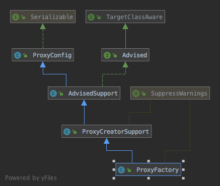

## 如何实现AOP
学习AOP之前需要先理解Spring AOP中涉及到的概念：
- Aspect（切面）：对哪些方法进行拦截，拦截后怎么处理，这些关注点称之为横切关注点，类是对物体特征的抽象，切面就是对横切关注点的抽象
- Advisor：Advice和Pointcut组成的独立的单元，可以认为是v切面的具体实现
- Joint point（连接点）：表示在程序中明确定义的点，典型的包括方法调用，对类成员的访问以及异常处理程序块的执行等等，是个单纯的定义，如所有的方法调用都是Joint point
- Pointcut（切点）：用于描述Joint point，如通过逻辑关系组合，或是通过通配、正则表达式等方式组合一组Joint point，也就是对Advice将要作用的Joint point进行筛选的条件
- Advice（增强）：Advice定义了在通过Pointcut筛选后的Joint point上具体要做的操作，它通过before、after和around来区别是在每个Joint point之前、之后还是代替执行的代码
- Target（目标对象）：织入Advice的目标对象
- Weaving（织入）：将Aspect和其他对象连接起来, 并创建Adviced object的过程

以AspectJ注解风格的AOP配置为例，XML中添加如下配置:
```
<beans xmlns="http://www.springframework.org/schema/beans"
	   xmlns:xsi="http://www.w3.org/2001/XMLSchema-instance"
	   xmlns:aop="http://www.springframework.org/schema/aop"
	   xsi:schemaLocation="http://www.springframework.org/schema/beans
	   http://www.springframework.org/schema/beans/spring-beans.xsd
	   http://www.springframework.org/schema/aop
	   http://www.springframework.org/schema/aop/spring-aop.xsd">
	   
<aop:aspectj-autoproxy/>
<beans>
```
开配置将开启AspectJ注解的自动扫描功能，解析[BeanFactory]中所有代理AspectJ注解的类。当Spring解析XML时，对于aop标签，将会根据自定义命名空间找到指定的[NamespaceHandlerSupport]并进行解析，
而`http://www.springframework.org/schema/aop`命名空间的[NamespaceHandlerSupport]是[AopNamespaceHandler]，[AopNamespaceHandler]注册了多个[BeanDefinitionParser]:
```
registerBeanDefinitionParser("config", new ConfigBeanDefinitionParser());
registerBeanDefinitionParser("aspectj-autoproxy", new AspectJAutoProxyBeanDefinitionParser());
registerBeanDefinitionDecorator("scoped-proxy", new ScopedProxyBeanDefinitionDecorator());

// Only in 2.0 XSD: moved to context namespace as of 2.1
registerBeanDefinitionParser("spring-configured", new SpringConfiguredBeanDefinitionParser());
```
对于上面的`<aop:aspectj-autoproxy/>`将交由[AspectJAutoProxyBeanDefinitionParser]进行解析，[AspectJAutoProxyBeanDefinitionParser]添加了一个class是[AnnotationAwareAspectJAutoProxyCreator]
的[BeanDefinition]到[BeanFactory]，即手动添加[AnnotationAwareAspectJAutoProxyCreator]这个bean，[AnnotationAwareAspectJAutoProxyCreator]类图如下:

[ProxyConfig]类定义了具有创建代理功能的类的通用配置，如`proxyTargetClass`，`exposeProxy`等属性，代码：
```java
// 创建bean代理类的类的父类，维护了拥有创建代理类功能的类的属性，确保代理的creator拥有一致的配置属性
public class ProxyConfig implements Serializable {

	/** use serialVersionUID from Spring 1.2 for interoperability */
	private static final long serialVersionUID = -8409359707199703185L;

    // 为true表示使用cglib实现代理，否则使用JDK动态代理
	private boolean proxyTargetClass = false;

	private boolean optimize = false;

	// 代理对象是否可以强转为Advised类型，Advised类可以获取一些代理的信息
	boolean opaque = false;

	// 如果为true则被代理类就可以在其代码中使用MyTest proxy=(MyTest) AopContext.currentProxy()获取到代理他的代理类，并以此对象代替this指针执行自身的方法
	boolean exposeProxy = false;

	private boolean frozen = false;

	public void setProxyTargetClass(boolean proxyTargetClass) {
		this.proxyTargetClass = proxyTargetClass;
	}

	public boolean isProxyTargetClass() {
		return this.proxyTargetClass;
	}

	public void setOptimize(boolean optimize) {
		this.optimize = optimize;
	}

	public boolean isOptimize() {
		return this.optimize;
	}

	public void setOpaque(boolean opaque) {
		this.opaque = opaque;
	}

	public boolean isOpaque() {
		return this.opaque;
	}

	public void setExposeProxy(boolean exposeProxy) {
		this.exposeProxy = exposeProxy;
	}

	public boolean isExposeProxy() {
		return this.exposeProxy;
	}

	public void setFrozen(boolean frozen) {
		this.frozen = frozen;
	}

	public boolean isFrozen() {
		return this.frozen;
	}

	public void copyFrom(ProxyConfig other) {
		Assert.notNull(other, "Other ProxyConfig object must not be null");
		this.proxyTargetClass = other.proxyTargetClass;
		this.optimize = other.optimize;
		this.exposeProxy = other.exposeProxy;
		this.frozen = other.frozen;
		this.opaque = other.opaque;
	}

	@Override
	public String toString() {
		StringBuilder sb = new StringBuilder();
		sb.append("proxyTargetClass=").append(this.proxyTargetClass).append("; ");
		sb.append("optimize=").append(this.optimize).append("; ");
		sb.append("opaque=").append(this.opaque).append("; ");
		sb.append("exposeProxy=").append(this.exposeProxy).append("; ");
		sb.append("frozen=").append(this.frozen);
		return sb.toString();
	}
}
```

[AopInfrastructureBean]是个标记接口，标记bean是否为AOP配置类
```java
public interface AopInfrastructureBean {
}
```

[ProxyProcessorSupport]类添加`evaluateProxyInterfaces`方法用于为[ProxyFactory]筛选bean的可用于JDK动态代理的接口：
```java
@SuppressWarnings("serial")
public class ProxyProcessorSupport extends ProxyConfig implements Ordered, BeanClassLoaderAware, AopInfrastructureBean {
	private int order = Ordered.LOWEST_PRECEDENCE;

	@Nullable
	private ClassLoader proxyClassLoader = ClassUtils.getDefaultClassLoader();

	private boolean classLoaderConfigured = false;


	public void setOrder(int order) {
		this.order = order;
	}

	@Override
	public int getOrder() {
		return this.order;
	}

	public void setProxyClassLoader(@Nullable ClassLoader classLoader) {
		this.proxyClassLoader = classLoader;
		this.classLoaderConfigured = (classLoader != null);
	}

	@Nullable
	protected ClassLoader getProxyClassLoader() {
		return this.proxyClassLoader;
	}

	@Override
	public void setBeanClassLoader(ClassLoader classLoader) {
		if (!this.classLoaderConfigured) {
			this.proxyClassLoader = classLoader;
		}
	}

	// 过滤bean的接口中不应该被用于JDK动态代理中使用的部分，并将剩下的添加到ProxyFactory，如果没有可用于动态代理的接口，则设置ProxyFactory的
	// proxyTargetClass为true，表示使用cglib
	protected void evaluateProxyInterfaces(Class<?> beanClass, ProxyFactory proxyFactory) {
		Class<?>[] targetInterfaces = ClassUtils.getAllInterfacesForClass(beanClass, getProxyClassLoader());
		boolean hasReasonableProxyInterface = false;
		for (Class<?> ifc : targetInterfaces) {
			// 过滤掉回调接口如InitializingBean、Closeable和没有方法的接口
			if (!isConfigurationCallbackInterface(ifc) && !isInternalLanguageInterface(ifc) &&
					ifc.getMethods().length > 0) {
				hasReasonableProxyInterface = true;
				break;
			}
		}
		// 如果存在可以被代理的接口则把所有的接口添加到ProxyFactory中，否则设置ProxyTargetClass为true表示使用cglib
		if (hasReasonableProxyInterface) {
			// Must allow for introductions; can't just set interfaces to the target's interfaces only.
			for (Class<?> ifc : targetInterfaces) {
				proxyFactory.addInterface(ifc);
			}
		}
		else {
			proxyFactory.setProxyTargetClass(true);
		}
	}

	protected boolean isConfigurationCallbackInterface(Class<?> ifc) {
		return (InitializingBean.class == ifc || DisposableBean.class == ifc || Closeable.class == ifc ||
				AutoCloseable.class == ifc || ObjectUtils.containsElement(ifc.getInterfaces(), Aware.class));
	}

	protected boolean isInternalLanguageInterface(Class<?> ifc) {
		return (ifc.getName().equals("groovy.lang.GroovyObject") ||
				ifc.getName().endsWith(".cglib.proxy.Factory") ||
				ifc.getName().endsWith(".bytebuddy.MockAccess"));
	}

}
```

[AbstractAutoProxyCreator]实现了基本的创建bean代理的逻辑，获取切面的过程由子类实现，代码：
```java
// 实现了基本的创建bean代理的逻辑，获取切面的过程由子类实现，这里在获取到切面后利用BeanPostProcessor拦截bean的创建，调用createProxy方法创建bean的代理并返回
@SuppressWarnings("serial")
public abstract class AbstractAutoProxyCreator extends ProxyProcessorSupport
		implements SmartInstantiationAwareBeanPostProcessor, BeanFactoryAware {

	@Nullable
	protected static final Object[] DO_NOT_PROXY = null;

	protected static final Object[] PROXY_WITHOUT_ADDITIONAL_INTERCEPTORS = new Object[0];


	/** Logger available to subclasses */
	protected final Log logger = LogFactory.getLog(getClass());

	/** Default is global AdvisorAdapterRegistry */
	// advisorAdapterRegistry可将advice封装成advisor，也可从advisor中获取MethodInterceptor，MethodInterceptor能够拦截指定方法的调用
	// AdvisorAdapterRegistry还可注册AdvisorAdapter，AdvisorAdapter用于将特定的advice转换为MethodInterceptor
	private AdvisorAdapterRegistry advisorAdapterRegistry = GlobalAdvisorAdapterRegistry.getInstance();

	private boolean freezeProxy = false;

	/** Default is no common interceptors */
	private String[] interceptorNames = new String[0];

	private boolean applyCommonInterceptorsFirst = true;

	@Nullable
	private TargetSourceCreator[] customTargetSourceCreators;

	@Nullable
	private BeanFactory beanFactory;

	private final Set<String> targetSourcedBeans = Collections.newSetFromMap(new ConcurrentHashMap<>(16));

	private final Set<Object> earlyProxyReferences = Collections.newSetFromMap(new ConcurrentHashMap<>(16));

	private final Map<Object, Class<?>> proxyTypes = new ConcurrentHashMap<>(16);

	// key为bean，value为true表示该bean已创建代理，false表示不需要创建代理
	private final Map<Object, Boolean> advisedBeans = new ConcurrentHashMap<>(256);

	@Override
	public void setFrozen(boolean frozen) {
		this.freezeProxy = frozen;
	}

	@Override
	public boolean isFrozen() {
		return this.freezeProxy;
	}

	public void setAdvisorAdapterRegistry(AdvisorAdapterRegistry advisorAdapterRegistry) {
		this.advisorAdapterRegistry = advisorAdapterRegistry;
	}

	public void setCustomTargetSourceCreators(TargetSourceCreator... targetSourceCreators) {
		this.customTargetSourceCreators = targetSourceCreators;
	}

	public void setInterceptorNames(String... interceptorNames) {
		this.interceptorNames = interceptorNames;
	}

	public void setApplyCommonInterceptorsFirst(boolean applyCommonInterceptorsFirst) {
		this.applyCommonInterceptorsFirst = applyCommonInterceptorsFirst;
	}

	@Override
	public void setBeanFactory(BeanFactory beanFactory) {
		this.beanFactory = beanFactory;
	}

	@Nullable
	protected BeanFactory getBeanFactory() {
		return this.beanFactory;
	}


	@Override
	@Nullable
	// 预测bean最终返回时的类型
	public Class<?> predictBeanType(Class<?> beanClass, String beanName) {
		if (this.proxyTypes.isEmpty()) {
			return null;
		}
		Object cacheKey = getCacheKey(beanClass, beanName);
		return this.proxyTypes.get(cacheKey);
	}

	@Override
	@Nullable
	// 由于将为bean创建代理，所以没必要决定可用的构造函数
	public Constructor<?>[] determineCandidateConstructors(Class<?> beanClass, String beanName) throws BeansException {
		return null;
	}

	@Override
	// bean从BeanFactory最终返回前被调用
	public Object getEarlyBeanReference(Object bean, String beanName) throws BeansException {
		Object cacheKey = getCacheKey(bean.getClass(), beanName);
		if (!this.earlyProxyReferences.contains(cacheKey)) {
			this.earlyProxyReferences.add(cacheKey);
		}
		return wrapIfNecessary(bean, beanName, cacheKey);
	}

	// 在bean被实例化前调用，这里每次获取bean实例化之前检查是否存在该bean的TargetSource，如果存在则用TargetSource取代bean并创建代理返回
	@Override
	public Object postProcessBeforeInstantiation(Class<?> beanClass, String beanName) throws BeansException {
		Object cacheKey = getCacheKey(beanClass, beanName);

		if (!StringUtils.hasLength(beanName) || !this.targetSourcedBeans.contains(beanName)) {
			// 如果已经存在代理则没必要再执行下面的判断了，因为已存在代理表示bean已经被创建，该方法已经执行过了
			if (this.advisedBeans.containsKey(cacheKey)) {
				return null;
			}
			// 如果是基础设施bean或者不应该被代理，则保存到advisedBeans中，并标记成不需要代理
			if (isInfrastructureClass(beanClass) || shouldSkip(beanClass, beanName)) {
				this.advisedBeans.put(cacheKey, Boolean.FALSE);
				return null;
			}
		}

		// Create proxy here if we have a custom TargetSource.
		// Suppresses unnecessary default instantiation of the target bean:
		// The TargetSource will handle target instances in a custom fashion.
		// 如果customTargetSourceCreators不为空并且能通过customTargetSourceCreators创建当前bean的TargetSource则使用
		// TargetSource作为bean并创建代理返回，TargetSource的使用场景如下：
		// https://docs.spring.io/spring/docs/5.1.3.RELEASE/spring-framework-reference/core.html#aop-targetsource
		TargetSource targetSource = getCustomTargetSource(beanClass, beanName);
		if (targetSource != null) {
			if (StringUtils.hasLength(beanName)) {
				this.targetSourcedBeans.add(beanName);
			}
			Object[] specificInterceptors = getAdvicesAndAdvisorsForBean(beanClass, beanName, targetSource);
			Object proxy = createProxy(beanClass, beanName, specificInterceptors, targetSource);
			this.proxyTypes.put(cacheKey, proxy.getClass());
			return proxy;
		}

		return null;
	}

	@Override
	public boolean postProcessAfterInstantiation(Object bean, String beanName) {
		return true;
	}

	@Override
	public PropertyValues postProcessPropertyValues(
			PropertyValues pvs, PropertyDescriptor[] pds, Object bean, String beanName) {

		return pvs;
	}

	@Override
	public Object postProcessBeforeInitialization(Object bean, String beanName) {
		return bean;
	}

	// bean被初始化后即AbstractAutowireCapableBeanFactory的doCreateBean调用完populateBean方法并执行完其他初始化方法后调用
	@Override
	public Object postProcessAfterInitialization(@Nullable Object bean, String beanName) throws BeansException {
		if (bean != null) {
			Object cacheKey = getCacheKey(bean.getClass(), beanName);
			// getEarlyBeanReference方法会将bean的cacheKey添加到earlyProxyReferences中，防止对同一个bean多次调用wrapIfNecessary方法
			if (!this.earlyProxyReferences.contains(cacheKey)) {
				return wrapIfNecessary(bean, beanName, cacheKey);
			}
		}
		return bean;
	}

	// 如果beanName不为空则以beanName为cacheKey
	protected Object getCacheKey(Class<?> beanClass, @Nullable String beanName) {
		if (StringUtils.hasLength(beanName)) {
			return (FactoryBean.class.isAssignableFrom(beanClass) ?
					BeanFactory.FACTORY_BEAN_PREFIX + beanName : beanName);
		}
		else {
			return beanClass;
		}
	}

	// 如果是需要代理的bean则创建代理，否则直接返回bean
	protected Object wrapIfNecessary(Object bean, String beanName, Object cacheKey) {
		// 如果创建过bean的targetSource则直接返回，因为该bean已经被代理过了
		if (StringUtils.hasLength(beanName) && this.targetSourcedBeans.contains(beanName)) {
			return bean;
		}
		// 如果之前已经判断过该bean不需要代理则直接返回
		if (Boolean.FALSE.equals(this.advisedBeans.get(cacheKey))) {
			return bean;
		}
		// 基础设施bean不进行代理
		if (isInfrastructureClass(bean.getClass()) || shouldSkip(bean.getClass(), beanName)) {
			this.advisedBeans.put(cacheKey, Boolean.FALSE);
			return bean;
		}

		// Create proxy if we have advice.
		// 获取bean的切面，供子类实现
		Object[] specificInterceptors = getAdvicesAndAdvisorsForBean(bean.getClass(), beanName, null);
		// 如果发现了适合当前bean的切面则创建代理
		if (specificInterceptors != DO_NOT_PROXY) {
			this.advisedBeans.put(cacheKey, Boolean.TRUE);
			Object proxy = createProxy(
					bean.getClass(), beanName, specificInterceptors, new SingletonTargetSource(bean));
			// 添加代理到缓存
			this.proxyTypes.put(cacheKey, proxy.getClass());
			return proxy;
		}

		this.advisedBeans.put(cacheKey, Boolean.FALSE);
		return bean;
	}

	protected boolean isInfrastructureClass(Class<?> beanClass) {
		boolean retVal = Advice.class.isAssignableFrom(beanClass) ||
				Pointcut.class.isAssignableFrom(beanClass) ||
				Advisor.class.isAssignableFrom(beanClass) ||
				AopInfrastructureBean.class.isAssignableFrom(beanClass);
		if (retVal && logger.isTraceEnabled()) {
			logger.trace("Did not attempt to auto-proxy infrastructure class [" + beanClass.getName() + "]");
		}
		return retVal;
	}

	protected boolean shouldSkip(Class<?> beanClass, String beanName) {
		return false;
	}

	@Nullable
	protected TargetSource getCustomTargetSource(Class<?> beanClass, String beanName) {
		// We can't create fancy target sources for directly registered singletons.
		if (this.customTargetSourceCreators != null &&
				this.beanFactory != null && this.beanFactory.containsBean(beanName)) {
			for (TargetSourceCreator tsc : this.customTargetSourceCreators) {
				TargetSource ts = tsc.getTargetSource(beanClass, beanName);
				if (ts != null) {
					// Found a matching TargetSource.
					if (logger.isDebugEnabled()) {
						logger.debug("TargetSourceCreator [" + tsc +
								" found custom TargetSource for bean with name '" + beanName + "'");
					}
					return ts;
				}
			}
		}

		// No custom TargetSource found.
		return null;
	}

	protected Object createProxy(Class<?> beanClass, @Nullable String beanName,
			@Nullable Object[] specificInterceptors, TargetSource targetSource) {

		if (this.beanFactory instanceof ConfigurableListableBeanFactory) {
			AutoProxyUtils.exposeTargetClass((ConfigurableListableBeanFactory) this.beanFactory, beanName, beanClass);
		}

		// ProxyFactory用于创建代理
		ProxyFactory proxyFactory = new ProxyFactory();
		proxyFactory.copyFrom(this);

		// 如果没有设置proxyTargetClass属性为true的话则判断当前bean的BeanDefinition是否设置了preserveTargetClass属性为true，如果是则仍然使用cglib
		// 如果没有设置则使用evaluateProxyInterfaces方法判断当前bean是否支持JDK动态代理(实现了除了Spring的回调接口外的其他接口)，如果有则将这些接口添加到proxyFactory中，如果没有可代理的接口则使用cglib
		if (!proxyFactory.isProxyTargetClass()) {
			if (shouldProxyTargetClass(beanClass, beanName)) {
				proxyFactory.setProxyTargetClass(true);
			}
			else {
				evaluateProxyInterfaces(beanClass, proxyFactory);
			}
		}

		Advisor[] advisors = buildAdvisors(beanName, specificInterceptors);
		proxyFactory.addAdvisors(advisors);
		proxyFactory.setTargetSource(targetSource);
		// 空方法，供子类实现
		customizeProxyFactory(proxyFactory);

		proxyFactory.setFrozen(this.freezeProxy);
		// 如果advisor已经都是过滤后的则设置preFiltered为true标记一下
		if (advisorsPreFiltered()) {
			proxyFactory.setPreFiltered(true);
		}

		// 通过proxyFactory创建代理返回
		return proxyFactory.getProxy(getProxyClassLoader());
	}

	protected boolean shouldProxyTargetClass(Class<?> beanClass, @Nullable String beanName) {
		return (this.beanFactory instanceof ConfigurableListableBeanFactory &&
				AutoProxyUtils.shouldProxyTargetClass((ConfigurableListableBeanFactory) this.beanFactory, beanName));
	}

	protected boolean advisorsPreFiltered() {
		return false;
	}

	protected Advisor[] buildAdvisors(@Nullable String beanName, @Nullable Object[] specificInterceptors) {
		// Handle prototypes correctly...
		// 获取interceptorNames对应的多个beanName并从beanFactory获取这些beanName对应的bean，转换为Advisor，默认为空数组，相当于
		// 可以通过interceptorNames属性为所有的将被代理的bean添加切面
		Advisor[] commonInterceptors = resolveInterceptorNames();

		List<Object> allInterceptors = new ArrayList<>();
		if (specificInterceptors != null) {
			allInterceptors.addAll(Arrays.asList(specificInterceptors));
			if (commonInterceptors.length > 0) {
				// 如果设置了applyCommonInterceptorsFirst为true则表示通用的Advisor应该优先调用
				if (this.applyCommonInterceptorsFirst) {
					allInterceptors.addAll(0, Arrays.asList(commonInterceptors));
				}
				else {
					allInterceptors.addAll(Arrays.asList(commonInterceptors));
				}
			}
		}
		if (logger.isDebugEnabled()) {
			int nrOfCommonInterceptors = commonInterceptors.length;
			int nrOfSpecificInterceptors = (specificInterceptors != null ? specificInterceptors.length : 0);
			logger.debug("Creating implicit proxy for bean '" + beanName + "' with " + nrOfCommonInterceptors +
					" common interceptors and " + nrOfSpecificInterceptors + " specific interceptors");
		}

		Advisor[] advisors = new Advisor[allInterceptors.size()];
		for (int i = 0; i < allInterceptors.size(); i++) {
			// 遍历allInterceptors，如果是Advisor类型的直接返回，如果是Advice则用DefaultPointcutAdvisor封装成Advisor，DefaultPointcutAdvisor中的
			// Pointcut对于所有的连接点都判定为需要执行advice
			advisors[i] = this.advisorAdapterRegistry.wrap(allInterceptors.get(i));
		}
		return advisors;
	}

	private Advisor[] resolveInterceptorNames() {
		BeanFactory bf = this.beanFactory;
		ConfigurableBeanFactory cbf = (bf instanceof ConfigurableBeanFactory ? (ConfigurableBeanFactory) bf : null);
		List<Advisor> advisors = new ArrayList<>();
		for (String beanName : this.interceptorNames) {
			if (cbf == null || !cbf.isCurrentlyInCreation(beanName)) {
				Assert.state(bf != null, "BeanFactory required for resolving interceptor names");
				Object next = bf.getBean(beanName);
				advisors.add(this.advisorAdapterRegistry.wrap(next));
			}
		}
		return advisors.toArray(new Advisor[0]);
	}

	protected void customizeProxyFactory(ProxyFactory proxyFactory) {
	}

	@Nullable
	protected abstract Object[] getAdvicesAndAdvisorsForBean(Class<?> beanClass, String beanName,
			@Nullable TargetSource customTargetSource) throws BeansException;

}
```

[AbstractAutoProxyCreator]实现了[SmartInstantiationAwareBeanPostProcessor]接口，[SmartInstantiationAwareBeanPostProcessor]接口又继承自[InstantiationAwareBeanPostProcessor]接口，从笔记[从容器获取Bean](容器的实现/从容器获取Bean.md)可知，在创建`bean`时，[AbstractAutowireCapableBeanFactory]的`createBean`方法会首先遍历[BeanFactory]中的[InstantiationAwareBeanPostProcessor]的`postProcessBeforeInstantiation`方法，如果该方法返回了非空对象则[BeanFactory]将会以该对象作为`bean`返回给客户端，而[AbstractAutoProxyCreator]类实现了`postProcessBeforeInstantiation`方法，利用[AbstractAutoProxyCreator]的`customTargetSourceCreators`属性尝试创建`bean`的[TargetSource]，如果创建成功则为该[TargetSource]创建代理并作为`bean`返回，
`customTargetSourceCreators`属性配置可以通过配置`bean`指定，如:
```xml
<bean class="org.springframework.aop.aspectj.annotation.AnnotationAwareAspectJAutoProxyCreator">
	<property name="customTargetSourceCreators">
		<bean class="org.springframework.aop.framework.autoproxy.target.LazyInitTargetSourceCreator"/>
	</property>
</bean>
```
不过[TargetSource]不是实现AOP的关键，[TargetSource]的使用场景也不多，可以看[Spring官方文档](https://docs.spring.io/spring/docs/5.1.3.RELEASE/spring-framework-reference/core.html#aop-targetsource)了解[TargetSource]，如果没有创建出[TargetSource]，[AbstractAutowireCapableBeanFactory]将会继续进行普通`bean`的创建过程，并在调用完`populateBean`方法设置了`bean`的属性及调用各种初始化方法后，获取[BeanFactory]中的[BeanPostProcessor]并执行`postProcessAfterInitialization`方法，[AbstractAutoProxyCreator]也实现了该方法，代码如下:
```java
public Object postProcessAfterInitialization(@Nullable Object bean, String beanName) throws BeansException {
	if (bean != null) {
	    //如果beanName不为空则以beanName为cacheKey，否则以className为cacheKey
		Object cacheKey = getCacheKey(bean.getClass(), beanName);
		if (!this.earlyProxyReferences.contains(cacheKey)) {
			// 创建代理
			return wrapIfNecessary(bean, beanName, cacheKey);
		}
	}
	return bean;
}
```

`wrapIfNecessary`方法代码如下:
```java
// 如果是需要代理的bean则创建代理，否则直接返回bean
protected Object wrapIfNecessary(Object bean, String beanName, Object cacheKey) {
	// 如果创建过bean的targetSource则直接返回，因为该bean已经被代理过了
	if (StringUtils.hasLength(beanName) && this.targetSourcedBeans.contains(beanName)) {
		return bean;
	}
	// 如果之前已经判断过该bean不需要代理则直接返回
	if (Boolean.FALSE.equals(this.advisedBeans.get(cacheKey))) {
		return bean;
	}
	// 基础设施bean不进行代理
	if (isInfrastructureClass(bean.getClass()) || shouldSkip(bean.getClass(), beanName)) {
		this.advisedBeans.put(cacheKey, Boolean.FALSE);
		return bean;
	}

	// Create proxy if we have advice.
	// 获取bean的切面，供子类实现
	Object[] specificInterceptors = getAdvicesAndAdvisorsForBean(bean.getClass(), beanName, null);
	// 如果发现了适合当前bean的切面则创建代理
	if (specificInterceptors != DO_NOT_PROXY) {
		this.advisedBeans.put(cacheKey, Boolean.TRUE);
		Object proxy = createProxy(
				bean.getClass(), beanName, specificInterceptors, new SingletonTargetSource(bean));
		// 添加代理到缓存
		this.proxyTypes.put(cacheKey, proxy.getClass());
		return proxy;
	}

	this.advisedBeans.put(cacheKey, Boolean.FALSE);
	return bean;
}
```

`wrapIfNecessary()`方法调用了`getAdvicesAndAdvisorsForBean()`方法获取当前bean的切面，[AbstractAutoProxyCreator]中该方法为抽象方法，所以[AbstractAutoProxyCreator]定义了Spring AOP获取代理的基本过程，继续看[AnnotationAwareAspectJAutoProxyCreator]的类图，[AbstractAdvisorAutoProxyCreator]实现了`getAdvicesAndAdvisorsForBean()`方法，实现了创建代理过程中获取[Advisor]的过程，代码：
```java
@SuppressWarnings("serial")
public abstract class AbstractAdvisorAutoProxyCreator extends AbstractAutoProxyCreator {

	@Nullable
	private BeanFactoryAdvisorRetrievalHelper advisorRetrievalHelper;


	@Override
	public void setBeanFactory(BeanFactory beanFactory) {
		super.setBeanFactory(beanFactory);
		if (!(beanFactory instanceof ConfigurableListableBeanFactory)) {
			throw new IllegalArgumentException(
					"AdvisorAutoProxyCreator requires a ConfigurableListableBeanFactory: " + beanFactory);
		}
		initBeanFactory((ConfigurableListableBeanFactory) beanFactory);
	}

	protected void initBeanFactory(ConfigurableListableBeanFactory beanFactory) {
		this.advisorRetrievalHelper = new BeanFactoryAdvisorRetrievalHelperAdapter(beanFactory);
	}


	@Override
	@Nullable
	protected Object[] getAdvicesAndAdvisorsForBean(
			Class<?> beanClass, String beanName, @Nullable TargetSource targetSource) {

		// 获取当前bean匹配的切面
		List<Advisor> advisors = findEligibleAdvisors(beanClass, beanName);
		if (advisors.isEmpty()) {
			return DO_NOT_PROXY;
		}
		return advisors.toArray();
	}

	// 获取合格的切面，即能作用在指定类的切面
	protected List<Advisor> findEligibleAdvisors(Class<?> beanClass, String beanName) {
		// 获取所有Advisor类型的bean，并以Advisor类型返回
		List<Advisor> candidateAdvisors = findCandidateAdvisors();
		// 遍历获取到的切面，过滤掉不适用于当前bean的Advisor
		List<Advisor> eligibleAdvisors = findAdvisorsThatCanApply(candidateAdvisors, beanClass, beanName);
		extendAdvisors(eligibleAdvisors);
		if (!eligibleAdvisors.isEmpty()) {
			eligibleAdvisors = sortAdvisors(eligibleAdvisors);
		}
		return eligibleAdvisors;
	}

	protected List<Advisor> findCandidateAdvisors() {
		Assert.state(this.advisorRetrievalHelper != null, "No BeanFactoryAdvisorRetrievalHelper available");
		// 返回beanFactory中所有实现了Advisor接口的bean
		return this.advisorRetrievalHelper.findAdvisorBeans();
	}

	protected List<Advisor> findAdvisorsThatCanApply(
			List<Advisor> candidateAdvisors, Class<?> beanClass, String beanName) {

		// 保存当前正在创建代理的beanName
		ProxyCreationContext.setCurrentProxiedBeanName(beanName);
		try {
			// 根据Advisor的类型调用不同的方法判断当前bean的类型是否满足Advisor，返回匹配当前bean类型的Advisor
			return AopUtils.findAdvisorsThatCanApply(candidateAdvisors, beanClass);
		}
		finally {
			ProxyCreationContext.setCurrentProxiedBeanName(null);
		}
	}

	protected boolean isEligibleAdvisorBean(String beanName) {
		return true;
	}

	protected List<Advisor> sortAdvisors(List<Advisor> advisors) {
		AnnotationAwareOrderComparator.sort(advisors);
		return advisors;
	}

	protected void extendAdvisors(List<Advisor> candidateAdvisors) {
	}

	@Override
	protected boolean advisorsPreFiltered() {
		return true;
	}

	private class BeanFactoryAdvisorRetrievalHelperAdapter extends BeanFactoryAdvisorRetrievalHelper {

		public BeanFactoryAdvisorRetrievalHelperAdapter(ConfigurableListableBeanFactory beanFactory) {
			super(beanFactory);
		}

		@Override
		protected boolean isEligibleBean(String beanName) {
			return AbstractAdvisorAutoProxyCreator.this.isEligibleAdvisorBean(beanName);
		}
	}

}
```

[AspectJAwareAdvisorAutoProxyCreator]重写了一些方法，代码：
```java
@SuppressWarnings("serial")
public class AspectJAwareAdvisorAutoProxyCreator extends AbstractAdvisorAutoProxyCreator {

	private static final Comparator<Advisor> DEFAULT_PRECEDENCE_COMPARATOR = new AspectJPrecedenceComparator();

	@Override
	@SuppressWarnings("unchecked")
	protected List<Advisor> sortAdvisors(List<Advisor> advisors) {
		List<PartiallyComparableAdvisorHolder> partiallyComparableAdvisors = new ArrayList<>(advisors.size());
		for (Advisor element : advisors) {
			partiallyComparableAdvisors.add(
					new PartiallyComparableAdvisorHolder(element, DEFAULT_PRECEDENCE_COMPARATOR));
		}
		// 用DEFAULT_PRECEDENCE_COMPARATOR对partiallyComparableAdvisors进行排序，也就是对传入的advisors进行排序
		List<PartiallyComparableAdvisorHolder> sorted = PartialOrder.sort(partiallyComparableAdvisors);
		// 如果partiallyComparableAdvisors的大小存在循环，即A>B, B>C, C>A，则PartialOrder.sort返回null，此时交给父类排序
		if (sorted != null) {
			List<Advisor> result = new ArrayList<>(advisors.size());
			for (PartiallyComparableAdvisorHolder pcAdvisor : sorted) {
				result.add(pcAdvisor.getAdvisor());
			}
			return result;
		}
		else {
			return super.sortAdvisors(advisors);
		}
	}

	@Override
	protected void extendAdvisors(List<Advisor> candidateAdvisors) {
		// 如果candidateAdvisors包含AspectJ的增强则添加ExposeInvocationInterceptor到增强链的首位，目的是暴露执行方法调用时的MethodInvocation便于全局访问
		AspectJProxyUtils.makeAdvisorChainAspectJCapableIfNecessary(candidateAdvisors);
	}

	@Override
	protected boolean shouldSkip(Class<?> beanClass, String beanName) {
		// TODO: Consider optimization by caching the list of the aspect names
		List<Advisor> candidateAdvisors = findCandidateAdvisors();
		for (Advisor advisor : candidateAdvisors) {
			if (advisor instanceof AspectJPointcutAdvisor &&
					((AspectJPointcutAdvisor) advisor).getAspectName().equals(beanName)) {
				return true;
			}
		}
		return super.shouldSkip(beanClass, beanName);
	}

	private static class PartiallyComparableAdvisorHolder implements PartialComparable {

		private final Advisor advisor;

		private final Comparator<Advisor> comparator;

		public PartiallyComparableAdvisorHolder(Advisor advisor, Comparator<Advisor> comparator) {
			this.advisor = advisor;
			this.comparator = comparator;
		}

		@Override
		public int compareTo(Object obj) {
			Advisor otherAdvisor = ((PartiallyComparableAdvisorHolder) obj).advisor;
			return this.comparator.compare(this.advisor, otherAdvisor);
		}

		@Override
		public int fallbackCompareTo(Object obj) {
			return 0;
		}

		public Advisor getAdvisor() {
			return this.advisor;
		}

		@Override
		public String toString() {
			StringBuilder sb = new StringBuilder();
			Advice advice = this.advisor.getAdvice();
			sb.append(ClassUtils.getShortName(advice.getClass()));
			sb.append(": ");
			if (this.advisor instanceof Ordered) {
				sb.append("order ").append(((Ordered) this.advisor).getOrder()).append(", ");
			}
			if (advice instanceof AbstractAspectJAdvice) {
				AbstractAspectJAdvice ajAdvice = (AbstractAspectJAdvice) advice;
				sb.append(ajAdvice.getAspectName());
				sb.append(", declaration order ");
				sb.append(ajAdvice.getDeclarationOrder());
			}
			return sb.toString();
		}
	}

}
```

最后是[AnnotationAwareAspectJAutoProxyCreator]，重新了`findCandidateAdvisors()`方法，在其父类的基础上添加了从注解解析而来的[Advisor]，代码：
```java
@SuppressWarnings("serial")
public class AnnotationAwareAspectJAutoProxyCreator extends AspectJAwareAdvisorAutoProxyCreator {

	@Nullable
	private List<Pattern> includePatterns;

	@Nullable
	private AspectJAdvisorFactory aspectJAdvisorFactory;

	@Nullable
	private BeanFactoryAspectJAdvisorsBuilder aspectJAdvisorsBuilder;

	public void setIncludePatterns(List<String> patterns) {
		this.includePatterns = new ArrayList<>(patterns.size());
		for (String patternText : patterns) {
			this.includePatterns.add(Pattern.compile(patternText));
		}
	}

	public void setAspectJAdvisorFactory(AspectJAdvisorFactory aspectJAdvisorFactory) {
		Assert.notNull(aspectJAdvisorFactory, "AspectJAdvisorFactory must not be null");
		this.aspectJAdvisorFactory = aspectJAdvisorFactory;
	}

	@Override
	protected void initBeanFactory(ConfigurableListableBeanFactory beanFactory) {
		super.initBeanFactory(beanFactory);
		if (this.aspectJAdvisorFactory == null) {
			// aspectJAdvisorFactory能够获取切面、切点和增强
			this.aspectJAdvisorFactory = new ReflectiveAspectJAdvisorFactory(beanFactory);
		}
		this.aspectJAdvisorsBuilder =
				new BeanFactoryAspectJAdvisorsBuilderAdapter(beanFactory, this.aspectJAdvisorFactory);
	}


	@Override
	protected List<Advisor> findCandidateAdvisors() {
		// Add all the Spring advisors found according to superclass rules.
		// 获取父类的所有Advisor
		List<Advisor> advisors = super.findCandidateAdvisors();
		// Build Advisors for all AspectJ aspects in the bean factory.
		// 解析所有有AspectJ注解的bean获取Advisor
		if (this.aspectJAdvisorsBuilder != null) {
			advisors.addAll(this.aspectJAdvisorsBuilder.buildAspectJAdvisors());
		}
		return advisors;
	}

	@Override
	protected boolean isInfrastructureClass(Class<?> beanClass) {
		return (super.isInfrastructureClass(beanClass) ||
				(this.aspectJAdvisorFactory != null && this.aspectJAdvisorFactory.isAspect(beanClass)));
	}

	protected boolean isEligibleAspectBean(String beanName) {
		if (this.includePatterns == null) {
			return true;
		}
		else {
			for (Pattern pattern : this.includePatterns) {
				if (pattern.matcher(beanName).matches()) {
					return true;
				}
			}
			return false;
		}
	}

	private class BeanFactoryAspectJAdvisorsBuilderAdapter extends BeanFactoryAspectJAdvisorsBuilder {

		public BeanFactoryAspectJAdvisorsBuilderAdapter(
				ListableBeanFactory beanFactory, AspectJAdvisorFactory advisorFactory) {

			super(beanFactory, advisorFactory);
		}

		@Override
		protected boolean isEligibleBean(String beanName) {
			return AnnotationAwareAspectJAutoProxyCreator.this.isEligibleAspectBean(beanName);
		}
	}

}
```

[AnnotationAwareAspectJAutoProxyCreator]用了两个辅助类，分别是[ReflectiveAspectJAdvisorFactory]和[BeanFactoryAspectJAdvisorsBuilderAdapter]，[BeanFactoryAspectJAdvisorsBuilderAdapter]实现了`buildAspectJAdvisors()`返回根据AspectJ注解解析而来的[Advisor]，代码：
```java
// 获取BeanFactory中AspectJ注解的bean对应的切面
public class BeanFactoryAspectJAdvisorsBuilder {

	private final ListableBeanFactory beanFactory;

	private final AspectJAdvisorFactory advisorFactory;

	@Nullable
	private volatile List<String> aspectBeanNames;

	private final Map<String, List<Advisor>> advisorsCache = new ConcurrentHashMap<>();

	private final Map<String, MetadataAwareAspectInstanceFactory> aspectFactoryCache = new ConcurrentHashMap<>();

	public BeanFactoryAspectJAdvisorsBuilder(ListableBeanFactory beanFactory) {
		this(beanFactory, new ReflectiveAspectJAdvisorFactory(beanFactory));
	}

	public BeanFactoryAspectJAdvisorsBuilder(ListableBeanFactory beanFactory, AspectJAdvisorFactory advisorFactory) {
		Assert.notNull(beanFactory, "ListableBeanFactory must not be null");
		Assert.notNull(advisorFactory, "AspectJAdvisorFactory must not be null");
		this.beanFactory = beanFactory;
		this.advisorFactory = advisorFactory;
	}

	public List<Advisor> buildAspectJAdvisors() {
		List<String> aspectNames = this.aspectBeanNames;

		if (aspectNames == null) {
			synchronized (this) {
				aspectNames = this.aspectBeanNames;
				if (aspectNames == null) {
					List<Advisor> advisors = new LinkedList<>();
					aspectNames = new LinkedList<>();
					String[] beanNames = BeanFactoryUtils.beanNamesForTypeIncludingAncestors(
							this.beanFactory, Object.class, true, false);
					// 遍历beanFactory中的所有bean
					for (String beanName : beanNames) {
						if (!isEligibleBean(beanName)) {
							continue;
						}
						// We must be careful not to instantiate beans eagerly as in this case they
						// would be cached by the Spring container but would not have been weaved.
						Class<?> beanType = this.beanFactory.getType(beanName);
						if (beanType == null) {
							continue;
						}
						// 如果存在Aspect注解
						if (this.advisorFactory.isAspect(beanType)) {
							aspectNames.add(beanName);
							// AspectMetadata在构造函数中解析了beanType的AjType，对于没有value的AspectJ注解的类，PerClauseKind是SINGLETON
							AspectMetadata amd = new AspectMetadata(beanType, beanName);
							// PerClause用于设置实例化切面使得策略，从Aspect注解的value而来，默认情况下为singleton
							if (amd.getAjType().getPerClause().getKind() == PerClauseKind.SINGLETON) {
								// MetadataAwareAspectInstanceFactory接口只有两个方法，一个返回刚刚创建的AspectMetadata，一个返回
								// 锁对象，该锁对象从beanFactory获取
								MetadataAwareAspectInstanceFactory factory =
										new BeanFactoryAspectInstanceFactory(this.beanFactory, beanName);
								// advisorFactory是AnnotationAwareAspectJAutoProxyCreator设置beanFactory是创建的，默认为ReflectiveAspectJAdvisorFactory，
								// 这里用advisorFactory获取指定了Aspect注解的bean的切面
								List<Advisor> classAdvisors = this.advisorFactory.getAdvisors(factory);
								if (this.beanFactory.isSingleton(beanName)) {
									// 添加到缓存中下次不用再获取
									this.advisorsCache.put(beanName, classAdvisors);
								}
								else {
									// 非单例bean不保存切面缓存，只保存工厂，下次获取时使用工厂重新获取
									this.aspectFactoryCache.put(beanName, factory);
								}
								advisors.addAll(classAdvisors);
							}
							else {
								// Per target or per this.
								if (this.beanFactory.isSingleton(beanName)) {
									throw new IllegalArgumentException("Bean with name '" + beanName +
											"' is a singleton, but aspect instantiation model is not singleton");
								}
								MetadataAwareAspectInstanceFactory factory =
										new PrototypeAspectInstanceFactory(this.beanFactory, beanName);
								this.aspectFactoryCache.put(beanName, factory);
								advisors.addAll(this.advisorFactory.getAdvisors(factory));
							}
						}
					}
					this.aspectBeanNames = aspectNames;
					return advisors;
				}
			}
		}

		if (aspectNames.isEmpty()) {
			return Collections.emptyList();
		}
		List<Advisor> advisors = new LinkedList<>();
		// 从缓存中获取所有Advisor
		for (String aspectName : aspectNames) {
			List<Advisor> cachedAdvisors = this.advisorsCache.get(aspectName);
			if (cachedAdvisors != null) {
				advisors.addAll(cachedAdvisors);
			}
			else {
				MetadataAwareAspectInstanceFactory factory = this.aspectFactoryCache.get(aspectName);
				advisors.addAll(this.advisorFactory.getAdvisors(factory));
			}
		}
		return advisors;
	}

	protected boolean isEligibleBean(String beanName) {
		return true;
	}

}
```

[BeanFactoryAspectJAdvisorsBuilderAdapter]中用到的[AspectJAdvisorFactory]就是[AnnotationAwareAspectJAutoProxyCreator]中的[ReflectiveAspectJAdvisorFactory]，[ReflectiveAspectJAdvisorFactory]代码：
```java
@SuppressWarnings("serial")
public class ReflectiveAspectJAdvisorFactory extends AbstractAspectJAdvisorFactory implements Serializable {

	private static final Comparator<Method> METHOD_COMPARATOR;

	static {
		Comparator<Method> adviceKindComparator = new ConvertingComparator<>(
				//按照下面声明的注解类的顺序为大小进行排序
				new InstanceComparator<>(
						Around.class, Before.class, After.class, AfterReturning.class, AfterThrowing.class),
				(Converter<Method, Annotation>) method -> {
					AspectJAnnotation<?> annotation =
							AbstractAspectJAdvisorFactory.findAspectJAnnotationOnMethod(method);
					return (annotation != null ? annotation.getAnnotation() : null);
				});
		// 按名称排序
		Comparator<Method> methodNameComparator = new ConvertingComparator<>(Method::getName);
		// 先按注解顺序排序再按名称排序
		METHOD_COMPARATOR = adviceKindComparator.thenComparing(methodNameComparator);
	}


	@Nullable
	private final BeanFactory beanFactory;

	public ReflectiveAspectJAdvisorFactory() {
		this(null);
	}

	public ReflectiveAspectJAdvisorFactory(@Nullable BeanFactory beanFactory) {
		this.beanFactory = beanFactory;
	}


	@Override
	public List<Advisor> getAdvisors(MetadataAwareAspectInstanceFactory aspectInstanceFactory) {
		// 返回bean的类型
		Class<?> aspectClass = aspectInstanceFactory.getAspectMetadata().getAspectClass();
		// 返回beanName
		String aspectName = aspectInstanceFactory.getAspectMetadata().getAspectName();
		validate(aspectClass);

		// We need to wrap the MetadataAwareAspectInstanceFactory with a decorator
		// so that it will only instantiate once.
		// LazySingletonAspectInstanceFactoryDecorator代理了对象的获取，缓存获取到的对象以保证对象只被初始化一次
		MetadataAwareAspectInstanceFactory lazySingletonAspectInstanceFactory =
				new LazySingletonAspectInstanceFactoryDecorator(aspectInstanceFactory);

		List<Advisor> advisors = new LinkedList<>();
		/* getAdvisorMethods获取除了含有Pointcut注解外的其他方法，排序后返回，之所以排除Pointcut注解是因为Pointcut注解的作用是定义Pointcut的表达式，如：

		@Pointcut("execution(* *.sleep())")
    	public void sleepPoint(){}

    	其他方法只需要在注解中指向sleepPoint方法即可，如
    	@Before("sleepPoint()")
    	public void beforeSleep(){
    	    System.out.println("test");
    	}
    	即可定义一个完整的Pointcut
		 */
		for (Method method : getAdvisorMethods(aspectClass)) {
			// 创建当前方法的切面
			Advisor advisor = getAdvisor(method, lazySingletonAspectInstanceFactory, advisors.size(), aspectName);
			if (advisor != null) {
				advisors.add(advisor);
			}
		}

		// If it's a per target aspect, emit the dummy instantiating aspect.
		if (!advisors.isEmpty() && lazySingletonAspectInstanceFactory.getAspectMetadata().isLazilyInstantiated()) {
			Advisor instantiationAdvisor = new SyntheticInstantiationAdvisor(lazySingletonAspectInstanceFactory);
			advisors.add(0, instantiationAdvisor);
		}

		// Find introduction fields.
		/*
		获取属性上的DeclareParent注解，DeclareParent注解的作用是为某些类新增实现的接口，如
		@DeclareParents(value = "com.lzj.spring.annotation.Person+", defaultImpl = FemaleAnimal.class)
    	public Animal animal;

    	上面的注解将会为所有Person类的子类添加一个Animal接口并指定实现为FemaleAnimal
		 */
		for (Field field : aspectClass.getDeclaredFields()) {
			Advisor advisor = getDeclareParentsAdvisor(field);
			if (advisor != null) {
				advisors.add(advisor);
			}
		}

		return advisors;
	}

	private List<Method> getAdvisorMethods(Class<?> aspectClass) {
		final List<Method> methods = new LinkedList<>();
		ReflectionUtils.doWithMethods(aspectClass, method -> {
			// Exclude pointcuts
			if (AnnotationUtils.getAnnotation(method, Pointcut.class) == null) {
				methods.add(method);
			}
		});
		methods.sort(METHOD_COMPARATOR);
		return methods;
	}

	@Nullable
	private Advisor getDeclareParentsAdvisor(Field introductionField) {
		DeclareParents declareParents = introductionField.getAnnotation(DeclareParents.class);
		if (declareParents == null) {
			// Not an introduction field
			return null;
		}

		if (DeclareParents.class == declareParents.defaultImpl()) {
			throw new IllegalStateException("'defaultImpl' attribute must be set on DeclareParents");
		}

		return new DeclareParentsAdvisor(
				introductionField.getType(), declareParents.value(), declareParents.defaultImpl());
	}


	@Override
	@Nullable
	public Advisor getAdvisor(Method candidateAdviceMethod, MetadataAwareAspectInstanceFactory aspectInstanceFactory,
							  int declarationOrderInAspect, String aspectName) {

		validate(aspectInstanceFactory.getAspectMetadata().getAspectClass());

		// 创建AspectJExpressionPointcut并设置传入的candidateAdviceMethod方法上的AspectJ注解的value到AspectJExpressionPointcut，如
		// @Before("test()")的test()
		AspectJExpressionPointcut expressionPointcut = getPointcut(
				candidateAdviceMethod, aspectInstanceFactory.getAspectMetadata().getAspectClass());
		if (expressionPointcut == null) {
			return null;
		}

		// InstantiationModelAwarePointcutAdvisorImpl会在构造函数中调用当前类的getAdvice方法初始化Advice
		return new InstantiationModelAwarePointcutAdvisorImpl(expressionPointcut, candidateAdviceMethod,
				this, aspectInstanceFactory, declarationOrderInAspect, aspectName);
	}

	@Nullable
	private AspectJExpressionPointcut getPointcut(Method candidateAdviceMethod, Class<?> candidateAspectClass) {
		AspectJAnnotation<?> aspectJAnnotation =
				AbstractAspectJAdvisorFactory.findAspectJAnnotationOnMethod(candidateAdviceMethod);
		if (aspectJAnnotation == null) {
			return null;
		}

		AspectJExpressionPointcut ajexp =
				new AspectJExpressionPointcut(candidateAspectClass, new String[0], new Class<?>[0]);
		ajexp.setExpression(aspectJAnnotation.getPointcutExpression());
		if (this.beanFactory != null) {
			ajexp.setBeanFactory(this.beanFactory);
		}
		return ajexp;
	}


	@Override
	@Nullable
	public Advice getAdvice(Method candidateAdviceMethod, AspectJExpressionPointcut expressionPointcut,
							MetadataAwareAspectInstanceFactory aspectInstanceFactory, int declarationOrder, String aspectName) {

		Class<?> candidateAspectClass = aspectInstanceFactory.getAspectMetadata().getAspectClass();
		validate(candidateAspectClass);

		AspectJAnnotation<?> aspectJAnnotation =
				AbstractAspectJAdvisorFactory.findAspectJAnnotationOnMethod(candidateAdviceMethod);
		if (aspectJAnnotation == null) {
			return null;
		}

		// If we get here, we know we have an AspectJ method.
		// Check that it's an AspectJ-annotated class
		if (!isAspect(candidateAspectClass)) {
			throw new AopConfigException("Advice must be declared inside an aspect type: " +
					"Offending method '" + candidateAdviceMethod + "' in class [" +
					candidateAspectClass.getName() + "]");
		}

		if (logger.isDebugEnabled()) {
			logger.debug("Found AspectJ method: " + candidateAdviceMethod);
		}

		AbstractAspectJAdvice springAdvice;

		switch (aspectJAnnotation.getAnnotationType()) {
			case AtBefore:
				springAdvice = new AspectJMethodBeforeAdvice(
						candidateAdviceMethod, expressionPointcut, aspectInstanceFactory);
				break;
			case AtAfter:
				springAdvice = new AspectJAfterAdvice(
						candidateAdviceMethod, expressionPointcut, aspectInstanceFactory);
				break;
			case AtAfterReturning:
				springAdvice = new AspectJAfterReturningAdvice(
						candidateAdviceMethod, expressionPointcut, aspectInstanceFactory);
				AfterReturning afterReturningAnnotation = (AfterReturning) aspectJAnnotation.getAnnotation();
				/*
				如果定义了AfterReturning注解的returning值，则表示AspectJAfterReturningAdvice在执行时需要获取被代理方法执行完成后的返回值
				returning值表示的是被代理方法执行完成后的返回值的名称，advice可以在方法参数中声明一个名字为该值的参数，以此来访问被代理方法执行完成后的返回值，如：

				@AfterReturning(pointcut="execution(* *.Student.*(..))", returning="retVal")
						public void afterReturningAdvice(JoinPoint jp, Object retVal){
								System.out.println("[afterReturningAdvice] Method Signature: "  + jp.getSignature());
								System.out.println("[afterReturningAdvice] Returning: " + retVal.toString() );
						}

				下面将returning保存到AspectJAfterReturningAdvice中
				*/
				if (StringUtils.hasText(afterReturningAnnotation.returning())) {
					springAdvice.setReturningName(afterReturningAnnotation.returning());
				}
				break;
			case AtAfterThrowing:
				springAdvice = new AspectJAfterThrowingAdvice(
						candidateAdviceMethod, expressionPointcut, aspectInstanceFactory);
				AfterThrowing afterThrowingAnnotation = (AfterThrowing) aspectJAnnotation.getAnnotation();
				// 同上
				if (StringUtils.hasText(afterThrowingAnnotation.throwing())) {
					springAdvice.setThrowingName(afterThrowingAnnotation.throwing());
				}
				break;
			case AtAround:
				springAdvice = new AspectJAroundAdvice(
						candidateAdviceMethod, expressionPointcut, aspectInstanceFactory);
				break;
			case AtPointcut:
				if (logger.isDebugEnabled()) {
					logger.debug("Processing pointcut '" + candidateAdviceMethod.getName() + "'");
				}
				return null;
			default:
				throw new UnsupportedOperationException(
						"Unsupported advice type on method: " + candidateAdviceMethod);
		}

		// Now to configure the advice...
		springAdvice.setAspectName(aspectName);
		springAdvice.setDeclarationOrder(declarationOrder);
		String[] argNames = this.parameterNameDiscoverer.getParameterNames(candidateAdviceMethod);
		if (argNames != null) {
			springAdvice.setArgumentNamesFromStringArray(argNames);
		}
		springAdvice.calculateArgumentBindings();

		return springAdvice;
	}

	@SuppressWarnings("serial")
	protected static class SyntheticInstantiationAdvisor extends DefaultPointcutAdvisor {

		public SyntheticInstantiationAdvisor(final MetadataAwareAspectInstanceFactory aif) {
			super(aif.getAspectMetadata().getPerClausePointcut(), (MethodBeforeAdvice)
					(method, args, target) -> aif.getAspectInstance());
		}
	}

}
```

以上是获取代理的过程，获取代理后代理是如何运行的，则需要回到创建代理的地方，回到[AbstractAutoProxyCreator]的`createProxy()`方法，代码：
```java
protected Object createProxy(Class<?> beanClass, @Nullable String beanName,
		@Nullable Object[] specificInterceptors, TargetSource targetSource) {

	if (this.beanFactory instanceof ConfigurableListableBeanFactory) {
		AutoProxyUtils.exposeTargetClass((ConfigurableListableBeanFactory) this.beanFactory, beanName, beanClass);
	}

	// ProxyFactory用于创建代理
	ProxyFactory proxyFactory = new ProxyFactory();
	proxyFactory.copyFrom(this);

	// 如果没有设置proxyTargetClass属性为true的话则判断当前bean的BeanDefinition是否设置了preserveTargetClass属性为true，如果是则仍然使用cglib
	// 如果没有设置则使用evaluateProxyInterfaces方法判断当前bean是否支持JDK动态代理(实现了除了Spring的回调接口外的其他接口)，如果有则将这些接口添加到proxyFactory中，如果没有可代理的接口则使用cglib
	if (!proxyFactory.isProxyTargetClass()) {
		if (shouldProxyTargetClass(beanClass, beanName)) {
			proxyFactory.setProxyTargetClass(true);
		}
		else {
			evaluateProxyInterfaces(beanClass, proxyFactory);
		}
	}

	Advisor[] advisors = buildAdvisors(beanName, specificInterceptors);
	proxyFactory.addAdvisors(advisors);
	proxyFactory.setTargetSource(targetSource);
	// 空方法，供子类实现
	customizeProxyFactory(proxyFactory);

	proxyFactory.setFrozen(this.freezeProxy);
	// 如果advisor已经都是过滤后的则设置preFiltered为true标记一下
	if (advisorsPreFiltered()) {
		proxyFactory.setPreFiltered(true);
	}

	// 通过proxyFactory创建代理返回
	return proxyFactory.getProxy(getProxyClassLoader());
}
```

代理是由[ProxyFactory]创建的，[ProxyFactory]类图如下:


[TargetClassAware]能够返回被代理类的类型，代码：
```java
public interface TargetClassAware {
	/**
	 * Return the target class behind the implementing object
	 * (typically a proxy configuration or an actual proxy).
	 * @return the target Class, or {@code null} if not known
	 */
	@Nullable
	Class<?> getTargetClass();

}
```

[Advised]定义了获取访问AOP代理工厂配置的方法，代码：
```java
public interface Advised extends TargetClassAware {

	boolean isFrozen();

	boolean isProxyTargetClass();
	
	Class<?>[] getProxiedInterfaces();

	boolean isInterfaceProxied(Class<?> intf);

	void setTargetSource(TargetSource targetSource);

	TargetSource getTargetSource();

	void setExposeProxy(boolean exposeProxy);

	boolean isExposeProxy();

	void setPreFiltered(boolean preFiltered);

	boolean isPreFiltered();

	Advisor[] getAdvisors();

	void addAdvisor(Advisor advisor) throws AopConfigException;

	void addAdvisor(int pos, Advisor advisor) throws AopConfigException;

	boolean removeAdvisor(Advisor advisor);

	void removeAdvisor(int index) throws AopConfigException;

	int indexOf(Advisor advisor);

	boolean replaceAdvisor(Advisor a, Advisor b) throws AopConfigException;

	void addAdvice(Advice advice) throws AopConfigException;

	void addAdvice(int pos, Advice advice) throws AopConfigException;

	boolean removeAdvice(Advice advice);

	int indexOf(Advice advice);

	String toProxyConfigString();

}
```

[ProxyConfig]定义了AOP代理工厂的配置，代码：
```java
// 创建bean代理类的类的父类，维护了拥有创建代理类功能的类的属性，确保代理的creator拥有一致的配置属性
public class ProxyConfig implements Serializable {

	/** use serialVersionUID from Spring 1.2 for interoperability */
	private static final long serialVersionUID = -8409359707199703185L;

    // 为true表示使用cglib实现代理，否则使用JDK动态代理
	private boolean proxyTargetClass = false;

	private boolean optimize = false;

	// 代理对象是否可以强转为Advised类型，Advised类可以获取一些代理的信息
	boolean opaque = false;

	// 如果为true则被代理类就可以在其代码中使用MyTest proxy=(MyTest) AopContext.currentProxy()获取到代理他的代理类，并以此对象代替this指针执行自身的方法
	boolean exposeProxy = false;

	private boolean frozen = false;

	public void setProxyTargetClass(boolean proxyTargetClass) {
		this.proxyTargetClass = proxyTargetClass;
	}

	public boolean isProxyTargetClass() {
		return this.proxyTargetClass;
	}

	public void setOptimize(boolean optimize) {
		this.optimize = optimize;
	}

	public boolean isOptimize() {
		return this.optimize;
	}

	public void setOpaque(boolean opaque) {
		this.opaque = opaque;
	}

	public boolean isOpaque() {
		return this.opaque;
	}

	public void setExposeProxy(boolean exposeProxy) {
		this.exposeProxy = exposeProxy;
	}

	public boolean isExposeProxy() {
		return this.exposeProxy;
	}

	public void setFrozen(boolean frozen) {
		this.frozen = frozen;
	}

	public boolean isFrozen() {
		return this.frozen;
	}

	public void copyFrom(ProxyConfig other) {
		Assert.notNull(other, "Other ProxyConfig object must not be null");
		this.proxyTargetClass = other.proxyTargetClass;
		this.optimize = other.optimize;
		this.exposeProxy = other.exposeProxy;
		this.frozen = other.frozen;
		this.opaque = other.opaque;
	}

	@Override
	public String toString() {
		StringBuilder sb = new StringBuilder();
		sb.append("proxyTargetClass=").append(this.proxyTargetClass).append("; ");
		sb.append("optimize=").append(this.optimize).append("; ");
		sb.append("opaque=").append(this.opaque).append("; ");
		sb.append("exposeProxy=").append(this.exposeProxy).append("; ");
		sb.append("frozen=").append(this.frozen);
		return sb.toString();
	}

}
```

[AdvisedSupport]实现了AOP代理工厂的配置管理的相关方法，代码：
```java
public class AdvisedSupport extends ProxyConfig implements Advised {

	/** use serialVersionUID from Spring 2.0 for interoperability */
	private static final long serialVersionUID = 2651364800145442165L;

	public static final TargetSource EMPTY_TARGET_SOURCE = EmptyTargetSource.INSTANCE;

	/** Package-protected to allow direct access for efficiency */
	TargetSource targetSource = EMPTY_TARGET_SOURCE;

	/** Whether the Advisors are already filtered for the specific target class */
	private boolean preFiltered = false;

	/** The AdvisorChainFactory to use */
	AdvisorChainFactory advisorChainFactory = new DefaultAdvisorChainFactory();

	/** Cache with Method as key and advisor chain List as value */
	private transient Map<MethodCacheKey, List<Object>> methodCache;

	private List<Class<?>> interfaces = new ArrayList<>();

	private List<Advisor> advisors = new LinkedList<>();

	private Advisor[] advisorArray = new Advisor[0];


	public AdvisedSupport() {
		this.methodCache = new ConcurrentHashMap<>(32);
	}
	
	public AdvisedSupport(Class<?>... interfaces) {
		this();
		setInterfaces(interfaces);
	}

	public void setTarget(Object target) {
		setTargetSource(new SingletonTargetSource(target));
	}

	@Override
	public void setTargetSource(@Nullable TargetSource targetSource) {
		this.targetSource = (targetSource != null ? targetSource : EMPTY_TARGET_SOURCE);
	}

	@Override
	public TargetSource getTargetSource() {
		return this.targetSource;
	}

	public void setTargetClass(Class<?> targetClass) {
		this.targetSource = EmptyTargetSource.forClass(targetClass);
	}

	@Override
	public Class<?> getTargetClass() {
		return this.targetSource.getTargetClass();
	}

	@Override
	public void setPreFiltered(boolean preFiltered) {
		this.preFiltered = preFiltered;
	}

	@Override
	public boolean isPreFiltered() {
		return this.preFiltered;
	}

	public void setAdvisorChainFactory(AdvisorChainFactory advisorChainFactory) {
		Assert.notNull(advisorChainFactory, "AdvisorChainFactory must not be null");
		this.advisorChainFactory = advisorChainFactory;
	}

	public AdvisorChainFactory getAdvisorChainFactory() {
		return this.advisorChainFactory;
	}

	public void setInterfaces(Class<?>... interfaces) {
		Assert.notNull(interfaces, "Interfaces must not be null");
		this.interfaces.clear();
		for (Class<?> ifc : interfaces) {
			addInterface(ifc);
		}
	}

	public void addInterface(Class<?> intf) {
		Assert.notNull(intf, "Interface must not be null");
		if (!intf.isInterface()) {
			throw new IllegalArgumentException("[" + intf.getName() + "] is not an interface");
		}
		if (!this.interfaces.contains(intf)) {
			this.interfaces.add(intf);
			adviceChanged();
		}
	}

	public boolean removeInterface(Class<?> intf) {
		return this.interfaces.remove(intf);
	}

	@Override
	public Class<?>[] getProxiedInterfaces() {
		return ClassUtils.toClassArray(this.interfaces);
	}

	@Override
	public boolean isInterfaceProxied(Class<?> intf) {
		for (Class<?> proxyIntf : this.interfaces) {
			if (intf.isAssignableFrom(proxyIntf)) {
				return true;
			}
		}
		return false;
	}


	@Override
	public final Advisor[] getAdvisors() {
		return this.advisorArray;
	}

	@Override
	public void addAdvisor(Advisor advisor) {
		int pos = this.advisors.size();
		addAdvisor(pos, advisor);
	}

	@Override
	public void addAdvisor(int pos, Advisor advisor) throws AopConfigException {
		if (advisor instanceof IntroductionAdvisor) {
			validateIntroductionAdvisor((IntroductionAdvisor) advisor);
		}
		addAdvisorInternal(pos, advisor);
	}

	@Override
	public boolean removeAdvisor(Advisor advisor) {
		int index = indexOf(advisor);
		if (index == -1) {
			return false;
		}
		else {
			removeAdvisor(index);
			return true;
		}
	}

	@Override
	public void removeAdvisor(int index) throws AopConfigException {
		if (isFrozen()) {
			throw new AopConfigException("Cannot remove Advisor: Configuration is frozen.");
		}
		if (index < 0 || index > this.advisors.size() - 1) {
			throw new AopConfigException("Advisor index " + index + " is out of bounds: " +
					"This configuration only has " + this.advisors.size() + " advisors.");
		}

		Advisor advisor = this.advisors.get(index);
		if (advisor instanceof IntroductionAdvisor) {
			IntroductionAdvisor ia = (IntroductionAdvisor) advisor;
			// We need to remove introduction interfaces.
			for (int j = 0; j < ia.getInterfaces().length; j++) {
				removeInterface(ia.getInterfaces()[j]);
			}
		}

		this.advisors.remove(index);
		updateAdvisorArray();
		adviceChanged();
	}

	@Override
	public int indexOf(Advisor advisor) {
		Assert.notNull(advisor, "Advisor must not be null");
		return this.advisors.indexOf(advisor);
	}

	@Override
	public boolean replaceAdvisor(Advisor a, Advisor b) throws AopConfigException {
		Assert.notNull(a, "Advisor a must not be null");
		Assert.notNull(b, "Advisor b must not be null");
		int index = indexOf(a);
		if (index == -1) {
			return false;
		}
		removeAdvisor(index);
		addAdvisor(index, b);
		return true;
	}

	public void addAdvisors(Advisor... advisors) {
		addAdvisors(Arrays.asList(advisors));
	}

	public void addAdvisors(Collection<Advisor> advisors) {
		if (isFrozen()) {
			throw new AopConfigException("Cannot add advisor: Configuration is frozen.");
		}
		if (!CollectionUtils.isEmpty(advisors)) {
			for (Advisor advisor : advisors) {
				if (advisor instanceof IntroductionAdvisor) {
					validateIntroductionAdvisor((IntroductionAdvisor) advisor);
				}
				Assert.notNull(advisor, "Advisor must not be null");
				this.advisors.add(advisor);
			}
			updateAdvisorArray();
			adviceChanged();
		}
	}

	private void validateIntroductionAdvisor(IntroductionAdvisor advisor) {
		advisor.validateInterfaces();
		// If the advisor passed validation, we can make the change.
		Class<?>[] ifcs = advisor.getInterfaces();
		for (Class<?> ifc : ifcs) {
			addInterface(ifc);
		}
	}

	private void addAdvisorInternal(int pos, Advisor advisor) throws AopConfigException {
		Assert.notNull(advisor, "Advisor must not be null");
		if (isFrozen()) {
			throw new AopConfigException("Cannot add advisor: Configuration is frozen.");
		}
		if (pos > this.advisors.size()) {
			throw new IllegalArgumentException(
					"Illegal position " + pos + " in advisor list with size " + this.advisors.size());
		}
		this.advisors.add(pos, advisor);
		updateAdvisorArray();
		adviceChanged();
	}

	protected final void updateAdvisorArray() {
		this.advisorArray = this.advisors.toArray(new Advisor[0]);
	}

	protected final List<Advisor> getAdvisorsInternal() {
		return this.advisors;
	}


	@Override
	public void addAdvice(Advice advice) throws AopConfigException {
		int pos = this.advisors.size();
		addAdvice(pos, advice);
	}

	/**
	 * Cannot add introductions this way unless the advice implements IntroductionInfo.
	 */
	@Override
	public void addAdvice(int pos, Advice advice) throws AopConfigException {
		Assert.notNull(advice, "Advice must not be null");
		if (advice instanceof IntroductionInfo) {
			// We don't need an IntroductionAdvisor for this kind of introduction:
			// It's fully self-describing.
			addAdvisor(pos, new DefaultIntroductionAdvisor(advice, (IntroductionInfo) advice));
		}
		else if (advice instanceof DynamicIntroductionAdvice) {
			// We need an IntroductionAdvisor for this kind of introduction.
			throw new AopConfigException("DynamicIntroductionAdvice may only be added as part of IntroductionAdvisor");
		}
		else {
			addAdvisor(pos, new DefaultPointcutAdvisor(advice));
		}
	}

	@Override
	public boolean removeAdvice(Advice advice) throws AopConfigException {
		int index = indexOf(advice);
		if (index == -1) {
			return false;
		}
		else {
			removeAdvisor(index);
			return true;
		}
	}

	@Override
	public int indexOf(Advice advice) {
		Assert.notNull(advice, "Advice must not be null");
		for (int i = 0; i < this.advisors.size(); i++) {
			Advisor advisor = this.advisors.get(i);
			if (advisor.getAdvice() == advice) {
				return i;
			}
		}
		return -1;
	}

	public boolean adviceIncluded(@Nullable Advice advice) {
		if (advice != null) {
			for (Advisor advisor : this.advisors) {
				if (advisor.getAdvice() == advice) {
					return true;
				}
			}
		}
		return false;
	}

	public int countAdvicesOfType(@Nullable Class<?> adviceClass) {
		int count = 0;
		if (adviceClass != null) {
			for (Advisor advisor : this.advisors) {
				if (adviceClass.isInstance(advisor.getAdvice())) {
					count++;
				}
			}
		}
		return count;
	}

	public List<Object> getInterceptorsAndDynamicInterceptionAdvice(Method method, @Nullable Class<?> targetClass) {
		MethodCacheKey cacheKey = new MethodCacheKey(method);
		List<Object> cached = this.methodCache.get(cacheKey);
		if (cached == null) {
			// 返回适合当前方法的advisor并转换为各种Interceptor返回
			cached = this.advisorChainFactory.getInterceptorsAndDynamicInterceptionAdvice(
					this, method, targetClass);
			// 缓存结果
			this.methodCache.put(cacheKey, cached);
		}
		return cached;
	}

	protected void adviceChanged() {
		this.methodCache.clear();
	}

	protected void copyConfigurationFrom(AdvisedSupport other) {
		copyConfigurationFrom(other, other.targetSource, new ArrayList<>(other.advisors));
	}

	protected void copyConfigurationFrom(AdvisedSupport other, TargetSource targetSource, List<Advisor> advisors) {
		copyFrom(other);
		this.targetSource = targetSource;
		this.advisorChainFactory = other.advisorChainFactory;
		this.interfaces = new ArrayList<>(other.interfaces);
		for (Advisor advisor : advisors) {
			if (advisor instanceof IntroductionAdvisor) {
				validateIntroductionAdvisor((IntroductionAdvisor) advisor);
			}
			Assert.notNull(advisor, "Advisor must not be null");
			this.advisors.add(advisor);
		}
		updateAdvisorArray();
		adviceChanged();
	}

	AdvisedSupport getConfigurationOnlyCopy() {
		AdvisedSupport copy = new AdvisedSupport();
		copy.copyFrom(this);
		copy.targetSource = EmptyTargetSource.forClass(getTargetClass(), getTargetSource().isStatic());
		copy.advisorChainFactory = this.advisorChainFactory;
		copy.interfaces = this.interfaces;
		copy.advisors = this.advisors;
		copy.updateAdvisorArray();
		return copy;
	}


	//---------------------------------------------------------------------
	// Serialization support
	//---------------------------------------------------------------------

	private void readObject(ObjectInputStream ois) throws IOException, ClassNotFoundException {
		// Rely on default serialization; just initialize state after deserialization.
		ois.defaultReadObject();

		// Initialize transient fields.
		this.methodCache = new ConcurrentHashMap<>(32);
	}


	@Override
	public String toProxyConfigString() {
		return toString();
	}

	/**
	 * For debugging/diagnostic use.
	 */
	@Override
	public String toString() {
		StringBuilder sb = new StringBuilder(getClass().getName());
		sb.append(": ").append(this.interfaces.size()).append(" interfaces ");
		sb.append(ClassUtils.classNamesToString(this.interfaces)).append("; ");
		sb.append(this.advisors.size()).append(" advisors ");
		sb.append(this.advisors).append("; ");
		sb.append("targetSource [").append(this.targetSource).append("]; ");
		sb.append(super.toString());
		return sb.toString();
	}

	private static final class MethodCacheKey implements Comparable<MethodCacheKey> {

		private final Method method;

		private final int hashCode;

		public MethodCacheKey(Method method) {
			this.method = method;
			this.hashCode = method.hashCode();
		}

		@Override
		public boolean equals(Object other) {
			return (this == other || (other instanceof MethodCacheKey &&
					this.method == ((MethodCacheKey) other).method));
		}

		@Override
		public int hashCode() {
			return this.hashCode;
		}

		@Override
		public String toString() {
			return this.method.toString();
		}

		@Override
		public int compareTo(MethodCacheKey other) {
			int result = this.method.getName().compareTo(other.method.getName());
			if (result == 0) {
				result = this.method.toString().compareTo(other.method.toString());
			}
			return result;
		}
	}

}
```

[ProxyCreatorSupport]实现了获取代理的方法
```java
@SuppressWarnings("serial")
public class ProxyCreatorSupport extends AdvisedSupport {

	// AopProxyFactory用于创建AopProxy，一共有两个AopProxy的实现，ObjenesisCglibAopProxy - cglib，JdkDynamicAopProxy - JDK动态代理
	// AopProxyFactory根据AdvisedSupport中的配置返回不同的AopProxy，默认实现为DefaultAopProxyFactory
	private AopProxyFactory aopProxyFactory;

	// 代理创建和执行期间的事件监听器
	private List<AdvisedSupportListener> listeners = new LinkedList<>();

	/** Set to true when the first AOP proxy has been created */
	private boolean active = false;

	public ProxyCreatorSupport() {
		this.aopProxyFactory = new DefaultAopProxyFactory();
	}

	public ProxyCreatorSupport(AopProxyFactory aopProxyFactory) {
		Assert.notNull(aopProxyFactory, "AopProxyFactory must not be null");
		this.aopProxyFactory = aopProxyFactory;
	}


	public void setAopProxyFactory(AopProxyFactory aopProxyFactory) {
		Assert.notNull(aopProxyFactory, "AopProxyFactory must not be null");
		this.aopProxyFactory = aopProxyFactory;
	}

	public AopProxyFactory getAopProxyFactory() {
		return this.aopProxyFactory;
	}

	public void addListener(AdvisedSupportListener listener) {
		Assert.notNull(listener, "AdvisedSupportListener must not be null");
		this.listeners.add(listener);
	}

	public void removeListener(AdvisedSupportListener listener) {
		Assert.notNull(listener, "AdvisedSupportListener must not be null");
		this.listeners.remove(listener);
	}

	protected final synchronized AopProxy createAopProxy() {
		if (!this.active) {
			activate();
		}
		// AopProxyFactory默认是DefaultAopProxyFactory
		// createAopProxy方法根据配置返回JdkDynamicAopProxy或ObjenesisCglibAopProxy
		return getAopProxyFactory().createAopProxy(this);
	}

	private void activate() {
		this.active = true;
		for (AdvisedSupportListener listener : this.listeners) {
			listener.activated(this);
		}
	}

	@Override
	protected void adviceChanged() {
		super.adviceChanged();
		synchronized (this) {
			if (this.active) {
				for (AdvisedSupportListener listener : this.listeners) {
					listener.adviceChanged(this);
				}
			}
		}
	}

	protected final synchronized boolean isActive() {
		return this.active;
	}

}

// 上面用到的DefaultAopProxyFactory
@SuppressWarnings("serial")
public class DefaultAopProxyFactory implements AopProxyFactory, Serializable {

	@Override
	public AopProxy createAopProxy(AdvisedSupport config) throws AopConfigException {
		// optimize表示优化，此时直接使用cglib作为实现，或者proxyTargetClass为true表示直接使用cglib，或者config中的interfaces为空则使用cglib
		if (config.isOptimize() || config.isProxyTargetClass() || hasNoUserSuppliedProxyInterfaces(config)) {
			Class<?> targetClass = config.getTargetClass();
			if (targetClass == null) {
				throw new AopConfigException("TargetSource cannot determine target class: " +
						"Either an interface or a target is required for proxy creation.");
			}
			// 如果想要代理的只是接口，则直接使用jdk
			if (targetClass.isInterface() || Proxy.isProxyClass(targetClass)) {
				return new JdkDynamicAopProxy(config);
			}
			return new ObjenesisCglibAopProxy(config);
		}
		else {
			return new JdkDynamicAopProxy(config);
		}
	}

	private boolean hasNoUserSuppliedProxyInterfaces(AdvisedSupport config) {
		Class<?>[] ifcs = config.getProxiedInterfaces();
		return (ifcs.length == 0 || (ifcs.length == 1 && SpringProxy.class.isAssignableFrom(ifcs[0])));
	}

}
```

最后[ProxyFactory]只是调用其父类方法返回代理，简化获取代理的过程，代码：
```java
@SuppressWarnings("serial")
public class ProxyFactory extends ProxyCreatorSupport {

	public ProxyFactory() {
	}

	public ProxyFactory(Object target) {
		setTarget(target);
		setInterfaces(ClassUtils.getAllInterfaces(target));
	}

	public ProxyFactory(Class<?>... proxyInterfaces) {
		setInterfaces(proxyInterfaces);
	}

	public ProxyFactory(Class<?> proxyInterface, Interceptor interceptor) {
		addInterface(proxyInterface);
		addAdvice(interceptor);
	}

	public ProxyFactory(Class<?> proxyInterface, TargetSource targetSource) {
		addInterface(proxyInterface);
		setTargetSource(targetSource);
	}

	public Object getProxy() {
		return createAopProxy().getProxy();
	}

	public Object getProxy(@Nullable ClassLoader classLoader) {
		return createAopProxy().getProxy(classLoader);
	}

	@SuppressWarnings("unchecked")
	public static <T> T getProxy(Class<T> proxyInterface, Interceptor interceptor) {
		return (T) new ProxyFactory(proxyInterface, interceptor).getProxy();
	}

	@SuppressWarnings("unchecked")
	public static <T> T getProxy(Class<T> proxyInterface, TargetSource targetSource) {
		return (T) new ProxyFactory(proxyInterface, targetSource).getProxy();
	}

	public static Object getProxy(TargetSource targetSource) {
		if (targetSource.getTargetClass() == null) {
			throw new IllegalArgumentException("Cannot create class proxy for TargetSource with null target class");
		}
		ProxyFactory proxyFactory = new ProxyFactory();
		proxyFactory.setTargetSource(targetSource);
		proxyFactory.setProxyTargetClass(true);
		return proxyFactory.getProxy();
	}

}
```

从[ProxyFactory]获取到的代理有两个：ObjenesisCglibAopProxy - cglib，JdkDynamicAopProxy - JDK动态代理，以JdkDynamicAopProxy为例，理解AOP代理的执行过程，代码：
```java
final class JdkDynamicAopProxy implements AopProxy, InvocationHandler, Serializable {

	/** use serialVersionUID from Spring 1.2 for interoperability */
	private static final long serialVersionUID = 5531744639992436476L;

	/** We use a static Log to avoid serialization issues */
	private static final Log logger = LogFactory.getLog(JdkDynamicAopProxy.class);

	/** Config used to configure this proxy */
	private final AdvisedSupport advised;

	private boolean equalsDefined;

	private boolean hashCodeDefined;

	public JdkDynamicAopProxy(AdvisedSupport config) throws AopConfigException {
		Assert.notNull(config, "AdvisedSupport must not be null");
		if (config.getAdvisors().length == 0 && config.getTargetSource() == AdvisedSupport.EMPTY_TARGET_SOURCE) {
			throw new AopConfigException("No advisors and no TargetSource specified");
		}
		this.advised = config;
	}


	@Override
	public Object getProxy() {
		return getProxy(ClassUtils.getDefaultClassLoader());
	}

	@Override
	public Object getProxy(@Nullable ClassLoader classLoader) {
		if (logger.isDebugEnabled()) {
			logger.debug("Creating JDK dynamic proxy: target source is " + this.advised.getTargetSource());
		}
		// 如果被代理的接口中没有SpringProxy、Advised、DecoratingProxy等接口，则添加这写接口为到被代理接口列表中
		Class<?>[] proxiedInterfaces = AopProxyUtils.completeProxiedInterfaces(this.advised, true);
		// 遍历接口，如果某个接口中存在equals方法，则标记equalsDefined为true，如果某个接口中存在hashCode方法，则标记hashCodeDefined为true
		findDefinedEqualsAndHashCodeMethods(proxiedInterfaces);
		// 返回代理，当前类实现了InvocationHandler接口，所以当前类本身就是代理
		return Proxy.newProxyInstance(classLoader, proxiedInterfaces, this);
	}

	private void findDefinedEqualsAndHashCodeMethods(Class<?>[] proxiedInterfaces) {
		for (Class<?> proxiedInterface : proxiedInterfaces) {
			Method[] methods = proxiedInterface.getDeclaredMethods();
			for (Method method : methods) {
				if (AopUtils.isEqualsMethod(method)) {
					this.equalsDefined = true;
				}
				if (AopUtils.isHashCodeMethod(method)) {
					this.hashCodeDefined = true;
				}
				if (this.equalsDefined && this.hashCodeDefined) {
					return;
				}
			}
		}
	}

	@Override
	@Nullable
	public Object invoke(Object proxy, Method method, Object[] args) throws Throwable {
		MethodInvocation invocation;
		Object oldProxy = null;
		boolean setProxyContext = false;

		TargetSource targetSource = this.advised.targetSource;
		Object target = null;

		try {
			// 如果代理接口中没有equals方法，则直接调用代理类的equals方法
			if (!this.equalsDefined && AopUtils.isEqualsMethod(method)) {
				// The target does not implement the equals(Object) method itself.
				return equals(args[0]);
			}
			// 如果代理接口中没有hashCode方法，则直接调用代理类的hashCode方法
			else if (!this.hashCodeDefined && AopUtils.isHashCodeMethod(method)) {
				// The target does not implement the hashCode() method itself.
				return hashCode();
			}
			// 如果是DecoratingProxy接口的方法，则返回被代理的类
			else if (method.getDeclaringClass() == DecoratingProxy.class) {
				// There is only getDecoratedClass() declared -> dispatch to proxy config.
				return AopProxyUtils.ultimateTargetClass(this.advised);
			}
			// 如果是Advised接口上的方法，则交由this.advised执行
			else if (!this.advised.opaque && method.getDeclaringClass().isInterface() &&
					method.getDeclaringClass().isAssignableFrom(Advised.class)) {
				// Service invocations on ProxyConfig with the proxy config...
				return AopUtils.invokeJoinpointUsingReflection(this.advised, method, args);
			}

			Object retVal;

			// 如果exposeProxy为true则暴露向前的代理到ThreadLocal中
			if (this.advised.exposeProxy) {
				// Make invocation available if necessary.
				oldProxy = AopContext.setCurrentProxy(proxy);
				setProxyContext = true;
			}

			// Get as late as possible to minimize the time we "own" the target,
			// in case it comes from a pool.
			target = targetSource.getTarget();
			Class<?> targetClass = (target != null ? target.getClass() : null);

			// Get the interception chain for this method.
			// 获取从匹配当前bean的当前方法的advisor解析而来的各种Interceptor，如MethodBeforeAdviceInterceptor
			List<Object> chain = this.advised.getInterceptorsAndDynamicInterceptionAdvice(method, targetClass);

			// Check whether we have any advice. If we don't, we can fallback on direct
			// reflective invocation of the target, and avoid creating a MethodInvocation.
			// 如果chain为空则表示没有需要执行的advice对应的Interceptor，则直接调用被代理类的方法
			if (chain.isEmpty()) {
				// We can skip creating a MethodInvocation: just invoke the target directly
				// Note that the final invoker must be an InvokerInterceptor so we know it does
				// nothing but a reflective operation on the target, and no hot swapping or fancy proxying.
				Object[] argsToUse = AopProxyUtils.adaptArgumentsIfNecessary(method, args);
				retVal = AopUtils.invokeJoinpointUsingReflection(target, method, argsToUse);
			}
			else {
				// We need to create a method invocation...
				// 否则创建ReflectiveMethodInvocation代理方法的执行，ReflectiveMethodInvocation类是AOP的关键之一，ReflectiveMethodInvocation利用递归实现
				// chain中的Interceptor执行逻辑，各个Interceptor执行自己的逻辑，并递归调用process方法执行下一个Interceptor
				invocation = new ReflectiveMethodInvocation(proxy, target, method, args, targetClass, chain);
				// Proceed to the joinpoint through the interceptor chain.
				retVal = invocation.proceed();
			}

			// Massage return value if necessary.
			Class<?> returnType = method.getReturnType();
			if (retVal != null && retVal == target &&
					returnType != Object.class && returnType.isInstance(proxy) &&
					!RawTargetAccess.class.isAssignableFrom(method.getDeclaringClass())) {
				// Special case: it returned "this" and the return type of the method
				// is type-compatible. Note that we can't help if the target sets
				// a reference to itself in another returned object.
				retVal = proxy;
			}
			else if (retVal == null && returnType != Void.TYPE && returnType.isPrimitive()) {
				throw new AopInvocationException(
						"Null return value from advice does not match primitive return type for: " + method);
			}
			return retVal;
		}
		finally {
			if (target != null && !targetSource.isStatic()) {
				// Must have come from TargetSource.
				targetSource.releaseTarget(target);
			}
			if (setProxyContext) {
				// Restore old proxy.
				AopContext.setCurrentProxy(oldProxy);
			}
		}
	}

	@Override
	public boolean equals(@Nullable Object other) {
		if (other == this) {
			return true;
		}
		if (other == null) {
			return false;
		}

		JdkDynamicAopProxy otherProxy;
		if (other instanceof JdkDynamicAopProxy) {
			otherProxy = (JdkDynamicAopProxy) other;
		}
		else if (Proxy.isProxyClass(other.getClass())) {
			InvocationHandler ih = Proxy.getInvocationHandler(other);
			if (!(ih instanceof JdkDynamicAopProxy)) {
				return false;
			}
			otherProxy = (JdkDynamicAopProxy) ih;
		}
		else {
			// Not a valid comparison...
			return false;
		}

		// If we get here, otherProxy is the other AopProxy.
		return AopProxyUtils.equalsInProxy(this.advised, otherProxy.advised);
	}

	/**
	 * Proxy uses the hash code of the TargetSource.
	 */
	@Override
	public int hashCode() {
		return JdkDynamicAopProxy.class.hashCode() * 13 + this.advised.getTargetSource().hashCode();
	}

}
```

上面提到的[ReflectiveMethodInvocation]类是AOP代理执行过程中的关键之一，代码：
```java
public class ReflectiveMethodInvocation implements ProxyMethodInvocation, Cloneable {

	protected final Object proxy;

	@Nullable
	protected final Object target;

	protected final Method method;

	protected Object[] arguments = new Object[0];

	@Nullable
	private final Class<?> targetClass;

	@Nullable
	private Map<String, Object> userAttributes;

	protected final List<?> interceptorsAndDynamicMethodMatchers;

	private int currentInterceptorIndex = -1;

	protected ReflectiveMethodInvocation(
			Object proxy, @Nullable Object target, Method method, @Nullable Object[] arguments,
			@Nullable Class<?> targetClass, List<Object> interceptorsAndDynamicMethodMatchers) {

		this.proxy = proxy;
		this.target = target;
		this.targetClass = targetClass;
		this.method = BridgeMethodResolver.findBridgedMethod(method);
		this.arguments = AopProxyUtils.adaptArgumentsIfNecessary(method, arguments);
		this.interceptorsAndDynamicMethodMatchers = interceptorsAndDynamicMethodMatchers;
	}


	@Override
	public final Object getProxy() {
		return this.proxy;
	}

	@Override
	@Nullable
	public final Object getThis() {
		return this.target;
	}

	@Override
	public final AccessibleObject getStaticPart() {
		return this.method;
	}

	@Override
	public final Method getMethod() {
		return this.method;
	}

	@Override
	public final Object[] getArguments() {
		return this.arguments;
	}

	@Override
	public void setArguments(Object... arguments) {
		this.arguments = arguments;
	}


	@Override
	@Nullable
	public Object proceed() throws Throwable {
		//	We start with an index of -1 and increment early.
		// 如果所有的拦截器都已经被调用了(无论是before还是after)，则进行被代理方法自身的执行
		if (this.currentInterceptorIndex == this.interceptorsAndDynamicMethodMatchers.size() - 1) {
			return invokeJoinpoint();
		}

		Object interceptorOrInterceptionAdvice =
				this.interceptorsAndDynamicMethodMatchers.get(++this.currentInterceptorIndex);
		// 遍历拦截器并调用，这里判断当前拦截器是否是动态拦截器，如果是则在下面判断是否匹配当前方法
		if (interceptorOrInterceptionAdvice instanceof InterceptorAndDynamicMethodMatcher) {
			// Evaluate dynamic method matcher here: static part will already have
			// been evaluated and found to match.
			InterceptorAndDynamicMethodMatcher dm =
					(InterceptorAndDynamicMethodMatcher) interceptorOrInterceptionAdvice;
			// DefaultAdvisorChainFactory在从advisor中创建Interceptor时，对于动态MethodMatcher，用InterceptorAndDynamicMethodMatcher封装了MethodInterceptor
			// 和MethodMatcher，表示需要在最终调用前传入调用参数并再次判断是否匹配MethodMatcher
			if (dm.methodMatcher.matches(this.method, this.targetClass, this.arguments)) {
				// proceed方法所有的invoke调用传入的代理都是this，所以在拦截器执行MethodInvocation.proceed方法是实际上调用的还是这里的proceed方法，
				// 对于before的拦截器，调用完拦截器自身的逻辑后调用proceed方法即可回到该方法继续执行后面的拦截器，而after则是先执行proceed再调用自身的逻辑。
				// 即递归调用，这样当proceed递归到最后执行上面invokeJoinpoint方法后，所有的after就会依次被执行了
				return dm.interceptor.invoke(this);
			}
			else {
				// Dynamic matching failed.
				// Skip this interceptor and invoke the next in the chain.
				// 如果动态拦截器匹配失败则跳过该拦截器
				return proceed();
			}
		}
		else {
			// It's an interceptor, so we just invoke it: The pointcut will have
			// been evaluated statically before this object was constructed.
			// 如果不是InterceptorAndDynamicMethodMatcher类型的，则直接调用即可
			return ((MethodInterceptor) interceptorOrInterceptionAdvice).invoke(this);
		}
	}

	@Nullable
	protected Object invokeJoinpoint() throws Throwable {
		return AopUtils.invokeJoinpointUsingReflection(this.target, this.method, this.arguments);
	}

	@Override
	public MethodInvocation invocableClone() {
		Object[] cloneArguments = this.arguments;
		if (this.arguments.length > 0) {
			// Build an independent copy of the arguments array.
			cloneArguments = new Object[this.arguments.length];
			System.arraycopy(this.arguments, 0, cloneArguments, 0, this.arguments.length);
		}
		return invocableClone(cloneArguments);
	}

	@Override
	public MethodInvocation invocableClone(Object... arguments) {
		// Force initialization of the user attributes Map,
		// for having a shared Map reference in the clone.
		if (this.userAttributes == null) {
			this.userAttributes = new HashMap<>();
		}

		// Create the MethodInvocation clone.
		try {
			ReflectiveMethodInvocation clone = (ReflectiveMethodInvocation) clone();
			clone.arguments = arguments;
			return clone;
		}
		catch (CloneNotSupportedException ex) {
			throw new IllegalStateException(
					"Should be able to clone object of type [" + getClass() + "]: " + ex);
		}
	}


	@Override
	public void setUserAttribute(String key, @Nullable Object value) {
		if (value != null) {
			if (this.userAttributes == null) {
				this.userAttributes = new HashMap<>();
			}
			this.userAttributes.put(key, value);
		}
		else {
			if (this.userAttributes != null) {
				this.userAttributes.remove(key);
			}
		}
	}

	@Override
	@Nullable
	public Object getUserAttribute(String key) {
		return (this.userAttributes != null ? this.userAttributes.get(key) : null);
	}

	public Map<String, Object> getUserAttributes() {
		if (this.userAttributes == null) {
			this.userAttributes = new HashMap<>();
		}
		return this.userAttributes;
	}


	@Override
	public String toString() {
		// Don't do toString on target, it may be proxied.
		StringBuilder sb = new StringBuilder("ReflectiveMethodInvocation: ");
		sb.append(this.method).append("; ");
		if (this.target == null) {
			sb.append("target is null");
		}
		else {
			sb.append("target is of class [").append(this.target.getClass().getName()).append(']');
		}
		return sb.toString();
	}

}
```

以最简单的[MethodBeforeAdviceInterceptor]为例，该[Interceptor]会在被代理方法执行前执行，代码：
```java
@SuppressWarnings("serial")
public class MethodBeforeAdviceInterceptor implements MethodInterceptor, Serializable {
	private MethodBeforeAdvice advice;

	public MethodBeforeAdviceInterceptor(MethodBeforeAdvice advice) {
		Assert.notNull(advice, "Advice must not be null");
		this.advice = advice;
	}

	@Override
	public Object invoke(MethodInvocation mi) throws Throwable {
		this.advice.before(mi.getMethod(), mi.getArguments(), mi.getThis());
		return mi.proceed();
	}

}
```

可以看到，[MethodBeforeAdviceInterceptor]的实现只需要在调用`mi.proceed()`之前调用advice即可实现前置增强，当调用`mi.proceed()`后，实际上会回到[ReflectiveMethodInvocation]的`proceed()`方法，相当于递归调用。

对于[MethodBeforeAdvice]，从AspectJ的@Before注解解析来的实现是[AspectJMethodBeforeAdvice]，代码：
```java
@SuppressWarnings("serial")
public class AspectJMethodBeforeAdvice extends AbstractAspectJAdvice implements MethodBeforeAdvice, Serializable {

	public AspectJMethodBeforeAdvice(
			Method aspectJBeforeAdviceMethod, AspectJExpressionPointcut pointcut, AspectInstanceFactory aif) {

		super(aspectJBeforeAdviceMethod, pointcut, aif);
	}


	@Override
	public void before(Method method, Object[] args, @Nullable Object target) throws Throwable {
		invokeAdviceMethod(getJoinPointMatch(), null, null);
	}

	@Override
	public boolean isBeforeAdvice() {
		return true;
	}

	@Override
	public boolean isAfterAdvice() {
		return false;
	}

}
```

[AspectJMethodBeforeAdvice]继承自[AbstractAspectJAdvice]，实际上所有AspectJ注解解析而来的Advice都继承自[AbstractAspectJAdvice]，[AbstractAspectJAdvice]实现了AspectJ的参数绑定，子类直接调用`invokeAdviceMethod()`方法就可以调用自己的advice，代码：
```java
@SuppressWarnings("serial")
public abstract class AbstractAspectJAdvice implements Advice, AspectJPrecedenceInformation, Serializable {

	protected static final String JOIN_POINT_KEY = JoinPoint.class.getName();

	public static JoinPoint currentJoinPoint() {
		// 获取当前的MethodInvocation，实际上就是JdkDynamicAopProxy在invoke方法中创建的ReflectiveMethodInvocation，AspectJAwareAdvisorAutoProxyCreator在
		// extendAdvisors方法中将ExposeInvocationInterceptor添加到了bean的advisor列表的首位，使得可以通过ExposeInvocationInterceptor.currentInvocation()获取
		// 当前的MethodInvocation
		MethodInvocation mi = ExposeInvocationInterceptor.currentInvocation();
		if (!(mi instanceof ProxyMethodInvocation)) {
			throw new IllegalStateException("MethodInvocation is not a Spring ProxyMethodInvocation: " + mi);
		}
		ProxyMethodInvocation pmi = (ProxyMethodInvocation) mi;
		JoinPoint jp = (JoinPoint) pmi.getUserAttribute(JOIN_POINT_KEY);
		if (jp == null) {
			// MethodInvocationProceedingJoinPoint可以理解为封装了ProxyMethodInvocation，能够执行ProxyMethodInvocation对应的advice，即
			// 执行MethodInvocationProceedingJoinPoint的proceed方法就是执行AOP中插入的代码
			jp = new MethodInvocationProceedingJoinPoint(pmi);
			pmi.setUserAttribute(JOIN_POINT_KEY, jp);
		}
		return jp;
	}

	// 保存定义advice对应的方法的类
	private final Class<?> declaringClass;

	// 保存advice对应的方法名
	private final String methodName;

	// 保存advice对应的方法名
	private final Class<?>[] parameterTypes;

	// 保存advice对应的方法
	protected transient Method aspectJAdviceMethod;

	// AspectJ表达式的实现，如execution(* *.sleep())
	private final AspectJExpressionPointcut pointcut;

	// AspectInstanceFactory的getAspectInstance方法能够返回bean
	private final AspectInstanceFactory aspectInstanceFactory;

	private String aspectName = "";

	private int declarationOrder;

	@Nullable
	private String[] argumentNames;

	/** Non-null if after throwing advice binds the thrown value */
	@Nullable
	private String throwingName;

	/** Non-null if after returning advice binds the return value */
	@Nullable
	private String returningName;

	private Class<?> discoveredReturningType = Object.class;

	private Class<?> discoveredThrowingType = Object.class;

	private int joinPointArgumentIndex = -1;

	private int joinPointStaticPartArgumentIndex = -1;

	@Nullable
	private Map<String, Integer> argumentBindings;

	private boolean argumentsIntrospected = false;

	@Nullable
	private Type discoveredReturningGenericType;
	// Note: Unlike return type, no such generic information is needed for the throwing type,
	// since Java doesn't allow exception types to be parameterized.

	public AbstractAspectJAdvice(
			Method aspectJAdviceMethod, AspectJExpressionPointcut pointcut, AspectInstanceFactory aspectInstanceFactory) {

		Assert.notNull(aspectJAdviceMethod, "Advice method must not be null");
		this.declaringClass = aspectJAdviceMethod.getDeclaringClass();
		this.methodName = aspectJAdviceMethod.getName();
		this.parameterTypes = aspectJAdviceMethod.getParameterTypes();
		this.aspectJAdviceMethod = aspectJAdviceMethod;
		this.pointcut = pointcut;
		this.aspectInstanceFactory = aspectInstanceFactory;
	}

	public final Method getAspectJAdviceMethod() {
		return this.aspectJAdviceMethod;
	}

	public final AspectJExpressionPointcut getPointcut() {
		calculateArgumentBindings();
		return this.pointcut;
	}

	public final Pointcut buildSafePointcut() {
		Pointcut pc = getPointcut();
		MethodMatcher safeMethodMatcher = MethodMatchers.intersection(
				new AdviceExcludingMethodMatcher(this.aspectJAdviceMethod), pc.getMethodMatcher());
		return new ComposablePointcut(pc.getClassFilter(), safeMethodMatcher);
	}

	public final AspectInstanceFactory getAspectInstanceFactory() {
		return this.aspectInstanceFactory;
	}

	@Nullable
	public final ClassLoader getAspectClassLoader() {
		return this.aspectInstanceFactory.getAspectClassLoader();
	}

	@Override
	public int getOrder() {
		return this.aspectInstanceFactory.getOrder();
	}

	public void setAspectName(String name) {
		this.aspectName = name;
	}

	@Override
	public String getAspectName() {
		return this.aspectName;
	}

	public void setDeclarationOrder(int order) {
		this.declarationOrder = order;
	}

	@Override
	public int getDeclarationOrder() {
		return this.declarationOrder;
	}

	public void setArgumentNames(String argNames) {
		String[] tokens = StringUtils.commaDelimitedListToStringArray(argNames);
		setArgumentNamesFromStringArray(tokens);
	}

	public void setArgumentNamesFromStringArray(String... args) {
		this.argumentNames = new String[args.length];
		for (int i = 0; i < args.length; i++) {
			this.argumentNames[i] = StringUtils.trimWhitespace(args[i]);
			if (!isVariableName(this.argumentNames[i])) {
				throw new IllegalArgumentException(
						"'argumentNames' property of AbstractAspectJAdvice contains an argument name '" +
						this.argumentNames[i] + "' that is not a valid Java identifier");
			}
		}
		if (this.argumentNames != null) {
			if (this.aspectJAdviceMethod.getParameterCount() == this.argumentNames.length + 1) {
				// May need to add implicit join point arg name...
				Class<?> firstArgType = this.aspectJAdviceMethod.getParameterTypes()[0];
				if (firstArgType == JoinPoint.class ||
						firstArgType == ProceedingJoinPoint.class ||
						firstArgType == JoinPoint.StaticPart.class) {
					String[] oldNames = this.argumentNames;
					this.argumentNames = new String[oldNames.length + 1];
					this.argumentNames[0] = "THIS_JOIN_POINT";
					System.arraycopy(oldNames, 0, this.argumentNames, 1, oldNames.length);
				}
			}
		}
	}

	public void setReturningName(String name) {
		throw new UnsupportedOperationException("Only afterReturning advice can be used to bind a return value");
	}

	protected void setReturningNameNoCheck(String name) {
		// name could be a variable or a type...
		if (isVariableName(name)) {
			this.returningName = name;
		}
		else {
			// assume a type
			try {
				this.discoveredReturningType = ClassUtils.forName(name, getAspectClassLoader());
			}
			catch (Throwable ex) {
				throw new IllegalArgumentException("Returning name '" + name  +
						"' is neither a valid argument name nor the fully-qualified " +
						"name of a Java type on the classpath. Root cause: " + ex);
			}
		}
	}

	protected Class<?> getDiscoveredReturningType() {
		return this.discoveredReturningType;
	}

	@Nullable
	protected Type getDiscoveredReturningGenericType() {
		return this.discoveredReturningGenericType;
	}

	public void setThrowingName(String name) {
		throw new UnsupportedOperationException("Only afterThrowing advice can be used to bind a thrown exception");
	}

	protected void setThrowingNameNoCheck(String name) {
		// name could be a variable or a type...
		if (isVariableName(name)) {
			this.throwingName = name;
		}
		else {
			// assume a type
			try {
				this.discoveredThrowingType = ClassUtils.forName(name, getAspectClassLoader());
			}
			catch (Throwable ex) {
				throw new IllegalArgumentException("Throwing name '" + name  +
						"' is neither a valid argument name nor the fully-qualified " +
						"name of a Java type on the classpath. Root cause: " + ex);
			}
		}
	}

	protected Class<?> getDiscoveredThrowingType() {
		return this.discoveredThrowingType;
	}

	private boolean isVariableName(String name) {
		char[] chars = name.toCharArray();
		if (!Character.isJavaIdentifierStart(chars[0])) {
			return false;
		}
		for (int i = 1; i < chars.length; i++) {
			if (!Character.isJavaIdentifierPart(chars[i])) {
				return false;
			}
		}
		return true;
	}

	public final synchronized void calculateArgumentBindings() {
		// The simple case... nothing to bind.
		// 如果advice的方法参数为空，直接返回
		if (this.argumentsIntrospected || this.parameterTypes.length == 0) {
			return;
		}

		int numUnboundArgs = this.parameterTypes.length;
		Class<?>[] parameterTypes = this.aspectJAdviceMethod.getParameterTypes();
		// 如果advice方法的第一个参数是JoinPoint类型的，则判断supportsProceedingJoinPoint方法是否返回true，如果为false，则报错
		// 只有环绕通知重写了supportsProceedingJoinPoint方法返回true，其他的都默认为false，所以只有环绕通过第一个参数可以为ProceedingJoinPoint
		if (maybeBindJoinPoint(parameterTypes[0]) || maybeBindProceedingJoinPoint(parameterTypes[0]) ||
				maybeBindJoinPointStaticPart(parameterTypes[0])) {
			numUnboundArgs--;
		}

		if (numUnboundArgs > 0) {
			// need to bind arguments by name as returned from the pointcut match
			bindArgumentsByName(numUnboundArgs);
		}

		this.argumentsIntrospected = true;
	}

	private boolean maybeBindJoinPoint(Class<?> candidateParameterType) {
		if (JoinPoint.class == candidateParameterType) {
			this.joinPointArgumentIndex = 0;
			return true;
		}
		else {
			return false;
		}
	}

	private boolean maybeBindProceedingJoinPoint(Class<?> candidateParameterType) {
		if (ProceedingJoinPoint.class == candidateParameterType) {
			if (!supportsProceedingJoinPoint()) {
				throw new IllegalArgumentException("ProceedingJoinPoint is only supported for around advice");
			}
			this.joinPointArgumentIndex = 0;
			return true;
		}
		else {
			return false;
		}
	}

	protected boolean supportsProceedingJoinPoint() {
		return false;
	}

	private boolean maybeBindJoinPointStaticPart(Class<?> candidateParameterType) {
		if (JoinPoint.StaticPart.class == candidateParameterType) {
			this.joinPointStaticPartArgumentIndex = 0;
			return true;
		}
		else {
			return false;
		}
	}

	private void bindArgumentsByName(int numArgumentsExpectingToBind) {
		if (this.argumentNames == null) {
			// 获取advice方法的参数名
			this.argumentNames = createParameterNameDiscoverer().getParameterNames(this.aspectJAdviceMethod);
		}
		if (this.argumentNames != null) {
			// We have been able to determine the arg names.
			bindExplicitArguments(numArgumentsExpectingToBind);
		}
		else {
			throw new IllegalStateException("Advice method [" + this.aspectJAdviceMethod.getName() + "] " +
					"requires " + numArgumentsExpectingToBind + " arguments to be bound by name, but " +
					"the argument names were not specified and could not be discovered.");
		}
	}

	protected ParameterNameDiscoverer createParameterNameDiscoverer() {
		// We need to discover them, or if that fails, guess,
		// and if we can't guess with 100% accuracy, fail.
		DefaultParameterNameDiscoverer discoverer = new DefaultParameterNameDiscoverer();
		AspectJAdviceParameterNameDiscoverer adviceParameterNameDiscoverer =
				new AspectJAdviceParameterNameDiscoverer(this.pointcut.getExpression());
		adviceParameterNameDiscoverer.setReturningName(this.returningName);
		adviceParameterNameDiscoverer.setThrowingName(this.throwingName);
		// Last in chain, so if we're called and we fail, that's bad...
		adviceParameterNameDiscoverer.setRaiseExceptions(true);
		discoverer.addDiscoverer(adviceParameterNameDiscoverer);
		return discoverer;
	}

	private void bindExplicitArguments(int numArgumentsLeftToBind) {
		Assert.state(this.argumentNames != null, "No argument names available");
		this.argumentBindings = new HashMap<>();

		int numExpectedArgumentNames = this.aspectJAdviceMethod.getParameterCount();
		if (this.argumentNames.length != numExpectedArgumentNames) {
			throw new IllegalStateException("Expecting to find " + numExpectedArgumentNames +
					" arguments to bind by name in advice, but actually found " +
					this.argumentNames.length + " arguments.");
		}

		// So we match in number...
		int argumentIndexOffset = this.parameterTypes.length - numArgumentsLeftToBind;
		for (int i = argumentIndexOffset; i < this.argumentNames.length; i++) {
			this.argumentBindings.put(this.argumentNames[i], i);
		}

		// Check that returning and throwing were in the argument names list if
		// specified, and find the discovered argument types.
		// returningName和throwingName不为空则必须包含在advice的参数名列表中
		if (this.returningName != null) {
			if (!this.argumentBindings.containsKey(this.returningName)) {
				throw new IllegalStateException("Returning argument name '" + this.returningName +
						"' was not bound in advice arguments");
			}
			else {
				Integer index = this.argumentBindings.get(this.returningName);
				this.discoveredReturningType = this.aspectJAdviceMethod.getParameterTypes()[index];
				this.discoveredReturningGenericType = this.aspectJAdviceMethod.getGenericParameterTypes()[index];
			}
		}
		if (this.throwingName != null) {
			if (!this.argumentBindings.containsKey(this.throwingName)) {
				throw new IllegalStateException("Throwing argument name '" + this.throwingName +
						"' was not bound in advice arguments");
			}
			else {
				Integer index = this.argumentBindings.get(this.throwingName);
				this.discoveredThrowingType = this.aspectJAdviceMethod.getParameterTypes()[index];
			}
		}

		// configure the pointcut expression accordingly.
		configurePointcutParameters(this.argumentNames, argumentIndexOffset);
	}

	private void configurePointcutParameters(String[] argumentNames, int argumentIndexOffset) {
		int numParametersToRemove = argumentIndexOffset;
		if (this.returningName != null) {
			numParametersToRemove++;
		}
		if (this.throwingName != null) {
			numParametersToRemove++;
		}
		String[] pointcutParameterNames = new String[argumentNames.length - numParametersToRemove];
		Class<?>[] pointcutParameterTypes = new Class<?>[pointcutParameterNames.length];
		Class<?>[] methodParameterTypes = this.aspectJAdviceMethod.getParameterTypes();

		int index = 0;
		for (int i = 0; i < argumentNames.length; i++) {
			if (i < argumentIndexOffset) {
				continue;
			}
			if (argumentNames[i].equals(this.returningName) ||
				argumentNames[i].equals(this.throwingName)) {
				continue;
			}
			pointcutParameterNames[index] = argumentNames[i];
			pointcutParameterTypes[index] = methodParameterTypes[i];
			index++;
		}

		// 保存剩下的普通参数的名称和类型，下标一一对应
		this.pointcut.setParameterNames(pointcutParameterNames);
		this.pointcut.setParameterTypes(pointcutParameterTypes);
	}

	protected Object[] argBinding(JoinPoint jp, @Nullable JoinPointMatch jpMatch,
			@Nullable Object returnValue, @Nullable Throwable ex) {

		calculateArgumentBindings();

		// AMC start
		Object[] adviceInvocationArgs = new Object[this.parameterTypes.length];
		int numBound = 0;

		// joinPointArgumentIndex表示的是advice中JoinPoint参数的位置
		if (this.joinPointArgumentIndex != -1) {
			adviceInvocationArgs[this.joinPointArgumentIndex] = jp;
			numBound++;
		}
		// 同上
		else if (this.joinPointStaticPartArgumentIndex != -1) {
			adviceInvocationArgs[this.joinPointStaticPartArgumentIndex] = jp.getStaticPart();
			numBound++;
		}

		// argumentBindings保存了advice中参数名称和参数的位置
		if (!CollectionUtils.isEmpty(this.argumentBindings)) {
			// binding from pointcut match
			if (jpMatch != null) {
				// AspectJ支持传入被代理的方法的参数到advice中，下面的getParameterBindings获取到的就是被代理的方法的参数，这里将这些参数
				// 传入advice中，用参数名进行匹配
				// 例子：https://stackoverflow.com/a/16624766/6298407
				PointcutParameter[] parameterBindings = jpMatch.getParameterBindings();
				for (PointcutParameter parameter : parameterBindings) {
					String name = parameter.getName();
					Integer index = this.argumentBindings.get(name);
					adviceInvocationArgs[index] = parameter.getBinding();
					numBound++;
				}
			}
			// binding from returning clause
			// 如果advice需要被代理方法的执行结果，则returningName保存的就是advice中接收这个返回值的参数的名称，argumentBindings
			// 保存了所有advice的参数和参数位置的对应关系，这里将被代理方法的执行结果设置到对应位置
			if (this.returningName != null) {
				Integer index = this.argumentBindings.get(this.returningName);
				adviceInvocationArgs[index] = returnValue;
				numBound++;
			}
			// binding from thrown exception
			// 同上
			if (this.throwingName != null) {
				Integer index = this.argumentBindings.get(this.throwingName);
				adviceInvocationArgs[index] = ex;
				numBound++;
			}
		}

		if (numBound != this.parameterTypes.length) {
			throw new IllegalStateException("Required to bind " + this.parameterTypes.length +
					" arguments, but only bound " + numBound + " (JoinPointMatch " +
					(jpMatch == null ? "was NOT" : "WAS") + " bound in invocation)");
		}

		return adviceInvocationArgs;
	}

	protected Object invokeAdviceMethod(
			@Nullable JoinPointMatch jpMatch, @Nullable Object returnValue, @Nullable Throwable ex)
			throws Throwable {

		return invokeAdviceMethodWithGivenArgs(argBinding(getJoinPoint(), jpMatch, returnValue, ex));
	}

	// As above, but in this case we are given the join point.
	protected Object invokeAdviceMethod(JoinPoint jp, @Nullable JoinPointMatch jpMatch,
			@Nullable Object returnValue, @Nullable Throwable t) throws Throwable {

		return invokeAdviceMethodWithGivenArgs(argBinding(jp, jpMatch, returnValue, t));
	}

	protected Object invokeAdviceMethodWithGivenArgs(Object[] args) throws Throwable {
		// args保存的是advice所需的参数
		Object[] actualArgs = args;
		if (this.aspectJAdviceMethod.getParameterCount() == 0) {
			actualArgs = null;
		}
		try {
			ReflectionUtils.makeAccessible(this.aspectJAdviceMethod);
			// TODO AopUtils.invokeJoinpointUsingReflection
			// 反射执行advice方法
			return this.aspectJAdviceMethod.invoke(this.aspectInstanceFactory.getAspectInstance(), actualArgs);
		}
		catch (IllegalArgumentException ex) {
			throw new AopInvocationException("Mismatch on arguments to advice method [" +
					this.aspectJAdviceMethod + "]; pointcut expression [" +
					this.pointcut.getPointcutExpression() + "]", ex);
		}
		catch (InvocationTargetException ex) {
			throw ex.getTargetException();
		}
	}

	protected JoinPoint getJoinPoint() {
		return currentJoinPoint();
	}

	@Nullable
	protected JoinPointMatch getJoinPointMatch() {
		MethodInvocation mi = ExposeInvocationInterceptor.currentInvocation();
		if (!(mi instanceof ProxyMethodInvocation)) {
			throw new IllegalStateException("MethodInvocation is not a Spring ProxyMethodInvocation: " + mi);
		}
		return getJoinPointMatch((ProxyMethodInvocation) mi);
	}

	@Nullable
	protected JoinPointMatch getJoinPointMatch(ProxyMethodInvocation pmi) {
		String expression = this.pointcut.getExpression();
		// expression这个attribute是在AspectJExpressionPointcut的matches中设置的，是AspectJ包下的类，能够获取被代理方法的参数
		return (expression != null ? (JoinPointMatch) pmi.getUserAttribute(expression) : null);
	}


	@Override
	public String toString() {
		return getClass().getName() + ": advice method [" + this.aspectJAdviceMethod + "]; " +
				"aspect name '" + this.aspectName + "'";
	}

	private void readObject(ObjectInputStream inputStream) throws IOException, ClassNotFoundException {
		inputStream.defaultReadObject();
		try {
			this.aspectJAdviceMethod = this.declaringClass.getMethod(this.methodName, this.parameterTypes);
		}
		catch (NoSuchMethodException ex) {
			throw new IllegalStateException("Failed to find advice method on deserialization", ex);
		}
	}

	private static class AdviceExcludingMethodMatcher extends StaticMethodMatcher {

		private final Method adviceMethod;

		public AdviceExcludingMethodMatcher(Method adviceMethod) {
			this.adviceMethod = adviceMethod;
		}

		@Override
		public boolean matches(Method method, @Nullable Class<?> targetClass) {
			return !this.adviceMethod.equals(method);
		}

		@Override
		public boolean equals(Object other) {
			if (this == other) {
				return true;
			}
			if (!(other instanceof AdviceExcludingMethodMatcher)) {
				return false;
			}
			AdviceExcludingMethodMatcher otherMm = (AdviceExcludingMethodMatcher) other;
			return this.adviceMethod.equals(otherMm.adviceMethod);
		}

		@Override
		public int hashCode() {
			return this.adviceMethod.hashCode();
		}
	}

}
```

再看一个比较复杂的@Around注解的环绕通知的实现，实现类是[AspectJAroundAdvice]，代码：
```java
@SuppressWarnings("serial")
public class AspectJAroundAdvice extends AbstractAspectJAdvice implements MethodInterceptor, Serializable {

	public AspectJAroundAdvice(
			Method aspectJAroundAdviceMethod, AspectJExpressionPointcut pointcut, AspectInstanceFactory aif) {

		super(aspectJAroundAdviceMethod, pointcut, aif);
	}


	@Override
	public boolean isBeforeAdvice() {
		return false;
	}

	@Override
	public boolean isAfterAdvice() {
		return false;
	}

	@Override
	protected boolean supportsProceedingJoinPoint() {
		return true;
	}

	@Override
	public Object invoke(MethodInvocation mi) throws Throwable {
		if (!(mi instanceof ProxyMethodInvocation)) {
			throw new IllegalStateException("MethodInvocation is not a Spring ProxyMethodInvocation: " + mi);
		}
		ProxyMethodInvocation pmi = (ProxyMethodInvocation) mi;
		ProceedingJoinPoint pjp = lazyGetProceedingJoinPoint(pmi);
		JoinPointMatch jpm = getJoinPointMatch(pmi);
		return invokeAdviceMethod(pjp, jpm, null, null);
	}

	protected ProceedingJoinPoint lazyGetProceedingJoinPoint(ProxyMethodInvocation rmi) {
		return new MethodInvocationProceedingJoinPoint(rmi);
	}

}
```


[BeanFactory]: aaa
[NamespaceHandlerSupport]: aaa
[AopNamespaceHandler]: aaa
[BeanDefinitionParser]: aaa
[AspectJAutoProxyBeanDefinitionParser]: aaa
[AnnotationAwareAspectJAutoProxyCreator]: aaa
[BeanDefinition]: aaa
[BeanFactory]: aaa
[ProxyConfig]: aaa
[ProxyProcessorSupport]: aaa
[AbstractAutoProxyCreator]: aaa
[SmartInstantiationAwareBeanPostProcessor]: aaa
[AbstractAutowireCapableBeanFactory]: aaa
[InstantiationAwareBeanPostProcessor]: aaa
[Advisor]: aaa
[BeanFactoryAspectJAdvisorsBuilderAdapter]: aaa
[Aspect]: aaa
[ReflectiveAspectJAdvisorFactory]: aaa
[Method]: aaa
[InstantiationModelAwarePointcutAdvisorImpl]: aaa
[Advice]: aaa
[Before]: aaa
[AspectJMethodBeforeAdvice]: aaa
