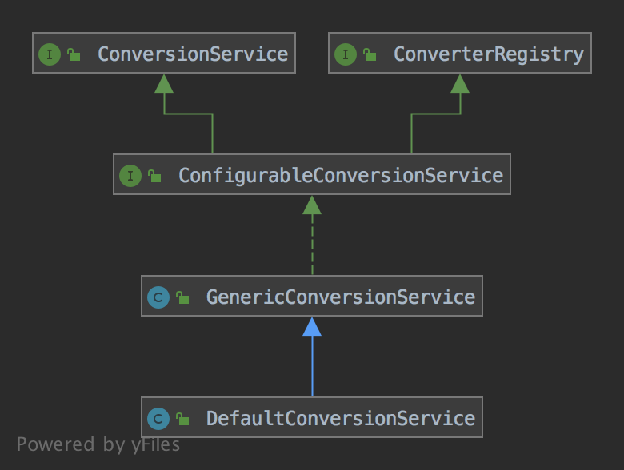

[ConversionService]主要用于[BeanWrapperImpl]的属性注入过程中的类型转换，下面以[ConversionService]的默认实现类[DefaultConversionService]为例，讲解[ConversionService]的实现过程，[DefaultConversionService]的继承结构：


[ConversionService]的接口定义了属性转换过程中会用到的方法
```java
public interface ConversionService {

	boolean canConvert(@Nullable Class<?> sourceType, Class<?> targetType);

    // TypeDescriptor用于获取指定类信息，如获取注解，是否是Map等，即类型描述
	boolean canConvert(@Nullable TypeDescriptor sourceType, TypeDescriptor targetType);

	@Nullable
	<T> T convert(@Nullable Object source, Class<T> targetType);

	@Nullable
	Object convert(@Nullable Object source, @Nullable TypeDescriptor sourceType, TypeDescriptor targetType);

}
```

[ConverterRegistry]定义了注册[Converter]的方法
```java
public interface ConverterRegistry {

	void addConverter(Converter<?, ?> converter);

	<S, T> void addConverter(Class<S> sourceType, Class<T> targetType, Converter<? super S, ? extends T> converter);

	void addConverter(GenericConverter converter);

	void addConverterFactory(ConverterFactory<?, ?> factory);

	void removeConvertible(Class<?> sourceType, Class<?> targetType);

}
```

上面用到的[Converter]接口定义了转换方法，代码：
```java
@FunctionalInterface
public interface Converter<S, T> {
	@Nullable
	T convert(S source);

}
```

[Converter]接口只有从一个类转换为另一个类的能力，[GenericConverter]能够实现多个类型之间的转换，即能够实现多个sourceType -> targetType的转换
```java
public interface GenericConverter {

	@Nullable
    // ConvertiblePair保存的是sourceType -> targetType的关系
	Set<ConvertiblePair> getConvertibleTypes();

	@Nullable
	Object convert(@Nullable Object source, TypeDescriptor sourceType, TypeDescriptor targetType);


	/**
	 * Holder for a source-to-target class pair.
	 */
	final class ConvertiblePair {

		private final Class<?> sourceType;

		private final Class<?> targetType;

		public ConvertiblePair(Class<?> sourceType, Class<?> targetType) {
			Assert.notNull(sourceType, "Source type must not be null");
			Assert.notNull(targetType, "Target type must not be null");
			this.sourceType = sourceType;
			this.targetType = targetType;
		}

		public Class<?> getSourceType() {
			return this.sourceType;
		}

		public Class<?> getTargetType() {
			return this.targetType;
		}

		@Override
		public boolean equals(@Nullable Object other) {
			if (this == other) {
				return true;
			}
			if (other == null || other.getClass() != ConvertiblePair.class) {
				return false;
			}
			ConvertiblePair otherPair = (ConvertiblePair) other;
			return (this.sourceType == otherPair.sourceType && this.targetType == otherPair.targetType);
		}

		@Override
		public int hashCode() {
			return (this.sourceType.hashCode() * 31 + this.targetType.hashCode());
		}

		@Override
		public String toString() {
			return (this.sourceType.getName() + " -> " + this.targetType.getName());
		}
	}

}
```

[ConfigurableConversionService]接口目的是组合[ConversionService]和[ConverterRegistry]接口
```java
public interface ConfigurableConversionService extends ConversionService, ConverterRegistry {
}
```

[GenericConversionService]类实现了[ConfigurableConversionService]接口，能够注册[Converters]和[GenericConverter]，并利用[Converters]和[GenericConverter]完成类型转换
```java
public class GenericConversionService implements ConfigurableConversionService {

	/**
	 * General NO-OP converter used when conversion is not required.
	 */
	// 空操作，convert方法直接返回source
	private static final GenericConverter NO_OP_CONVERTER = new NoOpConverter("NO_OP");

	/**
	 * Used as a cache entry when no converter is available.
	 * This converter is never returned.
	 */
	// 标记对象，用于表示未找到GenericConverter
	private static final GenericConverter NO_MATCH = new NoOpConverter("NO_MATCH");


	// Converters维护了ConvertiblePair和GenericConverter列表的关系，即能够通过一个ConvertiblePair获取到多个GenericConverter
	private final Converters converters = new Converters();

	// 缓存，ConverterCacheKey保存了source的TypeDescriptor和target的TypeDescriptor
	private final Map<ConverterCacheKey, GenericConverter> converterCache = new ConcurrentReferenceHashMap<>(64);


	// ConverterRegistry implementation

	@Override
	public void addConverter(Converter<?, ?> converter) {
		// ResolvableType是java.lang.reflect.Type的包装类，提供类型相关信息的方法
		ResolvableType[] typeInfo = getRequiredTypeInfo(converter.getClass(), Converter.class);
		if (typeInfo == null && converter instanceof DecoratingProxy) {
			typeInfo = getRequiredTypeInfo(((DecoratingProxy) converter).getDecoratedClass(), Converter.class);
		}
		if (typeInfo == null) {
			throw new IllegalArgumentException("Unable to determine source type <S> and target type <T> for your " +
					"Converter [" + converter.getClass().getName() + "]; does the class parameterize those types?");
		}
		// ConverterAdapter实现了GenericConverter和ConditionalConverter接口，相当于是Converter到GenericConverter的适配器，同时
		// 还能判断传入的converter是否能够实现source -> target的转换，判断依据实际上就是实现Converter接口时实现类的范型类型
		addConverter(new ConverterAdapter(converter, typeInfo[0], typeInfo[1]));
	}

	@Override
	public <S, T> void addConverter(Class<S> sourceType, Class<T> targetType, Converter<? super S, ? extends T> converter) {
		addConverter(new ConverterAdapter(
				converter, ResolvableType.forClass(sourceType), ResolvableType.forClass(targetType)));
	}

	@Override
	public void addConverter(GenericConverter converter) {
		this.converters.add(converter);
		invalidateCache();
	}

	@Override
	// ConverterFactory用于构建Converter，下面的实现和上面addConverter(Converter<?, ?> converter)类似
	public void addConverterFactory(ConverterFactory<?, ?> factory) {
		ResolvableType[] typeInfo = getRequiredTypeInfo(factory.getClass(), ConverterFactory.class);
		if (typeInfo == null && factory instanceof DecoratingProxy) {
			typeInfo = getRequiredTypeInfo(((DecoratingProxy) factory).getDecoratedClass(), ConverterFactory.class);
		}
		if (typeInfo == null) {
			throw new IllegalArgumentException("Unable to determine source type <S> and target type <T> for your " +
					"ConverterFactory [" + factory.getClass().getName() + "]; does the class parameterize those types?");
		}
		addConverter(new ConverterFactoryAdapter(factory,
				new ConvertiblePair(typeInfo[0].resolve(Object.class), typeInfo[1].resolve(Object.class))));
	}

	@Override
	public void removeConvertible(Class<?> sourceType, Class<?> targetType) {
		this.converters.remove(sourceType, targetType);
		// 清空converterCache
		invalidateCache();
	}


	// ConversionService implementation

	@Override
	public boolean canConvert(@Nullable Class<?> sourceType, Class<?> targetType) {
		Assert.notNull(targetType, "Target type to convert to cannot be null");
		return canConvert((sourceType != null ? TypeDescriptor.valueOf(sourceType) : null),
				TypeDescriptor.valueOf(targetType));
	}

	@Override
	public boolean canConvert(@Nullable TypeDescriptor sourceType, TypeDescriptor targetType) {
		Assert.notNull(targetType, "Target type to convert to cannot be null");
		if (sourceType == null) {
			return true;
		}
		GenericConverter converter = getConverter(sourceType, targetType);
		return (converter != null);
	}

	/**
	 * Return whether conversion between the source type and the target type can be bypassed.
	 * <p>More precisely, this method will return true if objects of sourceType can be
	 * converted to the target type by returning the source object unchanged.
	 * @param sourceType context about the source type to convert from
	 * (may be {@code null} if source is {@code null})
	 * @param targetType context about the target type to convert to (required)
	 * @return {@code true} if conversion can be bypassed; {@code false} otherwise
	 * @throws IllegalArgumentException if targetType is {@code null}
	 * @since 3.2
	 */
	public boolean canBypassConvert(@Nullable TypeDescriptor sourceType, TypeDescriptor targetType) {
		Assert.notNull(targetType, "Target type to convert to cannot be null");
		if (sourceType == null) {
			return true;
		}
		GenericConverter converter = getConverter(sourceType, targetType);
		return (converter == NO_OP_CONVERTER);
	}

	@Override
	@SuppressWarnings("unchecked")
	@Nullable
	public <T> T convert(@Nullable Object source, Class<T> targetType) {
		Assert.notNull(targetType, "Target type to convert to cannot be null");
		return (T) convert(source, TypeDescriptor.forObject(source), TypeDescriptor.valueOf(targetType));
	}

	@Override
	@Nullable
	public Object convert(@Nullable Object source, @Nullable TypeDescriptor sourceType, TypeDescriptor targetType) {
		Assert.notNull(targetType, "Target type to convert to cannot be null");
		if (sourceType == null) {
			Assert.isTrue(source == null, "Source must be [null] if source type == [null]");
			return handleResult(null, targetType, convertNullSource(null, targetType));
		}
		if (source != null && !sourceType.getObjectType().isInstance(source)) {
			throw new IllegalArgumentException("Source to convert from must be an instance of [" +
					sourceType + "]; instead it was a [" + source.getClass().getName() + "]");
		}
		GenericConverter converter = getConverter(sourceType, targetType);
		if (converter != null) {
			Object result = ConversionUtils.invokeConverter(converter, source, sourceType, targetType);
			return handleResult(sourceType, targetType, result);
		}
		return handleConverterNotFound(source, sourceType, targetType);
	}

	/**
	 * Convenience operation for converting a source object to the specified targetType,
	 * where the target type is a descriptor that provides additional conversion context.
	 * Simply delegates to {@link #convert(Object, TypeDescriptor, TypeDescriptor)} and
	 * encapsulates the construction of the source type descriptor using
	 * {@link TypeDescriptor#forObject(Object)}.
	 * @param source the source object
	 * @param targetType the target type
	 * @return the converted value
	 * @throws ConversionException if a conversion exception occurred
	 * @throws IllegalArgumentException if targetType is {@code null},
	 * or sourceType is {@code null} but source is not {@code null}
	 */
	@Nullable
	public Object convert(@Nullable Object source, TypeDescriptor targetType) {
		return convert(source, TypeDescriptor.forObject(source), targetType);
	}

	@Override
	public String toString() {
		return this.converters.toString();
	}


	// Protected template methods

	/**
	 * Template method to convert a {@code null} source.
	 * <p>The default implementation returns {@code null} or the Java 8
	 * {@link java.util.Optional#empty()} instance if the target type is
	 * {@code java.util.Optional}. Subclasses may override this to return
	 * custom {@code null} objects for specific target types.
	 * @param sourceType the source type to convert from
	 * @param targetType the target type to convert to
	 * @return the converted null object
	 */
	@Nullable
	protected Object convertNullSource(@Nullable TypeDescriptor sourceType, TypeDescriptor targetType) {
		if (targetType.getObjectType() == Optional.class) {
			return Optional.empty();
		}
		return null;
	}

	/**
	 * Hook method to lookup the converter for a given sourceType/targetType pair.
	 * First queries this ConversionService's converter cache.
	 * On a cache miss, then performs an exhaustive search for a matching converter.
	 * If no converter matches, returns the default converter.
	 * @param sourceType the source type to convert from
	 * @param targetType the target type to convert to
	 * @return the generic converter that will perform the conversion,
	 * or {@code null} if no suitable converter was found
	 * @see #getDefaultConverter(TypeDescriptor, TypeDescriptor)
	 */
	@Nullable
	protected GenericConverter getConverter(TypeDescriptor sourceType, TypeDescriptor targetType) {
		ConverterCacheKey key = new ConverterCacheKey(sourceType, targetType);
		GenericConverter converter = this.converterCache.get(key);
		if (converter != null) {
			return (converter != NO_MATCH ? converter : null);
		}

		converter = this.converters.find(sourceType, targetType);
		if (converter == null) {
			// 如果target的类型是source的子类，返回NO_OP_CONVERTER，否则null
			converter = getDefaultConverter(sourceType, targetType);
		}

		// 添加缓存
		if (converter != null) {
			this.converterCache.put(key, converter);
			return converter;
		}

		this.converterCache.put(key, NO_MATCH);
		return null;
	}

	/**
	 * Return the default converter if no converter is found for the given sourceType/targetType pair.
	 * <p>Returns a NO_OP Converter if the source type is assignable to the target type.
	 * Returns {@code null} otherwise, indicating no suitable converter could be found.
	 * @param sourceType the source type to convert from
	 * @param targetType the target type to convert to
	 * @return the default generic converter that will perform the conversion
	 */
	@Nullable
	protected GenericConverter getDefaultConverter(TypeDescriptor sourceType, TypeDescriptor targetType) {
		// 如果target的类型是source的子类，返回NO_OP_CONVERTER，否则null
		return (sourceType.isAssignableTo(targetType) ? NO_OP_CONVERTER : null);
	}


	// Internal helpers

	@Nullable
	private ResolvableType[] getRequiredTypeInfo(Class<?> converterClass, Class<?> genericIfc) {
		// 将converterClass转换为genericIfc，获取genericIfc的范型信息
		ResolvableType resolvableType = ResolvableType.forClass(converterClass).as(genericIfc);
		ResolvableType[] generics = resolvableType.getGenerics();
		if (generics.length < 2) {
			return null;
		}
		Class<?> sourceType = generics[0].resolve();
		Class<?> targetType = generics[1].resolve();
		if (sourceType == null || targetType == null) {
			return null;
		}
		return generics;
	}

	private void invalidateCache() {
		this.converterCache.clear();
	}

	@Nullable
	private Object handleConverterNotFound(
			@Nullable Object source, @Nullable TypeDescriptor sourceType, TypeDescriptor targetType) {

		if (source == null) {
			assertNotPrimitiveTargetType(sourceType, targetType);
			return null;
		}
		if ((sourceType == null || sourceType.isAssignableTo(targetType)) &&
				targetType.getObjectType().isInstance(source)) {
			return source;
		}
		throw new ConverterNotFoundException(sourceType, targetType);
	}

	@Nullable
	private Object handleResult(@Nullable TypeDescriptor sourceType, TypeDescriptor targetType, @Nullable Object result) {
		if (result == null) {
			// 如果结果为空并且targetType是原始类型，则报错
			assertNotPrimitiveTargetType(sourceType, targetType);
		}
		return result;
	}

	private void assertNotPrimitiveTargetType(@Nullable TypeDescriptor sourceType, TypeDescriptor targetType) {
		if (targetType.isPrimitive()) {
			throw new ConversionFailedException(sourceType, targetType, null,
					new IllegalArgumentException("A null value cannot be assigned to a primitive type"));
		}
	}


	/**
	 * Adapts a {@link Converter} to a {@link GenericConverter}.
	 */
	@SuppressWarnings("unchecked")
	// 实现了ConditionalGenericConverter接口，能够判断自己的Converter能否实现source -> target的转换
	private final class ConverterAdapter implements ConditionalGenericConverter {

		private final Converter<Object, Object> converter;

		private final ConvertiblePair typeInfo;

		private final ResolvableType targetType;

		public ConverterAdapter(Converter<?, ?> converter, ResolvableType sourceType, ResolvableType targetType) {
			this.converter = (Converter<Object, Object>) converter;
			this.typeInfo = new ConvertiblePair(sourceType.resolve(Object.class), targetType.resolve(Object.class));
			this.targetType = targetType;
		}

		@Override
		public Set<ConvertiblePair> getConvertibleTypes() {
			return Collections.singleton(this.typeInfo);
		}

		@Override
		public boolean matches(TypeDescriptor sourceType, TypeDescriptor targetType) {
			// Check raw type first...
			if (this.typeInfo.getTargetType() != targetType.getObjectType()) {
				return false;
			}
			// Full check for complex generic type match required?
			ResolvableType rt = targetType.getResolvableType();
			if (!(rt.getType() instanceof Class) && !rt.isAssignableFrom(this.targetType) &&
					!this.targetType.hasUnresolvableGenerics()) {
				return false;
			}
			return !(this.converter instanceof ConditionalConverter) ||
					((ConditionalConverter) this.converter).matches(sourceType, targetType);
		}

		@Override
		@Nullable
		public Object convert(@Nullable Object source, TypeDescriptor sourceType, TypeDescriptor targetType) {
			if (source == null) {
				return convertNullSource(sourceType, targetType);
			}
			return this.converter.convert(source);
		}

		@Override
		public String toString() {
			return (this.typeInfo + " : " + this.converter);
		}
	}


	/**
	 * Adapts a {@link ConverterFactory} to a {@link GenericConverter}.
	 */
	@SuppressWarnings("unchecked")
	private final class ConverterFactoryAdapter implements ConditionalGenericConverter {

		private final ConverterFactory<Object, Object> converterFactory;

		private final ConvertiblePair typeInfo;

		public ConverterFactoryAdapter(ConverterFactory<?, ?> converterFactory, ConvertiblePair typeInfo) {
			this.converterFactory = (ConverterFactory<Object, Object>) converterFactory;
			this.typeInfo = typeInfo;
		}

		@Override
		public Set<ConvertiblePair> getConvertibleTypes() {
			return Collections.singleton(this.typeInfo);
		}

		@Override
		public boolean matches(TypeDescriptor sourceType, TypeDescriptor targetType) {
			boolean matches = true;
			if (this.converterFactory instanceof ConditionalConverter) {
				matches = ((ConditionalConverter) this.converterFactory).matches(sourceType, targetType);
			}
			if (matches) {
				Converter<?, ?> converter = this.converterFactory.getConverter(targetType.getType());
				if (converter instanceof ConditionalConverter) {
					matches = ((ConditionalConverter) converter).matches(sourceType, targetType);
				}
			}
			return matches;
		}

		@Override
		@Nullable
		public Object convert(@Nullable Object source, TypeDescriptor sourceType, TypeDescriptor targetType) {
			if (source == null) {
				return convertNullSource(sourceType, targetType);
			}
			return this.converterFactory.getConverter(targetType.getObjectType()).convert(source);
		}

		@Override
		public String toString() {
			return (this.typeInfo + " : " + this.converterFactory);
		}
	}


	/**
	 * Key for use with the converter cache.
	 */
	// 缓存GenericConverter时的key
	private static final class ConverterCacheKey implements Comparable<ConverterCacheKey> {

		private final TypeDescriptor sourceType;

		private final TypeDescriptor targetType;

		public ConverterCacheKey(TypeDescriptor sourceType, TypeDescriptor targetType) {
			this.sourceType = sourceType;
			this.targetType = targetType;
		}

		@Override
		public boolean equals(Object other) {
			if (this == other) {
				return true;
			}
			if (!(other instanceof ConverterCacheKey)) {
				return false;
			}
			ConverterCacheKey otherKey = (ConverterCacheKey) other;
			return (this.sourceType.equals(otherKey.sourceType)) &&
					this.targetType.equals(otherKey.targetType);
		}

		@Override
		public int hashCode() {
			return (this.sourceType.hashCode() * 29 + this.targetType.hashCode());
		}

		@Override
		public String toString() {
			return ("ConverterCacheKey [sourceType = " + this.sourceType +
					", targetType = " + this.targetType + "]");
		}

		@Override
		public int compareTo(ConverterCacheKey other) {
			int result = this.sourceType.getResolvableType().toString().compareTo(
					other.sourceType.getResolvableType().toString());
			if (result == 0) {
				result = this.targetType.getResolvableType().toString().compareTo(
						other.targetType.getResolvableType().toString());
			}
			return result;
		}
	}


	/**
	 * Manages all converters registered with the service.
	 */
	private static class Converters {

		private final Set<GenericConverter> globalConverters = new LinkedHashSet<>();

		// ConvertersForPair维护了一个实现了ConditionalGenericConverter接口的GenericConverter的列表
		private final Map<ConvertiblePair, ConvertersForPair> converters = new LinkedHashMap<>(36);

		public void add(GenericConverter converter) {
			Set<ConvertiblePair> convertibleTypes = converter.getConvertibleTypes();
			if (convertibleTypes == null) {
				// ConditionalConverter有一个match方法，能判断source是否能够转为target，只有实现了ConditionalConverter接口的
				// GenericConverter才能添加到globalConverters
				Assert.state(converter instanceof ConditionalConverter,
						"Only conditional converters may return null convertible types");
				this.globalConverters.add(converter);
			}
			else {
				// 遍历ConvertiblePair并添加到this.converters中
				for (ConvertiblePair convertiblePair : convertibleTypes) {
					ConvertersForPair convertersForPair = getMatchableConverters(convertiblePair);
					convertersForPair.add(converter);
				}
			}
		}

		private ConvertersForPair getMatchableConverters(ConvertiblePair convertiblePair) {
			ConvertersForPair convertersForPair = this.converters.get(convertiblePair);
			if (convertersForPair == null) {
				convertersForPair = new ConvertersForPair();
				this.converters.put(convertiblePair, convertersForPair);
			}
			return convertersForPair;
		}

		public void remove(Class<?> sourceType, Class<?> targetType) {
			this.converters.remove(new ConvertiblePair(sourceType, targetType));
		}

		/**
		 * Find a {@link GenericConverter} given a source and target type.
		 * <p>This method will attempt to match all possible converters by working
		 * through the class and interface hierarchy of the types.
		 * @param sourceType the source type
		 * @param targetType the target type
		 * @return a matching {@link GenericConverter}, or {@code null} if none found
		 */
		@Nullable
		public GenericConverter find(TypeDescriptor sourceType, TypeDescriptor targetType) {
			// Search the full type hierarchy
			List<Class<?>> sourceCandidates = getClassHierarchy(sourceType.getType());
			List<Class<?>> targetCandidates = getClassHierarchy(targetType.getType());
			// 遍历sourceType和targetType的继承结构寻找GenericConverter
			for (Class<?> sourceCandidate : sourceCandidates) {
				for (Class<?> targetCandidate : targetCandidates) {
					ConvertiblePair convertiblePair = new ConvertiblePair(sourceCandidate, targetCandidate);
					GenericConverter converter = getRegisteredConverter(sourceType, targetType, convertiblePair);
					if (converter != null) {
						return converter;
					}
				}
			}
			return null;
		}

		@Nullable
		private GenericConverter getRegisteredConverter(TypeDescriptor sourceType,
				TypeDescriptor targetType, ConvertiblePair convertiblePair) {

			// Check specifically registered converters
			ConvertersForPair convertersForPair = this.converters.get(convertiblePair);
			if (convertersForPair != null) {
				GenericConverter converter = convertersForPair.getConverter(sourceType, targetType);
				if (converter != null) {
					return converter;
				}
			}
			
			// Check ConditionalConverters for a dynamic match
			// 如果未找到则在globalConverters中找，globalConverters保存的GenericConverter是实现了ConditionalConverter接口
			// 并且getConvertibleTypes返回空的GenericConverter的实现类
			for (GenericConverter globalConverter : this.globalConverters) {
				if (((ConditionalConverter) globalConverter).matches(sourceType, targetType)) {
					return globalConverter;
				}
			}
			return null;
		}

		/**
		 * Returns an ordered class hierarchy for the given type.
		 * @param type the type
		 * @return an ordered list of all classes that the given type extends or implements
		 */
		private List<Class<?>> getClassHierarchy(Class<?> type) {
			List<Class<?>> hierarchy = new ArrayList<>(20);
			Set<Class<?>> visited = new HashSet<>(20);
			addToClassHierarchy(0, ClassUtils.resolvePrimitiveIfNecessary(type), false, hierarchy, visited);
			boolean array = type.isArray();

			int i = 0;
			while (i < hierarchy.size()) {
				Class<?> candidate = hierarchy.get(i);
				candidate = (array ? candidate.getComponentType() : ClassUtils.resolvePrimitiveIfNecessary(candidate));
				Class<?> superclass = candidate.getSuperclass();
				if (superclass != null && superclass != Object.class && superclass != Enum.class) {
					addToClassHierarchy(i + 1, candidate.getSuperclass(), array, hierarchy, visited);
				}
				addInterfacesToClassHierarchy(candidate, array, hierarchy, visited);
				i++;
			}

			if (Enum.class.isAssignableFrom(type)) {
				addToClassHierarchy(hierarchy.size(), Enum.class, array, hierarchy, visited);
				addToClassHierarchy(hierarchy.size(), Enum.class, false, hierarchy, visited);
				addInterfacesToClassHierarchy(Enum.class, array, hierarchy, visited);
			}

			addToClassHierarchy(hierarchy.size(), Object.class, array, hierarchy, visited);
			addToClassHierarchy(hierarchy.size(), Object.class, false, hierarchy, visited);
			return hierarchy;
		}

		private void addInterfacesToClassHierarchy(Class<?> type, boolean asArray,
				List<Class<?>> hierarchy, Set<Class<?>> visited) {

			for (Class<?> implementedInterface : type.getInterfaces()) {
				addToClassHierarchy(hierarchy.size(), implementedInterface, asArray, hierarchy, visited);
			}
		}

		private void addToClassHierarchy(int index, Class<?> type, boolean asArray,
				List<Class<?>> hierarchy, Set<Class<?>> visited) {

			if (asArray) {
				type = Array.newInstance(type, 0).getClass();
			}
			if (visited.add(type)) {
				hierarchy.add(index, type);
			}
		}

		@Override
		public String toString() {
			StringBuilder builder = new StringBuilder();
			builder.append("ConversionService converters =\n");
			for (String converterString : getConverterStrings()) {
				builder.append('\t').append(converterString).append('\n');
			}
			return builder.toString();
		}

		private List<String> getConverterStrings() {
			List<String> converterStrings = new ArrayList<>();
			for (ConvertersForPair convertersForPair : converters.values()) {
				converterStrings.add(convertersForPair.toString());
			}
			Collections.sort(converterStrings);
			return converterStrings;
		}
	}


	/**
	 * Manages converters registered with a specific {@link ConvertiblePair}.
	 */
	// ConvertersForPair维护了一组实现了ConditionalGenericConverter接口的GenericConverter
	private static class ConvertersForPair {
		
		private final LinkedList<GenericConverter> converters = new LinkedList<>();

		public void add(GenericConverter converter) {
			this.converters.addFirst(converter);
		}

		@Nullable
		public GenericConverter getConverter(TypeDescriptor sourceType, TypeDescriptor targetType) {
			for (GenericConverter converter : this.converters) {
				if (!(converter instanceof ConditionalGenericConverter) ||
						((ConditionalGenericConverter) converter).matches(sourceType, targetType)) {
					return converter;
				}
			}
			return null;
		}

		@Override
		public String toString() {
			return StringUtils.collectionToCommaDelimitedString(this.converters);
		}
	}


	/**
	 * Internal converter that performs no operation.
	 */
	private static class NoOpConverter implements GenericConverter {

		private final String name;

		public NoOpConverter(String name) {
			this.name = name;
		}

		@Override
		public Set<ConvertiblePair> getConvertibleTypes() {
			return null;
		}

		@Override
		@Nullable
		public Object convert(@Nullable Object source, TypeDescriptor sourceType, TypeDescriptor targetType) {
			return source;
		}

		@Override
		public String toString() {
			return this.name;
		}
	}

}

```

[DefaultConversionService]继承自[GenericConversionService]，只是默认添加了若干个[GenericConverter]
```java
public class DefaultConversionService extends GenericConversionService {

	@Nullable
	private static volatile DefaultConversionService sharedInstance;


	/**
	 * Create a new {@code DefaultConversionService} with the set of
	 * {@linkplain DefaultConversionService#addDefaultConverters(ConverterRegistry) default converters}.
	 */
	public DefaultConversionService() {
		addDefaultConverters(this);
	}


	/**
	 * Return a shared default {@code ConversionService} instance,
	 * lazily building it once needed.
	 * <p><b>NOTE:</b> We highly recommend constructing individual
	 * {@code ConversionService} instances for customization purposes.
	 * This accessor is only meant as a fallback for code paths which
	 * need simple type coercion but cannot access a longer-lived
	 * {@code ConversionService} instance any other way.
	 * @return the shared {@code ConversionService} instance (never {@code null})
	 * @since 4.3.5
	 */
	// 类似单例，返回一个公共的DefaultConversionService实例
	public static ConversionService getSharedInstance() {
		DefaultConversionService cs = sharedInstance;
		if (cs == null) {
			synchronized (DefaultConversionService.class) {
				cs = sharedInstance;
				if (cs == null) {
					cs = new DefaultConversionService();
					sharedInstance = cs;
				}
			}
		}
		return cs;
	}

	/**
	 * Add converters appropriate for most environments.
	 * @param converterRegistry the registry of converters to add to
	 * (must also be castable to ConversionService, e.g. being a {@link ConfigurableConversionService})
	 * @throws ClassCastException if the given ConverterRegistry could not be cast to a ConversionService
	 */
	public static void addDefaultConverters(ConverterRegistry converterRegistry) {
		addScalarConverters(converterRegistry);
		addCollectionConverters(converterRegistry);

		converterRegistry.addConverter(new ByteBufferConverter((ConversionService) converterRegistry));
		converterRegistry.addConverter(new StringToTimeZoneConverter());
		converterRegistry.addConverter(new ZoneIdToTimeZoneConverter());
		converterRegistry.addConverter(new ZonedDateTimeToCalendarConverter());

		converterRegistry.addConverter(new ObjectToObjectConverter());
		converterRegistry.addConverter(new IdToEntityConverter((ConversionService) converterRegistry));
		converterRegistry.addConverter(new FallbackObjectToStringConverter());
		converterRegistry.addConverter(new ObjectToOptionalConverter((ConversionService) converterRegistry));
	}

	/**
	 * Add common collection converters.
	 * @param converterRegistry the registry of converters to add to
	 * (must also be castable to ConversionService, e.g. being a {@link ConfigurableConversionService})
	 * @throws ClassCastException if the given ConverterRegistry could not be cast to a ConversionService
	 * @since 4.2.3
	 */
	public static void addCollectionConverters(ConverterRegistry converterRegistry) {
		ConversionService conversionService = (ConversionService) converterRegistry;

		converterRegistry.addConverter(new ArrayToCollectionConverter(conversionService));
		converterRegistry.addConverter(new CollectionToArrayConverter(conversionService));

		converterRegistry.addConverter(new ArrayToArrayConverter(conversionService));
		converterRegistry.addConverter(new CollectionToCollectionConverter(conversionService));
		converterRegistry.addConverter(new MapToMapConverter(conversionService));

		converterRegistry.addConverter(new ArrayToStringConverter(conversionService));
		converterRegistry.addConverter(new StringToArrayConverter(conversionService));

		converterRegistry.addConverter(new ArrayToObjectConverter(conversionService));
		converterRegistry.addConverter(new ObjectToArrayConverter(conversionService));

		converterRegistry.addConverter(new CollectionToStringConverter(conversionService));
		converterRegistry.addConverter(new StringToCollectionConverter(conversionService));

		converterRegistry.addConverter(new CollectionToObjectConverter(conversionService));
		converterRegistry.addConverter(new ObjectToCollectionConverter(conversionService));

		converterRegistry.addConverter(new StreamConverter(conversionService));
	}

	private static void addScalarConverters(ConverterRegistry converterRegistry) {
		converterRegistry.addConverterFactory(new NumberToNumberConverterFactory());

		converterRegistry.addConverterFactory(new StringToNumberConverterFactory());
		converterRegistry.addConverter(Number.class, String.class, new ObjectToStringConverter());

		converterRegistry.addConverter(new StringToCharacterConverter());
		converterRegistry.addConverter(Character.class, String.class, new ObjectToStringConverter());

		converterRegistry.addConverter(new NumberToCharacterConverter());
		converterRegistry.addConverterFactory(new CharacterToNumberFactory());

		converterRegistry.addConverter(new StringToBooleanConverter());
		converterRegistry.addConverter(Boolean.class, String.class, new ObjectToStringConverter());

		converterRegistry.addConverterFactory(new StringToEnumConverterFactory());
		converterRegistry.addConverter(new EnumToStringConverter((ConversionService) converterRegistry));

		converterRegistry.addConverterFactory(new IntegerToEnumConverterFactory());
		converterRegistry.addConverter(new EnumToIntegerConverter((ConversionService) converterRegistry));

		converterRegistry.addConverter(new StringToLocaleConverter());
		converterRegistry.addConverter(Locale.class, String.class, new ObjectToStringConverter());

		converterRegistry.addConverter(new StringToCharsetConverter());
		converterRegistry.addConverter(Charset.class, String.class, new ObjectToStringConverter());

		converterRegistry.addConverter(new StringToCurrencyConverter());
		converterRegistry.addConverter(Currency.class, String.class, new ObjectToStringConverter());

		converterRegistry.addConverter(new StringToPropertiesConverter());
		converterRegistry.addConverter(new PropertiesToStringConverter());

		converterRegistry.addConverter(new StringToUUIDConverter());
		converterRegistry.addConverter(UUID.class, String.class, new ObjectToStringConverter());
	}

}
```